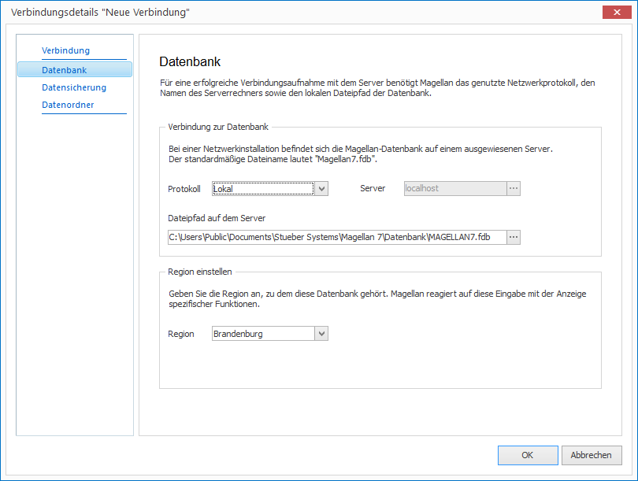
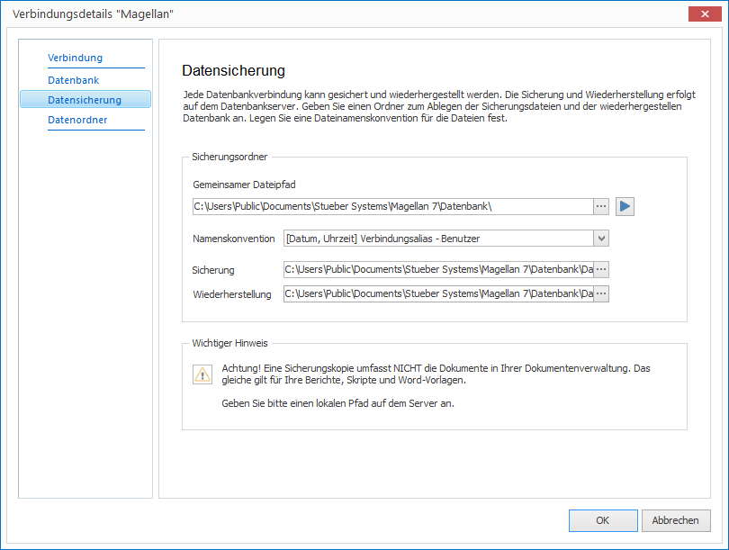
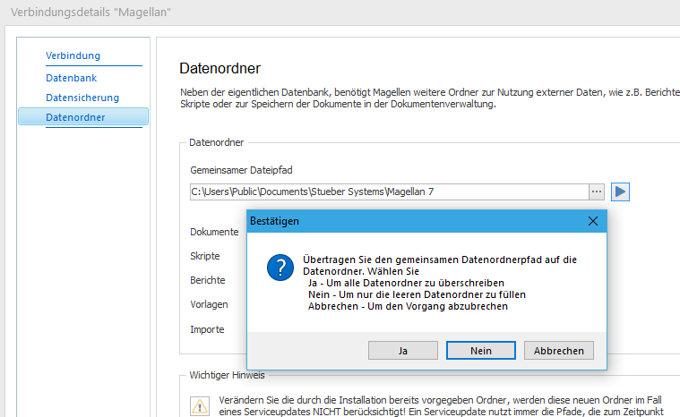
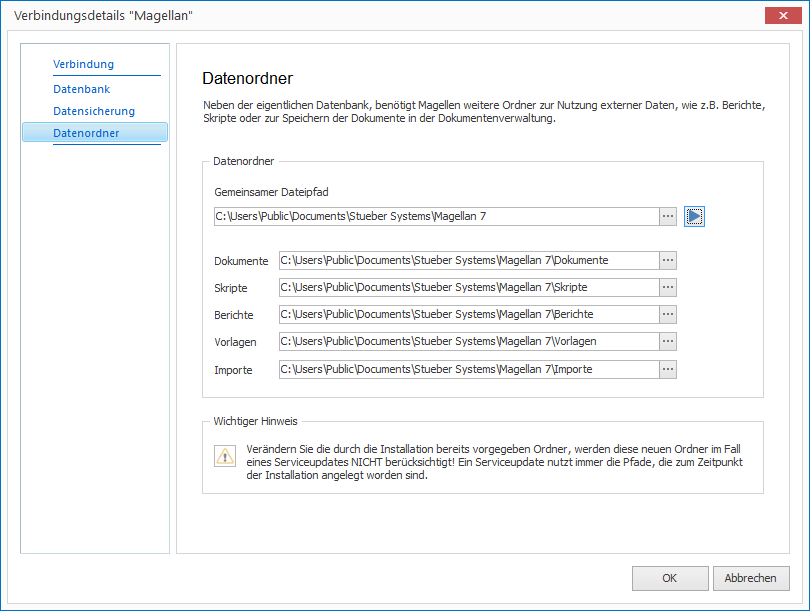
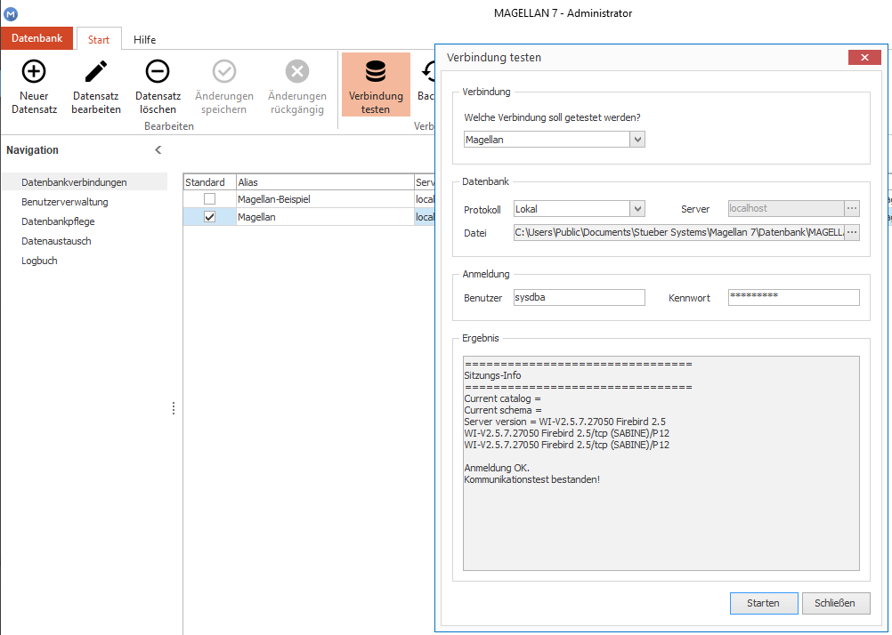
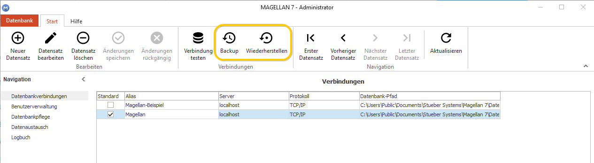
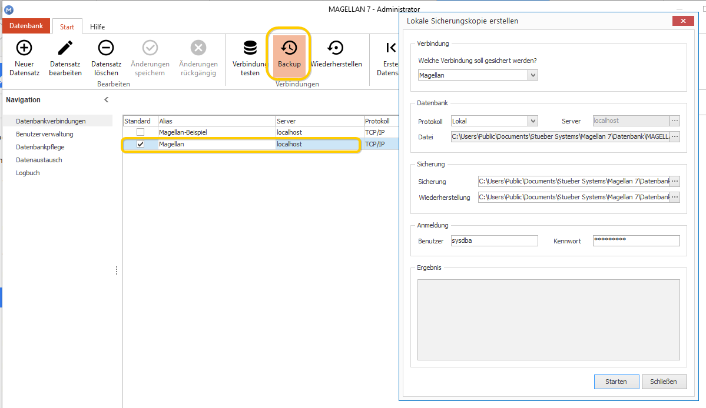
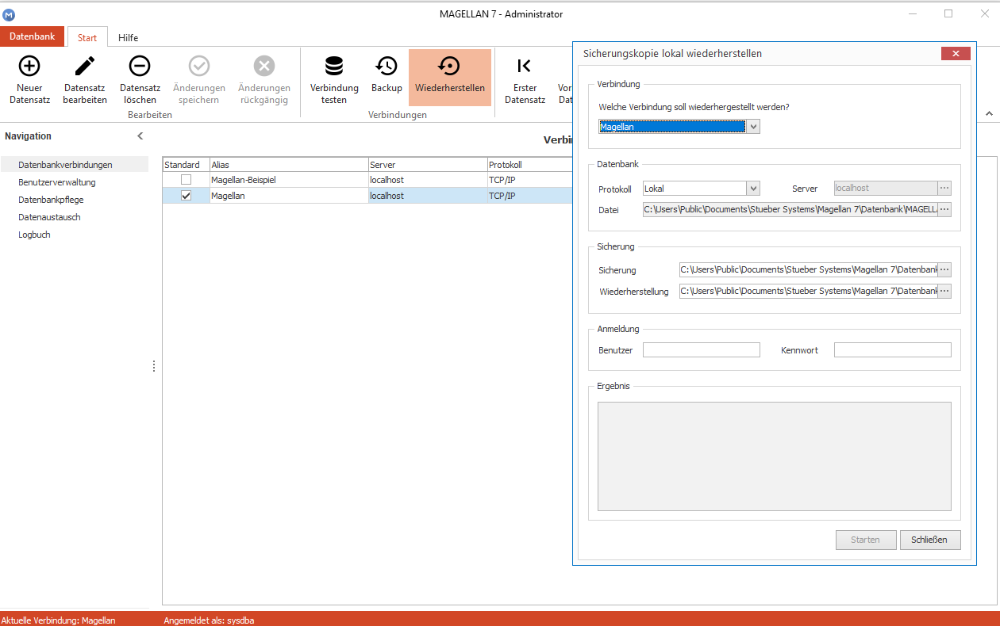

# Datenbankverbindungen

Das Programm MAGELLAN kann mit mehreren Datenbanken verbunden werden. Bei der Anmeldung an dem Schulverwaltungsmodul wird später eine Verbindung ausgewählt, die auf eine bestimmte Datenbank und Datenordner (Skripte, Berichte, Vorlagen usw.) verweist. Damit könnten auf einem Serverrechner mehrere Datenbanken (zum Beispiel mehrerer Schulen)parallel abgelegt werden, der Nutzer erhält über die Rechtevergabe in der Benutzerverwaltung dann das Recht sich an einer oder an mehreren Verbindungen anzumelden.

Bei der Installation von MAGELLAN 7 werden zwei Datenbanken angelegt: eine leere Datenbank, in die Ihre Schulverwaltungsdaten aus der Version 6 übernommen oder auch neue Daten über das MAGELLAN-Importformat importiert werden können und eine Beispieldatenbank mit Testdaten (Magellan_Beispiel.fdb). 
Eine neue Verbindung können Sie oben links über die Schaltfläche `Neuer Datensatz`anlegen!

## Unterpunkt Verbindung

Auf dieser Karte wird standardmäßig der Aliasname "Magellan" vorgeschlagen, passen Sie die Bezeichnung nach Wunsch an, gibt es nur eine Verbindung, muss keine Anpassung erfolgen. Der Alias wird bei der Anmeldung an MAGELLAN im Feld Datenbank bezeichnet. 

## Unterpunkt Datenbank

Feld|Anmerkung
--|--
Protokoll|`TCP/IP`:  Wählen Sie diesen Wert, wenn die Datenbank nicht auf dem lokalen Rechner liegt.  `Lokal`:  Wählen Sie diesen Typ, wenn die Datenbank sich auf dem lokalen Rechner befindet. Diese Auswahl ist für die Installationstypen `Server-/Einzelplatz` gedacht.
Server|Wenn Sie für das `Protokoll` `TCP/IP` gewählt haben, tragen Sie bitte den Namen des Servers oder die IP-Adresse des Servers ein.  Haben Sie für das Feld `Protokoll` den Wert `Lokal` gewählt, ist das Feld `Server` ausgegraut.
Dateipfad auf dem Serverrechner|Tragen Sie hier Pfad zur Datenbank und die Bezeichnung der Datenbank ein.  Wichtig ist, dass der Pfad immer aus Sicht des Servers erwartet wird.  In den meisten Fällen steht in diesem Feld in der Verbindung des Servers der identische Pfad wie in der Verbindung des Clientrechners
Region|Bitte wählen Sie Ihre Region aus, zur Verfügung steht: - Deutschland  - die Bundesländer - Schweiz - Deutsche Auslandsschulen 

**Beispiel für die Eintragungen für einen Clientrechner:**

**Beispiel für die Eintragungen für einen Server- oder Einzelplatzrechner:**

## Unterpunkt Datensicherung

Wir empfehlen Ihnen eine tägliche Sicherung Ihrer Datenbank anzulegen. Um nicht für jede Sicherung den Ablagepfad der Sicherung oder den Ablagepfad für eine wiederhergestellte Datenbank eingeben zu müssen, können Ihre Standardpfade mit den Verbindungsinformationen vorab gespeichert werden. Die Sicherung oder Wiederherstellung selbst, starten Sie aus der Menüleiste über die Schaltflächen `Backup`oder `Wiederherstellen`. Einzelheiten zum Wiederherstellen einer Sicherung oder dem Erstellen eines Datenbankbackups lesen Sie bitte im Abschnitt [Datensicherung]().

Feld|Anmerkung
--|--
Gemeinsamer Dateipfad|Tragen Sie hier Ihren Wunschpfad für Datenbankbackups ein, der Pfad sollte auf dem Verzeichnis `Datenbank`enden. Beispiel für den Standardpfad: `C:\Users\Public\Documents\Stueber Systems\Magellan 7\Datenbank`   Dieser Vorgabepfad kann über die `blaue Pfeiltaste`am Ende der Zeile als Vorgabe in die Zeilen `Sicherung`und `Wiederherstellung` übernommen werden. Die Vorgaben werden wie folgt ergänzt: `Sicherung`: `C:\Users\Public\Documents\Stueber Systems\Magellan 7\Datenbank\Datensicherung\Backup` `Wiederherstellung`: `C:\Users\Public\Documents\Stueber Systems\Magellan 7\Datenbank\Datensicherung\Restore` Diese Unterverzeichnisse werden durch die Installation im Verzeichnis `Datenbank`angelegt.
Namenskonventionen| Wählen Sie die Benennung für die Sicherung oder wiederhergestellte Sicherung: [Datum, Uhrzeit]Verbindungsalias - Benutzer [Datum, Uhrzeit]Verbindungsalias
Sicherung|Tragen Sie hier den Pfad ein, an dem die Sicherung später erstellt werden soll. Alternativ können Sie auch die Eintragung aus `Gemeinsamer Dateipfad` übernehmen.
Wiederherstellung|Tragen Sie hier den Pfad ein, an dem die Sicherung später erstellt werden soll. Alternativ können Sie auch die Eintragung aus `Gemeinsamer Dateipfad` übernehmen.

!!! info "Hinweis"

	Eine Sicherung/Wiederherstellung der Datenbank kann ausschließlich auf dem Rechner angelegt werden, auf dem auch die Datenbank selbst gespeichert ist und der Firebird-Server läuft. Sie können zwar die Aktion zum Sichern selbst von einem Clientrechner starten, die Sicherung kann aber nur auf Ihrem Serverrechner abgelegt werden.

## Unterpunkt Datenordner

Feld|Anmerkung
--|--
Gemeinsamer Dateipfad|Tragen Sie hier den Pfad zum Verzeichnis über den Datenordnern Dokumente, Berichte, Skripte, Vorlagen und Importe ein. Möglich ist für Clientinstalltionen ein Netzwerkpfad oder einen Verweis auf ein Netzlaufwerk. Für Server- oder Einzelplatzinstallationen tragen Sie bitte den lokalen Pfad ein. Der Standardpfad für eine Server-/Einzelplatzinstallation wäre: `C:\Users\Public\Documents\Stueber Systems\Magellan 7`   Wenn hier einen Pfad eintragen und dieser Pfad für alle Verzeichnisse gilt, können Sie die blaue Pfeiltaste am Ende der Zeile verwenden, um den Eintrag in die weiteren Zeilen zu übernehmen.
Dokumente Skripte Berichte Vorlagen Importe|Tragen Sie hier den Pfad ein, an dem die Sicherung später erstellt werden soll. Alternativ können Sie auch die Eintragung aus `Gemeinsamer Dateipfad` übernehmen, die Bezeichnung des Verzeichnisses wird automatisch ergänzt.

## Verbindung testen

Ob Ihre eingegebene Verbindung funktionsfähig ist, können Sie testen. Rufen Sie den Assistenten `Verbindung testen`über die Schaltfläche unter dem Punkt `Datenbankverbindungen`auf. Sollte die Ergebnisanzeige Probleme anzeigen, schauen Sie bitte den Abschnitt [Probleme bei der Installation?](https://doc.magellan7.stueber.de/installation/probleme-bei-der-installation.html)an.

!!! info "Hinweis"

	 MAGELLAN-Arbeitsplatzrechner und MAGELLAN-Serverrechner werden unterschiedlich eingerichtet. Wenn Sie den ersten Arbeitsplatz fertig eingerichtet und den Aufruf von MAGELLAN (um die Datenbankanbindung zu testen), die Druckvorschau (um den Pfad zum Verzeichnis Berichte zu testen) und zum Beispiel eine Sammelzuweisung (um den Pfad zum Verzeichnis Skripte zu testen) ausgeführt haben, können Sie die Optionen, die Lizenz und die Pfadeinstellungen (Datenbank und Datenordner) für andere Arbeitsplätze nutzen. Bitte lesen Sie dazu den Abschnitt ["Die Pathsdatei"](https://doc.magellan7.stueber.de/installation/die-pathsdatei.html)!

## Datensicherung

Über den Punkt `Datenbankverbindungen` kommen Sie zu den Datensicherungsmöglichkeiten in MAGELLAN. In dieser Funktion wird das Sicherungstool der Firebird-Datenbank ausgeführt. Sie können mit diesem Tool Sicherungskopien der Schulverwaltungsdatenbank (MAGELLAN.fdb) erstellen und aus Sicherungsdateien (*.fbk)eine neue Datenbank wiederherstellen.

> #### warning::Wichtig!
>
> Eine Sicherung/Wiederherstellung der Datenbank kann ausschließlich auf dem Rechner angelegt werden, auf dem auch die Datenbank selbst gespeichert ist und der Firebird-Server läuft. Sie können zwar die Aktionen zum Sichern oder Wiederherstellen (Sie müssen den Dateinamen der Sicherung und den Speicherort kennen) selbst von einem Clientrechner starten, die Sicherung/Wiederherstellung kann aber nur auf Ihrem Serverrechner abgelegt werden.

> #### danger::Achtung!
>
> Wir empfehlen eine tägliche Sicherung Ihrer Datenbank! Bitte verwenden Sie dazu den entsprechenden Punkt im MAGELLAN-ADMINISTRATOR oder den unten beschriebenen Weg per Windows Taskplaner. Diese von Firebird mit angebotene Funktion kann auch erfolgen, während der Firebird-Dienst läuft und MAGELLAN verwendet wird. Es werden die Daten Ihrer MAGELLAN.fdb in eine neue Datei mit der Endung *.fbk geschrieben, hieraus kann eine neue Datenbank aufgebaut werden. Anders als bei einer Sicherung per Kopie der Datenbank (die nie bei laufendem Firebird-Dienst erfolgen darf!) erhalten Sie Rückmeldungen zur Qualität der gesicherten Daten.
> Sie sollten in Abständen, zum Beispiel vierteljährlich, mit einer wiederhergestellten Datenbank weiterarbeiten. Dazu stoppen Sie den Firebird-Server-Manager in der Systemsteuerung Ihres Serverrechners, tauschen die Datenbanken (z.B. C:\Users\Public\Documents\Stueber Software\MAGELLAN 7\Datenbank) aus und starten den Firebird-Server-Manager erneut.
>
> Das Herstellen einer Sicherungskopie und anschließende Wiederherstellen dieser Sicherungskopie hat eine reparierende und zugleich komprimierende Funktion. Die wiederhergestellte Sicherungskopie ist meist kleiner als die Ausgangsdatenbank, da "Lücken" in der Datenbank beseitigt werden und so die Datenmenge „abgespeckt“ wird.

## Sicherungskopie erstellen

Der nachstehend beschriebene Assistent kann eine Sicherung Ihrer Datenbank erstellen.

Wir beschreiben in der nachstehenden Tabelle die Eingabeoptionen:

Gruppe|Feld|Bedeutung
---|---|---
Verbindung|Welche Verbindung soll gesichert werden?|Es wird Ihnen eine Liste Ihrer unter Server-Verwaltung angelegten Datenbankanbindungen gezeigt. Mit der Auswahl der Verbindung, wählen Sie auch die der Verbindung zugeordnete Datenbank aus, die Felder unter dem Punkt "Datenbank" werden automatisch aus den Verbindungsinformationen gefüllt.
Datenbank|Protokoll|wird aus den Einstellungen der unter Server-Verwaltung angelegten und im Schritt zuvor ausgewählten Verbindung befüllt
Datenbank|Server|wird aus den Einstellungen der unter Server-Verwaltung angelegten und im Schritt zuvor ausgewählten Verbindung befüllt
Datenbank|Datei|wird aus den Einstellungen der unter Server-Verwaltung angelegten und im Schritt zuvor ausgewählten Verbindung befüllt
Anmeldung|Benutzer|Tragen Sie bitte die sysdba-Kennung ein!
Anmeldung|Kennwort|Tragen Sie bitte Ihr sysdba-Passwort ein!
Sicherung|Sicherung|Hier wird der in der Verbindung unter der Unterkarte`Sicherung`erfasst Pfad vorbelegt.  Sollten Sie die Verbindungsdaten nicht entsprechend befüllt haben: Tragen Sie hier bitte einen lokalen Pfad auf Ihrem MAGELLAN-Server ein, damit dort die Sicherungskopie erzeugt werden kann. Wir empfehlen die Sicherung in das Backupverzeichnis im Datenbankordner abzulegen.  Der Pfad könnte dafür wie folgt aussehen: `C:\Users\Public\Documents\Stueber Systems\Magellan 6\Datenbank\Backup`  Der Name der Sicherung wird vom Programm ergänzt und beinhaltet:  ` [Datum, Uhrzeit]Verbindungsname - Benutzer.fbk` oder   Beispiel:  [2017-06-26, 14-07-16] Magellan.local - sysdba.fbk  Wenn Sie das Modul MAGELLAN ADMINISTRATOR auf dem MAGELLAN-Server aufrufen, steht Ihnen die Schaltfläche zur Auswahl per Datenexplorer zur Verfügung.
Sicherung|Wiederherstellung|Hier wird der in der Verbindung unter der Unterkarte`Sicherung`erfasst Pfad vorbelegt.  Sollten Sie die Verbindungsdaten nicht entsprechend befüllt haben: Tragen Sie hier bitte einen lokalen Pfad auf Ihrem MAGELLAN-Server ein, damit dort die Sicherungskopie erzeugt werden kann. Wir empfehlen die Sicherung in das Backupverzeichnis im Datenbankordner abzulegen.  Der Pfad könnte dafür wie folgt aussehen: `C:\Users\Public\Documents\Stueber Systems\Magellan 6\Datenbank\Backup`  Der Name der Sicherung wird vom Programm ergänzt und beinhaltet:  ` [Datum, Uhrzeit]Verbindungsname - Benutzer.fbk` oder   Beispiel:  [2017-06-26, 14-07-16] Magellan.local - sysdba.fbk  Wenn Sie das Modul MAGELLAN ADMINISTRATOR auf dem MAGELLAN-Server aufrufen, steht Ihnen die Schaltfläche zur Auswahl per Datenexplorer zur Verfügung.
Ergebnis|Ergebnis|In diesem Feld erhalten Sie eine Rückmeldung über gewählte Aktion!

## Sicherungskopie wiederherstellen

Der nachstehend beschriebene Assistent kann aus einer Sicherung Ihrer Datenbank eine neue Datenbankdatei aufbauen.

Wir beschreiben in der nachstehenden Tabelle die Eingabeoptionen:

Gruppe|Feld|Bedeutung
---|---|---
Verbindung|Verbindung|Um eine Sicherung wiederherstellen zu können, muss eine Firebird-Server zur Verfügung stehen. Diesen wählen Sie indirekt mit der Verbindung aus. Welche Sicherung wirklich wiederhergestellt werden soll, legen Sie im Bereich Sicherung fest.  Mit der Auswahl der Verbindung, wählen Sie auch die der Verbindung zugeordnete Datenbank aus, die folgenden Felder werden automatisch aus den Verbindungsinformationen gefüllt.
Datenbank|Protokoll|wird aus den Einstellungen der unter Server-Verwaltung angelegten und im Schritt zuvor ausgewählten Verbindung befüllt
Datenbank|Server|wird aus den Einstellungen der unter Server-Verwaltung angelegten und im Schritt zuvor ausgewählten Verbindung befüllt
Datenbank|Datei|wird aus den Einstellungen der unter Server-Verwaltung angelegten und im Schritt zuvor ausgewählten Verbindung befüllt
Anmeldung|Benutzer|Tragen Sie bitte die sysdba-Kennung ein!
Anmeldung|Kennwort|Tragen Sie bitte Ihr sysdba-Passwort ein!
Sicherung|Sicherung|Der Pfad zum Backupverzeichnis wird auch Ihren Eintragungen für die Verbindung gelesen. Klicken Sie bitte auf die Schaltfläche am Ende der Zeile und verweisen auf die konkrete Sicherungsdatei! Beispiel: `C:\Users\Public\Documents\Stueber Systems\Magellan 6\Datenbank\Datensicherung\Backup\[2018-03-29, 14-07-16] Magellan.local - sysdba.fbk`
Sicherung|Wiederherstellung|Der Pfad zum Restore-Ordner wird aus den Einstellungen der Verbindung gelesen, der neue Datenbankname wird aus dem Namen der Sicherung vom Programm selbst generiert.
Ergebnis|Ergebnis|In diesem Feld erhalten Sie eine Rückmeldung über gewählte Aktion!

!!! info "Hinweis"

	Wenn Sie von einem Client aus die Sicherung der Datenbank auf dem Server durchführen, haben Sie nicht die Möglichkeit (Schaltfläche mit den drei Punkten am Ende der Zeile) den Pfad auszusuchen. Sie können lediglich manuell den entsprechenden Pfad eintragen. Erwartet wird immer lokaler Pfad auf dem Rechner, auf dem auch der Firebirdserver läuft. Sie können keine Sicherung auf einen anderen Rechner in Ihrem Netzwerk erstellen lassen.Eine Sicherungskopie kann im laufenden Betrieb von MAGELLAN durchgeführt werden. Von der Sicherungskopie sind alle Dokumente, Word-Vorlagen und Berichte ausgenommen.

## Einbinden der Sicherung in den Windows Taskplaner

Sie können eine Datensicherung auch außerhalb des MAGELLAN-ADMINISTRATORs nur mit den Möglichkeiten von Firebird erstellen. mit in den Taskplaner des Serverrechners einbinden. Damit Sie sicherstellen können, dass diese Aktion automatisch einmal täglich ausgeführt wird, können Sie die Aktion in den Windows Taskplaner einbinden. Der nachfolgende Abschnitt basiert auf der Firebird-Dokumentation.

Erstellen Sie mit dem Texteditor eine neue Datei und kopieren den nachfolgenden Text hinein.

!!! info "Hinweis"

	Bitte beachten Sie, dass die Pfade bei Ihrer Installation abweichen können!

`"C:\Program Files (x86)\Firebird\Firebird_2_5\bin\gbak.exe" -v -t -user SYSDBA -password masterkey -y "C:\Users\Public\Documents\Stueber Systems\Magellan 7\Datenbank\Backup\MAGELLAN6_%date:~0%.log" "C:\Users\Public\Documents\Stueber Systems\Magellan 7\Datenbank\MAGELLAN6.FDB" "C:\Users\Public\Documents\Stueber Systems\Magellan 7\Datenbank\Backup\MAGELLAN6_%date:~0%.FBK" pause`

Speichern Sie diesen Text und passen die drei Pfade den Gegebenheiten auf Ihrem Serverrechner an. Wir beschreiben nachstehend die Bedeutung der einzelnen Punkte:

Hinweis | Bedeutung
---------- | -------------
Pfad zur gbak.exe | Der erste Pfad führt zur gbak.exe, die die Datensicherung Ihrer Magellan7.fdb erstellt. Der von uns angebebene Pfad entspricht dem Standardinstallationspfad, könnte bei Ihnen aber abweichen.
-user und -password | Anschließend ist die Administratorenanmeldung an Ihrer Datenbank in der Datei enthalten, wenn Sie ein anderes Passwort verwenden, tragen Sie dieses anstelle von „masterkey“ein.
-y und Pfad|Dieser optionale Pfad legt Ihnen pro Sicherung eine Logdatei mit dem Tagesdatum mit den Meldungen an.
Pfad und Dateiname der *.fdb |Der nachfolgende Pfad verweist auf Ihre Datenbank. Liegt Ihre Datenbank an anderer Stelle, passen Sie diesen Pfad bitte an.
Ablagepfad der Sicherungskopie|Als letzte Information wird der Ablagepfad für die Sicherungskopie mit angegeben. Sie könnten sich einen gesonderten Unterordner "Backup" erstellen, müssten auf diesen dann im Pfad verweisen.
Pfad und Dateiname der *.fbk | Der Dateiname wird automatisch mit Magellan7_aktuelles Datum.fbk angegeben. Durch das Datum im Namen wird sichergestellt, dass die Sicherungskopie des Vortages nicht täglich überschrieben wird.
pause | Programmfenster im Vordergrund oder unsichtbar: Wenn Sie "pause" weglassen, dann läuft die Sicherung im Hintergrund ab, mit pause können Sie den Fortschritt im Vordergrund verfolgen. Wenn Sie eine Logdatei erstellen lassen, können Sie auf diesen Parameter verzichten.

Wenn alle Angaben angepasst sind, speichern Sie die Datei und benennen sie anschließend in "MagellanBackup.bat"um. Legen Sie diese Datei bitte auf Ihrem Server im Datenbankordner ab.

!!! info "Hinweis"

	Führen Sie die Datei zum Test bitte per `Doppelklick` oder `Rechtsklick > Ausführen` aus.

Hat es funktioniert? Dann richten Sie im Taskplaner bitte einen neuen Task ein, der täglich zu einer bestimmten Zeit diese Datei ausführt. Gehen Sie dazu auf dem Server unter `Start > Programme > Zubehör > Systemprogramme > Geplante Tasks`.

