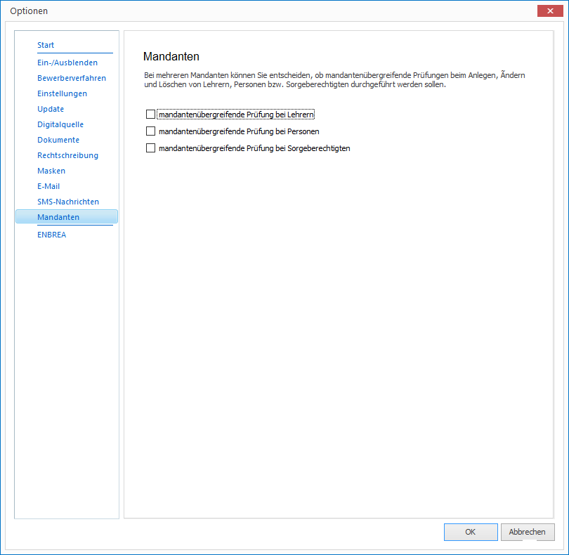
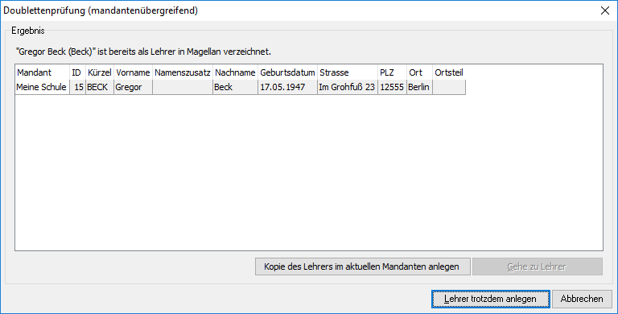
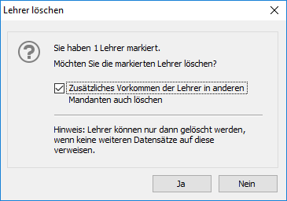

# Mehrmandantenlösung

## Sorgeberechtigte, Personen und Lehrer abgleichen

Verwalten Sie Ihre Daten in mehreren Mandanten, aber es gibt Überschneidungen bei den erfassten Lehrern, Sorgeberechtigten oder Personen? MAGELLAN bietet Ihnen die Möglichkeit diese Daten gleich aktuell zu halten.

### Was genau passiert im Hintergrund?

Wir beschreiben es am Beispiel Lehrer, das Vorgehen ist aber für Personen oder Sorgeberechtigte gleich.

Jedem Lehrer weist MAGELLAN im Hintergrund beim Anlegen eine GUID (Globally Unique Identifier, eine weltweit eindeutige Zahl) zu. Diese GUID dient der Identifizierung und ist einmalig vorhanden.
Ist der Lehrer in mehr als einem Mandanten angelegt, kann diese GUID diesem zweiten (... dritten...) Lehrerdatensatz zugewiesen werden. Damit kann der Zusammenhang zwischen beiden Datensätzen markiert werden, um zum Beispiel eine Adressänderung des Lehrers über mehrere Mandanten zu ermöglichen.

### Bestehende Daten miteinander abgleichen

Wenn bereits Daten in mehreren Mandanten existieren, ist es möglich auch nachträglich die GUIDs als gleich erkannter Lehrer, Personen oder Sorgeberechtigter zu vereinheitlichen.
Zum Erkennen als selber Lehrer (...Personen oder Sorgeberechtigter) werden die folgenden Felder miteinander verglichen:

* Vorname
* Nachname
* Straße
* Postleitzahl
* Ort

!!! info "Hinweis"

	 Damit das Zuweisen der GUIDs funktioniert, müssen die Felder gefüllt sein und auch identisch sein. Sind vier der Felder identisch gefüllt, das fünfte aber leer, wird die GUID nicht zugewiesen.

Gehen Sie wie folgt vor:

1. Rufen Sie den Mandanten auf, dessen GUIDs zum Zuweisen verwendet werden sollen.
2. Wählen Sie `Extras > In Mandanten GUIDs abgleichen...` aus.
3. Wählen Sie einen Mandanten und den Speicherort für die Logdatei aus, klicken Sie auf `Weiter `und `Fertigstellen`.

Bei allen Personen, Lehrern oder Sorgeberechtigten des Zielmandanten wurde jetzt die GUID des Startmandanten zugewiesen, vorausgesetzt die fünf oben genannten Felder wurden als identisch erkannt und die GUID war noch unterschiedlich.

Die Logdatei "AbgleichMandantenGUID.log.csv" zeigt für welche Datensätze die GUID übernommen wurde und für welche Datensätze eine Prüfung nicht möglich war, weil nicht alle Prüffelder gefüllt waren.

### Prüfung beim Anlegen, Ändern oder Löschen

Wenn Sie MAGELLAN mit mehreren Mandanten einsetzen, können mandantenübergreifend beim Anlegen, Ändern oder Löschen Prüfungen erfolgen. Mit den nachstehenden Optionen aktivieren Sie die Prüfung für die jeweiligen Bereiche (Lehrer, Personen, Sorgeberechtigte).

!!! info "Hinweis"

	 Die gewählten Optionen gelten pro MAGELLAN-Installation. Wenn Sie die Einstellungen für alle oder eine Gruppe von Kollegen vorbelegen möchten, können Sie das per Pathsdatei. Lesen Sie dazu bitte [diesen Abschnitt](https://doc.magellan7.stueber.de/installation/die-pathsdatei.html).

#### Neuanlegen

Sind die Häkchen für die Menüs aktiviert, wird beim Neuanlegen eines Lehrers (genauso für Sorgeberechtigte oder Personen) der Vorname und der Nachname geprüft. Werden in einem Ihrer Mandanten Lehrer mit dem identischen Vor- und Nachnamen gefunden, wird das Fenster der Doublettenprüfung gezeigt.
Zwei Optionen:

Option|Was passiert
--|--
Kopie des Lehrers im aktuellen Mandanten anlegen|Die Daten des Lehrers (inklusive GUID) werden kopiert
Lehrer trotzdem anlegen|Lehrer wird mit neuer GUID angelegt, die weiteren Felder sind leer

#### Ändern

Ändern Sie Stammdaten eines Lehrers (genauso für Sorgeberechtigte oder Personen) in einem Mandanten, werden die Daten genauso bei allen weiteren Datensätzen mit gleicher GUID angepasst. Es erfolgt keine weitere Meldung.

#### Löschen

Wenn Sie einen Lehrer, eine Person oder einen Sorgeberechtigten löschen, dann kann zusätzlich die Option gewählt werden, ob auch per GUID als zusammengehörig erkannte Lehrer (, Personen oder Sorgeberechtigte) in anderen Mandanten gelöscht werden sollen.

## Versetzen in einen anderen Mandanten

Besitzen Sie eine SchoolCentral-Lösung von MAGELLAN mit mehr als einem Mandanten, so können Sie die Stammdaten von Schülern bzw. Lehrern von einem Mandanten in einen anderen Mandanten versetzen. Die Daten werden dazu jeweils in den neuen Mandanten kopiert, ohne die Eintragung im alten Mandanten zu löschen.

!!! info "Hinweis"

	 Beim Versetzen in einen anderen Mandanten werden die Daten des Schülers bzw. Lehrers im bisherigen Mandanten nicht verändert.

### Schüler versetzen

So versetzen Sie Schüler in einen anderen Mandanten:

1. Wählen Sie den bisherigen Mandanten der Schüler als aktuellen Mandanten aus.

2. Wählen Sie `Extras` und dann `In Mandanten versetzen....`

3. Klicken Sie im Assistenten auf `Weiter`.

4. Wählen Sie `Schüler versetzen` und klicken Sie dann auf `Weiter`.

5. Markieren Sie die gewünschten Schüler des aktuellen Zeitraums und klicken Sie dann auf `Weiter`.

6. Markieren Sie den Mandanten, in den die Schüler versetzt werden sollen und klicken Sie dann auf `Weiter`.

7. Klicken Sie auf `Fertigstellen`, um das Versetzen durchzuführen.

Im neuen Mandanten werden die Schullaufbahndaten des Schülers nicht mit übernommen. Auch ist der Schüler dort noch keiner Klasse zugeordnet. Ausgeschulte Schüler können nicht in einen anderen Mandanten versetzt werden.

### Lehrer versetzen

So versetzen Sie Lehrer in einen anderen Mandanten:

1. Wählen Sie den bisherigen Mandanten der Lehrer als aktuellen Mandanten aus.

2. Wählen Sie `Extras` und dann `In Mandanten versetzen....`

3. Klicken Sie im Assistenten auf `Weiter`.

4. Wählen Sie `Lehrer versetzen` und klicken Sie dann auf `Weiter`.

5. Markieren Sie die gewünschten Lehrer und klicken Sie dann auf `Weiter`.

6. Markieren Sie den Mandanten, in den die Lehrer versetzt werden sollen und klicken Sie dann auf `Weiter`.

7. Klicken Sie auf `Fertigstellen`, um das Versetzen durchzuführen.

Bei der Übernahme in den neuen Mandanten werden die Lehrer-Soll-Berechnungen des Lehrers nicht mit übernommen.