# Das MyMAGELLAN CENTER

Das MyMAGELLAN CENTER ist das zentrale Administrationswerkzeug zur dezentralen Noteneingabe über MyMAGELLAN. Es dient der Verteilung der Daten pro MyMAGELLAN-Teilnehmer in jeweils eine MyMAGELLAN-Datei (Export aus Magellan) und dem späteren Einsammeln der vom MyMAGELLAN-Teilnehmer modifizierten MyMAGELLAN-Dateien (Import nach Magellan).

Das MyMAGELLAN CENTER ist Teil des Moduls MAGELLAN ADMINISTRATOR. Um das MyMAGELLAN CENTER zu starten, gehen Sie wie folgt vor:

1. Klicken Sie auf Start, dann auf Programme und dann auf STÜBER SYSTEMS.

2. Klicken Sie auf MyMAGELLAN ADMINISTRATOR.

3. Tippen Sie Ihre Kennung und Ihr Kennwort ein und bestätigen Sie mit OK (Wenn Sie Magellan neu installiert haben, dann tippen Sie unter Kennung „sysdba“ und das Kennwort „masterkey“ ein).

4. Wählen Sie in der Menüleiste auf der linken Seite den Punkt `MyMAGELLAN Center` aus.

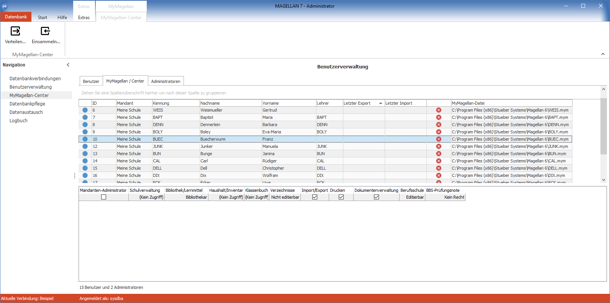

MyMAGELLAN ist ein Programm zur dezentralen Notenerfassung für die Benutzer von Magellan. Es besteht aus zwei Programmenteilen:

* **MyMAGELLAN CENTER:** Dient dem Administrator zum Erzeugen und späteren Einsammeln von jeweils einer MyMAGELLAN-Datei pro MyMAGELLAN-Teilnehmer. Diese MyMAGELLAN-Datei enthält nur die für den Teilnehmer aufgrund seiner Benutzerrechte relevanten Daten auf Basis der Magellan-Datenbank.

* **MyMAGELLAN:** Dient dem MyMAGELLAN-Teilnehmer zur Eingabe seiner Noten. Er verwendet dazu die vom Administrator zuvor erzeugte MyMAGELLAN-Datei.

Im Unterschied zur zentralen Noteneingabe an der Schule über die Magellan-Clients kann so jeder Teilnehmer von MyMAGELLAN seine Noten auf einem beliebigen PC eingeben. Er benötigt dazu lediglich die vom MyMAGELLAN CENTER erzeugte MyMAGELLAN-Datei und muss MyMAGELLAN auf seinem PC installieren. Die MyMAGELLAN-Datei dient somit dem Datenaustausch zwischen MyMAGELLAN und der Magellan-Datenbank.

!!! info "Hinweis"

	In diesem Abschnitt werden ausschließlich die Aufgaben für das MyMAGELLAN CENTER aus Sicht des Administrators vorgestellt. 
Die Anleitung für das Lehrergegenstück, also für MyMAGELLAN finden Sie im Dokument [MyMAGELLAN](https://doc.MyMAGELLAN7.stueber.de/) .

Die Nutzung von MyMAGELLAN kann in drei Hauptschritte unterteilt werden:

**Erster Schritt:** Verteilen der MyMAGELLAN-Dateien für alle MyMAGELLAN-Teilnehmer durch das MyMAGELLAN CENTER (Aufgabe des Administrators)

**Zweiter Schritt:** Nutzung der MyMAGELLAN-Dateien in MyMAGELLAN zur Eingabe der Noten (Aufgabe des MyMAGELLAN-Teilnehmers, also der Lehrer)

**Dritter Schritt:** Einsammeln der von MyMAGELLAN nach der Noteneingabe aktualisierten MyMAGELLAN-Dateien der MyMAGELLAN-Teilnehmer (Aufgabe des Administrators)

!!! info "Hinweis"

	 Die nachfolgenden Beschreibungen beziehen sich auf das MyMAGELLAN CENTER in der Version „Professional“. Diese Version besitzt gegenüber dem MyMAGELLAN CENTER „Standard“ einige Zusatzfunktionen. Auf die Unterschiede zur Professional Version wird an den entsprechenden Stellen im Text mit [bei „Standard“ nicht enthalten] hingewiesen.

## Voraussetzungen

Voraussetzungen für die Nutzung des MyMAGELLAN CENTERs sind:
* die Definition der MyMAGELLAN-Teilnehmer in der Benutzerverwaltung des Magellan-Administrators
* die Eingabe der Stammdaten der Schüler
* die Zuordnung der MyMAGELLAN-Teilnehmer zu den Schülern in Magellan

### Einstellungen im MAGELLAN ADMINISTRATOR

Jeder MyMAGELLAN-Teilnehmer muss als Benutzer in der Benutzerverwaltung (MAGELLAN ADMINISTRATOR > Benutzerverwaltung) angelegt sein. Dabei muss er folgende Bedingungen erfüllen:

### 1. Recht zuweisen

Der Benutzer muss unter „Schulverwaltung“ der Benutzergruppe „Schulleitung 1“, „Schulleitung 2“, „Sekretariat 1“, „Kollegium 1“, „Kollegium 2“, „Kollegium 3“ oder „Kollegium 4“ zugeordnet sein.

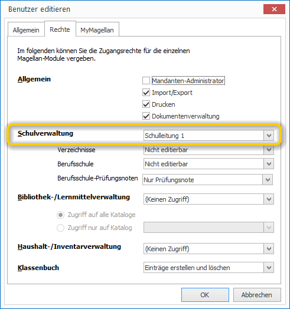

### 2. Teilnehmer von MyMAGELLAN

Der Benutzer muss unter „MyMAGELLAN“ den Status „Teilnehmer von MyMAGELLAN“ besitzen. Anderenfalls wird der Benutzer nicht auf der Karte `
MyMAGELLAN CENTER` angezeigt.

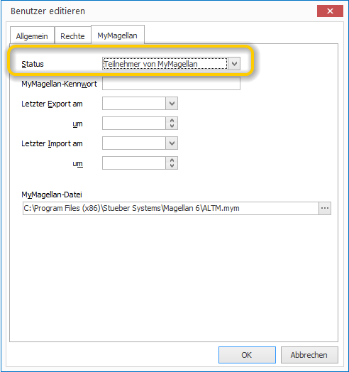

### 3. Speicherort für die Datei vorbelegen

Dem Benutzer muss unter „MyMAGELLAN“ eine „MyMAGELLAN-Datei“ (Datei mit der Endung .mym7) zugeordnet werden. Die Datei muss lediglich benannt werden, jedoch nicht schon existieren. Es geht hier darum die Stelle für die spätere Sammelerstellung der Lehrerdateien vorzubelegen.
Bitte achten Sie darauf, dass Sie den kompletten Pfad eintragen. Wenn Sie lediglich eine Dateibezeichnung eintragen, führt dies später zu einer Fehlermeldung, da der Speicherort nicht gefunden wird. Nur Benutzer mit diesen Rechten werden im MyMAGELLAN CENTER angezeigt.

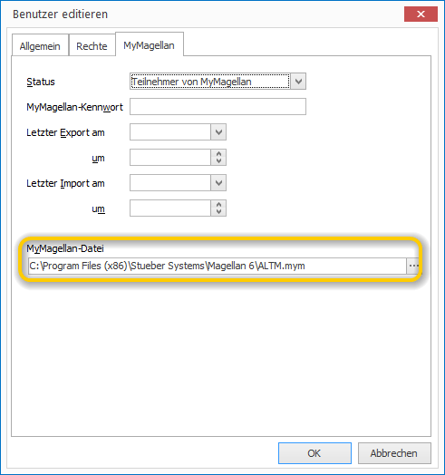

!!! info "Hinweis"

	Unter MyMAGELLAN 6 war die Dateiendung "mym", jetzt ist sie "mym7". Sie müssen aber an der Stelle nichts ändern, beim Erstellen wird die korrekte Dateiendung ergänzt.

### Dateipasswort

Die Datei kann mit einem Passwort belegt werden, das beim Öffnen der Datei eingegeben werden muss. Hierfür gibt es drei Möglichkeiten.

1. Sie aktivieren den Haken auf der Unterkarte `Rechte`, damit wird das MAGELLAN-Passwort des Benutzers auch als Passwort für die MyMAGELLAN-Datei verwendet. 

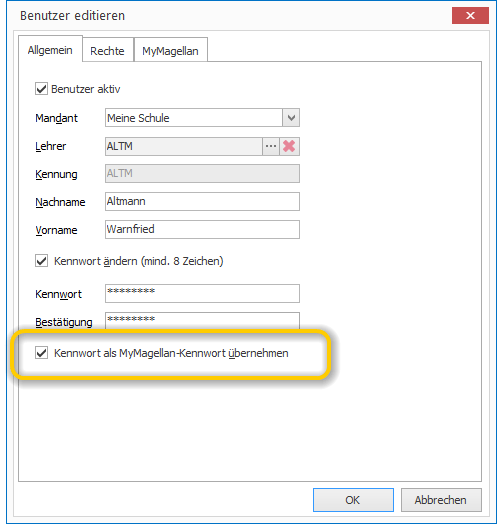

2. Sie vergeben ein gesondertes Passwort für die MyMAGELLAN-Datei auf der Unterkarte `MyMAGELLAN`.

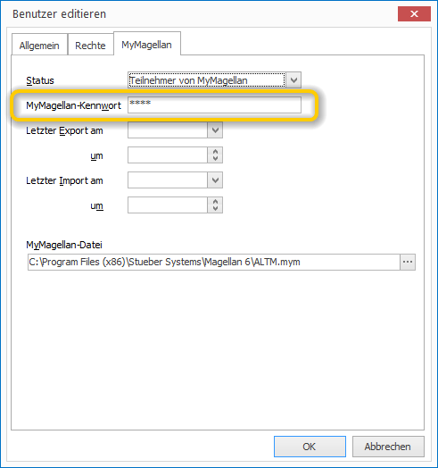

3. Sie vergeben ein Passwort für mehrere Dateien, [diese Möglichkeit wird später beim Erstellen der Dateien angeboten](https://doc.magellan7.stueber.de/admin/mymagellan-center/#karte-sicherheit-festlegen).

### Einstellungen in MAGELLAN 

Grundsätzlich gilt: Alle Schüler, deren Noten über MyMAGELLAN erfasst werden sollen, müssen in Magellan erfasst sein. Hierzu zählt neben der eigentlichen Definition des Schülers auch dessen Zuordnung zu einer Klasse. Zusätzlich müssen den Schülern Fächer zugeordnet werden, deren Noten mit MyMAGELLAN erfasst werden sollen, da eine Eingabe der Fächer in MyMAGELLAN nicht möglich ist.

### Zuordnung der MyMAGELLAN-Teilnehmer zu den Schülern

Die Zuordnung der MyMAGELLAN-Teilnehmer zu den Schülern erfolgt über die Aufgaben der Teilnehmer in der Schule:

Rolle|Bedeutung
--|--
**Klassenleiter 1** |Der Lehrer ist in mindestens einer Klasse Klassenleiter 1 im aktuellen Zeitraum. In diesem Fall werden alle Schüler mit allen Fachzeilen in die MyMAGELLAN-Datei exportiert. Der Klassenleiter kann auch Zeugnisbemerkungen editieren.
**Fachlehrer** |Der Lehrer ist bei mindestens einem Schüler in einer Fachzeile als Fachlehrer hinterlegt. Für die Rolle als Fachlehrer werden die unterrichteten Fachzeilen der Schüler in seine Datei übertragen, beispielsweise nur die Biofachzeilen der in diesem Fach unterrichteten Schüler.
**Tutor** | Der Lehrer ist bei mindestens einem Schüler als Tutor zugeordnet. Dies ist beispielsweise in der gymnasialen Oberstufe der Fall, wenn der Tutor den Stammkursleiter darstellt. Die Datenmenge, die für den Tutor übertragen wird ist identisch mit der des Klassenleiters: also alle Fachzeilen der Schüler und auch Zeugnisbemerkungen, aber eben nicht für die Schüler einer ganzen Klasse, sondern für alle Schüler, denen er als Tutor zugewiesen wurde.

Zuordnung Klassenleiter unter `Klasse > Zeiträume > Zeitraum > Feld Klassenleiter1`: 
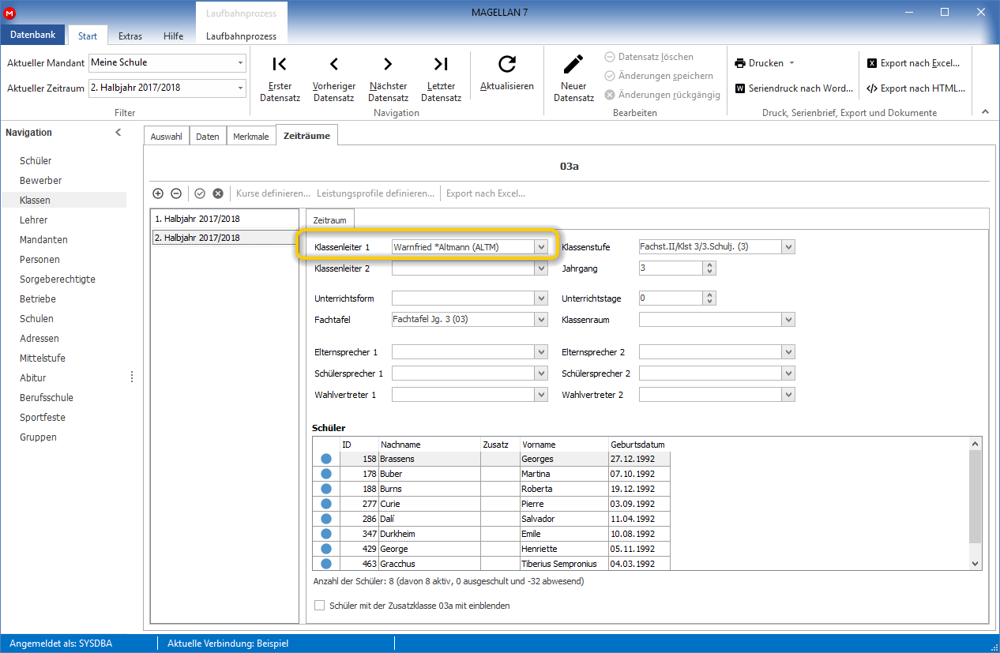

Zuordnung Fachlehrer unter `Schüler > Zeugnis > Fächer > Spalte Lehrer`. 

Die Zuordnung kann auch per Fachtafel verteilt werden oder durch den Abgleich mit DAVINCI als Resulat der Stundenplanung übernommen werden.

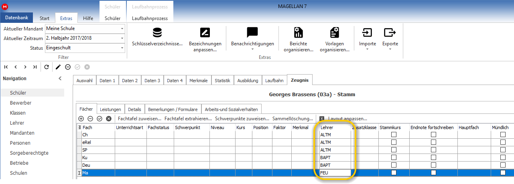

Zuordnung des Tutors unter `Schüler > Zeugnis > Details > Feld Tutor`. Dieses Feld kann auch per Sammelzuweisung, Aufruf dazu am oberen Ende der Karte, durchgeführt werden.

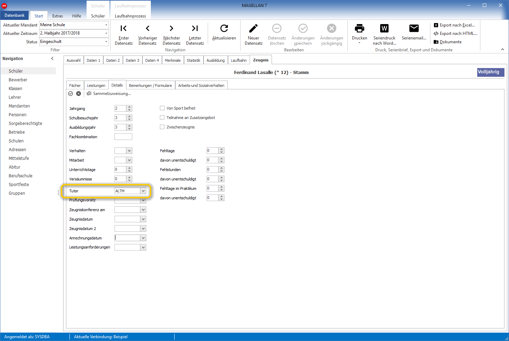

Ist ein MyMAGELLAN-Teilnehmer im aktuellen Zeitraum weder Klassenleiter 1, noch Fachlehrer, noch Tutor, wird für ihn keine MyMAGELLAN-Datei durch das MyMAGELLAN CENTER erzeugt.

## MyMAGELLAN-Dateien verteilen

Sind alle Voraussetzungen für die Erstellung der MyMAGELLAN-Dateien erfüllt, werden nach dem Aufruf der Karte `MyMAGELLAN CENTER` alle MyMAGELLAN-Teilnehmer aufgelistet.

!!! info "Hinweis"

	Vor dem eigentlichen Verteilen der MyMAGELLAN-Dateien, sollten Sie nochmals überprüfen, ob für jeden Teilnehmer der Speicherort und der Dateiname für seine MyMAGELLAN-Datei vordefiniert wurde. Wenn dies noch nicht über die Benutzerverwaltung des MAGELLAN ADMINISTRATORs erfolgt ist, können Sie diese Vorgaben auch im MyMAGELLAN CENTER definieren.

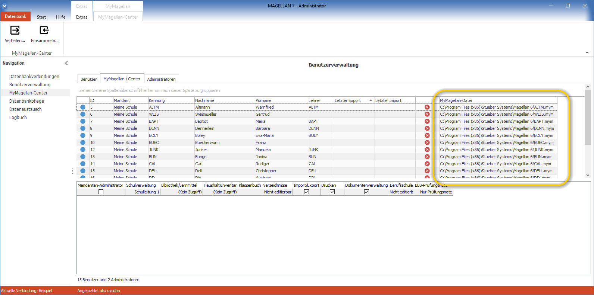

So starten Sie die Verteilung der MyMAGELLAN-Dateien:

1. Markieren Sie die Teilnehmer, deren MyMAGELLAN-Dateien Sie verteilen wollen.

2. Klicken Sie auf die Schaltfläche`Verteilen` im Menüband.

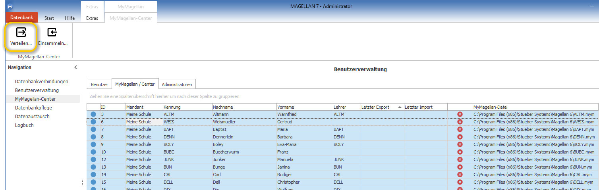

### Karte "Zeitraum auswählen"

3. Wählen Sie das Halbjahr für das die Noten eingegeben werden soll und Ihren Mandanten aus!

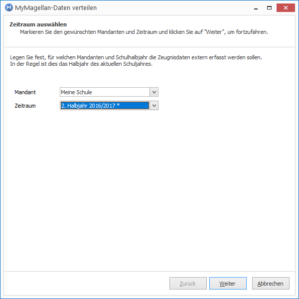

### Karte "Klassen auswählen"

4. Wählen Sie aus, ob für alle Klassen die Noten erfasst werden sollen oder nur für einen Teil. Die Standardauswahl ist für alle Schüler aller Klassen.

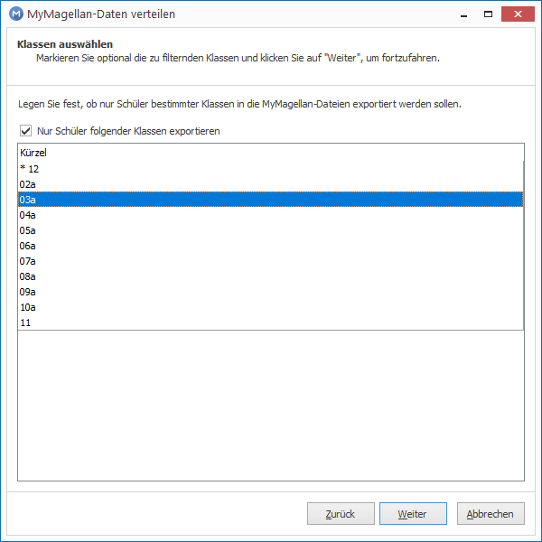

### Karte "Teilnehmer auswählen"

5. Wählen Sie aus, aus für welche Rolle oder Rollen Schüler und deren Fachdaten exportiert werden sollen. Bitte beachten Sie hierzu die Abschnitte:
* [Zuordnung der MyMAGELLAN-Teilnehmer zu den Schülern](https://doc.magellan7.stueber.de/admin/mymagellan-center/#zuordnung-der-mymagellan-teilnehmer-zu-den-sch%C3%BClern)
* [Organisation des zeitlichen Ablaufs](https://doc.magellan7.stueber.de/admin/mymagellan-center/#organisation-des-zeitlichen-ablaufs)
* [Mögliche Konflikte](https://doc.magellan7.stueber.de/admin/mymagellan-center/#m%C3%B6gliche-konflikte)

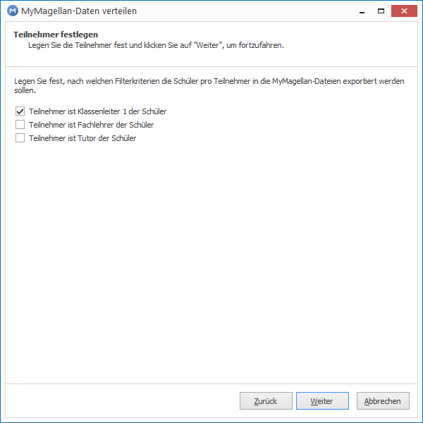

### Karte "Layout und Rechte auswählen"

6. Wählen Sie auf dieser Karte die Spalten für den Export aus und legen Sie fest, welche Einträge editiert werden können. Es werden sämtliche in MyMAGELLAN verfügbaren Felder/Spalten gezeigt. 

Feld|Funktion
--|--
**Spalte** | Name der Spalte oder des Feldes in der MAGELLAN-Oberfläche.
**Spaltenüberschrift** |Wählen Sie eine abweichende Bezeichnung für die Anzeige in MyMAGELLAN.   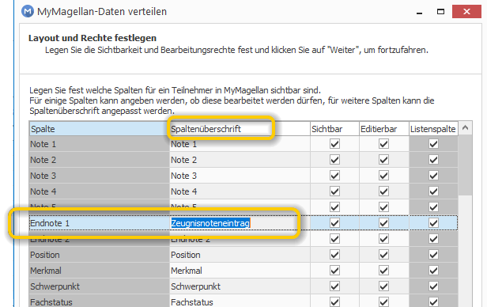
**Sichtbar** |Setzen Sie das Häkchen um das Feld in MyMAGELLAN anzuzeigen. 
**Editierbar** |Setzen Sie das Häkchen zusammen mit dem Häkchen in der Spalte `Sichtbar`, um eine Eingabe zuzulassen. Bei einigen Spalten bietet es sich an, keinen Eintrag zuzulassen, die Spalte aber dennoch zur besseren Sortierbarkeit in der Datei auszugeben, zum Beispiel für die Unterrichtart oder den Fachstatus.
**Listenspalte** |Diese Option ist fest vorgegeben und soll Ihnen zeigen, welche Einträge später als Liste zur Verfügung stehen (Beispiel Endnote1) und welche als Eingabefelder(Beispiel Versetzungsart oder Abschlussart).

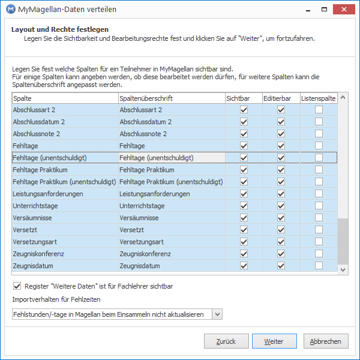

> #### primary::Hinweis
>
> Wenn Sie mehrere Zeilen markieren, können Sie per Rechtsklick diese in einer Aktion auf `sichtbar/unsichtbar` oder auf `editierbar/nicht` editierbar setzen.

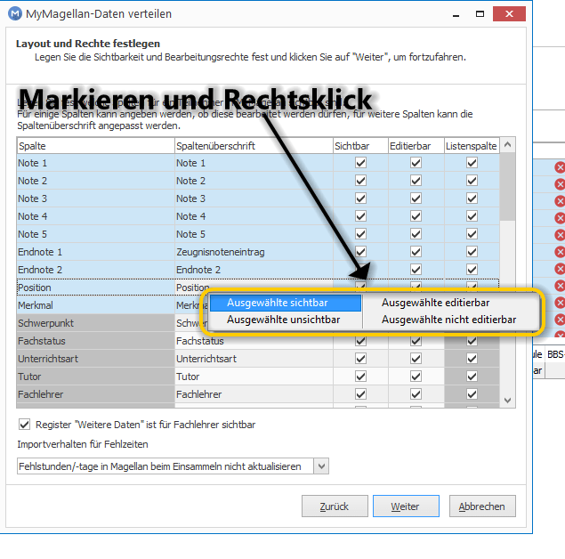

Am unteren Rand der Karte `Layout und Rechte festlegen` stellen Sie bitte ein, wie beim späteren Einsammeln der Daten mit den Fehlzeiten verfahren werden soll.

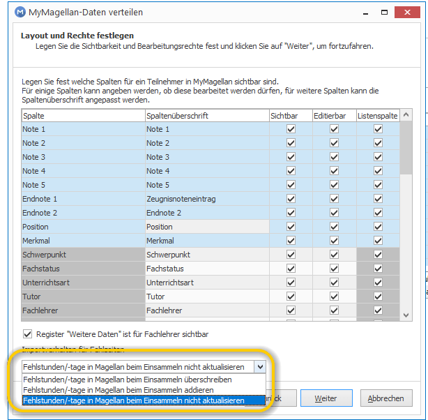

Option|Bedeutung
--|--
Fehlstunden/-tage in Magellan beim Einsammeln überschrieben|Die Werte der Felder „Fehlstunden“, „Fehlstunden unentschuldigt“, „Fehltage“ und „Fehltage unentschuldigt“ des Schülers in Magellan werden durch Einlesen einer MyMAGELLAN-Datei, mit Daten zu diesem Schüler überschrieben. Ausnahme: Kein Eintrag oder ein Null in MyMAGELLAN überschreiben keinen Wert in MAGELLAN. Eine Korrektur des verkehrten Wertes aus MAGELLAN ist nur im Schulverwaltungsprogramm selbst möglich.
Fehlstunden/-tage in Magellan beim Einsammeln addieren|Die Werte der Felder „Fehlstunden“, „Fehlstunden unentschuldigt“, „Fehltage“ und „Fehltage unentschuldigt“ des Schülers in Magellan werden durch Einlesen einer MyMAGELLAN-Datei, mit Daten zu diesem Schüler addiert. Bitte beachten Sie, dass bei dieser Option im Fall eines erneuten Importes der Datei auch die Fehlzeiten erneut addiert werden.  **Wichtig:** Bitte beachten Sie den Abschnitt [Fehlzeiten](https://doc.magellan7.stueber.de/admin/mymagellan-center/#fehlzeiten) und bedenken bitte auch, dass Sie Dateien in denen das Addieren der Fehlzeiten gewählt wurde, nicht mehrfach importieren dürfen.
Fehlstunden/-tage in Magellan beim Einsammeln nicht aktualisieren| Die Werte der Felder „Fehlstunden“, „Fehlstunden unentschuldigt“, „Fehltage“ und „Fehltage unentschuldigt“ des Schülers in Magellan werden durch Einlesen einer MyMAGELLAN-Datei nicht verändert. 

!!! info "Hinweis"

	 Bitte beachten Sie, dass für den Benutzer der MyMAGELLAN-Datei ausgeblendete Felder weiterhin mit Werten versehen sind. Diese Werte werden beim Zurückspielen der MyMAGELLAN-Dateien in die Quelldatenbank übernommen. Zwischenzeitliche Änderungen in der Quelldatenbank werden dabei überschrieben.
Und: Zeugnisbemerkungen werden nur von Klassenleitern und Tutoren nach Magellan übernommen.

### Karte "Sicherheit festlegen"

Sie haben die Möglichkeit ein teilnehmerindividuelles Passwort in der Benutzerverwaltung im MAGELLAN Administrator zu vergeben, die Schritte dafür beschreiben wir im Abschnitt [Dateipasswort](https://doc.magellan7.stueber.de/admin/mymagellan-center/#dateipasswort). Alternativ können Sie ein Passwort für mehrere Dateien vergeben, wenn kein Passwort im Administrator angelegt wurde. Tragen Sie für diese Situation hier ein Kennwort ein und wiederholen es.

Im Feld `Bemerkung`, dass dem Nutzer der Datei später in der Startansicht gezeigt wird, können Sie beispielsweise einen Hinweis für die Rückgabe hinterlegen.

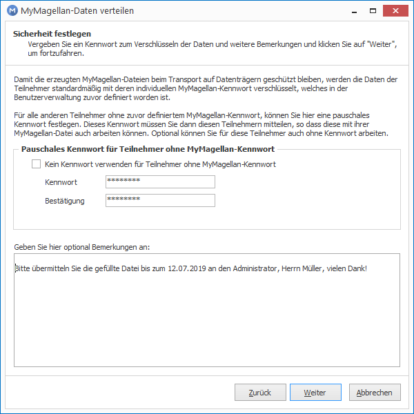

Wechseln Sie auf `Weiter` und `Fertigstellen`! 

### Karte "MyMAGELLAN-Daten verteilen"

Der Assistent erstellt die Dateien, füllt sie individuell mit den in MAGELLAN erfassten Daten und legt sie am gewählten Speicherort ab.
Sollte es einen Grund geben, warum keine Datei erzeugt werden kann, wird dieser Hinweis in der Ergebnisliste gezeigt.

Häufige Gründe fürs nicht Erzeugen einer Datei sind beispielsweise:
* Schüler, denen keine Fachdaten zugewiesen wurden
* Lehrer, denen keine Schüler zugeordnet wurden (als Fachlehrer, Tutor oder Klassenleiter)
* im Zielverzeichnis existiert bereits eine gleichnamige Datei, die nicht überschrieben wird

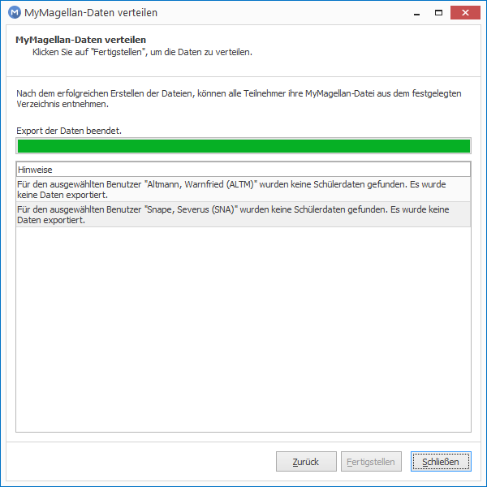

Am gewählten Speicherort werden die Dateien erzeugt.

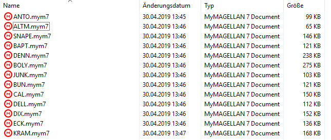

!!! info "Hinweis"

	 Die neue Dateiendung `mym7` erzeugt MAGELLAN unabhängig von der Angabe im Speicherpfad, Sie müssen dafür nichts anpassen.

## Übermittlung der Datei an die eingebenden Kollegen

Im nächsten Schritt sind die Dateien an die Kollegen zur Eingabe zur Übermitteln. Die Datei ist als Binärdatei nicht lesbar, das Passwort ist zwar in der Datei enthalten, aber mit einer kryptografischen Funktion so gesichert, dass es nicht ausgelesen werden kann. 

Zusätzlich zur Datei brauchen die Kollegen zum Bearbeiten der mym-Datei auch das Programm MyMAGELLAN, dass lizenzfrei auf unserer Webseite geladen werden kann. Die Installation des Programms ist schnell und unkompliziert. Allerdings sollte die verwendete MyMAGELLAN-Version auch der zu lesenden Datei entsprechen, insofern ist es sinnvoll den Kollegen auch die Installationsdatei zur Verfügung zu stellen.

Für die Übermittlung werden von den Schulen die unterschiedlichsten Wege gewählt, Beispiele:

* Die Kollegen erhalten jeweils einen Stick mit der eigenen mym-Datei, zusätzlich kann man auf dem Stick auch das jeweils aktuelle Installationspaket des Noteneingabeprogrammes MyMAGELLAN mit geben.
* Die Dateien werden in einem passwortgeschützten Bereich der Schulwebseite zum Download angeboten und später gefüllt wieder hochladen.
* Als Anhang einer Mail mit einem Downloadlink zur MyMAGELLAN-Installationspaket auf unserer Webseite oder an einer Ablagestelle Ihrer Wahl.
* Die Eingabe erfolgt innerhalb der Schule, die Dateien werden in Ihrem Netzwerk zu Verfügung gestellt.

## Noteneingabe über MyMAGELLAN

Die Noteneingabe in MyMAGELLAN ist der gesonderten Dokumentation [MyMAGELLAN](https://doc.MyMAGELLAN6.stueber.de/) zu entnehmen.

## MyMAGELLAN-Dateien einsammeln

## ALT!!!!

---------------

!!! info "Hinweis"

	 Bitte beachten Sie, dass für den Benutzer der MyMAGELLAN-Datei ausgeblendete Felder weiterhin mit Werten versehen sind. Diese Werte werden beim Zurückspielen der MyMAGELLAN-Dateien in die Quelldatenbank übernommen. Zwischenzeitliche Änderungen in der Quelldatenbank werden dabei überschrieben.
Und: Zeugnisbemerkungen werden nur von Klassenleitern und Tutoren nach Magellan übernommen.

## Noteneingabe über MyMAGELLAN

Die Noteneingabe in MyMAGELLAN ist der gesonderten Dokumentation [MyMAGELLAN](https://doc.MyMAGELLAN6.stueber.de/) zu entnehmen.

## Importlogik

Nachstehend wird beschrieben was genau beim Import passiert, falls Daten in MAGELLAN und/oder in in MyMAGELLAN vorhanden sind.

### Noten

Stand in MAGELLAN/MyMAGELLAN |Was passiert beim Import?
---|---
Note ist in MAGELLAN /keine Note in MyMAGELLAN| Note in MAGELLAN bleibt bestehen
Note ist nicht in MAGELLAN, Note ist in MyMAGELLAN| Note aus der MyMAGELLAN-Datei wird eingelesen
Noten sind in beiden Programmen|Note aus MyMAGELLAN wird eingelesen

!!! info "Hinweis"

	Das bedeutet, wenn in MAGELLAN eine Note besteht, die Sie in der MyMAGELLAN-Datei entfernen, dann bleibt die Note weiterhin nach dem Einlesen in MAGELLAN bestehen.

### Beurteilungen

Gemeint sind die Beurteilungen unter `Schüler > Zeugnis > Leistungen` im Feld `Beurteilungen`. Hier können zusätzlich zur Benotung (per Punkt- oder Notenwert) schriftliche Beurteilungen pro Fach erfolgen.

Stand in MAGELLAN/MyMAGELLAN |Ergebnis
---|---
Beurteilung ist in MAGELLAN /keine Beurteilung in MyMAGELLAN| Beurteilung in MAGELLAN bleibt bestehen
Beurteilung ist nicht in MAGELLAN, Beurteilung ist in MyMAGELLAN| Beurteilung aus der MyMAGELLAN-Datei wird eingelesen
Beurteilung sind in beiden Programmen|Beurteilung aus MyMAGELLAN wird eingelesen

!!! info "Hinweis"

	Beispiel: Sie verteilen die Daten für Fachlehrer und Klassenleiter gleichzeitig, es ist beispielsweise die Fachzeile für Mathematik eines Schülers in der Fachlehrerdatei und in der Klassenleiterdatei. 
**Die Eintragungen beider Rollen werden beim Import gleichwertig behandelt.** 
Trägt nur einer der beiden in seine Datei eine Leistungsbeurteilung für Mathe ein, wird dessen Eintragung nach MAGELLAN importiert. 
Tragen beide Kollegen (also der Fachlehrer und der Klassenlehrer tragen etwas für die Mathezeile ein) ein oder wurde bereits eine Eintragung in die MyMAGELLAN-Dateien exportiert, werden die Eingaben nacheinander importiert, die zuletzt importierte Information bleibt in MAGELLAN bestehen.   

### Zeugnisbemerkungen

Stand in MAGELLAN/MyMAGELLAN |Ergebnis
-|-
Bemerkung in MAGELLAN existiert, MyMAGELLAN-Datei wird erzeugt|Bemerkung wird mit in die MyMAGELLAN-Datei übergeben
Bemerkung wird in MyMAGELLAN aktualisiert Bemerkung wird in MAGELLAN neu angelegt|Bemerkungen werden beim Import in MAGELLAN gelöscht und durch aktualisierte oder neue Bemerkungen aus MyMAGELLAN ersetzt
Neue Bemerkung wird in MAGELLAN erfasst, während die MyMAGELLAN-Dateien ausgeteilt sind|Bemerkungen wird beim Import in MAGELLAN gelöscht und durch aktualisierte oder neue Bemerkungen ersetzt. Sind keine neuen Bemerkungen in MyMAGELLAN erfasst worden, können als Ergebnis auch KEINE Bemerkungen übrig bleiben.

!!! info "Hinweis"

	Beim Erstellen der MyMAGELLAN-Dateien werden bereits in MAGELLAN existierende Zeugnisbemerkungen in die Lehrer-/Tutorendateien mit ausgegeben. 
 
Um beim Import keine Dopplungen von Bemerkungen zu erzielen, werden beim Einlesen der Klassenleiterdatei und der Tutorendatei jeweils zuvor die Schülerzeugnisbemerkungen gelöscht. 
Sollten einem Schüler ein Klassenleiter und ein Tutor zugeordnet worden sein, können damit je nach Einlesereihenfolge Zeugnisbemerkungen überschrieben werden.

Beispiel:

Schüler S1 wurden Lehrer L1 und Tutor T1 zugeordnet. Beim Erstellen der MyMAGELLAN-Dateien haken Sie versehentlich beide Rollen an, also Klassenleiter- und >Tutorendatei erstellen. 
Eventuell in MAGELLAN bereits existente Zeugnisbemerkungen werden für S1 ausgespielt. 
L1 vergibt eine neue Zeugnisbemerkung, T1 vergibt keine neue Zeugnisbemerkung. Die Dateien von L1 und T1 werden wieder importiert. 
 
Import der Datei von L1: Zeugnisbemerkungen werden für S1 gelöscht, neue und alte Zeugnisbemerkung werden aus der Datei von L1 importiert. 

Als nächstes wird die Datei für T1 importiert: die Zeugnisbemerkungen von S1 werden gelöscht (neue und alte reimportierte Zeugnisbemerkungen), nur die alten Zeugnisbemerkungen werden eingelesen. Im Ergebnis fehlen die neuen Zeugnisbemerkungen von L1. 
Sie können den Konflikt nur lösen, indem Sie entweder:
* entweder Schülern nicht einen Klassenleiter UND einen Tutor zuweisen
 * oder falls beide Felder für Schüler vergeben sind, beim Erstellen der Dateien nicht Tutor- und Klassenleiterdateien gemeinsam erstellen, sondern nacheinander, also erst die Dateien für die zweite Rolle **nach** dem Einsammeln der Daten der ersten Rolle verteilen.

### Fehlzeiten

Folgende Felder sind gemeint:

|Felder|Anmerkung
|--|--|
|Fehltage|Je nach Auswahl beim Erstellen der Datei: kein Aktualisieren, Addieren oder Ersetzen.  Wird die Option "Fehlstunden/-tage in MAGELLAN beim Einsammeln überschreiben" gewählt, kann ein Eintrag in MAGELLAN nicht auf NULL durch eine entsprechende Eingabe in MyMAGELLAN zurückgesetzt werden.|
|davon unentschuldigt|Je nach Auswahl beim Erstellen der Datei: kein Aktualisieren, Addieren oder Ersetzen.  Wird die Option "Fehlstunden/-tage in MAGELLAN beim Einsammeln überschreiben" gewählt, kann ein Eintrag in MAGELLAN nicht auf NULL durch eine entsprechende Eingabe in MyMAGELLAN zurückgesetzt werden.|
|Fehlstunden|-|
|davon unentschuldigt|Je nach Auswahl beim Erstellen der Datei: kein Aktualisieren, Addieren oder Ersetzen.  Wird die Option "Fehlstunden/-tage in MAGELLAN beim Einsammeln überschreiben" gewählt, kann ein Eintrag in MAGELLAN nicht auf NULL durch eine entsprechende Eingabe in MyMAGELLAN zurückgesetzt werden.|
|Fehltage Praktikum|Je nach Auswahl beim Erstellen der Datei: kein Aktualisieren, Addieren oder Ersetzen.  Wird die Option "Fehlstunden/-tage in MAGELLAN beim Einsammeln überschreiben" gewählt, kann ein Eintrag in MAGELLAN nicht auf NULL durch eine entsprechende Eingabe in MyMAGELLAN zurückgesetzt werden.|
|davon unentschuldigt|Je nach Auswahl beim Erstellen der Datei: kein Aktualisieren, Addieren oder Ersetzen.  Wird die Option "Fehlstunden/-tage in MAGELLAN beim Einsammeln überschreiben" gewählt, kann ein Eintrag in MAGELLAN nicht auf NULL durch eine entsprechende Eingabe in MyMAGELLAN zurückgesetzt werden.|
|Unterrichtstage|Kein Addieren, der Wert wird übertragen.  Kein Eintrag aus MyMAGELLAN wird nicht nach MAGELLAN übergeben, überschreibt also keinen MAGELLAN-Wert.
|Versäumnisse|Kein Addieren, der Wert wird übertragen.  Kein Eintrag aus MyMAGELLAN wird nicht nach MAGELLAN übergeben, überschreibt also keinen MAGELLAN-Wert.|

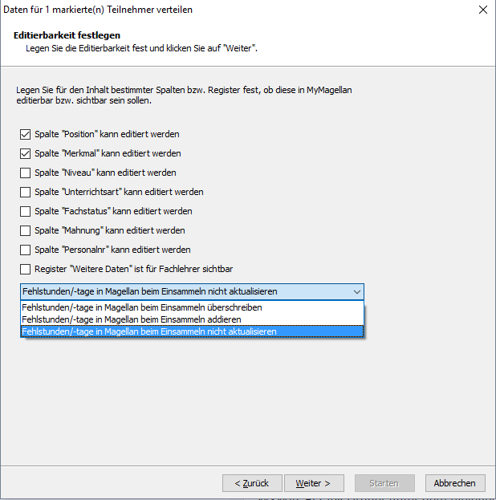

Die Option "Fehlstunden/-tage in MAGELLAN beim Einsammeln addieren" ist ungeeignet fürs erneute Einlesen, da die Werte dann wieder aufsummiert werden, also die doppelte Anzahl von Fehlzeiten das Ergebnis wäre.

Gut geeignet ist die Option "Fehlstunden/-tage in MAGELLAN beim Einsammeln überschreiben".

Option|Ergebnis
-|-
Fehlstunden/-tage in MAGELLAN beim Einsammeln überschreiben|Der Eintrag aus der MyMAGELLAN überschreibt den Eintrag in MAGELLAN.   **Ausnahme: Es wird nichts oder eine NULL in MyMAGELLAN erfasst, in diesem Fall bleibt der MAGELLAN-Eintrag erhalten.**
Fehlstunden/-tage in MAGELLAN beim Einsammeln addieren|Fehlstunden/-tage aus allen MyMAGELLAN-Dateien werden aufaddiert.  Bitte beachten Sie, dass das erneute Einlesen einer Datei bei dieser Option auch erneut die Werte addiert.
Fehlstunden/-tage in MAGELLAN beim Einsammeln nicht aktualisieren|Es erfolgt keine Änderung in MAGELLAN.

### Zeugnisdaten

Feld|Aktion beim Übertrag nach MAGELLAN
--|--
Abschluss 1|Wert aus MyMAGELLAN überschreibt den Wert in MAGELLAN. Es sein denn, in MyMAGELLAN ist das Feld leer, dann bleibt der MAGELLAN-Wert bestehen.
Abschluss 2|Wert aus MyMAGELLAN überschreibt den Wert in MAGELLAN. Es sein denn, in MyMAGELLAN ist das Feld leer, dann bleibt der MAGELLAN-Wert bestehen.
Abschlussart 1|Wert aus MyMAGELLAN überschreibt den Wert in MAGELLAN. Es sein denn, in MyMAGELLAN ist das Feld leer, dann bleibt der MAGELLAN-Wert bestehen.
Abschlussart 2|Wert aus MyMAGELLAN überschreibt den Wert in MAGELLAN. Es sein denn, in MyMAGELLAN ist das Feld leer, dann bleibt der MAGELLAN-Wert bestehen.
Versetzungsart|Wert aus MyMAGELLAN überschreibt den Wert in MAGELLAN. Es sein denn, in MyMAGELLAN ist das Feld leer, dann bleibt der MAGELLAN-Wert bestehen.
Versetzt|Wert aus MyMAGELLAN überschreibt den Wert in MAGELLAN. Es sein denn, in MyMAGELLAN ist das Feld leer, dann bleibt der MAGELLAN-Wert bestehen.
Leistungsanforderung|-
Zeugniskonferenz (Datum)|-
Zeugnisdatum (Datum)|-
Abschlussdatum 1 (Datum)|-
Abschlussdatum 2 (Datum)|-
Abschlussnote 1|-
Abschlussnote 2|-
Verhalten|-
Mitarbeit|-

## MyMAGELLAN-Dateien einsammeln

Nachdem die Noteneingabe der MyMAGELLAN-Teilnehmer erfolgt ist, müssen diese ihre MyMAGELLAN-Dateien wieder in den gleichen MyMAGELLAN-Ordner unter dem gleichen Dateinamen kopieren. Hierbei wird die bestehende, zuvor exportierte MyMAGELLAN-Datei überspielt, wenn sie noch im Ordner vorliegt. Hat die MyMAGELLAN-Datei ein neueres Dateidatum als der letzte Export, so wird in der Statusspalte das Symbol angezeigt. Sie wissen dann direkt, ob der Teilnehmer seine mit MyMAGELLAN bearbeitete MyMAGELLAN-Datei zurückgebracht hat.

So starten Sie das Einsammeln der MyMAGELLAN-Dateien:

1. Markieren Sie die Teilnehmer, deren MyMAGELLAN-Dateien Sie einsammeln wollen.

2. Klicken Sie auf `Umgebung `und dann auf `Daten einsammeln`.

3. Klicken Sie im Assistenten auf `Weiter`.

4. Klicken Sie auf `Fertigstellen` um das Einsammeln zu starten.

**Durch das Einsammeln der MyMAGELLAN-Dateien werden alle entsprechenden Daten in Magellan mit den neuen Werten überschrieben!** Nach dem erfolgreichen Einsammeln wird die Importdatum in der Spalte „Letzter Import“ der jeweiligen MyMAGELLAN-Datei gesetzt und in der Statusspalte wird das Symbol angezeigt. Für die Statusspalte gibt es somit vier Modi.

Statusspalte |Bedeutung
--|--
kein Symbol |Keine MyMAGELLAN-Datei im angegebenen Ordner.
roter Pfeil|MyMAGELLAN-Datei erzeugt: MyMAGELLAN-Datei existiert im angegebenen Ordner.
blauer Pfeil|MyMAGELLAN-Datei bereit zum Import: MyMAGELLAN-Datei existiert im angegebenen Ordner und hat ein jüngeres Dateidatum als das letzte Exportdatum.
grüner Pfeil|MyMAGELLAN-Datei erfolgreich importiert: MyMAGELLAN-Datei existiert im angegebenen Ordner und hat ein älteres Dateidatum als das letzte Importdatum und ein jüngeres Dateidatum als das letzte Exportdatum.

!!! info "Hinweis"

	Beim Einlesen der MyMAGELLAN-Dateien richtet sich das Verhalten beim Import der Felder „Fehlstunden“, „Fehlstunden unentschuldigt“, „Fehltage“ und „Fehltage unentschuldigt“ nach den Einstellungen beim Verteilen der MyMAGELLAN-Dateien.a

## Löschen der MyMAGELLAN-Dateien

Im MyMAGELLAN CENTER können Sie zu einem beliebigen Zeitpunkt die bereits erstellten MyMAGELLAN-Dateien direkt löschen. So löschen Sie MyMAGELLAN-Dateien:

1. Markieren Sie die Teilnehmer, deren MyMAGELLAN-Dateien Sie löschen wollen.

2. Klicken Sie auf `Umgebung `und dann auf `Dateien löschen`.

3. Klicken Sie im Assistenten auf `Weiter`.

4. Klicken Sie auf `Fertigstellen `um das Löschen zu starten.

!!! info "Hinweis"

	MyMAGELLAN-Dateien, die mit einer Ausgabe von MyMAGELLAN erstellt wurden, in der es eine Datenstrukturänderung gegeben hatte, lassen sich mit einer aktuelleren Version nicht bearbeiten. Wenn Sie das dennoch versuchen sollten, erhalten Sie den Hinweis, dass die Datei mit einer anderen Version erstellt wurde und dass Sie sich mit Ihrem Administrator in Verbindung setzen möchten. Dies bedeutet, dass die Dateien mit einer neuen Version neu erstellt werden müssen.

## MyMAGELLAN Dateien erneut importieren

Fällt nach dem Import auf, dass noch weitere Änderungen vorzunehmen sind, können MyMAGELLAN-Dateien auch erneut importiert werden.

### Bemerkungen

!!! info "Hinweis"

	Wichtig bei den Bemerkungen, wie eigentlich auch bei allen anderen Zeugnisinformationen ist: Sind die MyMAGELLAN-Dateien beim Lehrer darf nichts in MAGELLAN verändert werden!

Bemerkungen, die später in der MyMAGELLAN-Datei noch ergänzt werden, können einfach ergänzt oder auch bereits eingelesene noch geändert werden.
Beim erneuten Einlesen werden die Bemerkungen in MAGELLAN gelöscht und durch die neu eingelesenen ergänzt. Es würden aber auch Bemerkungen gelöscht, die zwischenzeitlich in MAGELLAN mit eingefügt wurden!!!

### Fehlzeiten

Die Option "Fehlstunden/-tage in MAGELLAN beim Einsammeln addieren" ist ungeeignet fürs erneute Einlesen, da die Werte dann wieder aufsummiert werden, also die doppelte Anzahl von Fehlzeiten das Ergebnis wäre.

Gut geeignet ist die Option "Fehlstunden/-tage in MAGELLAN beim Einsammeln überschreiben".

!!! info "Hinweis"

	Kein Eintrag oder eine Null aus den Fehlzeiten in MyMAGELLAN überschreibt keinen MAGELLAN-Eintrag!

## Organisation des zeitlichen Ablaufs

Vor dem Einsatz des MyMAGELLAN CENTERs bzw. von MyMAGELLAN sollten Sie sich ein entsprechendes Ablaufszenario erarbeiten. Dieses könnte beispielsweise wie folgt aussehen:

1. Bekanntgabe des Datums der Erzeugung der MyMAGELLAN-Dateien und der Frist zur Rückgabe der bearbeiteten MyMAGELLAN-Dateien pro Teilnehmer.

2. Bekanntgabe der Frist zur Kopie der MyMAGELLAN-Dateien auf die Datenträger.

3. Nach Ablauf der Rückgabefrist Überprüfung ob alle MyMAGELLAN-Dateien wieder eingespielt worden sind.

4. Einsammeln der MyMAGELLAN-Dateien.

## Mögliche Konflikte

### Konflikte bei Noten aufgrund Klassenlehrer/Tutor/Fachlehrer

Eine Verteilung der MyMAGELLAN-Dateien kann aufgrund der Benutzerrechte evtl. zu Konflikten führen.

Beim Erzeugen der Daten kann beispielsweise ein Schüler A sowohl in der MyMAGELLAN-Datei des Lehrers 1 existieren, weil dieser Klassenleiter 1 der aktuellen Klasse ist, als auch beim Fachlehrer der Klasse, weil dieser den Schüler A z.B. in Deutsch in der gleiche Klassen unterrichtet.

Es ist also organisatorisch festzulegen, wer überhaupt die Noten eingeben soll, um ein Überschreiben der Daten beim späteren Einsammeln zu vermeiden.

Beispielsweise könnten nur die Klassenleiter 1 der Klassen Teilnehmer von MyMAGELLAN sein, so dass nur die Klassenleiter die Noten mit MyMAGELLAN eingeben. Sie sollten daher beim Erzeugen der MyMAGELLAN-Dateien unter Filter genau festlegen, welche Daten in die MyMAGELLAN-Datei pro MyMAGELLAN-Teilnehmer übertragen werden sollen.

### Nicht eingegebene Noten in MyMAGELLAN

Nicht eingegebene Noten in MyMAGELLAN werden beim Einsammeln über das MyMAGELLAN CENTER besonders behandelt.

!!! info "Hinweis"

	Nicht eingegebene Noten in MyMAGELLAN werden beim Import nach MAGELLAN nicht berücksichtigt. Bestehende Noten in MAGELLAN werden so durch den Import einer MyMAGELLAN-Datei nicht gelöscht.

Hierbei gilt die Regel:
Ist einem Schüler in MyMAGELLAN für ein Fach keine Note eingetragen worden, so wird diese Note beim Import nach MAGELLAN nicht berücksichtigt. Wird z.B. in MyMAGELLAN für einen Schüler in einem Fach unter „Endnote 1“ keine Note eingetragen und in MAGELLAN ist für denselben Schüler unter „Endnote 1“ eine Note eingetragen, so wird diese durch dem Import nach MAGELLAN nicht überschrieben. 
Dieses Vorgehen ermöglicht die kombinierte Eingabe von Noten.
Unterrichtet beispielsweise der Lehrer L1 die Klasse 8a als Fachlehrer im Fach Deutsch und der Lehrer L2 ist Klassenleiter 1 der Klasse 8a , so ist folgende Konstellation möglich: Lehrer L2 gibt alle Noten bis auf das Fach Deutsch in MyMAGELLAN ein, Lehrer L1 gibt nur die Noten der 8a für das Fach Deutsch in MyMAGELLAN ein. Durch das Einspielen der MyMAGELLAN nach MAGELLAN werden beiden Dateien gemischt, so dass die Noten der Klasse 8a in MAGELLAN vollständig sind.

Dazu müssen Sie wie folgt vorgehen:

1. Lehrer L2 erhält über das Filter „Klassenleiter 1“ seine MyMAGELLAN-Datei. Er trägt in Absprache mit Lehrer L1 alle Noten der Klasse 8a mit Ausnahme des Fachs Deutsch über MyMAGELLAN ein und bringt die veränderte MyMAGELLAN-Datei wieder in die Schule.

2. Lehrer L1 erhält über das Filter „Fachlehrer“ seine MyMAGELLAN-Datei. Er trägt die Noten der Klasse 8a für das Fach Deutsch über MyMAGELLAN ein und bringt die veränderte MyMAGELLAN-Datei wieder in die Schule.

3. Die MyMAGELLAN-Dateien von L1 und L2 werden, unabhängig in welcher Reihenfolge, wieder nach MAGELLAN importiert. Alle Noten der 8a sind nun in MAGELLAN vollständig.

### Konflikt Klassenlehrer/Tutor/Fachlehrer bei „Weiteren Details“

Analog zu den Konflikten bei den Noten können auch Konflikte bei den weiteren Daten auftauchen:

* Unterrichtstage
* Versäumnisse
* Fehltage
* Davon unentschuldigt Fehltage
* Fehlstunden
* davon unentschuldigte Fehlstunden

Zur Konfliktlösung ist Folgendes zu berücksichtigen:

Kann der Lehrer eines Schülers die Registerkarte „Weiteren Daten“ in MyMAGELLAN editieren, so überschreiben in der Standardeinstellung seine Eingaben mit dem Einsammeln seiner MyMAGELLAN-Datei nach MAGELLAN unter grundsätzlich die bestehenden Eintragungen in MAGELLAN für diesen Schüler.

!!! info "Hinweis"

	Ausnahme: Wenn er keine Eintragungen in diesen Feldern in MyMAGELLAN vorgenommen hat, werden die Werte in MAGELLAN durch die >Eintragungen in MyMAGELLAN nicht überschrieben, wenn die Option beim Verteilen der MyMagelan-Dateien so gewählt wurde. 
    
Das gilt für folgende Werte:
* Unterrichtstage
* Versäumnisse
* Fehltage
* Davon unentschuldigt Fehltage
* Fehlstunden
* davon unentschuldigte Fehlstunden

Beispiel:
Der Lehrer L1 hat beim Schüler S1 in seiner MyMAGELLAN-Datei die Eintragung 2 bei den Fehlstunden gemacht. Der Lehrer L2 hat beim gleichen Schüler S1 in seiner MyMAGELLAN-Datei keine Eintragung (Standardwert=0) gemacht. Wird nun zuerst die MyMAGELLAN-Datei von Lehrer L1 eingelesen, so erhält der Schüler S1 in MAGELLAN den Wert 2 bei Fehlstunden. Wird anschließend die MyMAGELLAN-Datei des Lehrers L2 eingelesen, so bleibt die 2 bestehenen, wird nicht durch die 0 überschrieben. Sollte L2 die Null erfasst haben um einen Eintrag in MAGELLAN zu korrigieren, bleibt der vorherige Wert (> 0) bestehen. Erfasst Lehrer L2 einen anderen Wert, zum Beispiel 3 Fehlstunden, überschreibt die 3 die 2 (entscheidend ist die Reihenfolge des Einlesens).

Zur Konfliktlösung stehen Ihnen vier Möglichkeiten zur Verfügung.

* **Gewünschte Einstellungen bei Fehlstunden/-tage wählen:** Bei der Erstellung der MyMAGELLAN-Dateien über das MyMAGELLAN CENTER geben Sie an, ob die Fehlstunden/-tage beim späteren importieren überschrieben (nicht durch Null oder keinen Eintrag), addiert oder unverändert in MAGELLAN belassen werden. Ein Addieren macht beispielsweise dann Sinn, wenn jeder Fachlehrer nur seine Fehlstunden/-tage des Schüler einträgt.

* **Zeugnisbemerkungen: **Zeugnisbemerkungen werden generell nur aus Klassenleiter- oder Tutorendateien nach MAGELLAN eingelesen, nicht aus Fachlehrerdateien.
Nur Klassenleiter nutzen MyMAGELLAN: Bei der Erstellung der MyMAGELLAN-Dateien über das MyMAGELLAN CENTER werden nur Klassenleiter berücksichtigt (Exportfilter „Teilnehmer ist Klassenleiter 1 des Schülers“ aktiviert). Da ein Schüler nur einen „Klassenleiter 1“ zu einem Zeitraum in MAGELLAN besitzen kann, können die „Weiteren Daten“ eines Schülers nicht von einem anderen Lehrer beim Einlesen der MyMAGELLAN-Dateien überschrieben werden.

* **„Weitere Details“ exklusiv für Klassenleiter:** Bei der Erstellung der MyMAGELLAN-Dateien über das MyMAGELLAN CENTER werden Klassenleiter und Fachlehrer berücksichtigt, wobei die „Weiteren Daten“ nur für den Klassenleiter sichtbar sind (Exportfilter „Teilnehmer ist Klassenleiter 1 des Schülers“ und „Teilnehmer ist Fachlehrer des Schülers“ aktiviert, Editierbarkeit „Register „Weitere Daten“ ist für Fachlehrer sichtbar“ deaktiviert). In diesem Fall kann nur der Klassenleiter das Register “Weitere Daten“ in MyMAGELLAN nur bei den Schülern sehen, bei denen er Klassenleiter ist. Ist er nur Fachlehrer des Schülers, sieht es das Register „Weitere Daten“ in MyMAGELLAN nicht.

* **Unterscheidung von Fall zu Fall: **Bei der Erstellung der MyMAGELLAN-Dateien über das MyMAGELLAN CENTER werden Klassenleiter und Fachlehrer berücksichtigt, wobei die „Weiteren Daten“ für alle Lehrer sichtbar sind (Exportfilter „Teilnehmer ist Klassenleiter 1 des Schülers“ und „Teilnehmer ist Fachlehrer des Schülers“ aktiviert, Editierbarkeit „Register „Weitere Daten“ ist für Fachlehrer sichtbar“ aktiviert). In diesem Fall besteht die potentielle Gefahr, dass die Daten der Lehrer sich in Abhängigkeit von der Reihenfolge des Einlesens in MAGELLAN gegenseitig überschreiben. Man kann jedoch in MyMAGELLAN auf dem Register „Weitere Daten über“ das Optionsfeld „Nur Verhalten und Mitarbeit“ erreichen, dass nur die Felder „Verhalten“ und „Mitarbeit“ von den „Weiteren Daten“ beim Einlesen nach MAGELLAN berücksichtigt werden. Die Berücksichtigung dieser Möglichkeit setzt jedoch eine genaue Absprache zwischen den beteiligten Lehrern und sollte daher nur in Sonderfällen genutzt werden.

## Konflikt zwischen Tutoren und Klassenleitern beim Import von Zeugnisbemerkungen

 Wichtig bei den Bemerkungen, wie eigentlich auch bei allen anderen Zeugnisinformationen ist: Sind die MyMAGELLAN-Dateien beim Lehrer darf nichts in MAGELLAN verändert werden!
 
Beim Erstellen der MyMAGELLAN-Dateien werden bereits in MAGELLAN existierende Zeugnisbemerkungen in die Lehrer-/Tutorendateien mit ausgegeben. Um beim Import keine Dopplungen von Bemerkungen zu erzielen werden beim Einlesen der Klassenleiterdatei und der Tutorendatei jeweils zuvor die Schülerzeugnisbemerkungen gelöscht. Sollten einem Schüler ein Klassenleiter und ein Tutor zugeordnet worden sein, können damit je nach Einlesereihenfolge Zeugnisbemerkungen überschrieben werden.

Beispiel: Schüler S1 wurden Lehrer L1 und Tutor T1 zugeordnet. Beim Erstellen der MyMAGELLAN-Dateien haken Sie versehentlich beide Rollen an, also Klassenleiter und Tutorendatei erstellen. Eventuell in MAGELLAN bereits existente Zeugnisbemerkungen werden für S1 ausgespielt. L1 vergibt eine neue Zeugnisbemerkung, T1 vergibt keine neue Zeugnisbemerkung. Die Dateien von L1 und T1 werden wieder importiert. Import der Datei von L1: Zeugnisbemerkungen werden für S1 gelöscht, neue und alte Zeugnisbemerkung werden aus der Datei von L1 importiert. Als nächstes wird die Datei für T1 importiert: die Zeugnisbemerkungen von S1 werden gelöscht (neue und alte reimportierte Zeugnisbemerkungen), nur die alten Zeugnisbemerkungen werden eingelesen. Im Ergebnis fehlen die neuen Zeugnisbemerkungen von L1. Sie können den Konflikt nur lösen, indem Sie entweder:

> * entweder Schülern nicht einen Klassenleiter UND einen Tutor zuweisen
> * oder falls beide Felder für Schüler vergeben sind, beim Erstellen der Dateien nicht Tutor- und Klassenleiterdateien gemeinsam erstellen, sondern erst die Dateien für die zweite Rolle nach dem Einsammeln der Daten der ersten Rolle verteilen.  

!!! info "Hinweis"

	Zum Schluss eine Vorgehenstipp für die Schulen in Rheinland-Pfalz, an denen es eine MSS gibt: In der Mainzer Studienstufe wird das Fach „Gemeinschaftskunde“ als Grundkurs von zwei Lehrkräften je zweistündig unterrichtet. Dadurch sind in beiden Lehrerdateien die Schüler beinhaltet. Es sollte zuvor vereinbart werden, wer die Noten erfassen soll. Vorschlag: Es trägt diejenige Lehrkraft die Noten ein, in deren Fach die Kursarbeit geschrieben wurde.