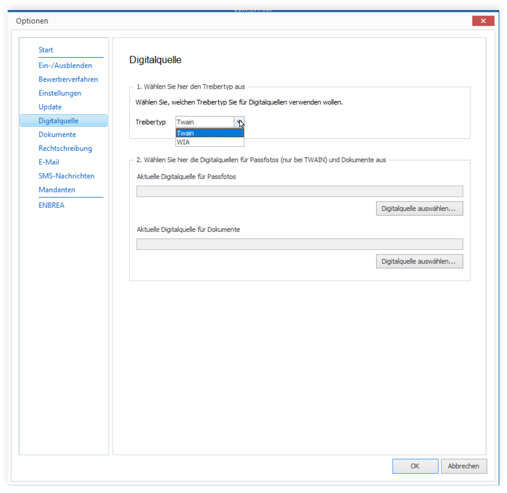

# Optionen

In MAGELLAN können Sie einige Einstellungen vornehmen. Klicken Sie auf `Datenbank > Optionen`, die möglichen Einstellungen werden nachstehend beschrieben.

> #### success::Tipp
>
> Die gewählten Optionen gelten pro MAGELLAN-Installation. Wenn Sie die Einstellungen für alle oder eine Gruppe von Kollegen vorbelegen möchten, können Sie das per Pathsdatei. Lesen Sie dazu bitte [diesen Abschnitt](https://doc.magellan7.stueber.de/installation/die-pathsdatei.html).

## Start

Feld     | Wert
-------- | ----
Mandant  | Mandanten starten MAGELLAN als Voreinstellung.
Zeitraum | Der gewählte Zeitraum wird beim Programmstart vorausgewählt

## Ein-/Ausblenden

Bestimmte Bereiche in MAGELLAN können ausgeblendet werden, wenn Sie diese nicht benötigen. Folgende Bereiche können Sie aus- bzw. einblenden lassen:

|Ein- und ausblendbare Bereiche|
|-|
|Bewerber|
|Sorgeberechtigte|
|Berufsschuldaten (nur mit entsprechender Lizenz einblendbar)|
|Abiturdaten (nur mit entsprechender Lizenz einblendbar)|
|Sportfeste|
|Mittelstufe|
|Schülergruppen (nur für die Bundeslandauswahl Rheinland-Pfalz)|
|Registerkarte „Arbeits- und Sozialverhalten“ in der Ansicht „Schüler“|
|Registerkarte „Extras“ in der Ansicht „Schüler“ bzw. „Bewerber“|
|Registerkarte „Zusatz“ in „Schüler“ bzw. „Bewerber“|
|Registerkarte „Medizin“ in Ansicht „Schüler“ bzw. „Bewerber“|
|Registerkarte „Schulgeld“ in Ansicht „Schüler“ bzw. „Bewerber“|
|Registerkarte „Zusatz“ in „Lehrer“|
|Registerkarte „Medizin“ in „Lehrer“|
|Registerkarte „Zusatz“ in „Sorgeberechtigte“|
|Registerkarte „Arbeitgeber“ in „Sorgeberechtigte“|
|Registerkarte „Zusatz“ in „Personen“|
|Registerkarte „Medizin“ in „Personen“|
|Feld „Gebiet“ bei Adressen von Schülern, Bewerbern, Lehrern, Personen und Sorgeberechtigten|

> #### primary::Hinweis
>
> Die Funktion des Ein- und Ausblendens von Bereichen ist abhängig von Ihrer Lizenzierung. Besitzen Sie beispielsweise nicht das Modul „MAGELLAN Berufsbildende Schule“, können Sie den Bereich „Berufsschule“ in MAGELLAN nicht einblenden. 

## Bewerberverfahren

Wählen Sie hier die gewünschten Einstellungen für Ihr Bewerberverfahren. Bitte lesen Sie hierzu den Abschnitt [„Bewerberverfahren durchführen“](https://doc.magellan7.stueber.de/howto/schueler.html#bewerberverfahren-durchf%C3%BChren).

## Einstellungen

Nachfolgend werden die einzelnen Optionen beschrieben.

Option|Auswirkung
--|--
Schüler ausschulen | Aktivieren Sie dieses Häkchen, wird das `Abgangsdatum` im Assistenten unter `Extras > Schüler ausschulen` zum Pflichtfeld. Wir empfehlen diese Option zu setzen.
Behinderung bei Schüler/Bewerber/Klassen| Diese Option blendet pro MAGELLAN-Arbeitsplatz das Feld `Behinderung` im Menü Bewerber oder Schüler unter Daten 4 und im Menü Klassen auf Daten ein.
Niveau bei `Schüler > Zeugnis > Leistungen `|Wählen Sie, ob die Spalte `Niveau` unter `Schüler > Zeugnis > Fächer` editierbar sein soll.
Suchen| Die Suche unter `Extras > Suchen` kann wahlweise über alle vorhandenen Mandanten oder nur im aktuell gewählten Mandanten suchen. Diese Option kann nur mit der sysdba-Anmeldung verändert werden.
Zeiträume| Wählen Sie, ob die Zeiträume der Datenbank als Trimester oder als Halbjahre geführt werden sollen. Die Option kann nur für neue Datenbanken gewählt werden. Sollten Sie nachträglich diese Einstellung ändern möchten, kann die Anpassung der Datenbank nur durch STÜBER SYSTEMS durchgeführt werden. Diese Option kann nur mit der sysdba-Anmeldung verändert werden.
Berechnete Felder im Abitur| Durch das Setzen dieser Option können Sie die per Skript berechneten Felder im Menü Abitur durch versehentliche Änderung schützen.
Durchschnitt in Berufsschule |Wählen Sie, ob die Halbjahresdurchschnitte unter `Berufsschule > Matrix` unterhalb der Ergebnisse der Fächer pro Halbjahr sichtbar sein sollen. Die eingeblendeten Felder werden beim Synchronisieren der Berufsschüler mit den Werten aus dem Feld Durchschnitt aus `Schüler > Zeugnis > Leistungen` gefüllt.
Abgleich Qualifikation/Fachwahl im Abitur |Wählen Sie aus, ob beim Synchronisieren der Schüleroberstufendaten die Fachwahldaten entsprechend ergänzt werden sollen. Beide Ansichten, `Abitur > Fachwahl` und `Abitur > Qualifikation` aktualisieren sich anschließend bei Änderungen von Fächern oder deren Eigenschaften. Bitte beachten Sie dazu den Abschnitt „Abgleich der Karte Qualifikation und Karte Fachwahl im Menü Abitur“. Diese Option kann nur mit der sysdba-Anmeldung verändert werden.
Hintergrundfarben für Benotungen |Unter `Verzeichnisse > Noten` können Sie pro Note eine Farbe festlegen, die den Hintergrund des Notenfeldes unter `Schüler > Zeugnis > Leistungen `und in der Notenübersicht füllt. Ob diese Auswahl mit gezeigt werden soll, können Sie hier optional festlegen. Diese Option kann nur mit der sysdba-Anmeldung verändert werden.

## Update

Über die Einstellungen dieser Karte wird festgelegt, ob MAGELLAN beim Programmstart auf neue Updates prüfen soll oder nicht. Weitere Informationen finden Sie im Abschnitt [„Updates“](https://doc.magellan7.stueber.de/update.html).

## Digitalquelle

Passfotos für Bewerber, Schüler, Lehrer oder Personen können direkt über die Nutzung einer Digitalquelle (z.B. Webcam, Digitalkamera oder Scanner) eingelesen werden. Im Unterschied zum Laden eines Passfotos aus einer Datei, können Sie die Daten direkt aus der Digitalquelle übernehmen, ohne dazu zunächst eine extra Bilddatei anlegen zu müssen. Voraussetzung für die Nutzung von Digitalquellen ist deren Unterstützung der Twain-Schnittstelle der Digitalquelle. Die Digitalquelle können Sie wie folgt einstellen:

1.	Klicken Sie auf Extras und dann auf Optionen.
2.	Wählen Sie die Registerkarte Digitalquelle.
3.	Wählen Sie unter Aktuelle Digitalquelle für Passfotos über die Schaltfläche Digitalquelle auswählen eine auf Ihrem Rechner installierte Digitalquelle aus.

Wenn Sie ein Digitalquelle in der Dokumentenverwaltung nutzen wollen, um Dokumente einzuscannen, so können Sie eine Digitalquelle unter Aktuell Digitalquelle für Dokumente auswählen. Zur Auswahl werden alle Digitalquellen des Rechners angeboten, die eine Twain-Schnittstelle besitzen und deren Twain-Treiber installiert ist.

## Dokumente

Beim Druck von Crystal Reports Berichten und beim Word-Seriendruck können Sie optional nach dem eigentlichen Druck die Einzeldokumente in der Dokumentenverwaltung automatisch abspeichern lassen. Für jede Ansicht in MAGELLAN können Sie auf der Registerkarte `Dokumente` einstellen, ob (Häkchen setzen) und wenn ja in welchem Ordner (gewünschten Verzeichnisnamen eintippen) die Dokumente in der Dokumentenverwaltung abgelegt werden.

### Einstellung für Crystal Reports Berichte

Für den Druck von Crystal Reports Berichten gehen Sie wie folgt vor:

1. Klicken Sie auf `Datenbank` und dann auf `Optionen`.

2. Wählen Sie die Registerkarte `Dokumente`.

3. Wählen Sie die Registerkarte `Crystal Reports`.

4. Markieren Sie pro Ansicht, ob nach dem Druck der gefüllte Berichte in der Dokumentenverwaltung gespeichert werden soll. Zusätzlich können Sie optional den Namen für einen Unterordner der Dokumentenverwaltung angeben, in welchem die PDF-Datei gespeichert werden soll.

### Einstellung für Word-Seriendruck

Für den Druck von Worddokumenten im Rahmen des Seriendrucks gehen Sie wie folgt vor:

1. Klicken Sie auf `Datenbank > Optionen`.

2. Wählen Sie die Registerkarte `Dokumente`.

3. Wählen Sie die Registerkarte `Word-Seriendruck`.

4. Markieren Sie pro Ansicht, ob vor dem Word-Seriendruck in der Dokumentenverwaltung eine Word-Datei gespeichert werden soll. Zusätzlich können Sie optional den Namen für einen Unterordner der Dokumentenverwaltung angeben, in welchem die Word-Datei gespeichert werden soll.

> #### warning::Achtung
>
> Bitte tragen Sie für die Unterordner der Dokumentenverwaltung keinen Pfad ein, sondern lediglich den Namen des Verzeichnisses in das die PDF-Datei oder docx-Datei abgelegt werden soll. Existiert das Verzeichnis nicht, wird es automatisch beim ersten Nutzen der Funktion mit angelegt.

### Dateinamenkonventionen

Für das automatische Ablegen der Crystal Reports Berichte oder der Word-Seriendruckdokumente können Sie zwischen zwei Dateibezeichnungen wählen.
Crystal Reports Berichte:

* [Datum, Uhrzeit] Name Berichtsname
* [Datum, Uhrzeit] Berichtsname

Word-Seriendruckdokumente:

* [Datum, Uhrzeit] Name Vorlagenname
* [Datum, Uhrzeit] Vorlagenname

 

## Rechtschreibung

Es steht Ihnen optional eine Rechtschreibprüfung an zwei Stellen im Programm zur Verfügung:

* Für Zeugnisbemerkungen unter `Schüler > Zeugnis > Zeugnis > Zeugnisbemerkungen`.
* Für Zeugnisbeurteilungen unter `Schüler > Zeugnis > Leistungen`. Hierbei müsste als Beurteilungsart der Klasse unter `Klassen > Daten > Beurteilungsart` „Beurteilungstexte“ gewählt werden.

 

## Masken

Dieser Punkt ist aktiv bei der Bundeslandauswahl Berlin. Die dazugehörigen Funktionalitäten werden alle im Abschnitt [Spezielle Eingabeformulare](https://doc.magellan7.stueber.de/bundeslaender/berlin/masken.html) beschrieben.

## E-Mail

Mit der Lizenzierung für das Modul MAGELLAN LIVEMESSAGE können Sie an ausgewählte Gruppen E-Mails versenden. Auf diesem Weg können Lehrer, Personen, Schüler, Sorgeberechtigte oder Klassenleiter informiert werden. Voraussetzung dafür ist, dass Sie jeweils auf der Karte Daten1 die E-Mailadressen einpflegen. Auf der nachfolgenden Karte erfassen Sie bitte dazu die Verbindungsdetails.

> #### primary::Hinweis
>
> Eine ausführlichere Anleitung für das Versenden finden Sie im [Kurznachrichten](https://doc.magellan7.stueber.de/howto/kurznachrichten.html).

## SMS-Nachrichten

Mit der Lizenzierung für das Modul MAGELLAN LIVEMESSAGE können Sie an ausgewählte Gruppen SMS-Nachrichten versenden. Auf diesem Weg können Lehrer, Personen, Schüler, Sorgeberechtigte oder Klassenleiter, zum Beispiel auch in Notfällen, informiert werden.

Voraussetzung dafür ist, dass Sie jeweils auf der Karte Daten1 die Mobilnummern einpflegen.

> #### warning::Wichtig!
>
> Auf dieser Karte erfassen Sie bitte dazu die Verbindungsdetails, die Sie beim Erwerb eines SMS-Pakets von uns erhalten.

> #### primary::Hinweis
>
> Eine ausführlichere Anleitung für das Versenden finden Sie im [Abschnitt "Kurznachrichten"](https://doc.magellan7.stueber.de/howto/kurznachrichten.html).

## Mandanten

Wenn Sie MAGELLAN mit mehreren Mandanten einsetzen, können mandantenübergreifend beim Anlegen, Ändern oder Löschen Prüfungen erfolgen. Mit den nachstehenden Optionen aktivieren Sie die Prüfung für die jeweiligen Bereiche (Lehrer, Personen, Sorgeberechtigte).

Eine ausführliche Beschreibung finden Sie im Abschnitt [Administration > Mehrmandantenlösungen](https://doc.magellan7.stueber.de/admin/mehrmandantenloesung.html).

## ENBREA

ENBREA ist ein webbasiertes Schulportal, das bestehende Anwendungen wie z.b. DAVINCI oder MAGELLAN integriert und diese um zusätzliche Module erweitert.
Wählen Sie hier die Einstellungen für zusätzliche Funktionen, die im Rahmen der ENBREA Entwicklung in MAGELLAN zur Verfügung gestellt werden.

