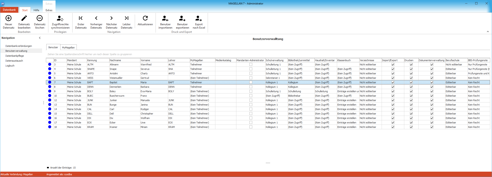
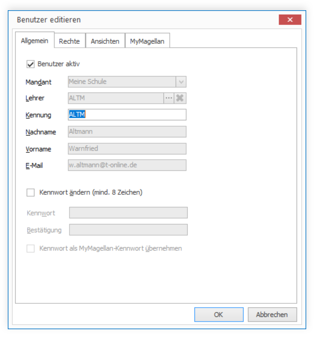

# Benutzerverwaltung

Die Benutzerverwaltung ist das Werkzeug des Administrators, um:

* den Benutzern allgemeinen Zugriffsrechte zuzuweisen,
* Spezielle Rechte zur Nutzung von MYMAGELLAN zuzuweisen und
* das MAGELLAN-Logbuch auszuwerten

!!! info "Hinweis"

	Benutzerdaten werden mit der Datenbankdatei abgespeichert.  Die Passwortdaten der Benutzer werden verschlüsselt in einer zweiten Firebird-Datenbank gespeichert, die bei der Installation von Firebird mit angelegt wurde.

## Registerkarte „Benutzerliste“

In der Benutzerliste ist jeder Benutzer ist durch seine Kennung, den Nachnamen, Vornamen, sein Lehrerkürzel (optional), seinen Mandanten, sein Kennwort und seinen Status definiert. Für jeden Benutzer können Sie seine Rechte in der Schulverwaltung, Bibliotheks & Lernmittel, Inventarisierung und für MYMAGELLAN, die dezentrale Notenverwaltung, festlegen. 

Einen neuen Benutzer können Sie über die Schaltfläche `Hinzufügen` anlegen, einen bestehenden durch Doppelklick auf den Benutzer auf der Karte „MAGELLAN Benutzerliste“ bearbeiten. Für bereits angelegte Benutzer können Rechte exportiert, angepasst und wieder importiert werden. Zum Beispiel, um einer Gruppe von Benutzer schnell und einfach ein neues Recht zu zuweisen oder den Teilnehmern am MYMAGELLAN-Verfahren einen neuen Ablagepfad für die mym-Datei zu hinterlegen.

Dafür stehen in der oberen Menüleiste der Benutzerverwaltung auf der rechten Seite drei Schaltflächen zur Verfügung.

## Benutzer exportieren und importieren

Mit Hilfe eines Assistenten werden alle bereits angelegten Benutzer in eine CSV-Datei exportiert. Bitte geben Sie einen Speicherort und einen Dateinamen an, die Endung „.csv“ wird automatisch ergänzt.

!!! info "Hinweis"

	Auf diesem Weg können keine Benutzer neu angelegt oder Passworte geändert werden, sondern es können für bereits angelegte Benutzer Werte geändert.

In der Datei sind Kopfzeilen und bereits erfasste Einstellungen. Diese Werte können ergänzt oder verändert werden:

Spaltentitel | Mögliche Werte
-------------------------- | --------------
Kennung | Enthalten ist die Benutzerkennung, dieser Wert ist nicht veränderbar
Status | Für die Teilnahme am MYMAGELLAN-Verfahren: Teilnehmer; (Kein Teilnehmer)
Schulverwaltung | Für den Zugriff auf MAGELLAN: (Kein Zugriff), Schulverwaltung 1, Schulverwaltung 2, Sekretariat 1,Sekretariat 2, Kollegium 1, Kollegium 2, Kollegium 3, Kollegium 4, Gast 1, Gast 2, Statistik-Administrator
Bibliothek/Lernmittel | (Kein Zugriff), Schulleitung, Bibliothekar, Kollegium, Gast
Medienkatalog | <Alle Kataloge> oder selbst im Schlüsselverzeichnis angelegte Kataloge (Modul Bibliothek/Lernmittel > Verzeichnisse > Schlüsselverzeichnis Kataloge)
MYMAGELLAN-Datei | Tragen Sie hier den Speicherpfad und den Dateinamen für die MYMAGELLAN-Datei ein, die später mit dem Modul MYMAGELLANCenter erzeugt wird, zum Beispiel:C:\MAGELLAN 6\MYMAGELLAN\Lehrer1.mym
Haushalt/Inventar | (Kein Zugriff), Schulleitung, Sekretariat, Gast
Verzeichnisse | Für die Editierbarkeit von Schlüsselverzeichnissen in MAGELLAN: Nicht editierbar, Editierbar
Aktiv | Ja, Nein, Kennzeichnung des Benutzers als Aktiv oder Inaktiv
Mandanten | Für das Benutzerrecht Mandanten-Administrator: Ja, Nein
Import/ Export | Für den Im- und Export: Ja, Nein
Drucken | Ja, Nein
Dokumente | Zum Zugriff auf die Dokumentenverwaltung: Ja, Nein
Berufsschule | Ermöglicht den Zugriff des Benutzers auf den Menüpunkt Berufsschule. Mögliche Werte: Editierbar, Nicht editierbar
Berufsschule-Prüfungsnoten | Regelt die Sichtbarkeit der Spalten Prüfungsnote und Prüfungsnote (Kontrolle) im Menüpunkt Berufsschule Unterkarte Matrix. Mögliche Werte sind: Kein Recht, Nur Prüfungsnote (Kontrolle), Prüfungsnote + Prüfungsnote (Kontrolle)

Anschließend: Klicken Sie auf die Schaltfläche` Benutzer importieren` um die veränderte Benutzerliste wieder zu importieren. Bitte führen Sie zum Abschluss den Punkt `Datenbankpflege > Datenbank überprüfen > Zugriffsrechte synchronisieren` aus.

## Export nach Excel/HTML

Über diese Schaltfläche können Sie eine Excelliste oder eine HTML-Datei mit den Benutzerdaten erzeugen. Bitte beachten Sie, dass diese Dateiformate nicht wieder direkt eingelesen werden können, dafür nutzen Sie bitte die Schaltfläche `Benutzer exportieren`.

## einen neuen Benutzer anlegen
 
Einen neuen Benutzer erzeugen Sie über die Schaltfläche `Neuer Datensatz` oben links in der Menüleiste. 

### Registerkarte „Allgemein“

Feld|Anmerkung
--|--
Benutzer aktiv|Der Haken ist beim Neuanlegen automatisch aktiviert. Sie haben über dieses Häkchen die Möglichkeit Benutzer vorübergehend zu deaktivieren, zum Beispiel während der Elternzeit
Mandant|Ist in Ihrer Datenbank nur ein Mandant, wird automatisch dieser Mandant vorbelegt. Die Rechte, die Sie im nachfolgenden gewähren, gelten ausschließlich für den hier gewählten Mandanten.
Lehrer|Ist ein Mandant ausgewählt, wird die Lehrerliste gefüllt. Für Kollegiumsrechte ist es notwendig auf einen Lehrer in der Datenbank zu verweisen. MAGELLAN benötigt diese Information um zum Beispiel die Schüler des Lehrers identifizieren zu können (mit Kollegiumsrechten kann man z.B. nur Zeugnisnoten für eigene Schüler einpflegen), oder auch um die eigene Lehrerzeile im Menü Lehrer einzublenden. Für Benutzer denen andere Rechtegruppen (z.B. Sekretariatsrechte)zugewiesen werden sollen, muss nicht nichts gewählt werden.
Nachname|Ist im Feld Lehrer ein Datensatz gewählt worden, wird das Feld automatisch befüllt, anderenfalls tippen Sie hier bitte den Nachnamen ein.
Vorname|Ist im Feld Lehrer ein Datensatz gewählt worden, wird das Feld automatisch befüllt, anderenfalls tippen Sie hier bitte den Vornamen ein.
Kennwort ändern|Mit Hilfe dieses Häkchens können Sie für bereits angelegte Benutzer ein neues 8-stelliges Passwort vergeben.
Kennwort|Bitte vergeben Sie ein 8-stelliges Passwort, bitte verzichten Sie auf Umlaute oder ß.
Bestätigung|Tragen Sie zur Bestätigung bitte das Passwort erneut ein.
Kennwort als MYMAGELLAN-Kennwort übernehmen|Das hier vergebene Passwort kann auch später als Passwort für die MYMAGELLAN-Datei des Benutzers übernommen werden.

!!! info "Hinweis"

	Die Kürzel der Lehrer dürfen keine Umlaute oder „ß“ enthalten. Bitte passen Sie die Kürzel der Kollegen vorab in MAGELLAN an. 
     Sollten Sie bereits einen Benutzerzugang für einen Kollegen mit einem Umlaut im Kürzel angelegt haben, genügt es nicht das Kürzel in MAGELLAN unter Lehrer zu ändern. Löschen Sie bitte den Benutzer unter `MAGELLAN Administrator > Benutzerverwaltung`, ändern anschließend das Kürzel in MAGELLAN unter `Lehrer > Daten1 > Kürzel` und legen abschließend den Benutzerzugang für den Lehrer erneut an.
      Wenn Sie unter Kennwort das Benutzerkennwort eintragen, kann dieses Kennwort gleichzeitig als MYMAGELLAN-Kennwort übernommen werden, wenn Sie das Optionsfeld `Kennwort als MYMAGELLAN-Kennwort übernehmen` markiert haben.Geben Sie bitte ein achtstelliges Passwort ohne Sonderzeichen für den neuen Nutzer an.

## Registerkarte „Rechte“

### Allgemeine Rechte

Rechtegruppe | Rechte
-------------------------- | ------
Mandanten-Administrator | Administratorenrechte, aber kein Zugriff auf den MAGELLAN-Administrator, dafür aber Zugriff auf das MYMAGELLAN Center für den jeweiligen Mandanten.  Das Verwenden dieses Rechtes erhöht alle Schulverwaltungsrechte.  Ausnahme: Kann der Nutzer mit seiner zugeordneten Rechtegruppe (z.B. einem Kollegiumsrecht) nur seinen eigenen Datensatz im Lehrermenü betrachten, bleibt diese Einschränkung erhalten.
Import/Export | Zusätzlich zum Schulverwaltungsrecht kann die Möglichkeit des Importes und Exportes (Seriendruck, Excelexport, Schuldatentransferformat) gesteuert werden.
Drucken | Zusätzlich zum Benutzerrecht kann das Drucken ermöglicht werden
Dokumentenverwaltung | Zusätzlich zum Benutzerrecht die Möglichkeit auf die Dokumentenverwaltung zuzugreifen
Berufsschule | Regelt zusätzlich zum Benutzerrecht den Zugriff des Nutzers auf den Menüpunkt Berufsschule
Berufsschule-Prüfungsnoten | Regelt zusätzlich zum Benutzerrecht die Sichtbarkeit der Spalten Prüfungsnote und Prüfungsnote (Kontrolle) im Menüpunkt Berufsschule auf der Registerkarte Matrix
Administratorenrechte | Keine Zugriffseinschränkungen (Administratorenkennung mit Benutzer: sysdba)

### Rechte für die Schulverwaltung

Rechtegruppe | Rechte
----------------------- | ------
Schulleitung 1 | * Zugriff auf alle Daten außer auf die Datenbankstruktur und die Benutzerverwaltung * Keine Anmeldung am Modul MAGELLAN ADMINISTRATOR möglich
Schulleitung 2 | * Wie Schulleitung 1, aber mit der Einschränkung, keine Fächer oder Noten der Schüler zu ändern * Keine Anmeldung am Modul MAGELLAN ADMINISTRATOR möglich
Sekretariat 1 | * Zugriff auf alle Daten außer auf die Datenbankstruktur und Benutzerverwaltung * Keine Anmeldung am Modul MAGELLAN ADMINISTRATOR möglich
Sekretariat 2 | * Wie Sekretariat 1 aber mit folgenden Einschränkungen: Kein Zugriff auf `Zeugnis > Fächer/Leistungen/Details/Bemerkungen und Formulare/Arbeits- und Sozialverhalten` keine Anmeldung am Modul MAGELLAN ADMINISTRATOR möglich
Kollegium 1 | * Stammdaten der Schüler können gelesen, aber nicht verändert werden. Noten der Schüler, die unterrichtet werden, dürfen als Fachlehrer, Tutor, Klassenleiter1 oder Klassenleiter2 erfasst bzw. geändert werden.  Weitere Zeugnisdaten können als Tutor, Klassenleiter1 oder Klassenleiter2 verändert werden.  Ansonsten bestehen nur Leserechte. Das Menü „Lehrer“ zeigt nur die eigenen Personaldaten an.  Kollegiumsrechte müssen zugewiesen sein, damit man MYMAGELLAN-Dateien bearbeiten kann. Welche Voraussetzungen hierfür des Weiteren gegeben sein müssen, erfahren Sie im Abschnitt „Das MYMAGELLAN Center“ unter „Voraussetzungen“. keine Anmeldung am Modul MAGELLAN ADMINISTRATOR möglich
Kollegium 2 | * Wie Kollegium 1, als Tutor, Klassenleiter1 oder Klassenleiter2 zusätzlich auch Laufbahndaten und Fehlzeiten des Schülers editierbar
Kollegium 3 | * Wie Kollegium 2, aber keine Zeugnisformulare der Schüler editierbar
Kollegium 4 | * Wie Kollegium 2, aber keine Zeugnisformulare und Zeugnisbemerkungen editierbar
Kollegium 5 | * Wie Kollegium 2, als Tutor, Klassenleiter1 oder Klassenleiter2zusätzlich auch das Abiturmenü für alle Schüler editierbar
Gast 1 | * Leserechte. *  Schreibzugriff ist nicht möglich.  * Das Menü „Lehrer“ zeigt nur die eigenen Personaldaten. * Keine Anmeldung am Modul MAGELLAN ADMINISTRATOR möglich
Gast 2 | * Leserechte.  * Schreibzugriff ist nicht möglich.  * Das Menü „Lehrer“ zeigt die Personaldaten aller Lehrer an. * Keine Anmeldung am Modul MAGELLAN ADMINISTRATOR möglich
Statistik-Administrator | Wie Schulleitung 1 zusätzlich können die folgenden Punkte ausgeführt werden:   *  im Administratormodul „Schlüsselverzeichnisse importieren“  * „Mach-Export“  * den Abgleich zwischen MAGELLAN und daVinci  *  Starten des DWH-Explorers

!!! info "Hinweis"

	Je Benutzer kann für die Schulverwaltung insbesondere festgelegt werden, ob der Benutzer das zusätzliche Recht besitzt, die Verzeichnisse in MAGELLAN zu editieren. Kann er die Verzeichnisse nicht editieren, so wird das Menü „Verzeichnis“ für Benutzer in MAGELLAN ausgeblendet. Er kann somit keine Schlüssel in den Verzeichnissen ändern. Im Standardfall hat ein Benutzer kein Recht Verzeichnisse zu editieren, das dies im Regelfall nur von einem ausgewählten kleinen Personenkreis durchgeführt werden soll.

### Bibliotheksrechte

Rechtegruppe |	Rechte
------------ | ------
Bibliothekar |	Zugriff auf alle Daten der Bibliotheksverwaltung
Schulleitung | wie Bibliothekar, aber kein Zugriff auf die Optionsunterkarten: Ausleihe, Quittung, Mahnwesen und Dokumente.
Kollegium | wie Schulleitung
Gast | nur Leserechte

!!! info "Hinweis"

	Beim Anlegen der Kennung bitten wir Sie, auf Abkürzungen wie „Do“ und „If“ zu verzichten, da diese Kürzel gleich lautend mit Programmierbefehlen sind und von Firebird fehl interpretiert werden. Es gibt noch weitere so genannte „reservierte“ Worte, die Sie in der Dokumentation [„MAGELLAN-Scripting“](https://doc.magellan-scripting.stueber.de/) in Kapitel „Die Skriptsprache“ nachschlagen können.
Die Benutzer können ihr Passwort in MAGELLAN unter `Datenbank > Kennwort` ändern selbst anpassen. Dafür werden mindestens 8 Zeichen erwartet. Sollte die Schaltfläche Kennwort ändern inaktiv bleiben, ist der Benutzer als Datenbankadministrator(„sysdba“) angemeldet. Dieses Kennwort kann nur im MAGELLAN-Administrator verändert werden.

## Registerkarte „MYMAGELLAN“

Alle Angaben der Benutzers zu MYMAGELLAN werden aus Gründen der Übersichtlichkeit unter dem Reiter `MYMAGELLAN` aufgelistet. Markieren Sie einen der Benutzer werden für ihn im unteren Bereich zusätzlich die MAGELLAN-Rechte eingeblendet. 

 

