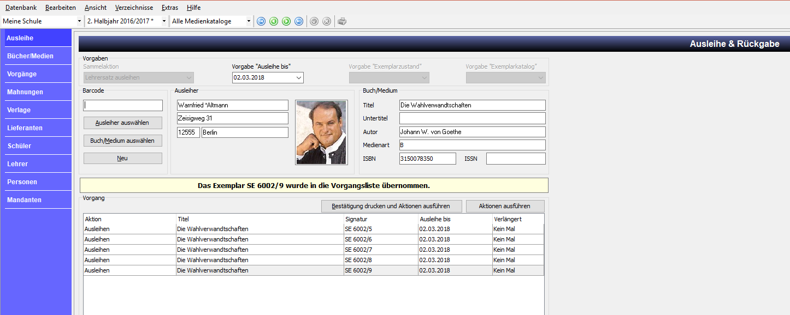

# Leihvorgänge abwickeln

Das Erfassen Ihres Medien- und Ausleiherbestands schafft die Voraussetzungen, um den Leihbetrieb mit MAGELLAN-BIBLIOTHEK aufzunehmen. Sie verfügen nun über die Datenbasis, um die dafür erforderlichen Aktionen durchzuführen. In diesem Kapitel lernen Sie die Abwicklung des eigentlichen Leihvorgangs von der Ausleihe bis zur Rückgabe des Mediums kennen. Wie Sie darüberhinaus Mahnungen für überzogene Medienexemplare erstellen können, erfahren Sie im Kapitel `Mahnungen erstellen`.

Bei der Abwicklung Ihrer Leihvorgänge unterstützt Sie die Datenmaske `Ausleihe & Rückgabe`. Diese Datenmaske erreichen Sie, indem Sie über die Navigationsleiste am linken Rand des Programmfensters, die Ansicht `Ausleihe` aufrufen.

Die Datenmaske Ausleihe & Rückgabe ist in verschiedene Segmente unterteilt, die Sie bei der Durchführung der folgenden Teilschritte unterstützen:

## Einzelaktionen oder Sammelaktionen abwickeln

Mit dem Auswahlfeld `Sammelaktion` im Segment `Vorgaben` entscheiden Sie, ob ein Leihvorgang ein oder mehrere Ausleiher umfassen soll bzw. ob Sie eine Sammelbearbeitung von Exemplaren durchführen möchten . Wenn Sie einen Einzelvorgang durchführen möchten, klicken Sie bitte im Feld `Sammelaktion` auf die Schaltfläche mit dem Pfeilsymbol und wählen Sie den Eintrag `Keine Sammelaktion` aus dem Aufklappmenü. Um stattdessen eine Sammelaktion auszuführen, wählen Sie einen der anderen Einträge aus dem Aufklappmenü.

## Leihfrist festlegen

Im Eingabefeld `Vorgabe: Ausleihe bis` bestimmen Sie die Dauer des Ausleihzeitraums für den aktuellen Leihvorgang. Wenn Sie die Datenmaske das erste Mal öffnen ist standardmäßig ein Leihzeitraum von 10 Tagen voreingestellt. Sie können das Datum für den aktuellen Leihvorgang ändern, indem Sie ein neues Datum eintippen oder die Datumsangaben mit dem hinterlegten Kalender eingeben. Der Kalender öffnet sich, wenn Sie mit der linken Maustaste auf die Pfeilschältfläche des Eingabefelds klicken.
Um den standardmäßig voreingestellten Leihzeitraum von 10 Tagen zu ändern, führen Sie bitte die folgenden Schritte aus:

* Rufen Sie den Menüpunkt `Extras > Optionen` auf
* Öffnen Sie im erscheinenden Dialogfenster die Registerkarte `Ausleihe`.
* Legen Sie im Eingabefeld vor `Tage darf ein Buch ausgeliehen werden` die Anzahl der Tage fest.
Bestätigen Sie Ihre Angaben abschließend mit `OK`.
Die Änderung fließt ab dem nächsten Aufruf der Ansicht `Ausleihe` als neuer Standardwert in die Berechnung der Leihfrist ein.

## Ausleiher suchen und auswählen

Bevor Sie den Ausleiher festlegen können, müssen Sie diesen in der Datenbank suchen und auswählen. Für die Suche nach einem Ausleiher stehen Ihnen im Segment `Barcode` zwei Wege zur Verfügung:

* Geben Sie im Eingabefeld `Barcode` die Barcodenummer des Ausleihers ein. Lesen Sie dazu mit Hilfe eines Barcodescanners den Strichcode ein, der sich auf dem BIBLIOTHEKsausweis des Ausleihers befindet. Ist die Barcodenummer in der Datenbank vorhanden, findet die Auswahl des Ausleihers automatisch statt. Die zugehörigen Angaben zu Name und Anschrift werden in den Datenfeldern des Segments `Ausleiher` hinterlegt. Möchten Sie die getroffene Auswahl korrigieren, so lesen Sie bitte den Barcode eines anderen Ausleihers ein.
* Betätigen Sie die Schaltfläche `Ausleiher` und geben Sie im erscheinenden Dialogfenster eines oder mehrere der vorgegebenen Suchkriterien ein. Bestätigen Sie Ihre Suchkriterien mit `Weiter` und markieren Sie im erscheinenden Dialogfenster die zugehörige Zeile des Ausleihers in der Trefferliste. Bestätigen Sie Ihre Auswahl abschließend mit `Fertigstellen` und die zugehörigen Daten des Ausleihers werden im Segment `Ausleiher` hinterlegt.

 Es besteht die Möglichkeit, den zuletzt in der Auswahlliste der Ansichten `Schüler`, `Lehrer` oder `Personen` markierten Ausleiher in der Datenmaske `Ausleihe & Rückgabe` vorauszuwählen. Um diese Einstellung vorzunehmen, gehen Sie bitte folgendermaßen vor:

* Führen Sie den Menüpunkt `Extras > Optionen` aus und öffnen Sie die Registerkarte `Ausleihe`.
* Setzen Sie den Haken im Kontrollkästchen vor `Zuletzt ausgewählten Ausleiher merken`
* Bestätigen Sie Ihre Auswahl mit `OK`
Beim Wechsel von den Ansichten `Schüler`, `Lehrer` und `Personen` zur Datenmaske `Ausleihe & Rückgabe` werden nun automatisch die Daten des zuletzt bearbeiteten Ausleihers in den Feldern des Segments `Ausleiher` angezeigt.

## Exemplar suchen und auswählen

Bevor Sie das Exemplar festlegen können, müssen Sie dieses in der Datenbank suchen und auswählen. Für die Suche nach einem Exemplar stehen Ihnen im Segment `Barcode` zwei Wege zur Verfügung:

* Geben Sie im Eingabefeld `Barcode` die Barcodenummer des Exemplars ein. Lesen Sie dazu mit Hilfe eines Barcodescanners den Strichcode ein, der sich auf dem Signaturetikett des Exemplars befindet. Ist die Barcodenummer in der Datenbank vorhanden, findet die Auswahl des Exemplars automatisch statt. Die zugehörigen Angaben werden in den Datenfeldern des Segments `Buch/ Medium` hinterlegt. Möchten Sie die getroffene Auswahl korrigieren, so lesen Sie einfach den Barcode eines anderen Exemplars ein.
* Betätigen Sie die Schaltfläche `Exemplare` und geben Sie im erscheinenden Dialogfenster eines oder mehrere der vorgegebenen Suchkriterien ein. Bestätigen Sie Ihre Suchkriterien mit `Weiter` und markieren Sie im erscheinenden Dialogfenster die zugehörige Zeile des Exemplars in der Trefferliste. Bestätigen Sie Ihre Auswahl abschließend mit `Fertigstellen` und die zugehörigen Angaben des Exemplars werden in den Datenfeldern des Segments `Buch/ Medium` hinterlegt.

## Aktion auswählen und bestätigen

In der Vorgangsliste des Segments `Vorgang` werden Ihnen die für einen Leihvorgang ausgewählten Exemplare angezeigt. Die Spalte `Aktion` der Vorgangsliste zeigt die Aktion an , die durchgeführt werden soll. Dabei stehen folgende Aktionen zur Verfügung: `Ausleihen`, `Verlängern`, `Zurückgeben` und `Rückgängig machen`. Wenn das gewählte Exemplar von einem Ausleiher noch nicht entliehen wurde, dann ist in der Spalte `Aktion` automatisch der Eintrag `Ausleihen` hinterlegt. Wurde das gewählte Exemplar vom Ausleiher bereits entliehen, so erscheint ein Dialogfenster, in dem Sie sich zwischen den Aktionen `Verlängern` und `Zurückgeben` entscheiden müssen. Die Aktion, die Sie hier wählen wird wiederum in der Spalte `Aktion` hinterlegt.
Es besteht darüber hinaus die Möglichkeit, die ausgewählte bzw. voreingestellte Aktion in der Spalte `Aktion` der Vorgangszeile eines Exemplars manuell zu korrigieren. Führen Sie dazu bitte die folgenden Schritte durch:
• Klicken Sie in der Vorgangszeile des Exemplars auf die Spalte `Aktion` und betätigen Sie die Pfeilschaltfläche des Auswahlfeldes `Aktion`
• Wählen Sie aus dem Aufklappmenü die gewünschte Aktion aus.
Damit die gewählte Aktion durchgeführt wird, betätigen Sie bitte die Schaltfläche `Aktionen ausführen`.

!!! info "Hinweis"

    Wenn Sie eine Aktion nicht durchführen möchten und auch mit dem gewählten Ausleiher sowie dem gewählten Exemplar nicht weiter arbeiten möchten, so betätigen Sie bitte die Schaltfläche `Neu` im Segment `Barcode`. Durch diese Aktion werden alle Felder der Datenmaske `Ausleihe & Rückgabe` geleert und Sie können einen neuen Leihvorgang beginnen.

## Bestätigung drucken

Die Schaltfläche `Bestätigung drucken und Aktionen ausführen` im Segment `Vorgang` ermöglicht darüber hinaus, einen Beleg über die durchgeführten Aktionen zu drucken. Damit Sie diese Funktion nutzen können, muss vorher eine Berichtsdatei definiert werden, die als Quittungsvorlage dient.

Um diese Berichtsdatei festzulegen, gehen Sie bitte folgendermaßen vor:

* Führen Sie den Menüpunkt `Extras > Optionen` aus und öffnen Sie im erscheinenden Dialogfenster die Registerkarte `Quittungen`.
* Betätigen Sie im Auswahlfeld `Quittungsbericht` die Schaltfläche mit den Pünktchen.
* Markieren Sie im angezeigten Dialogfenster die Berichtsdatei. `Quittung(DIN A5).rpt` und bestätigen Sie Ihre Auswahl mit `Öffnen`
* Setzen Sie den Haken im Kontrollkästchen vor `Quittung/ Bestätigung in Vorschau anzeigen`, wenn Sie wollen, dass Ihnen vor dem Druck einer Bestätigung jeweils eine Seitenvorschau auf dem Bildschirm angezeigt wird.
* Setzen Sie den Haken im Kontrollkästchen vor `Quittung/ Bestätigung automatisch drucken`, falls Sie wollen, dass bei jeder durchgeführten Aktion eine Bestätigung gedruckt wird, unabhängig davon mit welcher Schaltfläche Sie diese Aktion bestätigen.
* Bestätigen Sie Ihre Angaben abschließend mit `OK`.

Die ausgewählte Berichtsdatei ist nun als Quittungsvorlage hinterlegt und wird gemäß den getroffenen Einstellungen ausgegeben.

!!! info "Hinweis"

    Die Berichtsdatei `Quittung(DIN A5).rpt`wird bei der Installation im Programmverzeichnis von MAGELLAN-BIBLIOTHEK abgelegt und kann von Ihnen als Formatvorlage für das Erstellen von Bestätigungen genutzt werden. Wenn Sie darüber hinaus weitere Formatvorlagen benötigen, so können Sie diese mit dem von MAGELLAN unterstützen Berichtsprogramm `Crystal Reports` erstellen.

Grundlegend für die Arbeit mit der Datenmaske `Ausleihe & Rückgabe` ist die Differenzierung zwischen Einzel- und Sammelaktionen. Auf dieser Basis lassen sich die einzelnen Teilaufgaben zu folgenden übergeordneten Arbeitsschritten bündeln.

* Leihvorgänge für einzelne Ausleiher durchführen
* Leihvorgänge für mehrere Ausleiher durchführen
* Sammelbearbeitung von Exemplaren vornehmen

Wie Sie dabei im Einzelnen vorgehen müssen, erfahren Sie in den nun folgenden Abschnitten.

## Leihvorgänge für einzelne Ausleiher abwickeln

Wenn Sie einen Leihvorgang für einzelne Ausleiher durchführen, erfolgt die Auswahl der durchzuführenden Aktion jeweils über die Vorgangsliste der Datenmaske. Dabei stehen Ihnen vier unterschiedliche Aktionen zur Verfügung: `Ausleihen`, `Verlängern`, `Zurückgeben` und `Ausleihe rückgängig`.
Hinweis Sie können pro Ausleiher und Vorgang jeweils verschiedene Aktionen für mehrere Exemplare in der Vorgangsliste sammeln und auf einmal durchführen.
Exemplare ausleihen
Um Exemplare auszuleihen gehen Sie bitte folgendermaßen vor:

1. Wählen Sie im Auswahlfeld `Sammelaktion` den Eintrag `Keine Sammelaktion` aus dem Aufklappmenü.
2. Suchen und bestimmen Sie im Segment `Barcode` den Ausleiher.
3. Suchen und bestimmen Sie im Segment `Barcode` das Exemplar.
4. Lassen Sie im Feld `Status` der Vorgangszeile die Aktion `Ausleihen` voreingestellt
5. Bestätigen Sie Ihre Auswahl durch Betätigen der Schaltfläche `Aktionen ausführen` oder `Bestätigung drucken und Aktionen ausführen.`

Eine farbig hinterlegte Infozeile über dem Segment `Vorgang` weist Sie auf den erfolgreichen Abschluss des Vorgangs hin. Die Vorgangsdaten werden aus der Datenmaske gelöscht und in den jeweiligen Vorgangslisten bei den Ausleihern, sowie den Ansichten `Bücher/ Medien` und `Vorgänge` gespeichert.

### Aufgabe 13

Leihen Sie an die Schülerin `Petra Harz` ein Exemplar des Buches `Wir Kinder vom Bahnhof Zoo` aus. Drucken Sie eine Bestätigung über diesen Vorgang aus.
Exemplare verlängern und zurückgeben
Die Aktionen `Verlängern` und `Zurückgeben` folgen demselben Ablaufschema.
Um eine dieser Aktionen auszuführen, gehen Sie bitte folgendermaßen vor:

1. Wählen Sie im Auswahlfeld `Sammelaktion` den Eintrag `Keine Sammelaktion` aus dem Aufklappmenü.
2. Suchen und bestimmen Sie im Segment `Barcode` den Ausleiher: in der Vorgangsliste erscheinen die derzeit ausgeliehenen Exemplare dieses Ausleihers. Die Daten des zuletzt ausgeliehenen Exemplars werden automatisch in den Feldern des Segments `Buch/ Medium` hinterlegt.
Oder:
Suchen und bestimmen Sie im Segment `Barcode` das Exemplar: in der Vorgangsliste erscheinen die Vorgangsdaten des Exemplars. Im Segment `Ausleiher` werden automatisch die Daten des Ausleihers angezeigt.
3. Klicken Sie in der Vorgangszeile des zu verlängernden Exemplars auf die Spalte `Aktion` und wählen Sie über die Pfeilschaltfläche den Eintrag `Verlängern` oder `Zurückgeben` aus dem Aufklappmenü. Passen Sie ggf. im Auswahlfeld `Ausleihe bis` der Vorgangszeile das Datum an, bis zu dem die Verlängerung gelten soll.
Oder
Setzen Sie im erscheinenden Dialogfenster den Punkt im Kontrollkreis vor `Verlängern` oder `Zurückgeben`. Passen Sie ggf. im Eingabefeld unter `Verlängern` das Datum an , bis zu dem die Verlängerung gelten soll.

Bestätigen Sie Ihre Auswahl durch Betätigen der Schaltfläche `Aktionen ausführen` oder `Bestätigung drucken und Aktionen ausführen.`

Eine farbig hinterlegte Infozeile über dem Segment `Vorgang` weist Sie auf den erfolgreichen Abschluss des Vorgangs hin. Die Vorgangsdaten werden aus der Datenmaske gelöscht und in den Vorgangslisten bei den Ausleihern, sowie den Ansichten `Bücher/ Medien` und `Vorgänge` gespeichert.

!!! info "Hinweis"

    Sie können die Dauer des Verlängerungszeitraums und die Anzahl der möglichen Verlängerungen im Vorfeld festlegen. 

Gehen Sie dazu bitte folgendermaßen vor:

1. Führen Sie den Menüpunkt `Extras > Optionen` aus und öffnen Sie die Registerkarte `Ausleihe`.
2. Tragen Sie im Eingabefeld vor `mal darf ein Exemplar ausgeliehen werden` den gewünschten Wert für die Anzahl der möglichen Verlängerungen ein.
3. Tragen Sie im Eingabefeld vor `Tage dauert jede Verlängerung an` die Anzahl der Tage ein, um die ein Exemplar jeweils verlängert wird.
4. Bestätigen Sie Ihre Angaben abschließend mit `OK`.
Die neuen Einstellungen sind nun hinterlegt und werden mit dem nächsten Aufruf der Ansicht `Ausleihe` wirksam.

### Aufgabe 14

Erhöhen Sie auf der Registerkarte `Ausleihe` des Dialogfensters `Optionen` den standardmäßig voreingestellten Verlängerungszeitraum von 7 auf 10 Tage. Verlängern Sie das Exemplar von `Wir Kinder vom Bahnhof Zoo` der Ausleiherin `Petra Harz`. Beachten Sie dass die veränderte Standard-Verlängerungsfrist erst wirksam wird, wenn Sie die Ansicht `Ausleihe` einmal verlassen und danach wieder aufrufen.

## Ausleihe rückgängig machen

Mit der Aktion `Ausleihe rückgängig` können Sie dafür sorgen , dass alle Daten zu einem Leihvorgang aus den Vorgangslisten gelöscht werden. Um einen Leihvorgang rückgängig zu machen, gehen Sie bitte folgendermaßen vor:

1. Wählen Sie im Auswahlfeld `Sammelaktion` den Eintrag `Keine Sammelaktion` aus dem Drop-Down-Menü.
2. Suchen und bestimmen Sie im Segment `Barcode` den Ausleiher: in der Vorgangsliste erscheinen die derzeit ausgeliehenen Exemplare dieses Ausleihers. Die Daten des zuletzt ausgeliehenen Exemplars werden automatisch in den Feldern des Segments `Buch/ Medium` hinterlegt.
3. Klicken Sie in der Vorgangszeile des Exemplars, dessen Leihvorgang rückgängig gemacht werden soll, auf die Spalte `Aktion` und wählen Sie über die Pfeilschaltfläche den Eintrag `Rückgängig machen` aus dem Aufklappmenü.
4. Bestätigen Sie Ihre Auswahl durch Betätigen der Schaltfläche `Aktionen ausführen` oder `Bestätigung drucken und Aktionen ausführen`.
Eine farbig hinterlegte Infozeile über dem Segment `Vorgang` weist Sie auf den erfolgreichen Abschluss des Vorgangs hin. Die Vorgangsdaten werden aus der Datenmaske gelöscht. Außerdem werden alle Daten zu dem entsprechenden Leihvorgang aus den Vorgangslisten bei den Ausleihern, sowie den Ansichten `Bücher/ Medien` und `Vorgänge` entfernt.

## Leihvorgänge für mehrere Ausleiher abwickeln

Wenn Sie einen Leihvorgang für mehrere Ausleiher durchführen, dann erfolgt die Auswahl der durchzuführenden Aktion stets über das Auswahlfeld `Sammelaktion`. Dabei stehen Ihnen die Aktionen `Klassensatz ausleihen`, `Kurssatz ausleihen` und , `Exemplare zurückgeben` zur Verfügung

!!! info "Hinweis"

    Die Sammelaktionen `Klassensatz ausleihen` und `Kurssatz ausleihen` steht nur für die Ausleihergruppe der Schüler zur Verfügung.

## Ausleihe eines Klassensatzes durchführen

Die Funktion `Klassensatz ausleihen` ermöglicht Ihnen, in einem Vorgang mehrere Exemplare eines Titels an eine Gruppe von Schülern auszuleihen. Diese Funktion kommt klassischerweise im Bereich der Lernmittelverwaltung zum Einsatz, wenn z.B. ein Fachlehrer für einen Klassenverband einen kompletten Satz an Lehrbüchern ausleiht. Sie kann aber auch, ungeachtet einer gemeinsamen Klassenzugehörigkeit, von jeder anderen Schülergruppierung an Ihrer Schule genutzt werden.

Um eine Klassensatzausleihe durchzuführen, gehen Sie bitte folgendermaßen vor:

1. Wählen Sie im Auswahlfeld `Sammelaktion` den Eintrag `Klassensatz ausleihen` aus dem Aufklappmenü.
2. Betätigen Sie die Schaltfläche `Ausleiher auswählen` und markieren Sie im erscheinenden Dialogfenster die Schüler, für die Sie eine Gruppenausleihe durchführen möchten. Bestätigen Sie diese Auswahl mit `Fertigstellen`.
Oder:

Platzieren Sie den Cursor in das Feld `Barcode` und scannen Sie nacheinander den Barcode von den BIBLIOTHEKsausweisen der Schüler ein.
In der Vorgangsliste erscheint nun eine Zeile für jeden ausgewählten Schüler.
3. Suchen und bestimmen Sie im Segment `Barcode` das Exemplar bzw. den Titel: in der Spalte `Signatur` der Vorgangsliste werden die verfügbaren Exemplare des Titels automatisch den Ausleihern zugeweisen.
4. Bestätigen Sie Ihre Auswahl mit der Schaltfläche `Aktionen ausführen` oder `Bestätigung drucken und Aktionen ausführen`.
Eine farbig hinterlegte Infozeile über dem Segment `Vorgang` weist Sie auf den erfolgreichen Abschluss des Vorgangs hin. Die Vorgangsdaten werden aus der Datenmaske gelöscht und in den Vorgangslisten bei den Ausleihern, sowie den Ansichten `Bücher/ Medien` und `Vorgänge` gespeichert.

### Aufgabe 15

Führen Sie für die Schüler der Klasse 10a in der Beispieldatenbank eine Klassensatzausleihe des Titels `Die Räuber` durch.

## Ausleihe eine Kurssatzes durchführen

Die Funktion `Kurssatz ausleihen` bietet die Möglichkeit, gezielt auf die Teilnehmer eines Kurses zuzugreifen und einen Medientitel an einen, mehrere oder alle Kursteilnehmer zu verleihen. Dies ist insbesondere für den Leihbetrieb im Rahmen der gymnasialen Oberstufe eine nützliche Hilfe. Dort aber auch im Rahmen des Wahlpflicht- oder AG-Unterrichts z.B. an Grundschulen differenziert sich die schulische Medienleihe nicht nach dem Merkmal der Klassenzugehörigkeit, sondern vielmehr entlang des Besuchs gemeinsamer Kursangebote.

Um einen Medientitel gezielt an Teilnehmer eines bestimmten Kurses auszuleihen, gehen Sie bitte folgendermaßen vor:

1. Wählen Sie im Auswahlfeld `Sammelaktion` den Eintrag `Kurssatz ausleihen` aus dem Aufklappmenü.
2. Betätigen Sie die Schaltfläche `Ausleiher auswählen`: der Assistent für die Durchführung der Kurssatzausleihe öffnet sich.
3. Markieren Sie in der Kursliste auf der ersten Assistentenseite, den Kurs für den Sie eine Gruppenausleihe durchführen möchten.
4. Markieren Sie in der erscheinenden Liste der Kursteilnehmer die gewünschten Ausleiher für die Kurssatzausleihe
5. Bestätigen Sie diese Auswahl mit `Fertigstellen`: In der Vorgangsliste erscheint nun eine Zeile für jeden ausgewählten Schüler.
6. Suchen und bestimmen Sie im Segment `Barcode` das Exemplar bzw. den Titel: in der Spalte `Signatur` der Vorgangsliste werden die verfügbaren Exemplare des Titels automatisch den Ausleihern zugeweisen.
7. Bestätigen Sie Ihre Auswahl mit der Schaltfläche `Aktionen ausführen` oder `Bestätigung drucken und Aktionen ausführen`.
8. Eine farbig hinterlegte Infozeile über dem Segment `Vorgang` weist Sie auf den erfolgreichen Abschluss des Vorgangs hin. Die Vorgangsdaten werden aus der Datenmaske gelöscht und in den Vorgangslisten bei den Ausleihern, sowie den Ansichten `Bücher/ Medien` und `Vorgänge` gespeichert.

!!! info "Hinweis"

    Damit Sie für die Teilnehmer eines Kurses eine Kurssatzausleihe durchführen können, muss der Kurs bei den Schülern in MAGELLAN hinterlegt sein.
Die Aufnahme eines Kurses in die Auswahlliste für die Kurssatzausleihe erfordert Angaben mindestens in den Spalten `Fach`, `Unterrichtsart` und `Kurs` auf der Registerkarte `Schüler > Zeugnis > Fächer` des Basismoduls. Fehlt dort z.B. die Kursnummer in der Spalte `Kurs` kann für den zugehörigen Kurs keine Kurssatzausleihe vorgenommen werden

## Ausleihe eines Lehrersatzes durchführen

Die Funktion `Lehrersatz ausleihen` bietet die Möglichkeit mehrere Bücher an einen Lehrer zu verleihen - es gibt hierbei keine Zuweisung eines Exemplares zu einem einzelnen Schüler. 

!!! info "Hinweis"

    Diese Aktion eignet sich beispielsweise für Fachlehrer, die einen Satz Schulbücher für die Dauer einer Schulstunde ausleihen und später wieder einsammeln möchten. Diese Bücher werden nicht einem einzelnen Schüler zugeordnet, sondern können vom Lehrer für den Fachunterricht in mehreren Klassen genutzt werden.

Um mehrere Medientitel an einen Lehrer auszuleihen, gehen Sie bitte folgendermaßen vor:

1. Wählen Sie im Auswahlfeld `Sammelaktion` den Eintrag `Lehrersatz ausleihen` aus dem Aufklappmenü.
2. Betätigen Sie die Schaltfläche `Ausleiher auswählen`: eine Liste der Lehrer öffnet sich.
3. Markieren Sie in den Lehrer und bestätigen Sie die Auswahl!
4. Klicken Sie auf "Buch/Medium auswählen", geben den gewünschten Titel oder ein * (für die Liste aller Exemplare) ein und bestätigen Sie.
5. Markieren Sie die gewünschten Exemplare. 
7. Bestätigen Sie Ihre Auswahl mit der Schaltfläche `Aktionen ausführen` oder `Bestätigung drucken und Aktionen ausführen`.

Eine farbig hinterlegte Infozeile über dem Segment `Vorgang` weist Sie auf den erfolgreichen Abschluss des Vorgangs hin. Die Vorgangsdaten werden aus der Datenmaske gelöscht und in den Vorgangslisten bei den Ausleihern, sowie den Ansichten `Bücher/ Medien` und `Vorgänge` gespeichert.

## Exemplare für mehrere Ausleiher zurückgeben

Die Funktion `Exemplare zurückgeben` ermöglicht Ihnen die Rückgabe von Exemplaren für eine Gruppe von Schülern, Lehrern oder Personen. Um die Rückgabe für mehrere Ausleiher gleichzeitig abzuwickeln, führen Sie bitte folgende Schritte durch.

1. Wählen Sie im Auswahlfeld `Sammelaktion` den Eintrag `Exemplare zurückgeben` aus dem Aufklappmenü.
2. Platzieren Sie den Cursor in das Feld `Barcode` und scannen Sie nacheinander den Barcode von den Signaturetiketten der Exemplare ein. In der Vorgangsliste erscheint nun eine Zeile für jedes ausgewählte Exemplar.

Oder:

Betätigen Sie die Schaltfläche `Buch/ Medium auswählen` und geben Sie in der erscheinenden Suchmaske Ihre Suchkriterien ein. Bestätigen Sie bitte mit `Weiter` und markieren Sie in der Trefferliste das Exemplar, das Sie zurückgeben möchten. Bestätigen Sie abschließend mit `Fertigstellen` und das ausgewählte Exemplar erscheint in der Vorgangsliste. Wiederholen Sie diesen Vorgang bitte für jedes Exemplar der Gruppe.
3. Bestätigen Sie Ihre Auswahl mit der Schaltfläche `Aktionen ausführen` oder `Bestätigung drucken und Aktionen ausführen`.
Eine farbig hinterlegte Infozeile über dem Segment `Vorgang` weist Sie auf den erfolgreichen Abschluss des Vorgangs hin. Die Vorgangsdaten werden aus der Datenmaske gelöscht und in den Vorgangslisten bei den Ausleihern, sowie den Ansichten `Bücher/ Medien` und `Vorgänge` gespeichert.
