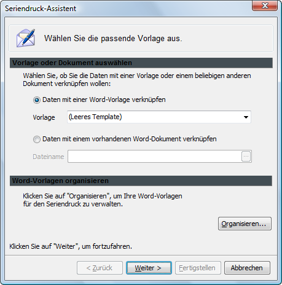

# Serienbrief erstellen

Sie haben die Möglichkeit aus verschiedenen Listen einen Serienbrief in Word zu erstellen. Diese Funktion steht für folgende Stammdaten und Vorgangslisten zur Verfügung:

* Die Liste `Überzogene Bücher/Medien` in der Ansicht `Mahnungen`
* Die Auswahllisten der Ansichten `Verlage` und `Lieferanten`
* Die Auswahllisten der Ansichten `Schüler`, `Personen` und `Lehrer`
* Die Auswahlliste der Ansicht `Mandanten`

Um aus den verschiedenen Listen einen Serienbrief an Ausleiher, Lieferanten, Verlage oder Mandanten zu erstellen, führen Sie bitte die folgenden Schritte aus:

1. Markieren Sie die Zeilen der gewünschten Personen bzw. Institutionen und betätigen Sie die Schaltfläche `Seriendruck nach Word` : der Assistent für den Seriendruck wird geöffnet.
2. Setzen Sie auf der ersten Seite des Seriendruck-Assistenten den Punkt im Kontrollkreis vor `Daten mit einer Word-Vorlage verknüpfen` Belassen Sie im Eingabefeld `Vorlage` den Eintrag `Leere Vorlage` oder wählen eine der angebotenen Vorlagen aus.

Oder
Setzen Sie auf der ersten Seite des Seriendruck-Assistenten den Punkt im Kontrollkreis vor `Daten mit einem vorhandenen Word-Dokument verknüpfen`.

1. Betätigen Sie die Schaltfläche mit den drei Pünktchen im Auswahlfeld Dateiname.
2. Wählen Sie im erscheinenden Dialogfenster die Zieldatei aus dem Windows-Explorer.
3. Bestätigen Sie Ihre Auswahl mit `Öffnen`: Der Name der ausgewählten Zieldatei wird nun im Auswahlfeld `Dateiname` des Dialogfensters `Seriendruck-Assistent` hinterlegt.
4. Bestätigen Sie Ihre Angaben mit `Weiter` und klicken Sie auf der zweiten Seite des Seriendruckassistenten auf die Schaltfläche `Fertigstellen`.

Die Daten für den Serienbrief werden nach Word übertragen. Von hier aus können Sie nun den Serienbrief fertig gestalten und ausdrucken.
