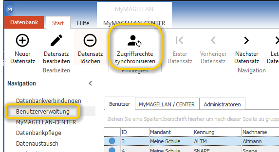

# Voraussichtliche Änderungen

Sie erhalten hier einen Überblick über die voraussichtlichen Änderungen und Korrekturen für das nächste Serviceupdate. Die nachfolgend gelisteten Änderungen wurden noch nicht veröffentlicht.

### LEGENDE

| Abkürzung | Bedeutung |
| --- | --- |
| FIX | Korrektur bestehender Funktionalität |
| NEW | Neue Funktionalität |
| CHANGE | Änderung des Ablaufs, Verarbeitung oder Bedienung |

---

## 7.0.12 - 705

!!! warning "Wichtig"

    Die Datenstruktur von MAGELLAN ist erweitert worden! Bitte aktualisieren Sie als erstes Ihren Serverrechner, anschließend alle Arbeitsplatzrechner! Beim ersten Start von MAGELLAN erfolgt eine automatische Anpassung an die neue Datenstruktur durch einen Assistenten. Bitte befolgen Sie die [Anleitung](https://doc.magellan7.stueber.de/schulverwaltung/update/vorbereitung/#updates-mit-datenstrukturerweiterung)!
   

### MAGELLAN

* FIX: `Schüler korrigieren`
* FIX: Passfotofunktion unter `Bewerber > Daten1` und unter `Lehrer > Daten1` ergänzt
* FIX: im Lehrermenü kann `Auswahlliste > Lehrer markieren > Rechtsklick` das Fehlzeitenfenster aufgerufen werden
* FIX: Die Funktionalitäten unter `Schüler > Zeugnis > Bemerkungen` wurden überarbeitet

### SAXSVS

* CHANGE: 

### MyMAGELLAN

* NEW: 

### MAGELLAN Administrator

* CHANGE: Die Skriptdatei `Zugriffsrechte zuweisen` wurde um neue Bestandteile der Datenbank ergänzt. Bitte synchronisieren Sie die Zugriffsrechte über die Schaltfläche im `MAGELLAN-ADMINISTRATOR > Benutzerverwaltung > Zugriffsrechte` synchronisieren.
  

* NEW: `Datenbankpflege > Gemeinden synchronisieren` wurde ergänzt um Sorgeberechtigte, damit können nachträglich Gemeindekennziffern für Sorgeberechtigte ergänzt werden, wenn die PLZ und der Ort einem Eintrag im Verzeichnis der Postleitzahlen zugeordnet werden können.

### MAGELLAN Bibliothek

* FIX: 

### Berichte (NEW oder CHANGE)

Eine Anleitung unserer Berichte finden Sie im Modul MAGELLAN BERICHTE, das Bestandteil der Installation ist und unter `Start > Programme > Stüber Systems > MAGELLAN BERICHTE` aufgerufen werden kann.

* FIX: Klassenliste inkl. ausgeschulter Schüler.rpt

Folgende Berichtsverzeichnisse wurden auf die Datenstruktur von MAGELLAN 7 angepasst:

* FIX: 
