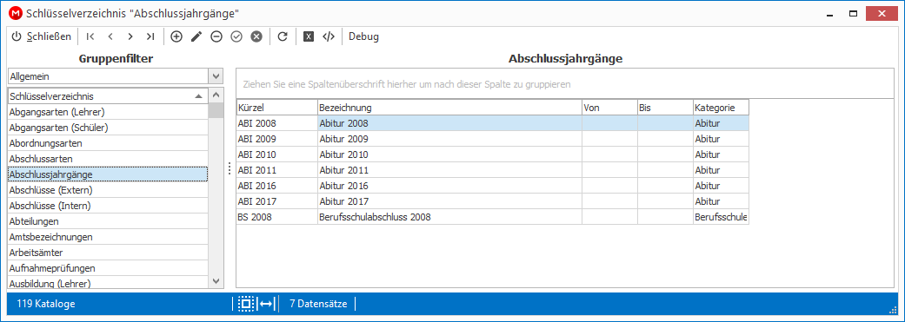

## Stammdaten und Schlüsselverzeichnisse einrichten

Die halbjährlich erworbenen Noten der Oberstufe samt der Fächer und weiteren Informationen (zum Beispiel Merkmale, Fachstatus, Unterrichtsarten) sollen per Assistent auf die Karte `Abitur > Qualifikation` in den korrekten Spalten (E1 bis Q4, eventuell regionale Abweichungen möglich) synchronisiert werden. Anschließend sollen skriptbasierte Berechnungen ausgeführt werden. Das Synchronisieren der Halbjahresdaten in das Menü `Abitur `und die anschließenden Berechnungen per Skript, gelingen nur, wenn die Daten entsprechend vorbereitet sind. Bitte schauen Sie sich dazu die nachstehenden Hinweise für die Vorbereitung der Stammdaten und Schlüsselverzeichnisse an.

### Verzeichnis Zeiträume

* Bitte überprüfen Sie unter `Extras > Schlüsselverzeichnisse > Zeiträume > Art`, dass die Art `1.Halbjahr` oder `2.Halbjahr` korrekt für jede Zeile gefüllt ist. 
* Um die Fachwahlen für die Oberstufe erfassen zu können, müssen zusätzlich zukünftige Zeiträume angelegt werden. Bitte legen Sie die Zeiträume soweit an, dass die Schuljahre bis zum Abitur für die aktuelle Klasse 10 existieren.

Beispiel:
Aktuelles Schuljahr 2018/2019: Um für Schüler der aktuellen Klasse 10 (die ihr Abitur voraussichtlich in der Klassenstufe 12 absolvieren) die Oberstufenfachwahl zu erfassen, müssen auch das Schuljahr 2019/2020 (Jahrgang 11) und das Schuljahr 2020/2021 (Jahrgang 12) angelegt werden.

### Eingaben für Klassen

Die Oberstufe besteht aus den Jahrgängen 11, 12 und 13. In MAGELLAN und DAVINCI sind Klassen und Jahrgänge gleichbedeutend. In MAGELLAN werden die Daten halbjahresbezogen abgelegt. Sie definieren also drei Klassen 11, 12 und 13 mit je zwei Zeiträumen bzw. Halbjahren. Folgende Angaben sind bei der Eingabe der Oberstufenjahrgänge neben den Halbjahren wichtig:

Eingabefeld | Eingabe
--------------- | -------
Klassenart | Oberstufenjahrgang (Leistungs- und Grundkurse) oder Oberstufenjahrgang (nur Kurse).  Möchten Sie Schüler für die Fachwahlkarte synchronisieren, können Sie für die Klasse auch die Klassenart „Standard mit Oberstufensynchronisation“ verwenden, hierbei werden nur die Schülerdaten übergeben, keine Fach- oder Leistungsdaten.
Jahrgang | 11, 12 oder 13 [bei G9] bzw. 10, 11 oder 12 [bei G8] (pro Zeitraum der Klasse notwendig)
Beurteilungsart | Benotung durch Punkte (oder Noten)

### Verzeichnisse Unterrichtsarten und Fachstatus

Voraussetzung für die Fachwahlüberprüfung und die Abiturqualifikationsberechnung ist, dass Sie in der Oberstufe bei den Fächern des Schülers die entsprechende Unterrichtsart und den entsprechenden Fachstatus eingegeben haben. Welche Unterrichtsarten und Fachstatus von den mitgelieferten Skripten in Abhängigkeit vom jeweiligen Bundesland verwendet werden, wird in der Dokumentation [Landesanpassungen](https://doc.la.stueber.de/) ausführlich je Skript erläutert.

### Verzeichnis Fächer

> Geben Sie für jedes Fach, das Sie in der Oberstufe verwenden `Fachkategorie` und `Aufgabenbereich` an:

* Klicken Sie auf `Extras > Schlüsselverzeichnisse > Fächer` und machen Sie im Verzeichnis der Fächer die entsprechenden Eingaben in den Spalten `Kategorie` und `Aufgabenbereich`.

!!! info "Hinweis"

	In der Dokumentation [Landesanpassungen](https://doc.la.stueber.de/) finden Sie eine entsprechende Anleitung, für welches Bundesland pro Fach welche Einstellungen bei Fachkategorie bzw. im Aufgabenbereich vorgenommen werden müssen.

### Verzeichnis Abschlussjahrgänge

Sie können in MAGELLAN unter `Extras > Schlüsselverzeichnisse > Abschlussjahrgäng` die Abschlussjahrgänge definieren. In unserem Fall ist dies ein Abiturjahrgang. Damit können Sie jedem Schüler in der Rubrik `Abitur` den entsprechenden Abiturjahrgang zuordnen. Dieser Vermerk hat keinen Einfluss auf Abschluss- oder Qualifikationsberechnungen, sondern dient dazu, später alle Schüler eines bestimmten Abiturjahrgangs z.B. für Ausdrucke herausfiltern zu können.

!!! info "Hinweis"

	Geben Sie bei der Definition des Abiturjahrgangs im Fenster `Verzeichnisse der Abschlussjahrgänge` unter `Kategorie` unbedingt `Abitur` an.

### Verzeichnis Verordnung 

Sie müssen für jeden Schüler die Abiturordnung angeben, die für ihn relevant ist. Dazu müssen Sie im Schlüsselverzeichnis `Verordnungen` die jeweilige Fachwahlverordnung und/oder Abiturprüfungsordnung definieren. Bitte prüfen Sie vorab, ob es ein Prüfskript für Ihre Region und Verordnung gibt (["Alle Skripte im Überblick"](https://doc.la.stueber.de/alle_skripte_im_uberblick.html)). 

!!! info "Hinweis"

	 Alle verfügbaren Skripte finden Sie in der Dokumentation ["Landesanpassungen"](https://doc.la.stueber.de/)  im Abschnitt ["Alle Skripte im Überblick"](https://doc.la.stueber.de/alle_skripte_im_uberblick.html). 

Um Ihre Skripte in MAGELLAN zu hinterlegen,  klicken Sie dazu auf `Extras > Schlüsselverzeichnisse > Verordnungen` und geben Sie dort die Verordnung an. Je Skript legen Sie bitte eine gesonderte Zeile an. Wenn für Ihre Region und Verordnung ein Fachwahlskript zur Verfügung steht, dann legen Sie dafür bitte eine Zeile an, für das Skript, das die Abiturberechnung vornimmt bitte eine zweite Zeile, sollten die Schüler nach verschiedenen Verordnungen geprüft werden, benötigen Sie eine dritte Zeile.

Welche Eintragungen für Ihre Region oder für Ihr Skript erwartet werden, [beschreiben wir für jedes verfügbare Skript  in unserer Landesanpassung](https://doc.la.stueber.de/) ). 

#### Abiturskript hinterlegen

Alle verfügbaren Berechnungsskripte werden im Abschnitt ["Die Berechnungsskripte"](https://doc.la.stueber.de/allgemeines_spezielle_einstellungen_pro_skript.html) beschrieben.

Spalte | Bedeutung
-------------- | ---------
Kürzel | Kurzbezeichnung der Verordnung (max. 10-stellig)
Bezeichnung | Bezeichnung der Verordnung
Kategorie | Geben Sie hier `Abitur` ein, für die Prüfungsverordnung der Qualifikationsberechnung.
Typ|[Bitte richten Sie sich genau nach der Anleitung für Ihr Skript!](https://doc.la.stueber.de/allgemeines_spezielle_einstellungen_pro_skript.html)
Notenart 11-13 | Geben Sie hier an, ob Sie in der Oberstufe Punkt- oder Notenwerte (z.B. in Nordrhein-Westfalen) vergeben möchten. [Bitte richten Sie sich genau nach der Anleitung für Ihr Skript!](https://doc.la.stueber.de/allgemeines_spezielle_einstellungen_pro_skript.html)
Gültig von | Gültigkeitsdatum von, ohne Bedeutung für die Berechnungen
Gültig bis | Gültigkeitsdatum bis, ohne Bedeutung für die Berechnungen
Skript | Geben Sie hier den Namen des Skripts für diese Abiturprüfungsordnung ein. Alle verfügbaren Skripte befinden sich im MAGELLAN-Verzeichnis SKRIPTE im jeweiligen Regionalordner, der Skriptname enthält "APO".

#### Fachwahlskript hinterlegen

Alle verfügbaren Fachwahlskripte werden im Abschnitt ["Die Fachwahlskripte"](https://doc.la.stueber.de/fachwahl/die_fachwahlskripte.html) beschrieben. Fachwahlskripte enthalten die Buchstaben "FW" für Fachwahl im Dateinamen.

Spalte | Bedeutung
-------------- | ---------
Kürzel | Kurzbezeichnung der Verordnung (max. 10-stellig)
Bezeichnung | Bezeichnung der Verordnung
Kategorie |Geben Sie hier `Fachwahl` ein. 
Typ|[Bitte richten Sie sich genau nach der Anleitung für Ihr Skript!](https://doc.la.stueber.de/fachwahl/die_fachwahlskripte.html)
Notenart 11-13 | Noten oder Punkte
Gültig von | Gültigkeitsdatum von, ohne Bedeutung für die Berechnungen
Gültig bis | Gültigkeitsdatum bis, ohne Bedeutung für die Berechnungen
Skript | Geben Sie hier den Namen des Skripts für diese Fachwahlprüfung ein. Alle verfügbaren Skripte befinden sich im MAGELLAN-Verzeichnis SKRIPTE im jeweiligen Regionalordner, der Skriptname enthält "FW".
