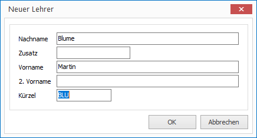
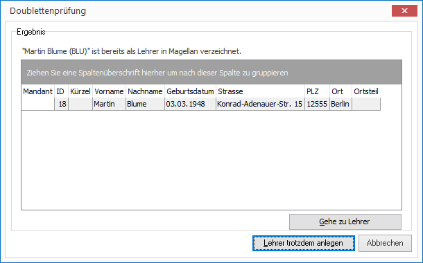

# Lehrer

In diesem Kapitel wird Ihnen gezeigt, wie Sie Lehrer in MAGELLAN aufnehmen und verwalten.

## Lehrer eingeben

Lehrerdaten besitzen im Gegensatz zu Klassendaten keinen Zeitraumbezug. Sie müssen also bei der Eingabe nicht darauf achten, ob Sie sich im richtigen Zeitraum befinden.

### Neuen Lehrer aufnehmen

Um einen neuen Lehrer aufzunehmen, klicken Sie in der Startleiste auf der linken Bildschirmseite auf Lehrer oder wählen Sie `Ansicht > Lehrer`. Wählen Sie dann das Symbol in der oberen Symbolleiste oder `Bearbeiten > Neuer Datensatz`. Es öffnet sich das Dialogfenster `Neuer Lehrer`.
 

Hier geben Sie zunächst den Vor- und Nachnamen des Lehrers und sein schulinternes Kürzel an. Anhand des Kürzels werden Sie den Lehrer in Zukunft identifizieren.

!!! info "Hinweis"

	Das Lehrerkürzel wird in der Regel auch später für die Anmeldung verwendet. In der Benutzerverwaltung dürfen in den Kennungen (beim Lehrer ist das dann das Kürzel) keine Umlaute und kein ß verwendet werden. Beim Anlegen in MAGELLAN selbst erhalten Sie auch eine entsprechende Meldung. Sollten Sie die Lehrer allerdings per Import nach MAGELLAN einlesen, achten Sie bitte darauf, die Zeichen im Lehrerkürzel nicht zu verwenden oder anzupassen. 
    Um einen neuen Lehrer in MAGELLAN aufnehmen zu können, müssen Sie dessen Namen und Kürzel in das Dialogfenster eintragen und dann auf OK klicken. Der Lehrer ist nun neu aufgenommen und Sie befinden sich automatisch auf der Registerkarte `Daten 1` dieses Lehrers, um dessen weitere Daten zu erfassen. Ist ein Datensatz mit dem gleichen Vor- und Zunamen oder dem gleichen Lehrerkürzel bereits angelegt erscheint folgender Hinweis:
 

### Registerkarte `Daten 1`

Auf der Registerkarte `Daten 1` des Lehrers befinden sich verschiedene Eingabefelder. Durch Betätigen der Eingabetaste oder der Tabulatortaste (TAB) gelangen Sie zum nächsten Eingabefeld. In ein vorheriges Eingabefeld gelangen Sie über die Tastenkombination UMSCHALT und TAB. Diese Art der Navigation auf den Registerkarten ist in MAGELLAN überall einheitlich.
 

!!! info "Hinweis"

	Die verschiedenen Registerkarten der Lehrer bieten Ihnen eine Fülle von Eintragsmöglichkeiten. Diese Einträge sind optional und nicht zwingend, d.h. Sie müssen nicht alle Eintragungsmöglichkeiten füllen, sondern nur die, die Sie tatsächlich benötigen. Dabei müssen Sie insbesondere die notwendigen Angaben für die Landesstatistik berücksichtigen. Näheres hierzu finden Sie im Dokument [Landesstatistiken](https://doc.ls.stueber.de/).

Auf der Registerkarte `Daten 1` tragen Sie die wichtigsten Grunddaten des Lehrers ein. Bei den Schlüsselfeldern, wie z.B. der Staatsangehörigkeit des Lehrers, können Sie die möglichen Kürzel durch Anwahl des Pfeils hinter dem Eingabefeld und der Auswahl aus der dann geöffneten Liste vornehmen. Alternativ können Sie auch direkt das Ihnen bereits bekannte zutreffende Kürzel eintragen, da sich der jeweils passende Eintrag dann automatisch einstellt, wie bei einer inkrementellen Suche. Besonders hervorzuheben sind hier zwei automatische Einstellungen:

* **Anrede - Geschlecht:** Wenn Sie im Feld `Anrede` den entsprechenden Wert ausgewählt haben und dann mit der Eingabetaste weitergehen, wird das Geschlecht des Lehrers automatisch eingestellt. Dies gilt auch analog für Bewerber, Schüler, Sorgeberechtigte, Lehrer und Personen.

* **Postleitzahlautomatik:** Wenn Sie die Postleitzahlen für Ihre Datenbank importiert haben, können Sie das gesamte Postleitzahlverzeichnis von Deutschland nutzen. Geben Sie die Postleitzahl ein und drücken dann die Eingabetaste, so werden die Felder `Länderkennzeichen`, `Ort`, `Ortsteil`, `Gemeinde` und `Vorwahl` automatisch vor besetzt. Als Voraussetzung für die automatische Zuordnung dürfen die Felder `Gemeinde` und `Ort` keinen Eintrag besitzen. Geben Sie nur den Ort ein und drücken dann die Eingabetaste, werden die Felder `Länderkennzeichen`, `PLZ`, `Ortsteil`, `Gemeinde` und `Vorwahl` automatisch vor besetzt. Als Voraussetzung für die automatische Zuordnung dürfen die Felder `PLZ` und `Gemeinde` keinen Eintrag besitzen. 

!!! info "Hinweis"

	Die Postleitzahlautomatik steht in MAGELLAN überall dort zur Verfügung, wo Postleitzahl und Ort bei der Datenaufnahme eingegeben werden müssen.

Für jeden Lehrer können Sie optional dessen Passfoto in MAGELLAN aufnehmen. Wählen Sie dazu `Bearbeiten > Passfoto` und dann `Passfoto aus Datei` oder `Passfoto aus Digitalquelle`.  Über den Menüpunkt `Passfoto aus Digitalquelle` können Sie direkt angeschlossene digitale Geräte (wie z.B. Digitalkamera, Scanner) nutzen, um die Bilder ohne Zwischenspeicherung in eine Datei nach MAGELLAN übernehmen zu können. Voraussetzung hierfür ist die Einstellung einer Digitalquelle unter `Datenbank  > Optionen > Digitalquelle`. Haben Sie das letzte Feld der Registerkarte gewählt und drücken dann die Eingabetaste, wechseln Sie automatisch zur nächsten Registerkarte.

### Registerkarte `Daten 2`

Auf der Registerkarte `Daten 2` sind die Abteilungen, dienstlichen Bezeichnungen und die Zugangs-/Abgangsdaten des Lehrers festgehalten.
 

### Registerkarte `Daten 3`

Hier können Lehrämter inklusive eventueller Lehrbefähigung, Unterrichtserlaubnis, Unterrichtsauftrag bzw. Unterrichtsbefugnis erfasst werden.
 

Klicken Sie neben der Lehrämterliste auf `Hinzufügen`, um das Dialogfenster `Lehrämter zuweisen` zu öffnen.
 

Zur Auswahl müssen Sie jetzt den `Lehramtstyp` einstellen und anschließend die entsprechenden Fächer für diesen Typ auswählen. Dabei ist eine Mehrfachmarkierung in der Liste der Fächer möglich. Unter den Funktionen 1 - 8 können Sie dem Lehrer besondere Funktionen innerhalb der Schule (z.B. Vertrauenslehrer) mit entsprechenden Zeitdauerangaben zuordnen. Ist ein Lehrer an mehr als einer Schule tätig, so können Sie im unteren Teil der Registerkarte die `Berichtende Schule` und die `Abordnungen` inklusive der `Abordnungsart` festhalten.

### Registerkarte `Merkmale`

Über die Registerkarte `Merkmale` können Sie weitere Merkmale eintragen. Prinzipiell sind diese Merkmale beliebig zu nutzen. In Abhängigkeit von der jeweiligen Landesstatistik haben diese Felder teilweise auch statistische Bedeutungen. Sie sollten daher vor der Verwendung dieser Felder zunächst das für Ihr Bundesland relevante Kapitel unter [Landesstatistiken](https://doc.ls.stueber.de/) lesen. Es wird dort genau beschrieben, welche der Merkmalsfelder statistisch verwendet werden und somit nur fest definierte Werte besitzen dürfen. Ihnen stehen zehn Merkmalsfelder (A1 bis A6, S1 bis S4) zur Verfügung, deren mögliche Werte Sie in den entsprechenden Schlüsselverzeichnissen eintragen können. Dabei können die Merkmalsfelder A1 bis A6 eine statistische Bedeutung haben. Die Merkmalsfelder S1 bis S4 haben ausschließlich statistische Bedeutung. Die vier Merkmalsfelder (B1 bis B4) können eine statistische Bedeutung haben. Sie sind nicht mit einer Liste von Werten hinterlegt, sondern frei editierbar. Zusätzlich können Sie dem Lehrer einen beliebigen Bemerkungstext zuordnen.
 

!!! info "Hinweis"

	Die Inhalte der Lehrermerkmale A1-A6 und S1-S4 können Sie sich über die `Extras > Schlüsselverzeichnisse > Gruppenfilter Merkmale` definieren. Lehrermerkmal B1-B5 lassen sich direkt in dem jeweiligen Feld eingeben. Diese Merkmalsfelder gibt es auch analog für Schüler, Bewerber und Klassen.

### Lehrer auswählen, editieren oder löschen

Über die Registerkarte `Auswahl` können Sie bestehende Lehrer auswählen. Sie wird daher auch `Lehrerliste` genannt. Alternativ können Sie auch über die Schaltflächen   und   zum nächsten Lehrer schalten. Die Daten des Lehrers befinden sich nach der Auswahl automatisch im Editiermodus, wenn Ihre Benutzerkennung über die entsprechenden Rechte verfügt. Wie Sie in der Lehrerliste sortieren, gruppieren oder inkrementell suchen können, erfahren Sie im Kapitel `Sortieren, Gruppieren, Filtern und Suchen`. Um einen Lehrer zu löschen, müssen Sie diesen auswählen und dann auf `Bearbeiten > Datensatz löschen` klicken. Das Prinzip des Auswählens, Editierens und Löschens ist für alle weiteren Stammdaten in MAGELLAN (Schüler, Bewerber, Sorgeberechtigte, Betriebe, Klassen, Mandanten, Personen, Adressen und Schulen) identisch.

### Lehrerstatus

Jeder Lehrer verfügt über einen Status. MAGELLAN unterscheidet dazu den Status `aktiver Lehrer` und `inaktiver Lehrer`. Inaktive Lehrer können beispielsweise ehemalige Lehrer, Lehrer mit einem längeren Auslandsaufenthalt usw. sein. In der Auswahlliste werden aktive Lehrer mit einem blauen gefüllten Kreis und inaktive Lehrer mit einem blauen ungefüllten Kreis angezeigt. Wird ein Lehrer neu angelegt, so besitzt er standardmäßig den Status aktiver Lehrer. Um den Status eines Lehrers zu ändern, müssen Sie diesen über die rechte Maustaste `Status zuweisen` wählen. Hier stehen Ihnen die Status `Aktive(r) Lehrer` oder `Inaktive(r) Lehrer`zur Auswahl.

### Fehlzeiten eines Lehrers erfassen

Für jeden Lehrer können in MAGELLAN Fehlzeiten erfasst werden. Sie können das Eingabefenster die Registerkarte `Lehrer` über die dafür vorgesehen Schaltfläche `Fehlzeiten` für den markierten Lehrer aufrufen.
 

!!! info "Hinweis"

	Für Rheinland-Pfälzische Berufsschulen stehen spezielle Berichte zur Auswertung der Fehlzeiten unter `Start > Drucken > Berichte drucken... > Rheinland-Pfalz` zur Verfügung. Wie genau diese Berichte genutzt werden können, wird im Modul MAGELLAN-Berichte beschrieben.
