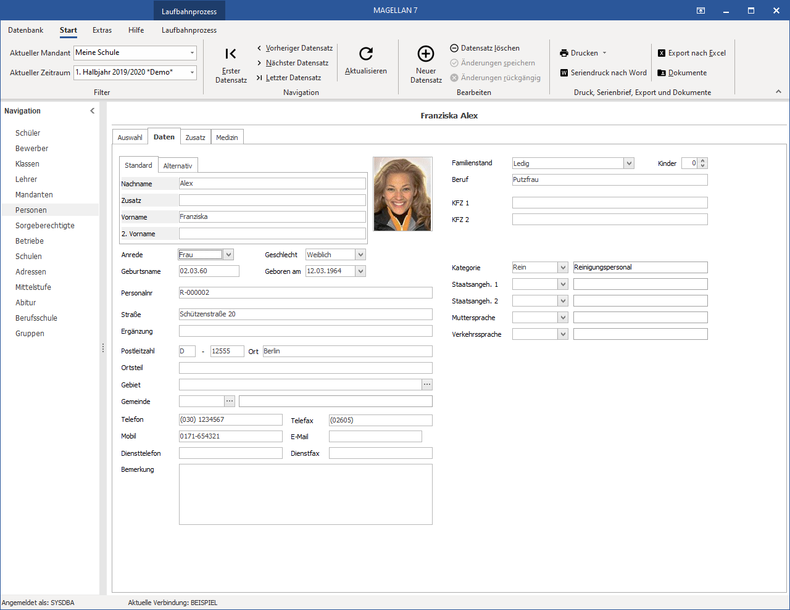
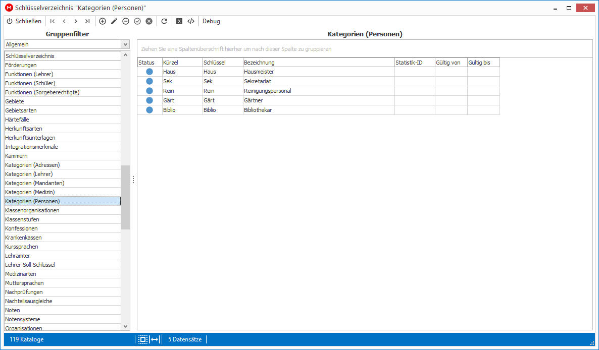
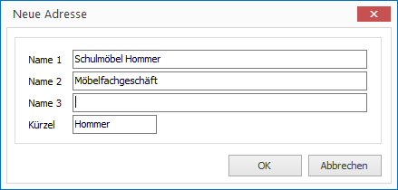
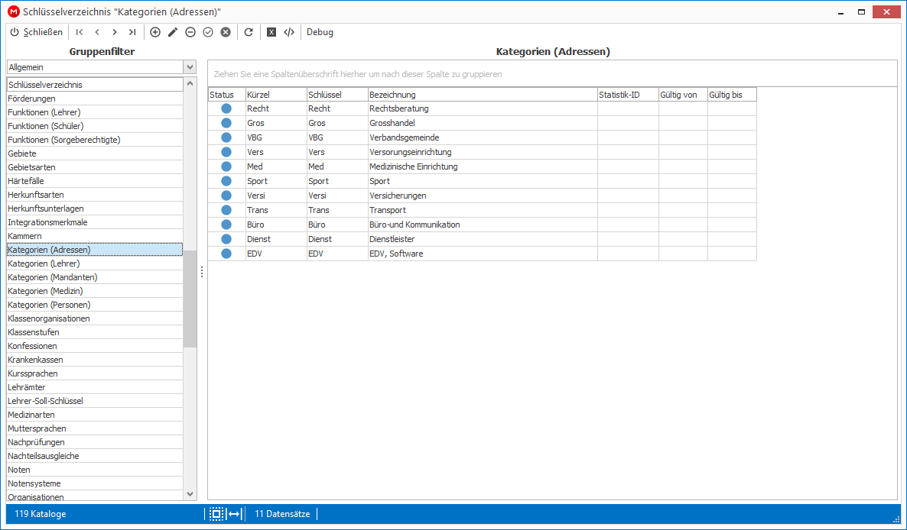
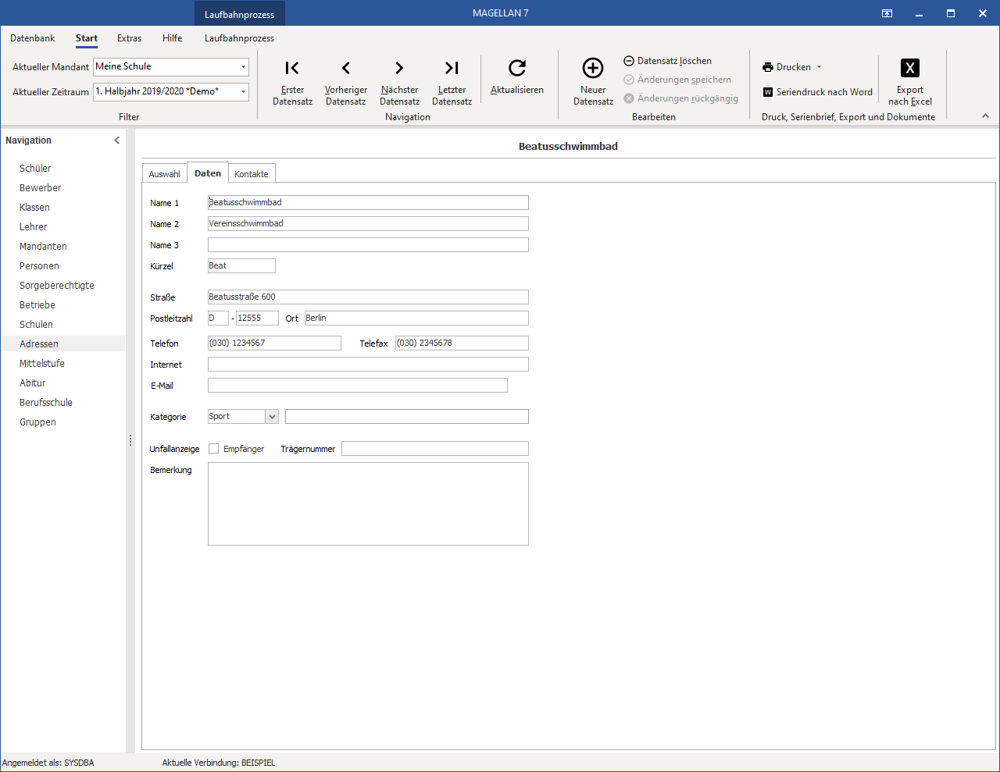
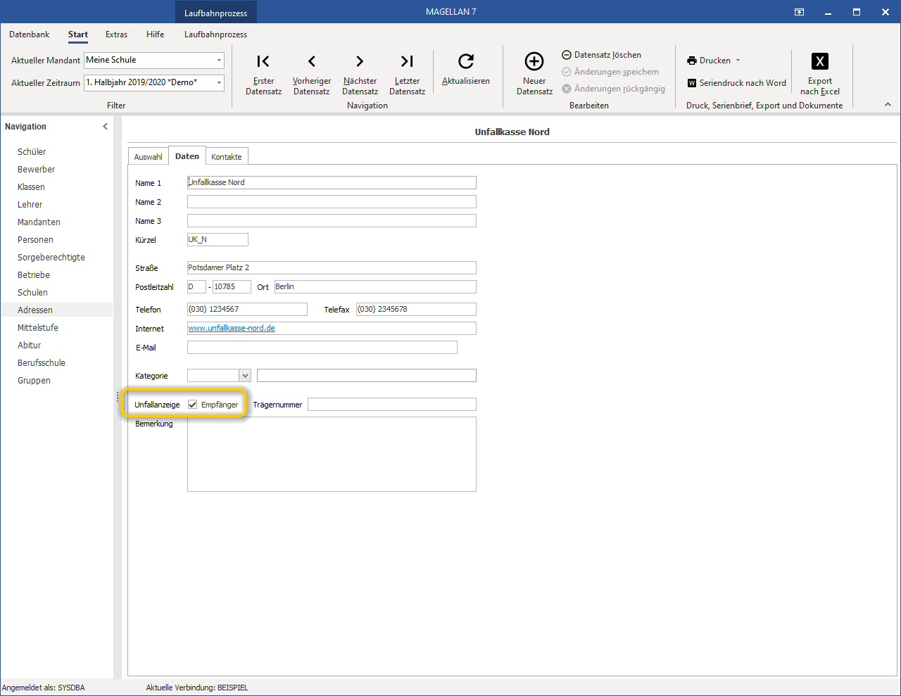

# Personen und Adressen

In diesem Kapitel wird die Stammdateneingabe der Personen und Adressen vorgestellt.

## Personen

Alle nicht als Lehrer, Sorgeberechtigte, Schüler oder Bewerber erfassten Personen, werden in MAGELLAN in der Gruppe der `Personen` festgehalten. Die Personengruppe kann selbst nach beliebigen Kategorien unterschieden werden. Beispielsweise können Sie die Kategorien in Sekretariat, Hausmeister und Reinigungspersonal unterscheiden.

### Neue Person aufnehmen

Um eine neue Person aufzunehmen, klicken Sie in der Startleiste auf der linken Bildschirmseite auf `Personen `.
 
Wählen Sie dann das Plus in der oberen Symbolleiste oder die Tastenkombination `STRG+N`. Es öffnet sich das Dialogfenster `Neue Person`. Sollte die Person als bereits erfasst erkannt werden, öffnet sich das Fenster der Doublettenprüfung (siehe `Doublettenprüfung`).
 

Die neue Person wird erstellt. Tragen Sie jetzt die restlichen Angaben auf der Registerkarte `Daten` ein.

### Registerkarte `Daten`

Um die Person einer Kategorie zuzuordnen, müssen Sie die möglichen Kategorien zuvor im entsprechenden Schlüsselverzeichnis `Kategorien (Personen)` definiert haben. 
 

Möchten Sie Ihre Personenliste nach eigenen Aspekten unterteilen, können Sie dafür das ist der Auswahlliste mit eingeblendete Feld `Kategorie` verwenden. Sie finden das zugrunde liegende Verzeichnis unter `Extras > Schlüsselverzeichnisse > Kategorie (Personen)`

## Adressen

Unter `Adressen` werden alle für die Schule wichtigen Adressen inkl. der damit verbundenen Kontakte festgehalten.

### Neue Adresse aufnehmen

Um eine neue Adresse aufzunehmen, klicken Sie in der Startleiste auf der linken Bildschirmseite auf `Adressen`.

Wählen Sie dann das Plus in der oberen Symbolleiste oder die Tastenkombination `STRG+N`. Es öffnet sich das Dialogfenster `Neue Adresse`.
 

Geben Sie hier den Namen und ein Kürzel an. Bestätigen Sie dann mit `OK`.

Die neue Adresse wird erstellt. Tragen Sie jetzt die restlichen Angaben auf der Registerkarte `Daten` ein. Die Adressen werden mandantenbezogen abgelegt.

Möchten Sie Ihre Adressliste nach eigenen Aspekten unterteilen, können Sie dafür das ist der Auswahlliste mit eingeblendete Feld `Kategorie` verwenden. Sie finden das zugrunde liegende Verzeichnis unter `Extras > Schlüsselverzeichnisse > Kategorie (Personen)`

 

### Registerkarten `Daten` und `Kontakte`

Auf der Registerkarte `Kontakte` können Sie ein oder mehrere Kontakte zu dieser Adresse festhalten. Jeder Kontakt besteht aus einem Namen und einer zugehörigen Information. Über `Hinzufügen` können Sie einen neuen Kontakt zur aktuellen Adresse eintragen.
 

 Geben Sie hier die Daten der Adresse ein.
 
 ### Unfallkasse Empfänger
 
 
 Unter `Adressen > Daten` gibt es das Häkchen für "Unfallkasse Empfänger". Setzen Sie den Haken bitte bei der für Ihre Unfallmeldung zuständigen Unfallkasse. Die so markierte Adresse wird in der Funktion [`Unfallanzeige`](https://doc.MAGELLAN7.stueber.de/howto/schueler/#unfallanzeigen-erstellen-und-verwalten) mit ausgegeben.
 
  

