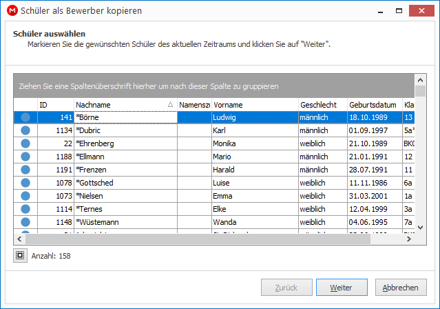
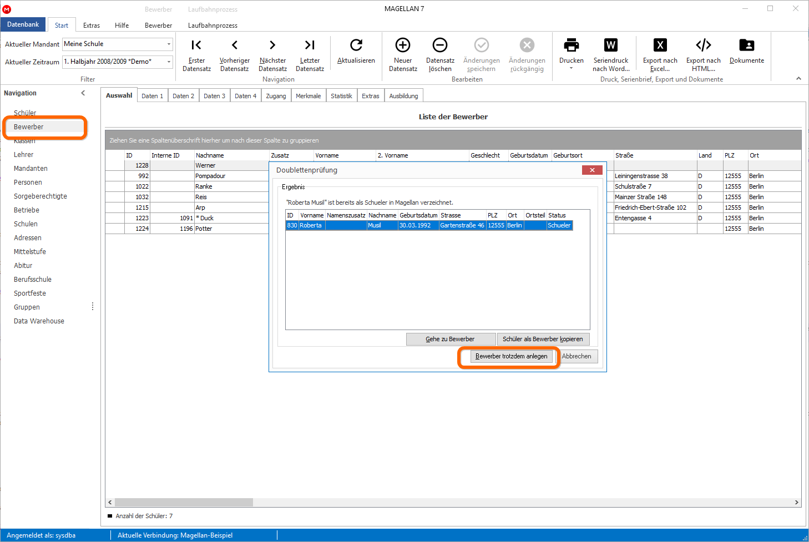
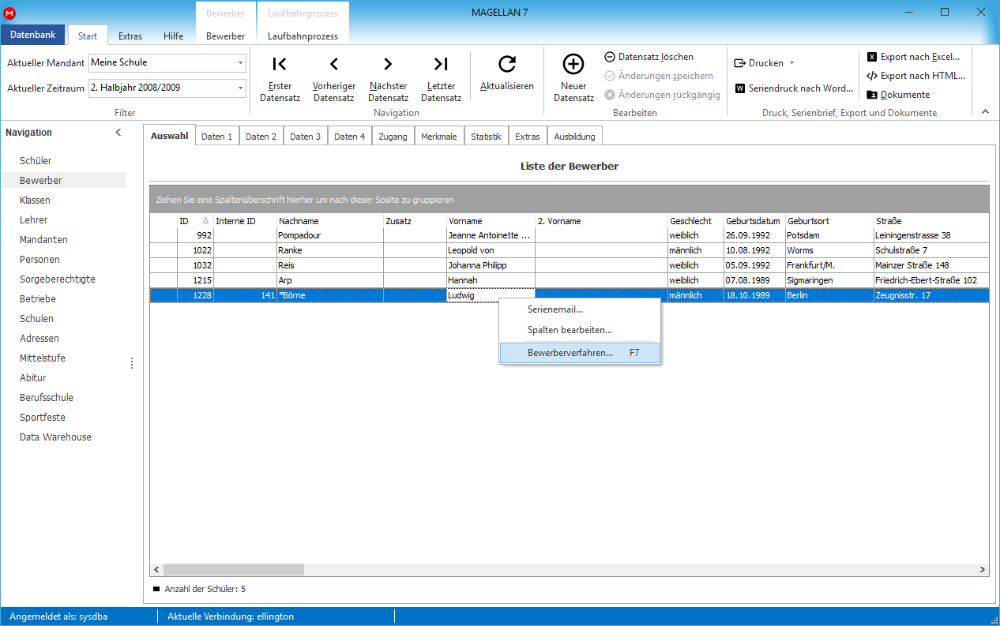
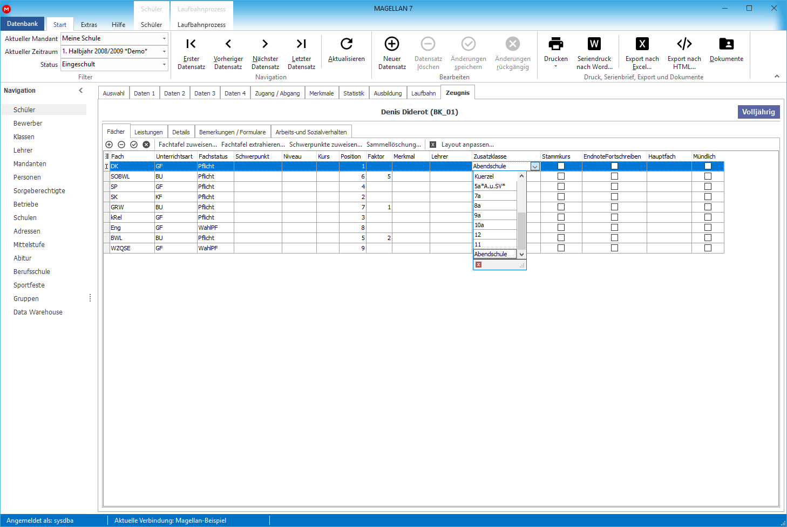
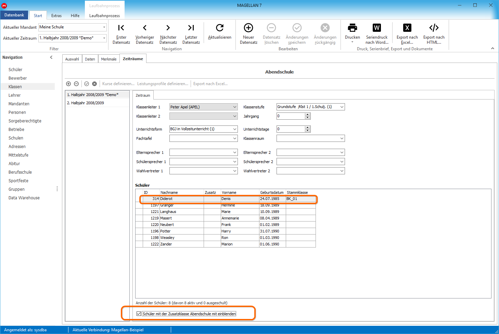
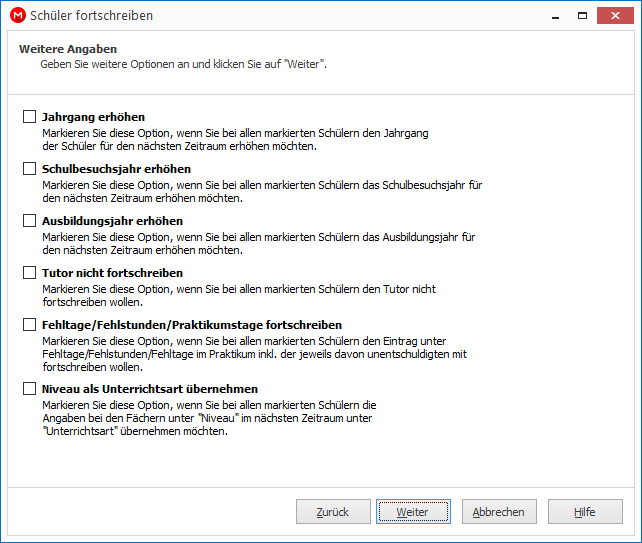
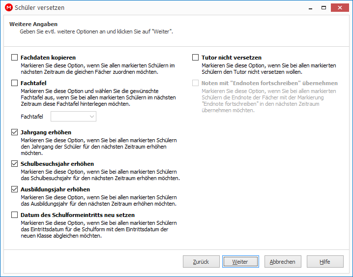
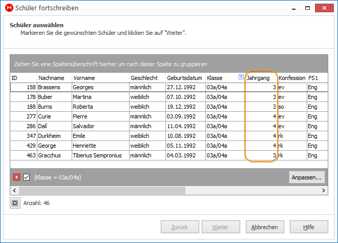
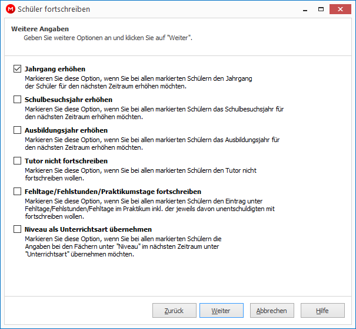

# Sonderfälle in der Schülerlaufbahn

In diesem Kapitel werden Sonderfälle in Schülerlaufbahnen behandelt.

## Schüler pausiert

Ab MAGELLAN 7 gibt es einen neuen Status um Schüler, die vorübergehend Ihre Schule nicht besuchen (zum Beispiel weil ein Auslandsjahr absolviert wird), markieren zu können.
Tragen Sie als erstes die für Ihre Schule relevanten Gründe unter `Extras > Schlüsselverzeichnisse > Fehlgründe` mit ein, vergeben Sie pro Grund bitte mindestens ein Kürzel und eine Bezeichnung.
In der Schülerauswahlliste markieren Sie den Schüler und wählen `Rechtsklick > Status zuweisen`.
Wählen Sie "Abwesend", einen Abwesenheitsgrund (hier werden Ihre vordefinierten Fehlgründe gezeigt) und ein Startdatum!

Der oder die ausgewählten Schüler erhalten ein neues Statussymbol, damit Sie in der Auswahlliste zwischen den Status aktiv, inaktiv und pausierend unterscheiden können.

|Status|Bedeutung|
|-|-|
||Aktiv, der Schüler besucht aktuell die Schule und ist nicht ausgeschult|
||Inaktiv, der Schüler besucht aktuell nicht mehr die Schule und ist ausgeschult|
||Pausierend, der Schüler besucht vorübergehend nicht die Schule, ist aber nicht ausgeschult|

Auf der Laufbahnkarte gibt es einen neuen Bereich, in dem die Zeiten dieser Abwesenheiten aufgelistet und editiert werden können.

Kehrt der Schüler zurück an Ihre Schule, können Sie ihn auf zwei Wegen wieder als aktiven Schüler markieren.

Ansicht|Vorgehen
-|-
`Schüler > Auswahlliste`|`pausierend -> aktiv` Markieren Sie den Schüler und wählen `Rechtsklick > Status zuweisen`. Sie wählen `aktiv` oder werden gefragt, ob das aktuelle Datum als Ende der Pause erfasst werden soll. Alternativ können Sie auch ein abweichendes Datum direkt auf der Laufbahnkarte vergeben.   `pausierend -> inaktiv` Kehrt der Schüler nach der Pause nicht an Ihre Schule zurück, können Sie auch den Wert `inaktiv` wählen, bitte tragen Sie anschließend noch ein Abgangsdatum ein.
`Schüler > Laufbahn`|`pausierend -> aktiv` Sie tragen das `Bis-Datum` ein, beim Speichern (Hakensymbol im Abwesenheitsfenster) wird gefragt, ob Sie den Schüler gleich wieder aktivieren möchten.

## Rückkehrer, parallele Laufbahn, parallele Bewerbung

Für alle Fälle ist die Vorgehensweisen gleich:

Nr.|Was ist zu tun?
--|--
1. |Eine Bewerberkopie vom Schüler erstellen
2. |Die Bewerberkopie nach erfolgreichem Bewerberverfahren ins Menü `Schüler` übernehmen.
3. |Kopie des Schülers einschulen und dabei werden beide "Schülerhälften" entweder zusammengeführt (Stammschüler + Kopie in unterschiedlichen Zeiträumen) oder eine neue Schülerlaufbahn(Stammschüler + Kopie im selben Zeitraum) eröffnet.

!!! info "Hinweis"

  Für alle Varianten möchten Sie sicherlich gern die Stamm- oder Laufbahndaten aus den vergangenen Zeiträumen weiterverwenden.
Wenn man die Kopie auf der Basis des "Stammschülers" erstellt, "merkt" sich MAGELLAN den Zusammenhang zwischen beiden Schülern und beide können beim Einschulen wieder zu einem Schüler mit der Gesamtlaufbahn (gemeint ist die alte und die neue Laufbahn) zusammengefasst werden.

### 1. Bewerberkopie erstellen

Sie erstellen eine Kopie des Schülers, dafür gibt es zwei Möglichkeiten:

Möglichkeit|Vorgehen
--|--
**aus dem Menü `Schüler`** |Starten Sie bitte den Assistenten `Als Bewerber kopieren` unter `Schüler > Laufbahnprozesse > Als Bewerber kopieren`. Der Assistent zeigt Ihnen alle Schüler und alle ehemaligen Schüler. Markieren Sie den Schüler, hinterlegen ggfs. auf der nächsten Karte noch Ihre Schule als Herkunftsschule und klicken auf `Fertigstellen`.    
**aus dem Menü `Bewerber`** |Wechseln Sie in Menü `Bewerber` (es ist aber auch aus dem Menü `Schüler` heraus möglich) und legen einen Bewerber mit den gleichen Vor- und Nachnamen an. Die Doublettenprüfung schaut immer anhand des Vornamens und Nachnamens im Datenbestand nach, ob bereits ein Schüler oder Bewerber mit diesem Namen an der Schule war. Das Fenster der Doublettenprüfung erscheint, Sie wählen `Schüler als Bewerber kopieren` aus.   

!!! info "Hinweis"

  Die Stammdaten des Schülers werden nun kopiert und im Menü `Bewerber` als neuer Bewerber angelegt. Es erfolgt dabei ein Verweis (interne ID) zwischen dem Schüler- und dem neuen Bewerberdatensatz. Diese „Interne ID“ kann auch als Spalte in der Auswahlliste `Schüler` eingeblendet werden. Bitte öffnen Sie dafür den Punkt `Schüler/Bewerber > Auswahl > Rechtsklick > Spalten bearbeiten` und ziehen die Spalte mit der linken Maustaste auf die gewünschte Position in die Auswahlliste `Schüler`.

### Welche Daten genau werden für den Bewerber kopiert?

Reiter|Anmerkung
--|--
Stammdaten|Mit Stammdaten sind die Einträge des Reiters `Daten1` bis zur Karte `Extras` gemeint, eine Ausnahme bilden die Daten zu den `bereits besuchten Schulen` auf der Karte `Zugang/Abgang`. Wird beim Stammschüler, bei der Bewerberkopie oder bei der Schülerkopie ein Feld geändert, wird beim Speichern geprüft, ob es den Schüler mehrfach gibt, der geänderte Wert wird dann mit für alle weiteren gefundenen Schüler übernommen. Die Daten sind also bei allen drei Varianten identisch, egal von wem aus etwas geändert wird.
Ausbildung|Beim Erstellen einer Bewerberkopie werden nicht die Daten des Reiters `Ausbildung` übernommen. Pflegen Sie diese Daten im Bewerbungszeitraums für den Bewerber, werden diese Daten dann beim späteren Einschulen des Bewerbers in seine Zielklasse mit den beim Stammschüler gespeicherten Daten ergänzt. Die Ausbildungsdaten des Bewerbers werden nach dem Einschulen als aktuelle Ausbildungsdaten markiert.
Bereits besuchte Schulen|Beim Erstellen einer Bewerberkopie werden nicht die Daten des Reiters `bereits besuchten Schulen` übernommen. Pflegen Sie diese Daten im Bewerbungszeitraums für den Bewerber, werden diese Daten dann beim späteren Einschulen des Bewerbers in seine Zielklasse mit den beim Stammschüler gespeicherten Daten ergänzt. Die Daten des Bewerbers werden dann als aktuelle Herkunftsschule markiert.
Familiendaten|Für die `Familiendaten` werden für den Stammschüler, Schülerkopien und Bewerber immer die Daten es Stammschülers gezeigt. Eine Änderung bei einem der über die ID-Intern miteinander verknüpften Schüler, zeigt also die Änderung immer auch für die anderen Datensätze an.
Zeugnisdaten|Für Bewerber werden keine Daten des Reiters `Zeugnis` kopiert.

### 2. Kopie ins Menü `Schüler` übernehmen

So geht's:

Schritt|Aktion
--|--
1. |Wechseln Sie nun bitte in den aktuellen Zeitraum und rufen das Menü `Bewerber` auf.
2. |Markieren Sie den Bewerber in der Auswahlliste, starten Sie anschließend per Rechtsklick den Assistenten für das Bewerberverfahren (`F7`) und wählen Sie `Übernahme als Schüler`.  

### 3. Kopie des Schülers einschulen und ggfs. zusammenführen

 Wechseln Sie ins Menü `Schüler` zurück und rufen Sie `Laufbahnprozesse > Schüler einschulen` auf, um den Schüler seiner Zielklasse zuzuweisen. Schulen Sie den Schüler wie gewohnt ein. Der Assistent prüft immer im Hintergrund, ob es eventuell noch einen Verweis auf einen weiteren Schüler gibt und ob dieser Schüler sich im selben Halbjahr befindet.

Prüfung bei der Einschulung|Folge
--|--
es gibt weitere Schüler im selben Halbjahr|Wenn Sie die Kopie des Schülers im gleichen Halbjahr einschulen, indem auch der "Urschüler" sich befindet, dann werden die Schüler nicht miteinander verbunden, sondern es gibt den Schüler doppelt. Es wird unterschieden in eine Stamm- und in eine Nebenlaufbahn des Schülers, Sie sehen die Markierung `S` und `N` in der Spalte `Laufbahn` in der Auswahlliste der Schüler.
es gibt weitere Schüler in anderen Halbjahren|Existiert der Schüler noch nicht in dem Zeitraum in den der Schüler in seine Klasse einschult wird, verbindet MAGELLAN die beiden Schüler miteinander.  **-** Die Stammdaten sind für den Stammschüler und die Schülerkopie identisch.   **-** Ausbildungsdaten des Bewerbers ergänzen die des bestehenden Schülers.  **-** die bereits besuchten Schulen des Bewerbers ergänzen die des Stammschülers.  **-** Die Laufbahnkarte der Schülerkopie zeigt nur den eigenen Verlauf.  **-** Die Laufbahnkarte des Stammschülers zeigt den gesamten Verlauf, also die STamm- und Nebenlaufbahn.

 
 
Beide Schüler werden zusammengeführt und die nachstehende Meldung wird ausgegeben. In der Laufbahn sind früheren und die aktuelle Klassenzugehörigkeit vermerkt.

### Welche Daten werden synchronisiert?
 
 Befindet sich der Schüler im selben Halbjahr, indem die Bewerberkopie eingeschult und mit dem Schüler wieder zusammengeführt werden soll, bleiben der Stammschüler und die Schülerkopie getrennt erhalten, beide werden in der Spalte `Laufbahn` mit `S` (Stammlaufbahn) und `N` Nebenlaufbahn gekennzeichnet. Die Kopien des Stammschülers haben in der Spalte IDIntern einen Verweis auf die ID des Stammschülers. Diese Information wird genutzt um Daten zwischen den Kopien auf dem aktuellen Stand zu halten. Zusätzlich werden für Schülerkopien aber auch teilweise Daten des Stammschülers eingeblendet, welche das genau sind, sehen Sie in der nachfolgenden Tabelle.
 
 Reiter|Anmerkung
--|--
Auswahlliste > Feld `Laufbahn`| Der Stammschüler wird immer mit `S` für Stammlaufbahn gekennzeichnet, die Schülerkopien werden mit `N` für Nebenlaufbahn markiert. Diese Information wird auch auf den Reitern für den ausgewählten Schüler neben seinem Namen hinter der Klasse dargestellt.
Stammdaten|Mit Stammdaten sind die Einträge des Reiters `Daten1` bis zur Karte `Extras` gemeint, eine Ausnahme bilden die Daten zu den `bereits besuchten Schulen` auf der Karte `Zugang/Abgang`. Wird beim Stammschüler und bei Schülerkopien ein Feld geändert, wird beim Speichern geprüft, ob es den Schüler mehrfach gibt, der geänderte Wert wird dann mit für alle weiteren gefundenen Schüler übernommen. Die Daten sind also bei allen drei Varianten identisch, egal von wem aus etwas geändert wird.
Ausbildung|Hier wird für die Schülerkopien der Inhalt der Ausbildungskarte des Stammschülers gezeigt, aber es können von den Schülerkopien aus Einträge und Änderungen vorgenommen werden. Die Inhalte sind also für den Stammschüler und die Schülerkopien(Laufbahn N) identisch.
Bereits besuchte Schulen|Hier wird für die Schülerkopien der Inhalt der `Schüler > Zugang/Abgang > bereits besuchten Schulen` des Stammschülers gezeigt, aber es können von den Schülerkopien aus Einträge und Änderungen vorgenommen werden. Die Inhalte sind also für den Stammschüler und die Schülerkopien(Laufbahn N) identisch.
Familiendaten|Für die `Familiendaten` werden für den Stammschüler und Schülerkopien die Daten es Stammschülers gezeigt. Eine Änderung bei einem der über die ID-Intern miteinander verknüpften Schüler, zeigt also die Änderung immer auch für die anderen Datensätze an.
Zeugnisdaten|Der Stammschüler und jede Kopie hat eine von den anderen unabhängige Zeugniskarte, Sie können für jede Schülerzeile ein individuelles Zeugnis füllen. 
Laufbahnkarte|Die Schülerkopien haben jeweils nur die eigenen Laufbahneinträge, der Stammschüler hat Einträge über alle parallelen Laufbahnen, also die Stammlaufbahn und die Nebenlaufbahnen.
Dokumentenverzeichnis|In MAGELLAN können für Bewerber/Schüler (auch für Lehrer, Klassen, Mandanten, Personen und Sorgeberechtigte ) Dateien in eine individuelles Verzeichnis gespeichert werden. Dieses Verzeichnis kann über die MAGELLAN-Oberfläche aufgerufen werden, die Dateien werden aber auf dem MAGELLAN-Serverrechner gespeichert. Wenn man einen Kopie eines Schülers erstellt, dann wird für diese Schülerkopie immer das Dokumentenverzeichnis des Stammschülers gezeigt. 

## Ein Schüler belegt ein Fach in einer anderen Klasse?

Schüler in MAGELLAN haben zeitgleich nur eine Stammklasse (Laufbahn `S`). Dennoch kann es sein, dass an Ihrer Schule Zusatzkurse angeboten werden, die Sie gern wie Klassen in Ihrem Datenbestand verwalten möchten. 
Oder, ein Schüler besucht in einzelnen Fächer den Unterricht in anderen Klassen und soll optional in den Schülerübersichten dieser Klassen sichtbar sein.
Weisen Sie für die Fächer des Schülers, die er in parallel stattfindenden Klassen besucht unter `Schüler > Zeugnis > Fächer` in der Spalte Zusatzklasse die Klasse zu.
 

Die Auswahlliste der Spalte Zusatzklasse zeigt alle parallel zur Stammklasse existierenden Klassen an. Die Eintragung ist lediglich für in anderen Klassen besuchte Fächer notwendig.
Rufen Sie das Menü `Klassen` auf, markieren die entsprechende Klasse und wählen die Unterkarte `Daten > Zeiträume > Schüler`. Sie können für diese Ansicht wählen, ob Ihnen wie gewohnt die Stammschüler dieser Klassen angezeigt werden oder auch die Zusatzschüler mit ihren Stammklassen eingeblendet werden sollen. 

## Jahrgangsübergreifende Klassen (JÜL)

Wenn Sie in MAGELLAN Klassen bestehend aus Schülern verschiedener Jahrgänge verwalten möchten, ist das auch möglich. 
Unter `Schüler > Zeugnis > Details` gibt es das Feld `Jahrgang`, welches anders als der Klassenjahrgang (`Klasse > Zeiträume > Jahrgang`, gilt für die Klasse) für den einzelnen Schüler geführt wird. 

Zum erstmaligen Befüllen stehen Ihnen zwei Varianten zur Verfügung:

1. Sie tragen es unter `Schüler > Zeugnis > Details` von Hand ein.
2. Sie nutzen die Sammelzuweisung auf der Karte und tragen es gruppenweise zu.

In der Auswahlliste der Schüler sehen Sie zusätzlich zur Klasse auch den schülerindividuellen Jahrgang:

!!! info "Hinweis"

  Der Jahrgang des Schülers kann optional beim Fortschreiben oder Versetzen der Schüler um 1 Jahr hochgesetzt werden.

### Was ist am Ende des 1. Halbjahres zu tun?

Hier weicht das Vorgehen nicht vom Standard ab:

Sie legen ein neues Halbjahr an und schreiben alle Schüler vom 1. Halbjahr ins 2. Halbjahr fort, die Option zum Erhöhen des Jahrgangs wird hier nicht aktiviert. Alle Schüler werden mit Ihrer Klasse in das nächste Halbjahr fortgeschrieben.

### Was ist am Ende des 2. Halbjahres zu tun?

Einige Schüler besuchen weiterhin diese Klasse, andere Schüler steigen auf. Wir empfehlen erst alle aufsteigenden Schüler in Ihre Zielklassen zu versetzen und im Anschluss einmal den Assistenten zum Fortschreiben zu nutzen, weil für das Fortschreiben keine Schüler-Klassen-Zuordnung nötig ist, sondern einfach alle übrigen Schüler fortgeschrieben werden können.

Wir beginnen mit den Schülern, die in die nächsthöhere Klasse aufsteigen:

So geht's:

Schritt|Aktion
--|--
1. |Wechseln Sie ins zweite Halbjahr des laufenden Schuljahres
2. |Öffnen Sie bitte aus einem beliebigen Menüpunkt heraus `Extras > Schüler versetzen`.
3. |Markieren Sie die Schüler, die versetzt werden sollen, bei der Auswahl hilft Ihnen die Spalte `Schülerjahrgang` (siehe Abbildung).
4. |Wählen Sie die Zielklasse und markieren bitte die Option "Schülerjahrgang erhöhen"! Fertig!     

Als nächstes schreiben Sie bitte die Schüler fort, die weiterhin in der Klasse bleiben:

So geht's:

Schritt|Aktion
--|--
1.| Wechseln Sie ins zweite Halbjahr des laufenden Schuljahres
2.| Öffnen Sie bitte aus einem beliebigen Menüpunkt heraus `Extras > Schüler fortschreiben`.
3.| Markieren Sie die Schüler, die versetzt werden sollen, bei der Auswahl hilft Ihnen die Spalte `Schülerjahrgang` (siehe Abbildung).
4.| Markieren bitte die Option "Schülerjahrgang erhöhen" (siehe Abbildung)! Fertig!    

