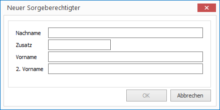
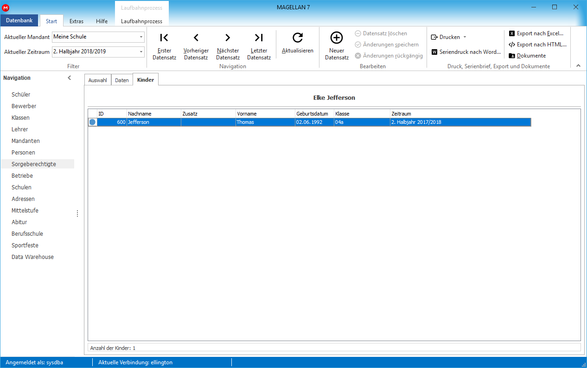

# Sorgeberechtigte eingeben

Sorgeberechtigte werden in MAGELLAN zentral verwaltet. Ein Sorgeberechtigter muss daher nur einmal erfasst werden, auch wenn er mehrere Kinder an der gleichen Schule hat. Sorgeberechtigte können sowohl zusammen als Eltern erfasst werden wie auch als Einzelpersonen.
Die Zuordnung eines Sorgeberechtigten und damit auch die Festlegung des Verhältnisses zwischen dem Schüler und dem Sorgeberechtigten (Vater, Onkel, Betreuer usw.) erfolgt nie aus dem Menü `Sorgeberechtigte` heraus, sondern wird immer vom Bewerber oder vom Schüler aus vorgenommen. Eine Anleitung dafür finden Sie jeweils im Kapitel "Bewerber" und "Schüler".

## Neuen Sorgeberechtigten aufnehmen

Einen neuen Sorgeberechtigten können Sie entweder im Rahmen der Aufnahme der Bewerber/Schüler (siehe Kapitel "Bewerber" oder "Schüler") erfassen oder direkt im Menü `Sorgeberechtigte` eingeben. 

Um einen neuen Sorgeberechtigten aufzunehmen, klicken Sie in der Startleiste auf der linken Bildschirmseite auf `Sorgeberechtigte`. Wählen Sie dann das Plus in der oberen Symbolleiste oder die Tastenkombination `STRG+N`. Es öffnet sich das Dialogfenster `Neuer Sorgeberechtigter`.
 

Geben Sie Vor- und Nachname ein und bestätigen Sie mit `OK`.
Der neue Sorgeberechtigte wird erstellt. Sie befinden sich automatisch auf der Registerkarte `Daten`. Sollte der Sorgeberechtigte als bereits erfasst erkannt werden, erscheint automatisch das Fenster der Doublettenprüfung (siehe `Doublettenprüfung`). Geben Sie nun die erforderlichen Daten zum Sorgeberechtigten ein. 

!!! info "Hinweis"

  Sie können um auf Ansprechpartner oder Familienmitglieder für einen Schüler zu verweisen, vom Register `Daten1` des Schülers/Bewerbers aus auf Datensätze aus den Menüs `Personen`, `Lehrer` oder `Schüler/Bewerber` verweisen.

## Registerkarte `Sorgeberechtigte > Daten`

Hier können Sie neben der Adresse auch den Status der Erreichbarkeit des Sorgeberechtigten eintragen. Bei den Funktionen 1 und 8 können Sie bis zu acht besondere Funktionen wie z.B. Elternsprecher zuordnen. Die Funktionen sind Schlüsselfelder, die zuvor unter `Extras > Schlüsselverzeichnis > Funktionen (Sorgeberechtigte)` definiert werden.
 

 

## Registerkarte `Sorgeberechtigte > Kinder`

Auf der Registerkarte `Kinder` werden alle Kinder des Sorgeberechtigten mit deren Geburtsdatum und Klassenzugehörigkeit aufgelistet.
 

Hier werden alle Schüler aufgelistet, die der Sorgeberechtigten `Andrea Antelami` zugewiesen wurden.

!!! info "Hinweis"

  Jedem Sorgeberechtigten (Mehrfachmarkierungen sind möglich) kann über `Bearbeiten > Status zuweisen…` der Status `aktiv` bzw. `nicht aktiv` zugeordnet werden. Beim Ausschulen eines Schülers können Sie optional angeben, ob die jeweiligen Sorgeberechtigten des auszuschulenden Schülers inaktiv gesetzt werden sollen, wenn diese keine weiteren aktiven Schüler an der Schule haben.
