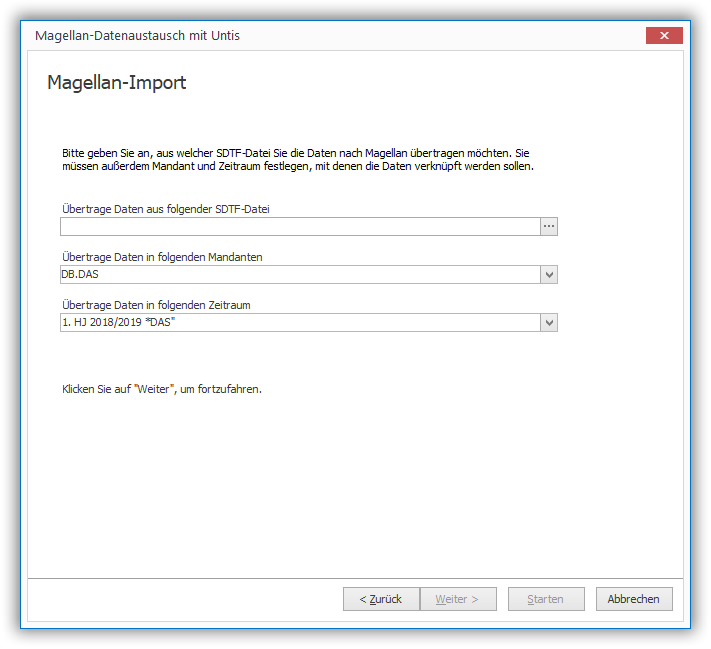
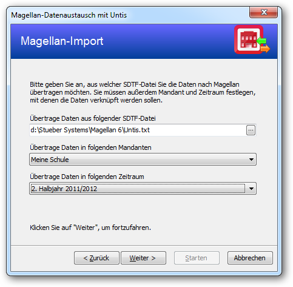
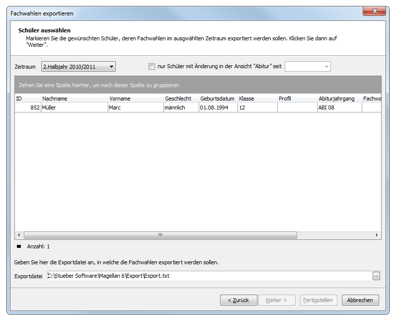
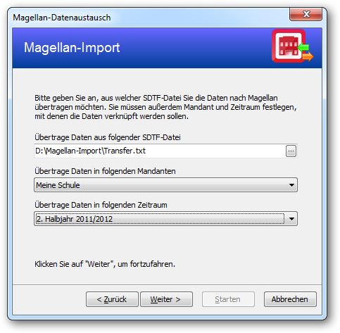

# Stundenplandaten

## DAVINCI-Stundenpläne integrieren

Wenn Sie zusätzlich zu MAGELLAN auch die DAVINCI Stundenplansoftware verwenden, haben Sie folgende Vorteile:

1. In den Ansichten „Klassen“, „Lehrer“ und „Schüler“ können Sie über den Befehl `Bearbeiten > Stundenplan` den entsprechenden Stundenplan der Klasse, des Lehrer bzw. des Schülers aufrufen.

2. Gemeinsame Daten müssen nur einmal eingeben werden, da beide Programme ihre Datenbestände miteinander synchronisieren können.

Voraussetzung für den direkten Aufruf der Stundenpläne in MAGELLAN ist, dass Sie DAVINCI LOOK installiert haben. DAVINCI LOOK können Sie unter [DAVINCI.stueber.de](http://DAVINCI.stueber.de/download.php) herunterladen. Wenn Sie den Befehl `Bearbeiten > Stundenplan` ausführen, startet DAVINCI LOOK automatisch und zeigt den gewünschten Plan an. Dabei werden Klassen- und Lehrerpläne über die in MAGELLAN und DAVINCI eindeutige ID zugeordnet. Schülerpläne werden über die Schüler-Fächer und die ID der Klasse zugeordnet. Dazu müssen Sie die Schüler-Kurse bzw. Schüler-Fächer einmalig zwischen MAGELLAN und DAVINCI synchronisiert haben.

Synchronisiert werden Stammdaten (Klassen, Lehrer, Fächer und Schüler) sowie Unterrichtsdaten (Schüler-Kurse). Diese Aufgabe übernimmt für Sie der Magellan-Datenaustausch-Assistent, der in DAVINCI gestartet wird. Weitere Informationen zum Datenabgleich können Sie im entsprechenden Kapitel des DAVINCI Benutzerhandbuchs nachlesen (siehe DAVINCI Benutzerhandbuch.pdf).

## Datenabgleich MAGELLAN-Untis

Wenn Sie MAGELLAN mit dem Stundenplanprogramm Untis gleichzeitig einsetzen wollen, so können Sie die Daten mit diesem Programm abgleichen, ohne Daten doppelt eingeben zu müssen. Der Datenaustausch erfolgt über das [Schuldatentransferformat](https://doc.sdtf.stueber.de/). Von MAGELLAN können die Abteilungen, Räume, die Lehrer, die Fächer, die Fachtafeln, die Klassen/Jahrgänge und die Schüler (wahlweise Oberstufen- oder alle Schüler), deren Schülerkurswahlen und die Fachwahlen in das Schuldatentransferformat für den Import nach Untis übergeben werden.

Über das Schuldatentransferformat können aus Untis die Abteilungen, Räume, die Lehrer, der Lehrer-Unterricht, die Fächer, die Stundentafeln, die Schülerkurswahlen und die Fachwahlen an MAGELLAN übergeben werden.

Der Datenaustausch erfolgt beim Export von MAGELLAN aus in eine Schuldatentransferdatei (Export), welche anschließend in Untis importiert wird. Beim Import nach MAGELLAN wird in Untis eine Schuldatentransferdatei erzeugt, die nachfolgend in MAGELLAN importiert wird. Sie benötigen die MAGELLAN-Administrator-Kennung, da der Austausch nur mit Administrator-Rechten erfolgen kann.

### MAGELLAN-Daten in eine Schuldatentransferdatei für Untis exportieren

Zum Austausch der Magellandaten mit Untis müssen Sie zunächst eine Schuldatentransferdatei in MAGELLAN erzeugen, die dann in Untis eingelesen werden kann. Für den Export der Daten inklusive der Schülerfachwahlen aus dem Menüpunkt `Abitur > Fachwahl` lesen Sie bitte im Abschnitt "Fachwahlen exportieren" weiter.

#### Schuldatentransferdatei für Untis aus MAGELLAN exportieren: Exportieren Sie eine Schuldatentransferdatei für Untis aus MAGELLAN.

1. Wählen Sie in MAGELLAN `Extras `und dann `Export > Untis`.
2. Geben Sie die MAGELLAN-Administrator-Kennung ein. Bestätigen Sie das Willkommen-Fenster.

3. Wählen Sie im Fenster `Magellan-Export` den Mandanten und das Halbjahr, aus dem Sie die Daten übernehmen möchten. Zusätzlich müssen Sie die Schuldatentransferdatei (SDTF-Datei) angeben, in die Sie exportieren wollen.

4. Wählen Sie hier die Daten aus, die Sie aus MAGELLAN nach Untis exportieren wollen. Klicken Sie auf `Weiter`, um die Daten in die zuvor angegebene Datei zu übertragen.

#### Schuldatentransferdatei in Untis importieren: Sie müssen die aus MAGELLAN exportierte Schuldatentransferdatei in Untis importieren.

1. Starten Sie Untis mit Ihrer aktuellen Untis-Datei.
2. Klicken Sie auf `Datei > Import/Export > Deutschland > Schuldatentransferformat`.
3. Wählen Sie die Registerkarte „Importieren“. Geben Sie dort die aus MAGELLAN exportierte Schuldatentransferdatei an, welche nach Untis importiert werden sollen. Klicken Sie dann auf `Importieren`.

Sie können folgende Daten nach Untis übernehmen:

**Abteilungen**

Felder	|Hinweis
--|--
Kürzel Bezeichnung	|Der Austausch erfolgt über das Kürzel. Ist das Kürzel bereits vorhanden, wird die Abteilung aktualisiert. Ist das Kürzel nicht vorhanden wird die Abteilung hinzugefügt.

**Lehrer**

Felder|Hinweis
--|--
Kürzel Nachname Vorname|Es werden nur aktive Lehrer aus MAGELLAN beim Export berücksichtigt.

**Fächer**

Felder	|Hinweis
--|--
Kürzel Schlüssel Bezeichnung|-

**Fachtafeln**

Felder	|Hinweis
--|--
Kürzel Bezeichnung Fächer der Fachtafel: Kürzel|-

**Klassen/Jahrgänge**

Felder	|Hinweis
--|--
Kürzel Klassenleiter 1 Klassenstufe Klassenart(Kursmodus) Anzahl der Schüler|Die Anzahl der Schüler wird nur für Oberstufenklassen übernommen.

**Schüler**

Felder	|Hinweis
--|--
Nachname Vorname Fachwahl Fachkürzel Unterrichtsart.Kürzel Fachstatus.Kürzel Merkmal	|Ausgetauscht werden entweder nur Schüler der Oberstufenjahrgänge, zu erkennen am Eintrag "Oberstufenjahrgang" im Feld „Klassenart“ im Register Daten der Ansicht Klassen oder alle Schüler.

### Schuldatentransferdatei aus Untis nach MAGELLAN importieren

Wenn Sie eine leere Magellan-Datenbank mit Daten aus einer Schuldatentransferdatei aus Untis füllen möchten, müssen in MAGELLAN mindestens ein Mandant und ein Zeitraum eingerichtet sein. Zum Erzeugen einer leeren Datenbank und Anlegen von Mandant und Zeitraum lesen Sie bitte die Abschnitte „Mandanten definieren“ und „Zeiträume definieren“.

Schuldatentransferdatei aus Untis exportieren: Zunächst müssen Sie in Untis aus Ihrer Untis-Datei eine Schuldatentransferdatei erzeugen.

1. Starten Sie Untis mit Ihrer aktuellen Untis-Datei.
2. Klicken Sie auf Datei > Import/Export > Deutschland > Schuldatentransferformat.
3. Wählen Sie die Registerkarte `Exportieren`. Geben Sie dort eine Exportdatei an, in welche die Untis-Daten exportiert werden sollen. Klicken Sie dann auf `Exportieren`.

### Schuldatentransferdatei nach MAGELLAN importieren
Die aus Untis exportierte Schuldatentransferdatei muss nun nach MAGELLAN importiert werden.

1. Wählen Sie in MAGELLAN `Extras `und dann `Import > Untis`.
2. Geben Sie die MAGELLAN-Administrator-Kennung ein. Bestätigen Sie das Willkommen-Fenster mit Weiter.

3. Wählen Sie im Fenster `MAGELLAN-Import` den Mandanten und das Halbjahr, in das Sie die Untis-Daten übernehmen möchten. Zusätzlich müssen Sie die Schuldatentransferdatei (SDTF-Datei) angeben, die Sie importieren wollen.

4. Klicken Sie auf `Weiter`, um die Daten aus der in Untis erzeugten Schuldatentransferdatei zu übertragen.

Sie können folgende Daten aus Untis übernehmen:

**Lehrer**

Felder	|Hinweis
--|--
Kürzel Nachname Vorname |Der Austausch erfolgt über Kürzel. Bei gleichem Kürzel wird aktualisiert. Ist das Kürzel nicht vorhanden wird hinzugefügt.

**Lehrer-Unterricht**

Bei der Übernahme des Lehrer-Unterrichts aus Untis werden durch den Import der Schuldatentransferdatei nach MAGELLAN aufgrund der Veranstaltungsliste pro Klasse in Untis die Lehrer übernommen. Es werden bei allen Schülern einer Klasse, die Fächer in MAGELLAN haben, die in der Schuldatentransferdatei zugeordneten Lehrer der gleichen Klasse zugeordnet. 

Dabei gelten folgende Voraussetzungen:

* Klassen, Lehrer und Fächer in der Schuldatentransferdatei und MAGELLAN müssen identische Kürzel haben.

Felder	|Hinweis
--|--
Zugewiesener Lehrer in der Veranstaltungsliste|Durch die Übernahme des Lehrer-Unterrichts wird pro Schüler im Register Zeugnis/Fächer jedem Fach, entsprechend der Unterrichtsverteilung in der Schuldatentransferdatei, der unterrichtende Fachlehrer zugeordnet. Pro Fach kann immer nur ein Lehrer übernommen werden. Voraussetzung für die Übernahme des Lehrer-Unterrichts ist, dass in MAGELLAN den Schülern bereits Fächer zugeordnet wurden. Auch Kurswahlen der Schüler der Oberstufe müssen bereits vorhanden sein. Außerdem müssen in der Schuldatentransferdatei und MAGELLAN die Kürzel der Klassen, der Fächer und der Lehrer übereinstimmen. Die Übernahme funktioniert nur, wenn neben der Option „Übernehme Lehrer-Unterricht“ keine weiteren Optionen markiert sind.

**Fächer**

Felder	|Hinweis
--|--
Kürzel Schlüssel Bezeichnung|Der Austausch erfolgt über Kürzel.  Hat das Fach ein Kürzel in der Schuldatentransferdatei, so wird ein entsprechendes Fach mit gleichem Kürzel in MAGELLAN gesucht. Existiert ein solches Fach in Magellan, so wird es aktualisiert, andernfalls wird das Fach in MAGELLAN hinzugefügt.

**Stundentafeln**

Stundentafeln aus Untis in der Schuldatentransferdatei werden als Fachtafeln nach MAGELLAN übertragen. Dabei gelten folgende Voraussetzungen:
* Fächer in Untis und MAGELLAN müssen identische Kürzel haben.
* In Untis müssen Sie eine Lizenz für das Modul Unterrichtsplanung besitzen.

Felder	|Hinweis
--|--
Kürzel Bezeichnung Fächer der Stundentafel Fachkürzel|Der Austausch erfolgt über das Kürzel. Ist das Kürzel bereits vorhanden, wird aktualisiert. Ist das Kürzel nicht vorhanden wird die Stundentafel hinzugefügt. Die Fächer werden mit Kürzel hinzugefügt.

**Schülerkurswahlen (Schüler > Zeugnis > Fächer)**

Optionen|Hinweis
--|--
Alle Daten |Die Schülerkurswahlen unter `Schüler > Zeugnis > Fächer` werden für den gewählten Zeitraum gelöscht und durch die Daten der Importdatei ersetzt.
Nur geänderte Daten|Werden bei einem Schüler Änderungen in den Fachdaten erkannt, wird die Fachwahl geleert und neu gefüllt. Wird für einen Schüler keine Änderung erkannt, bleibt sie unverändert.
Übertrag auch in die Fachwahlen|Zusätzlich zu den Änderungen unter `Schüler > Zeugnis > Fächer` werden die Änderungen für die Schüler unter `Abitur > Fachwahl `importiert. Werden anhand des Fachkürzels und der Unterrichtsartkürzel Fachzeilen erkannt, werden die Zeilen nur aktualisiert. Nicht in der Fachwahl vorhandene Fachzeilen werden eingefügt.
Bestehende Schülerkurs-wahlen nicht zuvor löschen|	Werden in einer Fachzeile Änderungen erkannt, wird die Zeile geändert. Bisher nicht bestehende Fachzeilen werden neu angelegt.
Fehlende Klassen anlegen|Existiert eine Klasse der Importdatei nicht in Magellan, wird sie angelegt. Es werden aber keine Schüler versetzt oder neu in MAGELLAN angelegt.

!!! info "Hinweis"

  Das Format der Schuldatentransferdatei wird im Dokument „Schuldatentransferformat.pdf“ beschrieben.

## Datenabgleich MAGELLAN über das Schuldatentransferformat

Wenn Sie MAGELLAN mit einem Fremdprogramm (z.B. Stundenplanprogramm) gleichzeitig einsetzen wollen, so können Sie die Daten mit diesem Programm abgleichen, ohne Daten doppelt eingeben zu müssen. Dazu muss das Fremdprogramm das Schuldatentransferformat unterstützen. 

Ausführliche Hinweise zum Schuldatentransferformat finden Sie in der Dokumentation [Schuldatentransferformat](https://doc.sdtf.stueber.de/). Von MAGELLAN können die Abteilungen, die Lehrer, die Fächer, die Fachtafeln, die Klassen und die Schüler der Oberstufe in das Schuldatentransferformat übergeben werden. Über das Schuldatentrans-ferformat können die Abteilungen, die Lehrer, die Fächer, die Stundentafeln, die Kurswahlen der Schüler der Oberstufe und der Fach- bzw. Kurslehrer an MAGELLAN übergeben werden. Der Datenaustausch wird grundsätzlich (egal in welche Richtung) von MAGELLAN aus in eine Schuldatentransferdatei (Export) und aus einer Schuldatentransferdatei (Import) gestartet. Sie benötigen die MAGELLAN-Administrator-Kennung, da der Austausch nur mit Administrator-Rechten erfolgen kann.

!!! info "Hinweis"

  Beim Austausch über das Kürzel wird die Groß- und Kleinschreibung beachtet.

## Fachwahlen exportieren

Aus dem Menü Abitur heraus können die jahrgangsübergreifenden Fachwahlen in eine Schuldatentransferformat-Datei gespielt werden.

Gehen Sie dazu wie folgt vor:
1. Wählen Sie in der Ansicht Abitur die Karte Fachwahl eines beliebigen Schülers. Starten Sie den Assistenten unter `Bearbeiten > Fachwahl exportieren`.

2. Wählen Sie einen Zeitraum aus. Die Schülerliste zeigt nur die Schüler an, für die eine Fachwahl für den gewählten Zeitraum angelegt wurde.
3. Lassen Sie sich die Ansicht gefiltert anzeigen, indem Sie ein Datum eingeben und nur Schüler mit einer Änderung der Fachwahlen ab dem gewählten Datum angezeigt bekommen.
4. Verweisen Sie im Feld Exportdatei auf eine Datei, in die die Fachwahlen exportiert werden sollen. Möglich sind CSV- oder TXT-Dateien
5. Markieren Sie die gewünschten Schüler und klicken auf `Fertigstellen`.

!!! info "Hinweis"

  Nicht alle Stammdatenfelder im Schuldatentransferformat sind auch in MAGELLAN vorhanden und umgekehrt. Werden die vorhandenen Daten beim Austausch aktualisiert (überschrieben), können vorhandene Einträge verloren gehen, z.B. bei den Klassen der Klassenraum oder bei den Stundentafeln die Soll-Stunden. Bitte entscheiden Sie mit Bedacht, welche Daten Sie austauschen.

### MAGELLAN-Daten in eine Schuldatentransferdatei exportieren

Zum Austausch der Daten gehen Sie bitte folgendermaßen vor: 

1. Wählen Sie in MAGELLAN `Extras `und dann `Export > Schuldatentransferformat`. Geben Sie die MAGELLAN-Administrator-Kennung ein. 
2. Bestätigen Sie das Willkommen-Fenster. Wählen Sie im Fenster `Magellan-Export` den Mandanten und das Halbjahr, aus dem Sie die Magellan-Daten übernehmen möchten. Zusätzlich müssen Sie die Schuldatentransferdatei (SDTF-Datei) angeben, in die der Export erfolgen soll.

3. Klicken Sie auf `Weiter`, um die Daten in die zuvor angegebene Datei zu übertragen. Sie können folgende Daten übernehmen:
 
**Abteilungen**

Felder	|Hinweis
--|--
Kürzel Bezeichnung	|Der Austausch erfolgt über das Kürzel. Ist das Kürzel bereits vorhanden, wird die Abteilung aktualisiert. Ist das Kürzel nicht vorhanden wird die Abteilung hinzugefügt.

**Räume**

Felder	|Hinweis
--|--
Kürzel Bezeichnung	|Der Austausch erfolgt über das Kürzel. Ist das Kürzel bereits vorhanden, wird der Raum aktualisiert. Ist das Kürzel nicht vorhanden wird der Raum hinzugefügt.

**Lehrer**

Felder	|Hinweis
--|--
ID Kürzel Nachname Vorname Titel Schulnummer Abteilungen: Abteilung.Kürzel|	Es werden nur aktive Lehrer aus MAGELLAN beim Export berücksichtigt.

**Fächer**

Felder	|Hinweis
--|--
ID Kürzel Schlüssel Bezeichnung Kategorie Aufgabenbereich|-

**Fachtafeln**

Felder	|Hinweis
--|--
Kürzel Bezeichnung Fächer der Fachtafel:Kürzel Unterrichtsart.Kürzel|-

**Klassen/Jahrgänge**

Felder	|Hinweis
--|--
Kürzel Klassenleiter 1 Klassenstufe Klassenart (Kursmodus) Anzahl der Schüler |Die Anzahl der Schüler wird für Oberstufenklassen übernommen.

**Schüler**

Felder	|Hinweis
--|--
Nachname Vorname Fachwahl Fachkürzel Unterrichtsart.Kürzel Fachstatus.Kürzel Merkmal	|Ausgetauscht werden entweder nur Schüler der Oberstufenjahrgänge, zu erkennen am Eintrag "Oberstufenjahrgang" im Feld „Klassenart“ im Register `Daten `der Ansicht `Klassen `.

### Schuldatentransferdatei nach MAGELLAN importieren

Wenn Sie eine leere MAGELLAN-Datenbank mit Daten aus einer Schuldatentransferdatei füllen möchten, müssen in MAGELLAN mindestens ein Mandant und ein Zeitraum eingerichtet sein. Zum Erzeugen einer leeren Datenbank und Anlegen von Mandant und Zeitraum lesen Sie bitte im Abschnitt ["Datenbank vorbereiten"](https://doc.magellan7.stueber.de/howto/preparation.html) nach. Zum Import einer Schuldatentransferdatei nach MAGELLAN gehen Sie bitte folgendermaßen vor:

1. Wählen Sie in MAGELLAN `Extras `und dann `Import > Schuldatentransferformat`.
2. Geben Sie die MAGELLAN-Administrator-Kennung ein. Bestätigen Sie das `Willkommen-Fenster`. Wählen Sie im Fenster `Magellan-Import` den Mandanten und das Halbjahr, in das Sie die DAVINCI-Daten übernehmen möchten. Zusätzlich müssen Sie die Schuldatentransferdatei (SDTF-Datei) angeben, die Sie importieren wollen.

3. Klicken Sie auf `Weiter`, um die Daten aus der Schuldatentransferdatei zu übertragen. Sie können folgende Daten übernehmen:

**Abteilungen**

Felder	|Hinweis
--|--
Kürzel Bezeichnung	|Der Austausch erfolgt über das Kürzel. Ist das Kürzel bereits vorhanden, wird die Abteilung aktualisiert. Ist das Kürzel nicht vorhanden wird die Abteilung hinzugefügt.

**Lehrer**

Felder	|Hinweis
--|--
Kürzel Nachname Vorname Soll-Berechnung|Der Austausch erfolgt über ID und Kürzel. Bei gleicher ID wird aktualisiert. Ist die ID in MAGELLAN nicht vorhanden, wird hinzugefügt. Ist in DAVINCI keine ID vorhanden, wird über das Kürzel ausgetauscht. Bei gleichem Kürzel wird aktualisiert. Ist das Kürzel nicht vorhanden wird hinzugefügt.

**Lehrer-Unterricht: **

Bei der Übernahme des Lehrer-Unterrichts aus der Schuldatentransferdatei werden durch die Aktualisierung nach MAGELLAN aufgrund der Veranstaltungsliste pro Klasse in DAVINCI die Lehrer übernommen. Es werden bei allen Schülern einer Klasse, die Fächer in MAGELLAN haben, die in der Schuldatentransferdatei zugeordneten Lehrer der gleichen Klasse zugeordnet. 

Dabei gelten folgende Voraussetzungen:
* Klassen, Lehrer und Fächer in der Schuldatentransferdatei und MAGELLAN müssen identische ID’s und Kürzel haben.
* Unterrichtsart und Fachstatus in der Schuldatentransferdatei müssen die gleichen Kürzel besitzen wie in Magellan.
* Schüler in der Schuldatentransferdatei müssen Fächer mit den gleichen zugeordneten Eigenschaften wie Unterrichtsart, Fachstatus und Kursnummer besitzen wie in Magellan

Felder	|Hinweis
--|--
Zugewiesener Lehrer in der Veranstaltungsliste|Durch die Übernahme des Lehrer-Unterrichts wird pro Schüler im Register Zeugnis/Fächer jedem Fach, entsprechend der Unterrichtsverteilung in der Schuldatentransferdatei, der unterrichtende Fachlehrer zugeordnet. Pro Fach kann immer nur ein Lehrer übernommen werden.   
Voraussetzung für die Übernahme des Lehrer-Unterrichts ist, dass in MAGELLAN den Schülern bereits Fächer zugeordnet wurden. Auch Kurswahlen der Schüler der Oberstufe müssen bereits vorhan-den sein. Außerdem müssen in der Schuldatentransferdatei und MAGELLAN die Kürzel der Klassen, der Fächer und der Lehrer überein-stimmen. Die Übernahme funktioniert nur, wenn neben der Option „Übernehme Lehrer-Unterricht“ keine weiteren Optionen markiert sind.

**Fächer**

Felder	|Hinweis
--|--
ID Kürzel Schlüssel Bezeichnung Kategorie Aufgabenbereich|Der Austausch erfolgt über ID oder Kürzel.    Hat das Fach eine ID in der Schuldatentransferdatei, so wird ein entsprechendes Fach mit gleicher ID in MAGELLAN gesucht. Existiert ein solches Fach in Magellan, so wird es aktualisiert, andernfalls wird das Fach in MAGELLAN hinzugefügt.   Hat das Fach keine ID in der Schuldatentransferdatei, so wird ein entsprechendes Fach mit gleichem Kürzel in MAGELLAN gesucht. Existiert ein solches Fach in Magellan, so wird es aktualisiert, andern-falls wird das Fach in MAGELLAN hinzugefügt.

**Stundentafeln:** 

Stundentafeln in der Schuldatentransferdatei werden als Fachtafeln nach MAGELLAN übertragen. Dabei gelten folgende Voraussetzungen:
* Fächer in der Schuldatentransferdatei und MAGELLAN müssen identische ID’s und Kürzel haben.
* Unterrichtsarten in der Schuldatentransferdatei müssen die gleichen Kürzel besitzen wie in Magellan.
 

Felder|Hinweis
--|--
Kürzel Bezeichnung Fächer der Stundentafel: Fachkürzel Unterrichtsart.Kürzel|Der Austausch erfolgt über das Kürzel. Ist das Kürzel bereits vorhanden, wird aktualisiert. Ist das Kürzel nicht vorhanden wird die Stundentafel hinzugefügt. Die Fächer werden mit Kürzel und Unterrichtart hinzugefügt.

**Schülerkurswahlen:** 

Für die Übernahme der Kurswahlen der Schüler der Schuldatentransferdatei gelten folgende Voraussetzungen:

* Klassen, Lehrer und Fächer in der Schuldatentransferdatei und MAGELLAN müssen identische ID’s und Kürzel haben.
* Oberstufenschüler in der Schuldatentransferdatei und MAGELLAN müssen identische ID’s haben und in die gleiche Klasse wie in DAVINCI eingeschult sein.
* Die Klassen der Oberstufenschüler in MAGELLAN muss eine Oberstufenklasse sein.
* Unterrichtsart und Fachstatus in der Schuldatentransferdatei müssen die gleichen Kürzel besitzen wie in MAGELLAN.

Felder	|Hinweis
--|--
Fachwahl: Fachkürzel Kursnummer Unterrichtsart.Kürzel Fachstatus.Kürzel Position Merkmal Tutor Fachkombination|Um die Schülerkurswahlen übernehmen zu können, müssen in MAGELLAN die entsprechenden Klassen als Oberstufenjahrgänge angelegt sein und die Schüler in diesen Klassen vorhanden sein.   Die Schüler-ID aus MAGELLAN muss auch in der Schuldatentransferdatei eingetragen werden.  Der Austausch erfolgt über die Schüler-ID.   Die Kurswahl (Fach, Unterrichtsart, Fachstatus, Kursnummer, Position, Merkmal) wird immer komplett und für die Schüler aller Oberstufenjahrgänge übertragen, wenn die Option „Alle Daten“ gewählt wurde. D.h. in MAGELLAN vorhandene Fachdaten werden vollständig überschrieben, bereits eingetragene Noten gehen verloren.  Schüler ohne oder mit in MAGELLAN nicht vorhandener ID werden nicht übertragen. Beim Austausch erscheint in diesem Fall eine Fehlermeldung.

**Option „Alle Daten“:** 

Über die Option „Alle Daten“ werden alle Daten der Schülerkurswahlen mit denen in MAGELLAN abgeglichen. Beim Datenabgleich werden zunächst alle Fächer des Schülers gelöscht und durch die Daten aus der Schuldatentransferdatei ersetzt.

**Option „Nur geänderte Daten“:** 

Die Option „Nur geänderte Daten“ kontrolliert pro Schüler, ob sich die Daten zwischen MAGELLAN und der Schuldatentransferdatei in Kurswahl unterscheiden. Nur wenn dies der Fall ist, erfolgt beim betroffenen Schüler ein Löschen aller Fächer und das anschließende Ersetzen durch die Daten aus der Schuldatentransferdatei.