# Zeugnisdaten erfassen

Dieses Kapitel befasst sich mit den zeitraumabhängigen Schülerdaten. Sie finden diese Schülerdaten auf den Registerkarten `Laufbahn` und `Zeugnis` des Schülers. In diesem Kapitel werden sämtliche Eingaben der notwendigen Daten für den Zeugnisdruck beschrieben. Die Noteneingabe kann über zweierlei Wege erfolgen: zentral über MAGELLAN und dezentral über MyMAGELLAN. In diesem Kapitel wird die zentrale Noteneingabe beschrieben. Wie Sie auf Grundlage der erfassten Zeugnisdaten die Zeugnisse ausdrucken können, erfahren Sie im Kapitel `Formulare, Listen und Zeugnisse`.

!!! info "Hinweis"

  Die Zeugnisberichte erwarten bestimmte Eingaben in den Programmfeldern. Bitte schauen Sie als erstes im automatisch mitinstalliertem Modul MAGELLAN BERICHTE nach, welche Einstellungen und Eingaben der von Ihnen verwendete Zeugnisbericht erwartet!

## Fächer und Fachtafeln definieren

### Fächer editieren

Bevor Sie mit der Zuweisung von Fächern beginnen, sollten Sie einen Blick in das Schlüsselverzeichnis der Fächer werfen. Das Fächerverzeichnis ist eines von vielen Schlüsselverzeichnissen. Um das Fächerverzeichnis zu bearbeiten, klicken Sie auf Verzeichnisse und auf Fächer. Es öffnet sich das Fenster `Verzeichnis der Fächer`.
 

Sie sollten dieses Verzeichnis genau durchgehen und die Kürzel oder Bezeichnungen an Ihre Anforderungen anpassen. Sie bearbeiten ein Fach, indem Sie im Verzeichnis in die gewünschte Spalte in die Zeile des Fachs klicken und direkt die Änderung durchführen. Sie können dem Fach eine Kategorie und einen Aufgabenbereich zuweisen. Diese Informationen werden bei der Fachwahlüberprüfung und der Abiturqualifikationsberechnung benötigt. Ansonsten unterscheidet sich die Bearbeitung des Verzeichnisses nicht von der Bearbeitung der übrigen Schlüsselverzeichnisse. 
Die Fächer aus dem Verzeichnis, die an Ihrer Schule nicht unterrichtet werden, können Sie löschen. Klicken Sie auf die entsprechenden Fächer in der Liste und auf das Symbol `Zeile löschen`. Die Fächer werden gelöscht und die Liste wird dadurch übersichtlicher. Sollten Fächer in der vorhandenen Liste fehlen, klicken Sie auf das Symbol `Neue Zeile`. Es erscheint eine neue Zeile im Verzeichnis zur Eingabe der Daten. Geben Sie die erforderlichen Daten wie Kürzel, Schlüssel und Bezeichnung und falls das Fach in der Oberstufe unterrichtet wird, bitte noch Kategorie und Aufgabenbereich ein. Welche Fachkategorien und Aufgabenbereiche für das von Ihnen verwendete Berechnungsskript vorausgesetzt werden, beschreiben wir in der Dokumentation [Landesanpassungen](https://doc.la.stueber.de/allgemeines_spezielle_einstellungen_pro_skript.html) je Skript (eine Skript setzt jeweils eine Verordnung um).  

!!! info "Hinweis"

  Alle Berechnungsskripte und auch ein Teil der Zeugnisse setzen Eintragungen im Verzeichnis Fächer voraus. Bitte informieren Sie sich **vor** dem Erstellen der Fachtafeln über die notwendigen Eingaben, da das Verteilen per Fachtafel der bequemste Weg ist.
Informationen zu Zeugnisberichten finden Sie im Modul MAGELLAN BERICHTE. 
> Was pro Skript an Eingaben voraussetzt wird, können Sie in der Dokumentation [Landesanpassungen](http://doc.la.stueber.de/) nachlesen.

### Fachtafeln definieren

Fachtafeln bestehen aus einer beliebigen Liste von Fächern und dienen der schnellen und bequemen Zuweisung von Fächern sowohl für einzelne Schüler als auch für ganze Klassen. Um in den Schülerdaten sinnvoll mit Fachtafeln zu arbeiten, müssen diese zunächst in einem Schlüsselverzeichnis vordefiniert und hinterlegt werden. Sie definieren Fachtafeln, indem Sie auf Verzeichnisse und dann auf Fachtafeln klicken. Es öffnet sich das Fenster `Verzeichnis der Fachtafeln`. Geben Sie hier die Fächer ein, die für die markierte Jahrgangsstufe relevant sind. So ist es möglich ganzen Klassen oder Schülern eine Fachtafel zuzuweisen.
 

Bei den Fachtafeln werden in der Spalte `Art` die folgenden Arten der Fachtafel unterschieden

Art|Bedeutung
--|--
** Fachtafel:** |Die Fachtafel wird bei Zuweisung von Fachtafel zu Schülern (Ansicht `Schüler > Zeugnis > Fächer` bzw. Ansicht `Schüler > Laufbahn > Fachtafel`) und der Zuordnung zu Klassen (Ansicht `Klassen > Zeiträume > Fachtafel`) berücksichtigt.
**Stundentafel:**| Stundentafeln werden bei der Zuweisung von Unterricht zu Klassen (Ansicht `Klassen > Unterricht`) berücksichtigt.
**Fachwahltafel:**| Fachwahltafeln werden bei der Zuweisung von Fachwahlen für Schüler in der Oberstufe (Ansicht `Abitur > Fachwahl`) berücksichtigt.
Die Standardeinstellung für die Spalte `Art` ist Fachtafel.

Klicken Sie auf das Symbol `Neue Zeile`. Es erscheint eine neue Zeile im Verzeichnis zur direkten Eingabe von Kürzel und Bezeichnung der Fachtafel auf der `Registerkarte Fachtafeln`. Um diese neu angelegte Fachtafel mit Fächern zu füllen, klicken Sie auf `Fachtafel-Fächer`. Hier können Sie der neu erstellten Fachtafel Fächer zuweisen oder Änderungen an bereits vorhandenen Eintragungen vornehmen. 

Ein neues Fach weisen Sie zu, indem Sie auf das Symbol `Neue Zeile` klicken. Es erscheint eine neue Zeile im Verzeichnis zur direkten Eingabe von Fach, Fachstatus, Unterrichtsart, Faktor, Position usw. 
 

 

Spalte|Bedeutung
--|--
Fach|muss mindestens gefüllt sein verweist auf Verzeichnis Fächer
Fachstatus|verweist auf Verzeichnis `Fachstatus`
Unerrichtsart|verweist auf Verzeichnis `Unterrichtsarten`
Schwerpunkt|verweist auf Verzeichnis `Fachschwerpunkte`
Niveau|verweist auf Verzeichnis `Fachniveaus`
Kurs|hier kann eine Kursnummer zugewiesen werden. In der Regel ist das nicht notwendig, da die Kursnummer dem Stundenplan von DAVINCI abgeholt werden kann.
Faktor|Gewichtung des Fachs (nur BBS)
Position|Positionierung auf dem Zeugnis    Die meisten der Zeugnisberichte benötigen zur Anzeige der Fächer eine per Position vorgegeben Reihenfolge. Bitte prüfen Sie vorab im Modul MAGELLAN BERICHTE ob es festgelegte Positionen pro Fach gibt, oder wie die Positionierung im Bericht erfolgt. Ein nachträgliches Zuweisen der Fachtafel macht fast immer mehr Mühe, Sie sollten die Positionen im besten Fall bereits per Fachtafel zuweisen.
Merkmal|optionales Zeugnismerkmal, Hinweis pro Zeugnis im Modul MAGELLAN BERICHTE
Lehrer|unterrichtender Lehrer, Verweis aufs Menü `Lehrer`. Diese Information kann optional auch für die Schüler aus dem Stundenplan von DAVINCI abgeholt werden.
Klasse|Zusatzklasse, falls Fach in einer anderen Klasse belegt wird
Stammkurs|wird nur in RLP verwendet
Endnote fortschreiben|Note und Fach werden beim Fortschreiben der Schüler mit ins Folgehalbjahr übernommen
Hauptfach|Fach kann per Hauptfach einem übergeordneten Fach zugeordnet werden. Beispiel: Hauptfach Deutsch, Unterfächer Lesen, Schreiben ...
Sprache|Unterrichtssprache für bilingualen Unterricht, Verweis auf Verzeichnis `Kurssprachen` 
Mündlich|zur Markierung ob die Zeugnisnote mündlich oder schriftlich erworben wurde (nur NRW ABS)

### Fachtafeln kopieren

Möchten Sie eine Fachtafel neu erstellen, die größtenteils auf einer bereits existierenden Fachtafel basiert, markieren Sie die Vorlage-Fachtafel, klicken auf `Fachtafel kopieren`, geben ein neues Kürzel und eine neue Bezeichnung an. Passen Sie anschließen die neue Fachtafel auf der Unterkarte `Fachtafel-Fächer` an.

 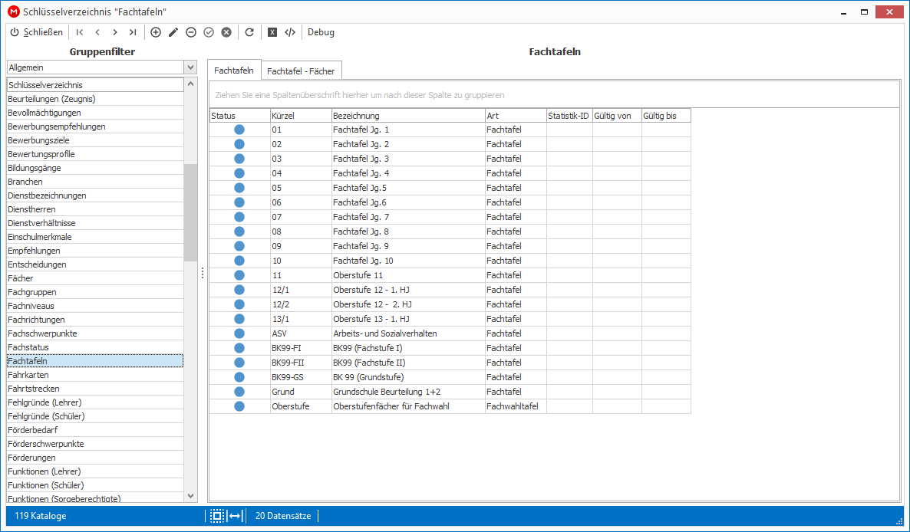

 

## Fächer zuweisen

#### Fachtafeln zuweisen

Sie weisen Schülern Fächer und Leistungen auf der Registerkarte `Zeugnis` zu. Durch das Zuweisen von Fachtafeln können Sie einem oder mehreren Schülern die zuvor definierten Fachtafeln  zuweisen. 

Das Zuweisen von Fachtafeln kann alternativ auch direkt beim Einschulen oder beim Fortschreiben bzw. Versetzen erfolgen. So weisen Sie Schülern eine Fachtafel zu.

|So geht's:|
|--|
|1. Klicken Sie auf Ansicht und dann auf Schüler.  |
|2. Wählen Sie einen gewünschten Schüler in der Auswahlliste aus und gehen Sie dann auf die Registerkarte `Zeugnis`. Wählen Sie hier die Registerkarte `Fächer`.   |
|3. Klicken Sie oben auf `Fachtafel zuweisen`. Es öffnet sich der Assistent `Fachtafel zuweisen`. Klicken Sie auf `Weiter`, um zu den nächsten Schritten zu gelangen. |
|4. Unter `Schüler auswählen` befinden sich alle Schüler des aktuellen Halbjahres. Nutzen Sie die [Gruppierung oder Filterung](https://doc.magellan7.stueber.de/howto/sort-group-filter-search.html) und markieren Sie Schüler, denen Sie dieselbe Fachtafel zuweisen möchten, gruppenweise und klicken Sie auf `Weiter`.      |
|5. Markieren Sie eine Fachtafel. Klicken Sie anschließend auf `Weiter`. Dabei richtet sich die Auswahl der Fachtafeln nach der Herkunft der Fachtafel:   * **Fachtafel manuell auswählen:** Es werden alle Fachtafeln angezeigt, die im Verzeichnis Fachtafeln definiert sind.   * **Beim jeweiligen Schüler hinterlegte Fachtafel benutzen:** Es werden jeweils die Fachtafeln zugewiesen, die bei den markierten Schülern auf der Registerkarte `Laufbahn` unter `Fachtafel` definiert sind.   * **Bei der jeweiligen Klasse hinterlegte Fachtafel benutzen:** Es werden jeweils die Fachtafeln zugewiesen, die bei den Klassen der markierten Schülern auf der Registerkarte `Zeiträume` unter `Fachtafel` definiert sind. |
|6. Klicken Sie dann auf `Weiter ` und anschließend auf `Fertigstellen`, um die Fachtafel den Schülern zuzuweisen. Sie haben auch die Möglichkeit z.B. erst die Fachtafelzuweisung für alle evangelischen Schüler einer Klasse oder eines Jahrganges zu machen. Gruppieren Sie in diesem Fall nach Klassen und nach Konfession. Markieren Sie alle evangelischen Schüler und klicken Sie auf `Weiter`.  |
|7. Unter Fachtafel zuweisen können Sie dann die gewünschte Fachtafel für die evangelischen Schüler markieren. Klicken Sie dann auf `Weiter`. Anschließend verfahren Sie analog für die katholischen Schüler und weisen diesen die Fachtafel für die katholischen Schüler zu. |

### Fach hinzufügen, ändern und löschen

#### Fach hinzufügen

Öffnen Sie die Fachliste eines Schülers, dessen Fachliste Sie bearbeiten möchten, indem Sie auf der Registerkarte `Zeugnis `des Schülers auf die Registerkarte `Fächer` gehen. In dem Verzeichnis der Fächer können Sie mit der Plustaste nach unten weitere Zeilen hinzufügen. Klicken Sie in der neuen Zeile in die Spalte `Fach`. Es erscheint ein kleiner Pfeil, der Sie auf das Schlüsselverzeichnis der Fächer hinweist. Klicken Sie auf dieses Symbol, um aus allen zur Verfügung stehenden Fächern auszuwählen. Um den Eintrag in die Fächerliste vorzunehmen, klicken Sie das entsprechende Fach an. 

Auf dieselbe Art können Sie dem Fach die `Unterrichtsart` und den `Status` zuweisen. 

In der Spalte `Position` können Sie jedem Fach eine fortlaufende Zahl zuordnen. Diese Zahl bestimmt die Position auf dem Zeugnis. 

!!! info "Hinweis"

  Bitte beachten Sie, dass die meisten Berichte ohne die Angabe einer Position keine Fächer zeigen. Bitte prüfen Sie die Hinweise für Ihre Zeugnisberichte im Modul MAGELLAN BERICHTE!

In der Spalte `Faktor` können Sie Berechnungsfaktoren eingeben. Dies ist allerdings nur für Berufsschulen relevant. 

#### Fach ändern

Möchten Sie ein Fach der Fachliste ändern, markieren Sie es entsprechend, indem Sie einmal auf die Zeile klicken. Wählen Sie nun ein anderes Fach aus dem Schlüsselverzeichnis `Fächer`.

#### Fach löschen

Um ein Fach aus der Fachliste zu löschen, markieren Sie die entsprechende Zeile. Klicken Sie auf die Schaltfläche `Minus` und das Fach verschwindet aus der Fächerliste des Schülers.

### Weitere Fachtafel hinzufügen

Falls Sie Schülern weitere Fachtafeln zuweisen möchten, klicken Sie erneut auf Fachtafel zuweisen. Es öffnet sich wieder der Assistent `Fachtafel zuweisen`. Klicken Sie auf `Weiter`, um zu den nächsten Schritten zu gelangen. Unter `Fachtafel auswählen` wählen Sie die Fachtafel aus, die den markierten Schülern nun zugewiesen werden soll. Folgende Optionen können dabei gewählt werden:

|Optionen im Assistenten|
|--|
|**Vorhandene Fächer der Schüler nicht löschen markiert:**   Die neu gewählte Fachtafel wird zu den bei den Schülern bereits eingetragenen Fächern hinzugefügt. Es werden keine Fächer gelöscht. |
|**Vorhandene Fächer der Schüler nicht löschen nicht markiert:**   Die bei den Schülern bereits eingetragenen Fächer werden gelöscht und die Schüler erhalten nur die Fächer der neu ausgewählten Fachtafel. |
|**Nur Lehrer der Fachtafel mit den vorhandenen Fächer, Unterrichtsart und Fachstatus der Schüler … markiert:**   Die bei den Schülern bereits eingetragenen Fächer werden um die Lehrer aus der Fachtafel ergänzt. Bereits zugewiesen Lehrer werden durch jene der Fachtafel überschrieben. |
|**Nur Position, Merkmal und Faktor der Fachtafel abgleichen…** **(Unterrichtsart u. Fachstatus berücksichtigen) markiert: **  Die bei den Schülern bereits eingetragenen Fächer und Leistungen werden nicht verändert oder gelöscht. Es werden nur Position, Merkmal und Faktor wie in der Fachtafel eingetragen übernommen. Unterrichtsart, Fachstatus und Fach müssen dabei übereinstimmen. |
|**Nur Position, Merkmal und Faktor der Fachtafel abgleichen… ** **(ohne Unterrichtsart u. Fachstatus zu berücksichtigen) markiert:**   Die bei den Schülern bereits eingetragenen Fächer und Leistungen werden nicht verändert oder gelöscht. Es werden nur Position, Merkmal und Faktor wie in der Fachtafel eingetragen übernommen. Der Abgleich wird unabhängig vom Fachstatus oder der Unterrichtsart vorgenommen, nur die Fächer müssen identisch sein. |

### Fächer zuweisen: Welche Möglichkeiten gibt es?

Für das Zuweisen der Fächer sind mehrere Wege möglich, Ziel ist, dass jeder Schüler die von ihm belegten Fächer zugewiesen bekommt. 

Einfachste Variante:** Alle Schüler der Klasse belegen die gleichen Fächer**, legen Sie pro Jahrgang eine Fachtafel an, die Sie jedes Jahr wiederverwenden können. Diese Fachtafel kann man auch für die Klasse vormerken und mit der Option `Bei der jeweiligen Klasse hinterlegte Fachtafel benutzen` zuordnen. Lesen Sie dazu den Punkt `Fachtafeln zuweisen`.

!!! info "Hinweis"

  Ändert sich etwas an diesen Fächern, können Sie unbesorgt die Änderung an den Fachtafeln vornehmen, da die Fachtafeln lediglich als Vorlage zu Zuweisen der Fächer dient, es gibt im Anschluss keine Verbindung zwischen den Schülerfächern und den Inhalten der Fachtafeln.

Ist der **überwiegende Teil der Schülerfächer innerhalb einer Klasse gleich**, einige Fächer unterscheiden sich aber, gibt es mehrere Wege:

1. Sie können diese Schnittmenge (Fächer, die alle Schüler der Klasse belegen) als Fachtafel anlegen. Die individuell belegten Fächer werden jeweils als Extrafachtafel (eine Fachtafel kann auch nur ein Fach enthalten) angelegt. Das Zuweisen erfolgt dann in mehreren Schritten, allerdings sollten Sie nach dem ersten Zuweisen darauf achten, dass die Option `Vorhandene Fächer der Schüler nicht löschen` gewählt ist.

2. Sie legen pro Fachvariante (Schnittmenge plus schülerindividuelle Fächer) eine Fachtafel an und weisen diese gezielt zu.

3. Sie erstellen eine Fachtafel, die alle in der Klasse vorkommenden Fächer enthält, weisen diese zu und entfernen dann per Sammellöschung die Fächer, die die einzelnen Schüler nicht belegen.

4. Sie merken bei der Klasse (`Klassen > Zeiträume > Zeitraum > Fachtafel`)/beim Schüler(`Schüler > Laufbahn > Fachtafel`)/bei der Klasse und beim Schüler Fachtafeln vor und weisen diese gesammelt zu. 

Beim Fachtafel zuweisen gehen Sie in zwei Schritten vor: 

Sie markieren alle Schüler und weisen die bei der Klasse hinterlegte Fachtafel zu, im zweiten Schritt weisen Sie die beim Schüler hinterlegte Fachtafel zu, achten aber bitte darauf, dass die Option `Vorhandene Fächer der Schüler nicht löschen` gesetzt ist.

5. Zusätzlich können Sie jederzeit per Hand auf der Fächerkarte einzelne Fachzeilen ergänzen, ändern oder löschen. 

!!! info "Hinweis"

  Fachtafeln, sind nur der geeignete Weg, wenn es eine Übereinstimmung in den Schülerfächern gibt. Für Oberstufenschüler, deren Fachwahl individuell erfolgt, eignet sich der Punkt `Abitur > Fachwahl` oder es können Schülerfachwahlen aus dem Kursplanmodul von daVinci übernommen werden. Informationen zum Punkt `Fachwahl` lesen Sie bitte im Abschnitt `Fachwahl-/Qualifikationsüberprüfungen vorbereiten` nach.

### Fachtafel extrahieren

Über das Extrahieren von Fachtafeln können Sie eine für einen Schüler erstellte Fachliste als Fachtafel extrahieren und somit weiteren Schülern zuweisen. Dies ist eine zusätzliche Möglichkeit Fachtafeln zu erstellen, allerdings diesmal "vor Ort". Markieren Sie dazu einen Schüler in der Auswahlliste `Schüler` und wählen Sie dessen Registerkarte `Zeugnis`. Wählen Sie dann die Registerkarte `Fächer` und klicken Sie oben auf `Fachtafel extrahieren`.
 
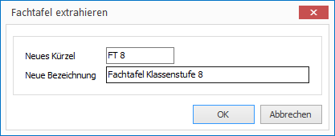

Die Fachtafel ist jetzt unter dem eingegebenen Kürzel und der Bezeichnung mit den Fächern des konkreten Schülers in dem Verzeichnis `Fachtafeln` gespeichert. Wenn Sie Schülern jetzt eine Fachtafel zuweisen, wird Ihnen die extrahierte Fachtafel ebenfalls als mögliche Fachtafel angeboten.

###  Schwerpunkte zuweisen

Über die Schaltfläche `Schwerpunkte…` können Sie eine Sammelzuweisung aufrufen, die ausgewählten Fächern oder Kurse einen Schwerpunkt zuweist. Sie können dabei zwischen Fach, Unterrichtsart, Fachstatus, Kursnummer und unterrichtendem Lehrer differenzieren. 
 
 

### Sammellöschung

Mit Hilfe der `Sammellöschung` kann bei mehreren Schülern gleichzeitig ein Fach gelöscht werden. Markieren Sie dazu einen Schüler in der Auswahlliste `Schüler` und wählen Sie dessen Registerkarte `Zeugnis`. Wählen Sie dann die Registerkarte `Fächer` und klicken Sie oben auf `Sammellöschung`. Ein Assistent ist Ihnen behilflich. Sie können nun mehrere Schüler markieren, bei welchen jeweils das gleiche Fach gelöscht werden soll. Besitzt einer der markierten Schüler nicht das ausgewählte Fach, so hat das Löschen keine Auswirkung auf diesen Schüler.
 

 

## Leistungen eingeben

Für jeden Schüler ist ein Verzeichnis über seine persönlichen Zeugnisdaten hinterlegt. Aus diesem Verzeichnis werden die Daten für den Zeugnisdruck verwendet. Alle diese Daten finden Sie auf den Registerkarten `Laufbahn` und `Zeugnis` des Schülers.

### Noten definieren

Als Voraussetzung für die Eingabe von Noten müssen diese im Verzeichnis `Noten` definiert sein. Wählen Sie dazu `Extras> Schlüsselverzeichnisse` und dann `Noten`. Im Dialogfenster `Verzeichnis der Noten` können Sie eine beliebige Anzahl von Noten definieren.
 

Für jeden Noteneintrag können Sie dabei in der Spalte `Notenart` zwischen einem `Notenwert`, `Füllwert` (zum Beispiel für "Attest" oder "o.B.") und einem `Punktwert` unterschieden. Zusätzlich können Sie neben der allgemeinen Bezeichnung in der Spalte `Bezeichnung` auch einen alternativen Text in der Spalte `Alternative Bezeichnung` wählen. Wird beim späteren Zeugnisdruck die Bezeichnung der Note ausgegeben, so erfolgt dies im Regelfall über den Wert im Feld `Bezeichnung`. Nur in Ausnahmefällen, wo beispielsweise Abkürzungen für Noten verwendet werden (z.B. bei Allgemeinbildenden Schulen in Baden-Württemberg), wird der Eintrag im Feld `Alternative Bezeichnung` genutzt.

Die angebotene Beurteilungsart unter `Schüler > Zeugnis > Leistungen` richtet sich danach, was der Klasse des Schülers unter `Klassen > Daten > Beurteilungsart` hinterlegt wurde. Zur Auswahl stehen dort die Berurteilungsarten:

* Benotung durch Noten (hierbei steht auch ein Feld für die schriftliche Beurteilung des Fachs zur Verfügung)
* Benotung durch Punkte
* Benotung durch Prozente
* Beurteilungstexte

Je nach Auswahl werden in den Notenfeldern der Schüler Noten, Punkte, Prozente oder auch Eingabemöglichkeiten für Beurteilungstexte eingeblendet.

!!! info "Hinweis"

  Bitte wählen Sie die Beurteilungsart der Klasse vor der Vergabe der Zeugnisnoten oder -punkte aus! 

!!! info "Hinweis"

  Um Ausfälle auf einen Blick erkennen zu können, weisen Sie den Noten unter `Extras > Schlüsselverzeichnisse > Noten` in der Spalte `Hintergrundfarbe `eine individuelle Farbe zu. Die Farbe wird unter `Schüler > Zeugnis > Leistungen `und auch in der Notenübersicht gezeigt. Zusätzlich muss bitte unter `Datenbank > Optionen > Einstellungen` die `Hintergrundfarbe für Benotungen` aktiviert werden.

### Noteneingabe

Sie geben Noten für einen Schüler ein, indem Sie auf der Registerkarte `Zeugnis` des Schülers die Registerkarte `Leistungen` wählen. Voraussetzung dafür ist, dass diesem Schüler bereits Fächer zugewiesen wurden.
 

Je nach der eingestellten Beurteilungsart der Klasse der werden zur Eingabe entweder Noten- oder Punktwerte angeboten. Auf die Eingabe von Beurteilungstexten wird im nachfolgenden Abschnitt näher eingegangen. Aus den schriftlichen und mündlichen Noten berechnet MAGELLAN im Regelfall nicht automatisch die Endnote!
Auf der Registerkarte `Leistungen` werden also im Regelfall nur die Noten eingetragen, die letztendlich auf dem Zeugnis erscheinen und sie besitzt keine Notenbuchfunktionalität. Im Regelfall sollten Sie in der Spalte `Endnote` die Zeugnisnote eintragen.

!!! info "Hinweis"

  Wenn Sie innerhalb eines Zeitraums aufgrund der eingetragenen Noten Versetzungen, Abschlüsse bzw. Durchschnittsnoten berechnen wollen, müssen Sie das Optionsfeld `Durchschnitt einblenden` markieren.

#### Zeitraumübergreifende Notenübersicht für einzelne Schüler oder eine Klasse

Es ist möglich, eine zeitraumübergreifende Notenmatrix für Schüler aufzurufen. Klicken Sie in der Registerkarte `Leistungen` auf die Schaltfläche `Notenübersicht…`. Es werden Ihnen nun entweder alle Fächer und Noten `aktuellen Schülers` oder `aller Schüler der Klasse` mit Angabe des Halbjahres angezeigt. Sie können in der Übersicht wie gewohnt Sortieren und Gruppieren.
 

!!! info "Hinweis"

   Die Registerkarte `Leistungen` und die `zeitraumübergreifende Notenmatrix` können nach Excel oder HTML exportiert werden.
Sie können die zeitraumübergreifende Notenübersicht auch für die gesamte Klasse des ausgewählten Schülers anzeigen lassen. Dafür schalten Sie in der oberen Menüleiste von `Aktueller Schüler` auf `Alle Schüler der Klasse` um.
 
 

### Beurteilungstexte

Haben Sie bei der Klasse die Beurteilungsart `Beurteilungstexte` eingestellt, so haben Sie für die Schüler dieser Klasse ein geändertes Layout auf der Registerkarte `Leistungen`.
 
: 

Um diesen einzutragen, müssen Sie in der Zeile des Fachs entweder einen Doppelklick auf die Spalte `Beurteilung` ausführen oder auf die entsprechende Schaltfläche `Beurteilung editieren..` klicken. Sie haben zusätzlich über die Schaltfläche `Rechtschreibung prüfen…` die Möglichkeit den Text überprüfen zu lassen. Die Einstellmöglichkeiten für die Rechtschreibprüfung finden Sie unter `Datenbank > Optionen > Rechtschreibung`
 
 

Bei der Eingabe des Beurteilungstextes können Sie auf bereits definierte Textbausteine zurückgreifen. Diese müssen Sie zuvor unter `Extras > Schlüsselverzeichnisse > Zeugnisbeurteilungen` definiert haben.
 
 

!!! info "Hinweis"

  Die Beurteilung nach Beurteilungstexten wird häufig in den ersten Klassen der Grundschule verwendet.

### Layout bei Noteneingabe anpassen

Das Layout auf der Registerkarte `Leistungen` kann individuell angepasst werden. Sie können sowohl nicht benötigte Spalten ausblenden als auch die Spaltenbezeichnungen umbenennen. Zur Anpassung des Layouts müssen Sie links oben auf der Registerkarte `Leistungen` auf die Schaltfläche `Layout anpassen…` klicken. Klicken Sie im Dialogfenster `Layout anpassen` auf die Häkchen in der Spalte `Sichtbar`, um die Spalte ein- bzw. auszublenden. Klicken Sie in der Spalte `Bezeichnung` auf den Begriff in der entsprechenden Zeile. Sie können diesen jetzt direkt überschreiben. 

!!! info "Hinweis"

  Die Einstellungen unter `Layout anpassen...` beziehen sich auf Ihren Arbeitsplatz, nicht auf andere MAGELLAN-Installationen.
 
 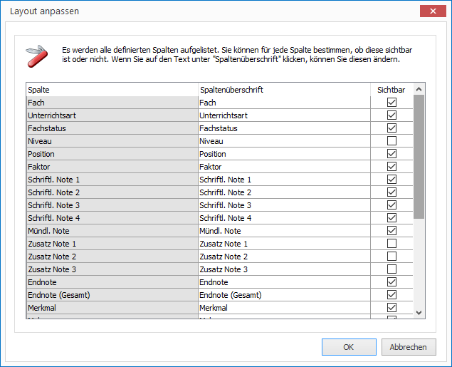

## Arbeits- und Sozialverhalten

Unter `Schüler > Zeugnis` können Sie für jeden Schüler das Arbeits- und Sozialverhalten in Kategorien (zum Beispiel `Teamfähigkeit`) erfassen und auch mit einer Bewertung (zum Beispiel `sehr ausgeprägt`) beurteilen. Zusätzlich können auch fachliche Leistungen nach selbst vergebenen Bewertungsmaßstäben beurteilt werden. 

### Vorbereitung

Vorab müssen die verwendeten Schlüsselverzeichnisse eingerichtet werden. Folgende Schlüsselverzeichnisse stehen dafür unter `Extras > Schlüsselverzeichnis > Arbeits- und Sozialverhalten` zur Verfügung:

|Verzeichnisse|
|--|
|**Typen:**   Dient als Filter um zwischen `Arbeits- und Sozialverhalten` und `Fachlichen Leistung` zu differenzieren.    |
|**Arten:**   Kann als Übergruppierung für die Kategorien verwendet werden, zum Beispiel um zwischen `Sozialverhalten` und `Arbeitsverhalten` zu unterscheiden. Für fachliche Leistungen entspricht die Art zum Beispiel `Deutsch` oder `Biologie`. Jeder Art wird zusätzlich der entsprechende Typ zugeordnet. Als Hilfe beim Erfassen der Arten kann das Verzeichnis zum Beispiel nach dem Typ gefiltert werden.    |
|**Kategoriegruppen:**   Legen in diesem Verzeichnis die Untergruppen der Arten an. Ein Bespiel für Kategoriegruppen: für die Art `Deutsch` sollen nach `Sprechen und Zuhören` und `Schreiben` getrennte Unterpunkte bewerten werden. Die Kategoriegruppen können Kategorien zugeordnet werden.  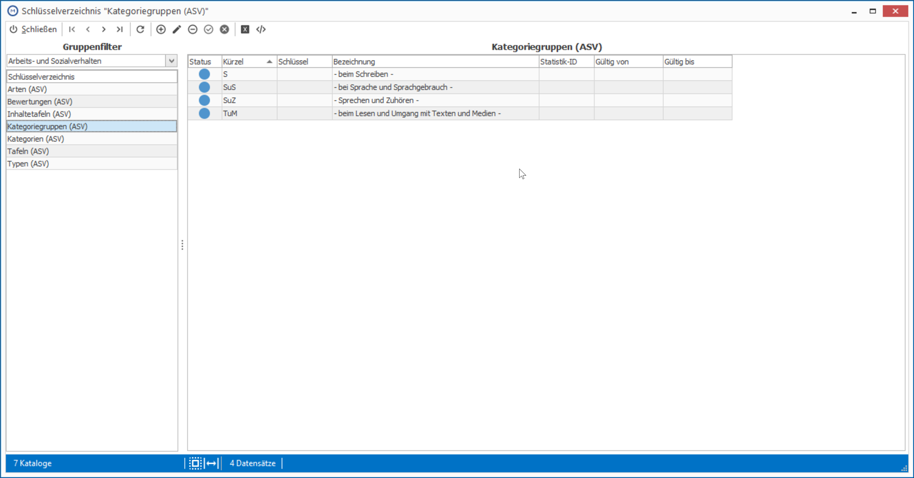 |
|**Kategorien:**   Legen Sie in diesem Verzeichnis die an Ihrer Schule zu bewertenden Kategorien an. In der Spalte Art können Sie den einzelnen Kategorien die zuvor angelegten Arten zuordnen. Diese Unterteilung hilft die Kategorien zusätzlich zu den Positionen im Zeugnisdruck korrekt anzuordnen. Jede Kategorie kann einer Kategoriegruppe zugeordnet werden.Der Inhalt des Verzeichnisses kann nach dem Typ gefiltert angezeigt werden. In der nachfolgenden Abbildung ist nach dem Typ `Fachliche Leistung` gefiltert worden.  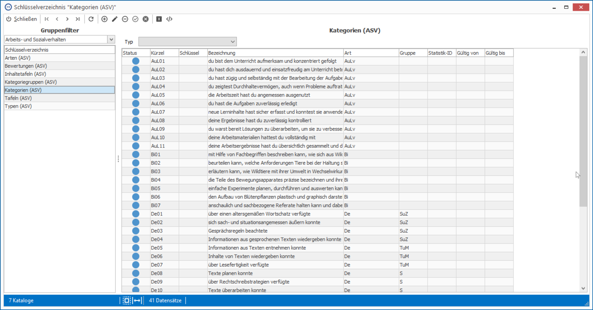  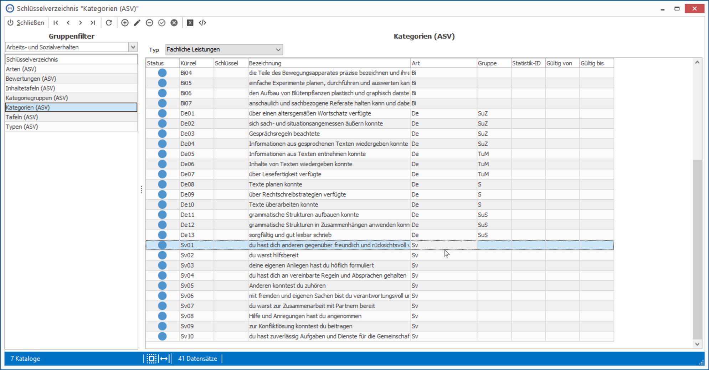 |
|**Inhaltetafeln:**   Um in Zeugnissen stichpunktartig die im Schuljahr unterrichteten Themen pro Klasse abzubilden, können die Themen in Inhaltetafeln gesammelt werden. Dabei ist es möglich für eine Art (zum Beispiel für Deutsch) verschiedene Inhaltetafeln anzulegen. Die Inhalte unterscheiden sich zwischen den Schuljahren und werden daher in getrennten Inhaltetafeln angelegt.   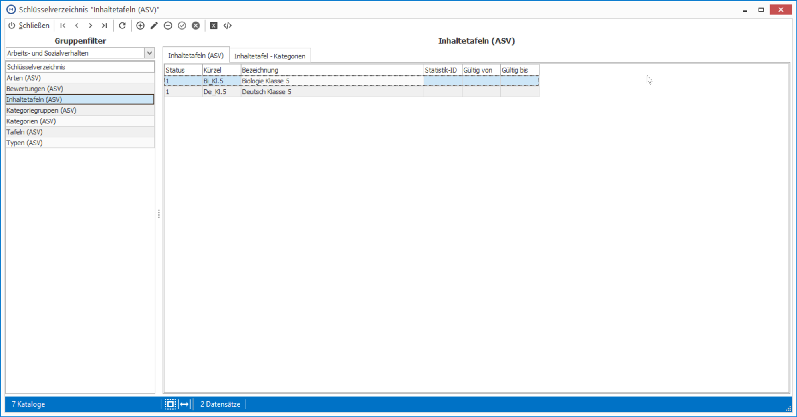 |
|**Inhaltetafel-Kategorien:**   Jede Inhaltetafel enthält Inhaltetafel-Kategorien. Für das Beispiel der Art Deutsch werden in der nachstehenden Abbildung die Themen für das 4. Schuljahr zeilenweise eingerichtet. Über die Position kann die spätere Reihenfolge auf dem Zeugnis gesteuert werden.   |
|**Bewertung: **  Legen Sie in diesem Verzeichnis die möglichen Abstufungen der Bewertungen an. Die Bewertungen können jeweils einem Typ zugeordnet werden. Damit können für das `Arbeits- und Sozialverhalten` andere Bewertungsabstufung als für `Fachliche Leistungen` realisiert werden. Je nach Zeugnisbericht kann für die Bewertungen eine Bezeichnung (zum Beispiel `erkennbar`) oder auch ein Kreuz abgeleitet aus dem Wert der Bewertung ausgegeben werden.   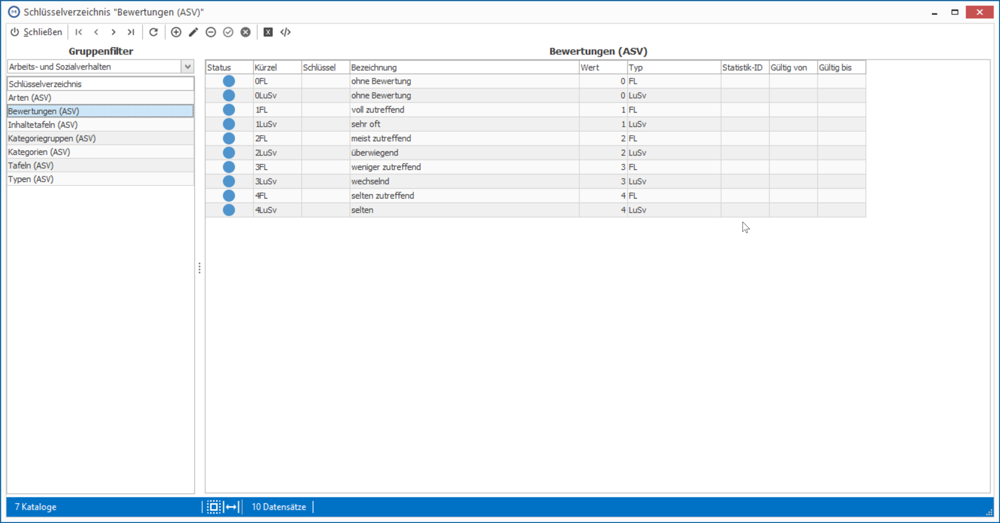 |
|**Kategorietafeln:**   Analog zu den Fachtafeln können auch vorbereitete Zusammenstellungen von Kategorien gesammelt den Schülern zugewiesen werden. Legen Sie dazu Kategorietafeln an und füllen sie mit Kategorien. Sie können dabei den Schülern auch die Fachlichen Leistungen und die Bewertungskriterien für das Arbeits- und Sozialverhalten in einem Arbeitsgang zuweisen.     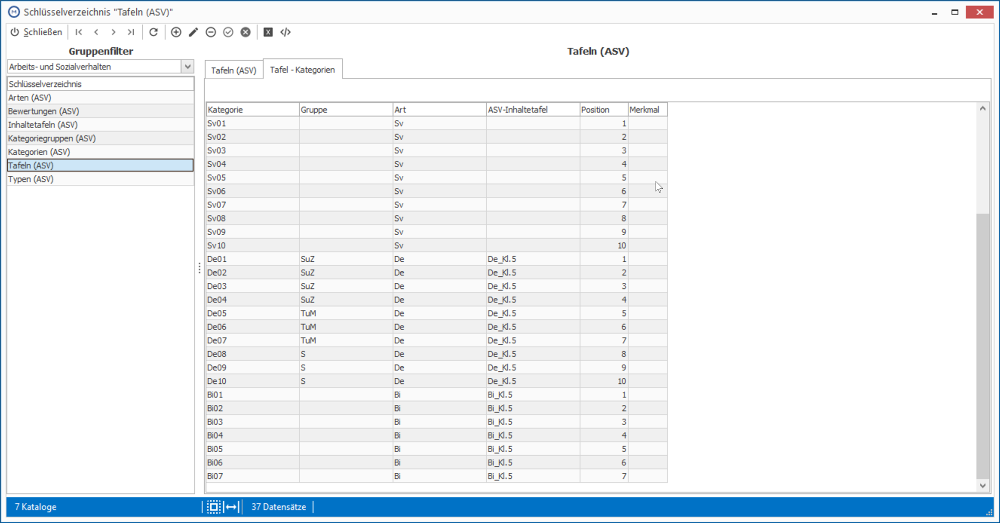 |

### Layout anpassen

Über die Schaltfläche `Layout anpassen…` können Sie die Benennung der Spaltenköpfe anpassen oder auch einzelne Spalten ausblenden. Die originale Bezeichnung des umbenannten Spaltenkopfes wird in der Spalte `Spalte` weiterhin angezeigt.

### Kategorietafel extrahieren

Wenn Sie für einen Schüler die Kategorien per Hand angelegt haben, können Sie daraus auch eine Kategorietafel extrahieren.

|So geht's:|
|--|
|1. Wählen Sie den gewünschten Schüler, rufen Sie die Karte ` Zeugnis > Arbeits- und Sozialverhalten` auf und klicken auf `Kategorietafel extrahieren…`.|
|2. Geben Sie ein Kürzel und eine Bezeichnung für die neue Kategorietafel ein und klicken auf `OK`.|
|3. Die neue Tafel steht im Anschluss im Assistenten ` Kategorietafel zuweisen… `zur Verfügung oder kann unter `Extras > Schlüsselverzeichnisse > Gruppe Arbeits- und Sozialverhalten > Kategorietafeln `editiert werden.|

### Verteilen der Kategorien

Sie können die Kategorien für die Schüler einzeln per Hand zuweisen oder mehrere Kategorien gesammelt für eine Gruppe von Schülern zuweisen. Rufen Sie in beiden Fällen im Menü `Schüler` die Unterkarte `Zeugnis > Arbeits- und Sozialverhalten` auf. Möchten Sie die Sammelzuweisung der Kategorietafeln verwenden, können Sie dabei einen beliebigen Schüler wählen.

#### Zuweisen einer einzelnen Kategorie und Bewertung

|So geht's:|
|--|
|1.  Wählen Sie in der Auswahlliste `Schüler` den gewünschten Schüler und rufen Sie die Registerkarte `Zeugnis > Arbeits- und Sozialverhalten` auf.     |
|2. Um eine neue Zeile zu erzeugen wählen Sie das rote Plus `Neue Kategorie` im rechten Bereich der Ansicht. |
|3. Wählen Sie für die neue Zeile im Feld Kategorie einen Wert aus den zuvor im Schlüsselverzeichnis erfassten Kategorien. |
|4. In der Spalte `Bewertung` können Sie eine Bewertung hinterlegen.|
|5. Bestätigen Sie die Auswahl abschließend mit dem orangen Häkchen für Speichern auf der rechten Seite.|

!!! info "Hinweis"

  Die Ansicht kann durch den Typfilter entweder die `Fachlichen Leistungen` oder die Eintragungen zum `Allgemeinen Lern- und Arbeitsverhalten` anzeigen. Aktivieren Sie den Wechsel durch einen Klick auf das Filtersymbol.
 

#### Sammelzuweisung von Kategorietafeln 

Rufen Sie die Sammelzuweisung bei einem beliebigen Schüler auf der Karte Arbeits- und Sozialverhalten über die Schaltfläche `Kategorietafel zuweisen` auf.
Wählen Sie die Schüler aus, Sie können dabei die Funktionen [`Sortieren`, `Gruppieren` oder auch `Filtern`](https://doc.magellan7.stueber.de/howto/sort-group-filter-search.html) nutzen. Sind die gewünschten Schüler markiert, klicken Sie auf `Weiter`. 

Wählen Sie die gewünschte Kategorietafel aus. Mit der Option `Vorhandene Kategorie der Schüler nicht löschen` können Sie steuern, ob die Kategorien der neuen Tafel ergänzt werden sollen oder anstelle der vorhandenen Kategorien zugewiesen werden sollen. Schließen Sie den Assistenten mit `Weiter` und `Fertigstellen` ab.

!!! info "Hinweis"

   Mit dem Zuweisen einer Kategorietafel können Einträge für die `Fachliche Leistungen` und das `Allgemeine Lern- und Arbeitsverhalten` für alle Schüler eines Jahrgangs in einem Arbeitsgang zugewiesen werden.

#### Kategorietafeln extrahieren

Haben Sie bei einem Schüler bereits Eintragungen vorgenommen, können Sie daraus auch eine Kategorietafel erzeugen um sie anderen Schülern gesammelt zu zuweisen.
Klicken Sie dafür beim Schüler auf die Schaltfläche `Kategorietafel extrahieren…` und vergeben ein Kürzel und einen aussagekräftigen Langnamen. Anschließend können Sie wie im vorhergehenden Abschnitt beschrieben die Kategorietafel weiteren Schülern zuweisen.

#### Ergänzungen anlegen

Gebunden an eine Inhaltetafel kann zusätzlich eine Ergänzung für einen Schüler frei formuliert werden. Beispielsweise soll auf dem Zeugnisbericht eines Schülers für das Fach Deutsch in der Klasse 4b ein besonderer Hinweis erscheinen. 

|So geht's:|
|--|
|1.  Um einen neue Ergänzung anzulegen, klicken Sie auf die Plusschaltfläche im rechten unteren Bereich |
|2. Wählen Sie eine Inhaltetafel aus und verfassen anschließend im Textfeld `Ergänzungen` die Anmerkung. Speichern Sie bitte über das Häkchen im rechten unteren Bereich.   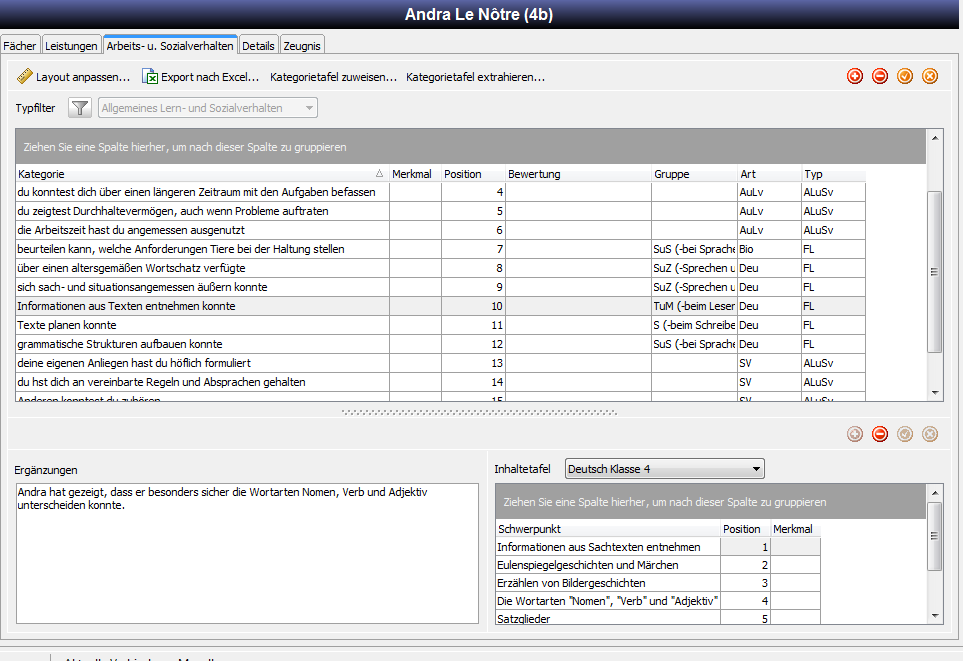 |

## Weitere Zeugnisdaten erfassen

### Registerkarte `Details`

Auf der Registerkarte `Details` unter der Registerkarte `Zeugnis` des Schülers werden alle weiteren Daten für das Zeugnis erfasst. Hierzu zählen als wichtigste Daten die `Fehltage`, `Fehlstunden`, `Unterrichtstage`, die Noten für `Mitarbeit` und `Verhalten`, das `Zeugnisdatum` und das `Datum der Zeugniskonferenz`. Im Eingabefeld `Tutor` können Sie dem Schüler einen Tutor zuordnen, der zuvor als Lehrer in MAGELLAN aufgenommen worden ist. Dieser wird entsprechend der Eingabe zeitraumbezogen abgelegt.
 
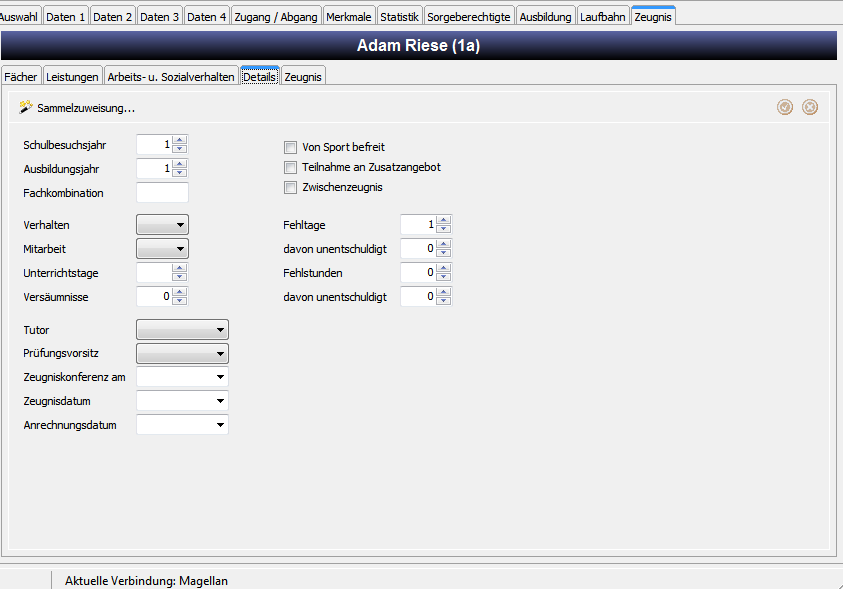

Die Ausgabe des Klassenlehrers und des Schulleiters auf dem Zeugnis richtet sich nach den entsprechenden Einstellungen unter `Klasse > Zeiträume > Klassenleiter` oder `Mandanten > Daten > Schulleiter`. Sollte nicht der Klassenleiter/Schulleiter selbst ausgegeben werden, sondern nur eine Unterscheidung zwischen Schulleiter und Schulleiterin oder Klassenleiter und Klassenleiterin vorgenommen werden, wird der Eintrag im Feld `Geschlecht` unter `Lehrer > Daten` für die der Klasse oder dem Mandanten zugeordneten Lehrer ausgewertet.
Unter `Fachkombination` können Sie die Fachkombinationsnummer in der gymnasialen Oberstufe für diesen Schüler eintragen.

### Sammelzuweisungen

Über die Möglichkeit der Sammelzuweisung können Sie für mehrere Schüler gleichzeitig bestimmte Werte auf der Registerkarte `Details` zuweisen. Auf diese Weise können Sie beispielsweise allen Schülern einer Klasse mit einer Anweisung das gleiche `Zeugnisdatum` zuordnen oder allen Schülern eines Oberstufenjahrgangs den gleichen `Tutor` zuweisen. Um den Assistenten für Sammelzuweisungen zu starten, müssen Sie links oben auf der Registerkarte `Details` auf die Schaltfläche `Sammelzuweisung…` klicken. 

So geht's:

Schritt|So geht's:|
|--|

|1.  Markieren Sie unter `Schüler auswählen` die Schüler, die im Rahmen der Sammelzuweisung den bzw. die gleichen Einträge auf der Registerkarte `Details` erhalten sollen. |
|2. Klicken Sie auf `Weiter`. Geben Sie unter `Felder auswählen und Werte zuweisen` die Werte an, die alle zuvor markierten Schüler erhalten sollen. Wichtig: Setzen Sie nur ein Häkchen, wählen im dazugehörigen Feld aber keienn Wert aus, können Sie auch Einträge aus Felder wieder löschen!  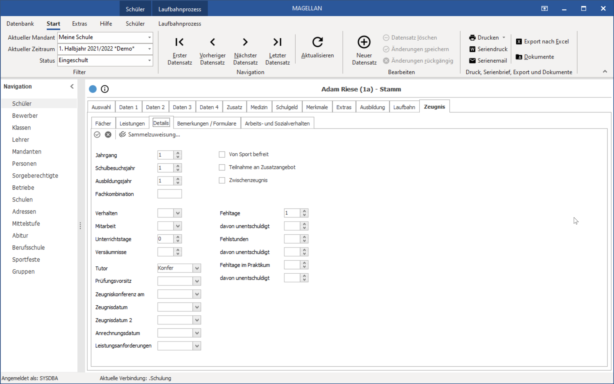 |
|3. Beispiel: Wählen Sie `Fächer der Schüler ohne Notenangabe löschen`, wenn Sie für alle markierten Schüler die zugewiesenen Fächer in der Registerkarte `Fächer` herauslöschen möchten. Es werden nur die Fächer gelöscht, bei welchen noch keine Noten eingetragen wurden. |
|4. Klicken Sie jetzt auf `Weiter `und anschließend auf `Fertigstellen`, um die Sammelzuweisung auszuführen.  |

Nach der Sammelzuweisung haben Sie natürlich immer noch die Möglichkeit, die zugewiesenen Daten einzeln abzuändern.

### Fehlzeiten

Sie können für jeden Schüler individuell Fehlzeiten oder Versäumnisse erfassen. Der Eintrag kann auf der Karte `Details` direkt für den Schüler vorgenommen werden oder kann auch über MyMAGELLAN gefüllt werden. Welche Felder für Ihren Zeugnisbericht gefüllt werden müssen, beschreiben wir pro Zeugnis im Modul MAGELLAN Berichte.
 
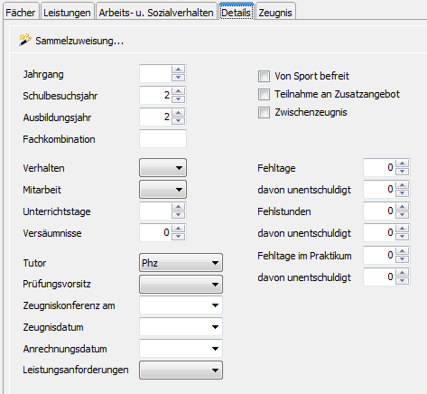

### Zeugnisbemerkungen

Die Zeugnisbemerkungen sind ein weiteres Schlüsselverzeichnis. Um das Verzeichnis der Zeugnisbemerkungen zu bearbeiten, klicken Sie auf `Extras > Schlüsselverzeichnisse > Zeugnisbemerkungen`. Sollten Bemerkungen in der vorhandenen Liste fehlen, klicken Sie auf das Symbol` Neue Zeile`. Es erscheint eine neue Zeile, in die Sie die Daten eintragen können.
 

### Zeugnisbemerkungen zuweisen

|So geht's:|
|--|
|1. Wählen Sie die Registerkarte Zeugnis des Schülers. Dann wählen Sie dort die untergeordnete Registerkarte Zeugnis.   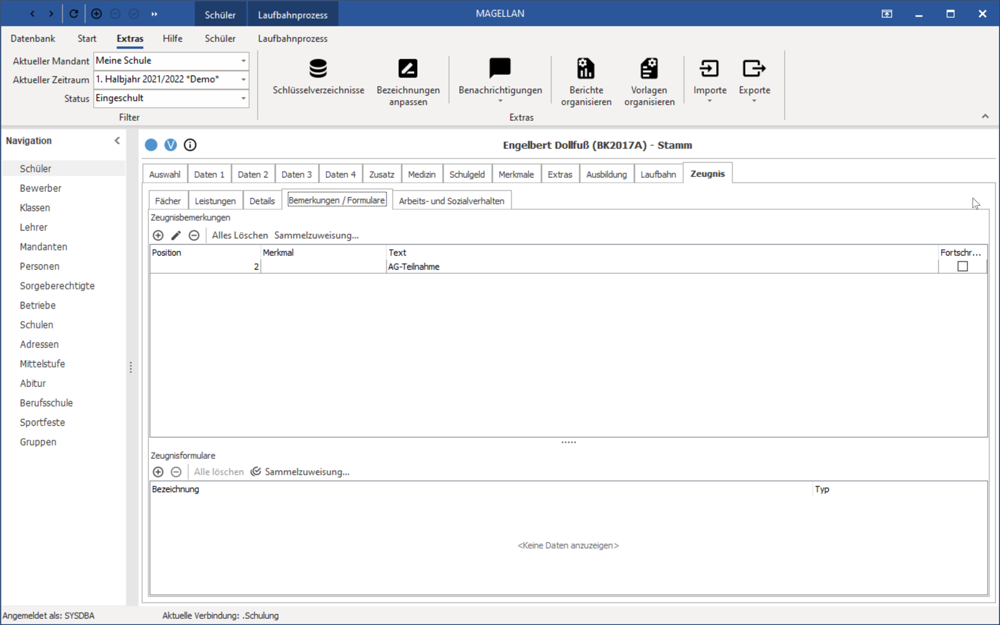 |
|2. Klicken Sie auf die Schaltfläche ``Hinzufügen`` neben der Liste der Zeugnisbemerkungen. Es öffnet sich das Dialogfenster `Neue Zeugnisbemerkung`. |
|3. Wählen Sie hier die entsprechenden zuvor definierten Zeugnisbemerkungen über die Schaltfläche `Aus Verzeichnis wählen` aus oder geben Sie einen freien Text ein. |
|4. Über das Häkchen `Fortschreiben `können Sie steuern, ob die Zeugnisbemerkung beim Versetzen oder Fortschreiben des Schülers ins kommende Halbjahr übernommen werden soll. |
|5. Klicken Sie anschließend auf `OK`.

Beim Anlegen einer Zeugnisbemerkung mit freiem Text steht Ihnen eine Rechtschreibprüfung zur Verfügung. Für jeden Schüler können Sie eine beliebige Anzahl von Zeugnisbemerkungen hinzufügen. Über das Feld `Position` können Sie die Reihenfolge der Ausgabe der Bemerkungen auf dem Zeugnis steuern.

## Sammelzuweisung von Zeugnisbemerkungen

Über die Möglichkeit der Sammelzuweisung können Sie für mehrere Schüler gleichzeitig bestimmte Zeugnisbemerkungen auf der Registerkarte `Zeugnis` zuweisen. Auf diese Weise können Sie beispielsweise allen Schülern einer Klasse mit einer Anweisung die gleiche Zeugnisbemerkung zuordnen.

|So geht's:|
|--|
|1. Um den Assistenten für Sammelzuweisungen zu starten, müssen Sie links oben auf der Registerkarte `Zeugnis` auf die Schaltfläche` Sammelzuweisung…` klicken. |
|2. Klicken Sie jeweils auf `Weiter`, um zum nächsten Schritt des Assistenten zu kommen.  Markieren Sie unter Schüler auswählen die Schüler, die im Rahmen der Sammelzuweisung den bzw. die gleichen Einträge auf der Registerkarte `Zeugnis` erhalten sollen. |
|3. Klicken Sie auf `Weiter`. Markieren Sie unter `Bemerkungen` auswählen die Einträge, die alle zuvor markierten Schüler erhalten sollen. Es sind hier Bereichsmarkierungen und Einzelmarkierungen möglich. Mit dem Häkchen `Fortschreiben` legen Sie fest, ob die Bemerkung für die Schüler beim Fortschreiben oder Versetzen ins Folgehalbjahr übernommen werden soll.  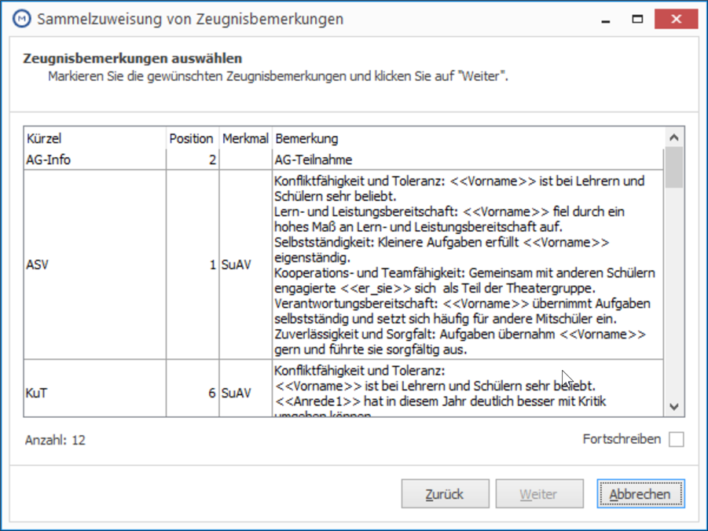 |
|4. ^Klicken Sie jetzt auf `Weiter `und anschließend auf `Fertigstellen`, um die Sammelzuweisung auszuführen.|

Nach der Sammelzuweisung haben Sie natürlich immer noch die Möglichkeit, die zugewiesenen Daten einzeln beim Schüler abzuändern.

### Zeugnisformulare

Sie haben in MAGELLAN die Möglichkeit, allen Schülern einzelne oder klassenweise (über `Sammelzuweisung`) Zeugnisformulare zuzuweisen. Durch diese Zuweisung können Sie den Zeugnisdruck automatisieren. Die `Zeugnisformulare` sind ein weiteres Schlüsselverzeichnis unter `Extras > Schlüsselverzeichnisse > Zeugnisformulare` und müssen dort erfasst werden. 

!!! info "Hinweis"

  Die Zuweisung der Zeugnisformulare zu den einzelnen Schülern ist optional und macht  z.B. dann Sinn, wenn die Schüler einer Klasse verschiedene Zeugnisse (BBS) oder mehrere Zeugnisse erhalten. 

Außerdem kann ein Außenstehender (z.B. die Sekretärin) ohne die Kenntnis, wer welches Zeugnis bekommt, den Druck automatisch starten, da die Zeugnisse beim Schüler hinterlegt sind. Bekommen die Schüler in der Mehrheit immer das gleiche Formular ist der standardmäßige Ausdruck der Zeugnisse vorzuziehen.

Um das Verzeichnis der Zeugnisformulare zu bearbeiten, wechseln Sie zu `Extras > Schlüsselverzeichnisse > Zeugnisformulare`. Das Fenster `Verzeichnis der Zeugnisformulare` öffnet sich. Sie fügen Zeugnisdaten hinzu, indem Sie auf das Plus klicken. Es wird eine neue Zeile eingefügt, in die Sie direkt die Daten eingeben können. Geben Sie eine Bezeichnung für das Formular ein und verknüpfen Sie diese unter Dateiname mit dem Zeugnisbericht.
 

!!! info "Hinweis"

   Verwenden Sie das Feld `Typ` um später beim Ausdruck die Zeugnisformulare nach den unterschiedlichen Vorlagen (zum Beispiel A3 = Typ 3, A4= Typ 4 o.ä.) filtern zu können.
 

### Wie wird gedruckt?

Beim Zeugnisdruck selbst können dann alle Schüler  (STRG+A) in der Auswahlliste `Schüler` markiert werden, eine bestimmte Sorte Zeugnispapier (selbstdefiniert über den Typ im Verzeichnis Zeugnisformulare) in den Drucker eingelegt werden und der Punkt `Drucken > Zeugnisformulare` gestartet werden. 
Beispiel: Sie haben die Ziffer 4 für A4-Papiervorlagen mit Wasserzeichen reserviert. Dann legen Sie diese Vorlagen in den Drucker und geben beim Druckaufruf die 4 in das Feld Typ ein. MAGELLAN überprüft jetzt für jeden markierten Schüler, ob ihm ein Zeugnisformular mit dem Typ 4 hinterlegt wurde und druckt die Zeugnisse dann nacheinander aus.

## Laufbahn des Schülers

Auf der Registerkarte Laufbahn des Schülers ist die Laufbahn des Schülers an der Schule aufgelistet.
 

Markiert man einen Zeitraumeintrag der Liste auf der linken Seite, so werden die entsprechenden Details zu diesem Zeitraum auf der rechten Seite für die  Registerkarten `Allgemein` und `Abschluss` angezeigt. Die Einträge in der Laufbahnliste des Schülers sind teilweise mit Symbolen markiert, welche eine Aussage über die Art des Wechselns machen.

|Bedeutung der Symbole|
|--|
|Schüler ist in den nächsten Zeitraum versetzt bzw. fortgeschrieben worden.   
|Parallele Laufbahn des Schülers, der Schüler besucht eine weitere Klasse neben seiner Hauptklasse.    
|Der Schüler innerhalb des gleichen Zeitraums gewechselt.   
|Der Schüler ist Wiederholer.    

**Feld `Versetzt`**:
Für die Erfassung der Zeugnisdaten ist dabei je nach Zeugnis der Eintrag unter `Versetzt` auf der Registerkarte `Allgemein` wichtig. Diese Einstellung entscheidet die beispielsweise in Zeugnissen verwendete Bemerkung, ob der Schüler in die nächsthöhere Stufe versetzt wird. Beim Fortschreiben oder Versetzen von Schülern wird dieses Feld automatisch gefüllt. Alternativ kann es auch mit der Sammelzuweisung befüllt werden.

**Feld `Schulformeintritt`**:
Der Eintrag im Feld `Schulformeintritt` hat Bedeutung für Zeitraumbezeichnungen auf Abschluss-/Abgangszeugnissen. Er ist das `Von-Datum` auf diesen Zeugnissen. Es kann erfasst werden, ob das Klassenziel erreicht wurde. Dies kann auch mit einem entsprechenden Datum versehen werden. 

**Karte `Abschluss`**:
Auf der Registerkarte `Abschluss` kann der Abschluss des Schülers (z.B. Abitur) unter Abschluss 1 festgehalten werden. Hierbei handelt es sich um ein Schlüsselfeld, welches Sie über `Verzeichnisse|Abschlüsse (Intern)` mit Werten füllen können. Der Eintrag im Feld `Abschlussdatum` hat Bedeutung für Zeitraumbezeichnungen auf Abschluss-/Abgangszeugnissen. Er ist das `Bis-Datum` auf diesen Zeugnissen. Optional können Sie unter `Abschluss 2` auch einen zweiten Abschluss des Schülers eintragen. 

### Sammelzuweisung von Laufbahndaten

Über die Möglichkeit der Sammelzuweisung können Sie für mehrere Schüler gleichzeitig bestimmte Laufbahndaten auf der Registerkarte `Laufbahn` zuweisen. Auf diese Weise können Sie beispielsweise allen Schülern einer Klasse mit einer Anweisung viele Laufbahndaten zuordnen.

|So geht's:|
|--|
|1. Um den Assistenten für Sammelzuweisungen zu starten, müssen Sie links oben auf der Registerkarte `Allgemein `auf die Schaltfläche `Sammelzuweisung` klicken. |
|2. Klicken Sie jeweils auf `Weiter`, um zum nächsten Schritt des Assistenten zu kommen. |
|3. Markieren Sie unter Schüler auswählen die Schüler, die im Rahmen der Sammelzuweisung den bzw. die gleichen Einträge auf der Registerkarte Allgemein erhalten sollen. |
|4. Klicken Sie auf `Weiter`. |
|5. Markieren Sie unter Sammelzuweisung von Laufbahndaten die Daten, die alle zuvor markierten Schüler erhalten sollen und tragen in die entsprechenden Felder die gewünschten Daten ein. |
|6. Klicken Sie jetzt auf `Weiter `und anschließend auf `Fertigstellen`, um die Sammelzuweisung auszuführen. |

Nach der Sammelzuweisung haben Sie natürlich immer noch die Möglichkeit, die zugewiesenen Daten einzeln abzuändern. Analog ist beim Durchführen einer Sammelzuweisung auf der Registerkarte `Abschluss` vorzugehen.
 
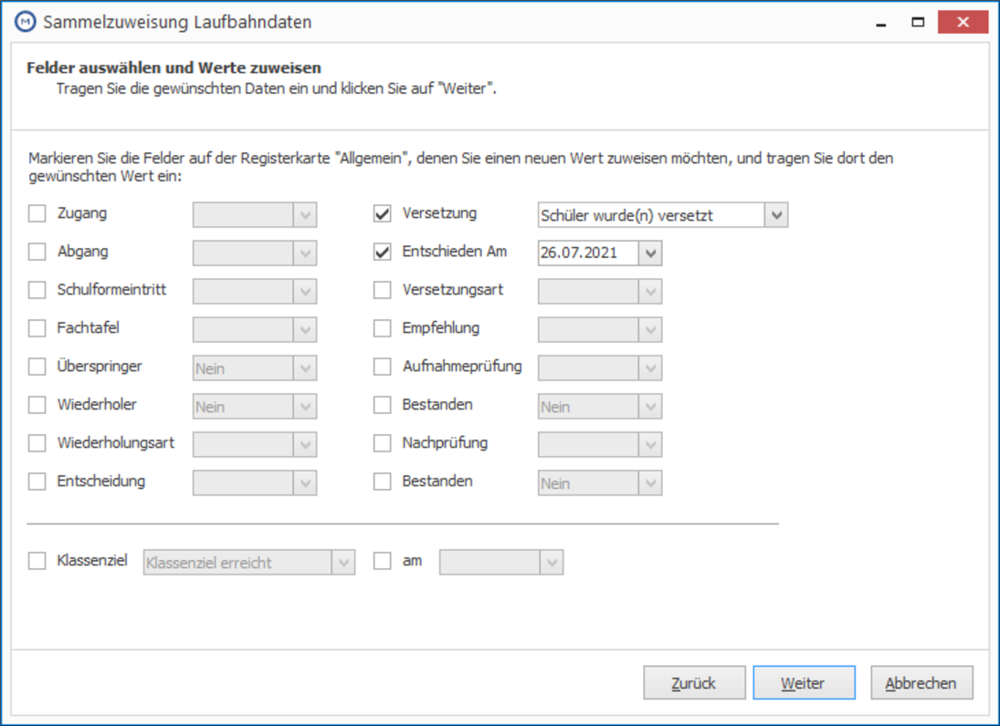

