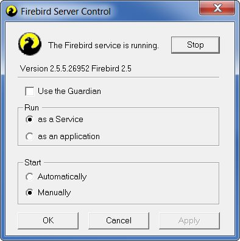

# Andere Benutzer sind noch angemeldet

Für die Datenstrukturanpassung darf kein Nutzer außer dem sysdba, der die Anpassung durchführt, angemeldet sein. Wenn Sie nicht wissen, wer in Ihrem Netzwerk noch ein Magellan-Modul(Schulverwaltung, Bibliothek, Haushalt&Inventar u.a) gestartet hat, können Sie den Firebird-Dienst stoppen und erneut starten. Öffnen Sie dazu auf Ihrem Server-Rechner in der Systemsteuerung den Punkt Firebird-Server-Manager, stoppen den Dienst und starten ihn erneut. 

Fehlt Ihnen der Aufruf in der Systemsteuerung? Sie können den Dienst auch unter Systemsteuerung|Verwaltung|Dienste|Firebird-Server finden.

