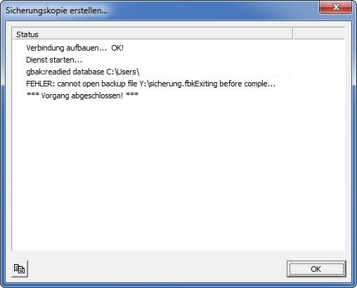
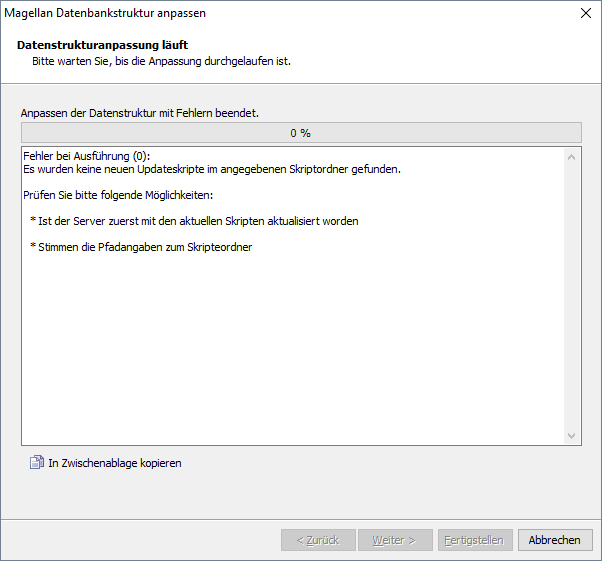

# Probleme beim Einspielen der Service-Updates?

In den nachfolgenden Punkte beschreiben wir die Lösungen zu Problemen, die bei Updates auftreten können. 

## Datenbanksicherung kann nicht erstellt werden

Die Sicherung der Datenbank kann nur auf dem selben Rechner erstellt werden, auf dem auch die Datenbank selbst gespeichert ist. Versuchen Sie die Sicherung auf einem anderen Rechner oder über ein Netzlaufwerk erstellen zu lassen, stoppt der Assistent mit nachfolgender Meldung.  
Bitte wählen Sie einen lokales Verzeichnis, wir empfehlen das Verzeichnis "Backup" in Ihrem Datenbankverzeichnis und einen Dateinamen, der das Tagesdatum enthält.

Beispiel die Benennung: 2016-04-23.fbk


 
## Die Magellan-Datenbank-ODS-Version ist nicht aktuell

Der Assistent prüft die ODS-Version (On-Disc-Structure) der Datenbank, um das Strukturupdate korrekt ausführen zu können. Ihre Datenbank sollte für die Anpassung bestimmte Befehle "kennen". Durch das Sichern und anschließende Wiederherstellen erhöht sich die ODS-Version , d.h. die Datenbank "lernt" neue Befehle. 
Folgende Schritte sind nötig:

1.	Firebird aktualisieren
2.	Sichern und Wiederherstellen der Datenbank im MAGELLAN ADMINISTRATOR > Datensicherung
3.	Firebird stoppen
4.	wiederhergestellte Datenbank gegen Realdatenbank tauschen
5.	Firebird starten
6.	MAGELLAN starten Datenstruktur anpassen
7.	MAGELLAN ADMINISTRATOR starten und Datenbankpflege > Zugriffsrechte synchronisieren ausführen.

Prüfen Sie bitte auf Ihrem Serverrechner in der Systemsteuerung im "Firebird-Server-Manager" oder unter dem Punkt "Programme und Funktionen|Firebird" welche Version von Firebird Sie einsetzen. Die aktuell empfohlene Ausgabe finden Sie auf unserer Webseite im [Downloadbereich](https://magellan.stueber.de/download.php). 

 
Wenn Sie diese Meldung erhalten, laden Sie über den Link unten links im Meldungsfenster die aktuelle Firebird-Version herunter. Stoppen Sie dann die aktuelle Firebird-Installation auf dem Serverrechner unter ```Systemsteuerung > Klassische Ansicht > Firebird-Server-Manager``` und schließen das Firebird-Fenster wieder. 
 
Falls Sie den Aufruf in der Systemsteuerung nicht finden können, rufen Sie stattdessen den Punkt ```Systemsteuerung > Verwaltung > Dienste > Firebird-Server ```per Doppelklick auf stoppen den Dienst hier.
 
Starten Sie anschließend die Installation von Firebird per Doppelklick auf das Installationspaket und folgen dem Assistenten. Starten Sie anschließend den Firebird-Dienst wieder in der Systemsteuerung. Wenn Sie diese Version bereits einsetzen, dann fehlen noch die folgenden Schritte:

1.	Melden Sie sich auf dem Serverrechner als sysdba am Magellan-Administrator an. Es wird erkannt, dass die Datenbank nicht in der aktuellen Version vorliegt, daher wird der Administrator nur mit dem Punkt Datenbanksicherung geöffnet.
2.	Wählen Sie den Punkt ```Datensicherung > Sicherungskopie```, geben einen Pfad und einen Datennamen an. Beispiel: ```C|...|Stüber Systems|Magellan 6|Datenbank|Backup|2016-03-24.fbk``` Starten Sie die Sicherung! 
1.	Im Anschluss stellen Sie die Datensicherung wieder her, die "Echtdatenbank" kann dabei nicht überschrieben werden.
 
1.	Stoppen den Firebird-Dienst (Systemsteuerung|Firebird Server Manager).
2.	Tauschen die Echtdatenbank gegen die wiederhergestellte Datenbank aus und starten den Firebird-Dienst wieder. 
	
>Den Pfad zur Echtdatenbank auf Ihrem Serverrechner finden Sie unter ```MAGELLAN ADMINISTRATOR > Server-Verwaltung > Verbindungen verwalten > Starten > Verbindung markieren > Bearbeiten > Unterkarte Datenordner```.

3.	Starten Sie Magellan erneut als sysdba und führen Sie die Datenstrukturerweiterung aus.

## Andere Benutzer sind noch angemeldet

Für die Datenstrukturanpassung darf kein Nutzer außer dem sysdba, der die Anpassung durchführt, angemeldet sein. Wenn Sie nicht wissen, wer in Ihrem Netzwerk noch ein Magellan-Modul(Schulverwaltung, Bibliothek, Haushalt&Inventar u.a) gestartet hat, können Sie den Firebird-Dienst stoppen und erneut starten. Öffnen Sie dazu auf Ihrem Server-Rechner in der Systemsteuerung den Punkt Firebird-Server-Manager, stoppen den Dienst und starten ihn erneut. 


Alternativ können Sie den Firebird-Server auch unter `Start > Systemsteuerung > Verwaltung > Dienste` anhalten.


Fehlt Ihnen der Aufruf in der Systemsteuerung? Sie können den Dienst auch unter Systemsteuerung|Verwaltung|Dienste|Firebird-Server finden.

## MAGELLAN findet den Skripteordner nicht

Sie starten nach dem Update MAGELLAN und erhalten folgende Meldung?


Nr|Ursache
--|--
1.|	die Pfade zum Skripteverzeichnis auf dem Server fehlen
2.|	die Pfade zum Skripteverzeichnis auf dem Server sind verkehrt

Eventuell wurde bei der Installation kein oder nicht der korrekte Pfad zu dem Skripteordner erfasst. Bitte rufen Sie das Anmeldefenster des Administrators auf und wählen die folgende Einstellung:


   
Anschließend rufen Sie im Administrator den Punkt Server-Verwaltung|Verbindungen verwalten|Starten|Verbindung markieren|Bearbeiten|Unterkarte "Datenordner" auf. Steht dort der Pfad zum Ordner Skripte? Wenn nicht tragen Sie ihn bitte nach.
  
Die Datenordner liegen je nach Betriebssystem bei unverändert übernommenen Installationspfaden an den nachfolgenden Stellen:
(Pfad bitte jeweils um den Namen des Verzeichnisses ergänzen: Berichte, Skripte, Vorlagen, Importe, Dokumente, Datenbank) finden Sie unter:

| Betriebssystem    |Standardpfad|
| --                | --         |
|  Vista            | C:\Users\Public\Documents\Magellan 7  |
|XP                 |C:\Dokumente und Einstellungen\All Users\Anwendungsdaten\Stueber S...\Magellan 7|
|Windows 2000       |C:\Dokumente und Einstellungen\All Users\Dokumente\Stueber S...\Magellan 7 |
|Windows 7          |C:\Users\Public\Documents\Stueber S...\Magellan 7 |
|Windows Server 2008|C:\Users\Public\Documents\Stueber S...\Magellan 7\ |


## Trotz Update fehlen Skripte oder andere aktuelle Daten

Sie spielen das Update ein und dennoch fehlen Skripte für die Strukturanpassung oder zum Beispiel das in der LiesMich-Datei angekündigte neue Zeugnis?




Drei Möglichkeiten können hinter diesem Problem stecken: 

Nr|Ursache
--|--
1.|dem Server fehlt das Update und damit auch zum Beispiel die  Strukturanpassungsskripte
2.|der Server hat das Update erhalten, aber das Update konnte die Anpassungsskripte nicht ablegen
3.|Sie haben eine Einzelplatzinstallation und haben Ihr Betriebssystem auf Windows 10 aktualisiert


**Zu 1.: **

Bitte immer als erstes den Serverrechner aktualisieren, da dieser Rechner der einzige im Netzwerk ist, der die gemeinsam genutzten Programmkomponenten, wie zum Beispiel die Skripte hat und für die Clientinstallationen zur Verfügung stellt.

**Zu 2.:** 

Sollten nach dem Update die Skripte u.a. dennoch nicht aktuell sein, kann es damit zusammenhängen, dass nach der ursprünglichen Serverinstallation die Pfade nachträglich verschoben wurden. Der bei der Installation und bei den Updates verwendete Windows Installer „möchte“ die Dateien am ursprünglichen Speicherort aktualisieren. Sollte dieser nicht mehr bestehen, müsste erneut installiert werden und gleich auf die gewünschten Pfade verwiesen werden.


**zu 3.:**  
Wenn Sie Ihren Rechner mit einer bestehenden MAGELLAN-Installationauf Windows 10 aktualisieren, kann es passieren, dass beim Folgeupdate von Magellan die Datenordner vom Windows Installer nicht gefunden werden und keine neuen Bestandteile wie Skripte, Berichte usw abgelegt werden.
Das betrifft keine Clientinstallationen die auf Datenordner auf dem Serverrechner nutzen, sondern nur Server-/Einzelplatzinstallationen. Bitte deinstallieren Sie Magellan und installieren Sie es neu!


## Meldung "no permission for read/select Access to TABLE..."?

Wenn bei einem Update die Datenstruktur um eine neue Tabelle erweitert wurde, dann muss für die bereits eingerichteten Benutzer geklärt werden, ob sie darauf zugreifen können. Daher ist der letzte Schritt im Updateprozess das Ausführen des Punktes "Zugriffsrechte synchronisieren" im Modul MAGELLAN Administrator.


Bitte rufen Sie den MAGELLAN Administrator auf und führen den Punkt `Datenbankpflege > Datenbank überprüfen > Zugriffsrechte synchronisieren` durch, im Anschluss können die Kollegen sich wieder mit der gewohnten Kennung anmelden.


## Meldung "Runtime error ..."


Vermutlich ist eine der Dateien, die beim Start von MAGELLAN geladen werden sollen, beschädigt. Die möglichen Dateien pro Arbeitsplatz wären (außer Sie verwenden eine MAGELLAN.paths um die Dateien gemeinsam zu verwenden):

  *  MAGELLAN.opt (Optionen)
  *  MAGELLAN.evm (Pfade zur Datenbank und zu den gemeinsam verwendeten Datenordnern)
  *  MAGELLAN.lic (Lizenz)

Bitte schauen Sie an dem Rechner je nach Betriebssystem unter folgendem Pfad nach:


| Betriebssystem | Pfad |
| --- | --- |
| Windows Vista | C:\ProgramData\Stueber Software\Magellan 6 |
| Windows XP | C:\Dokumente und Einstellungen\All Users\Anwendungsdaten\Stueber Software\Magellan 6 |
| Windows 2000 | C:\Dokumente und Einstellungen\All Users\Anwendungsdaten\Stueber Software\Magellan 6 |
| Windows 7 | C:\ProgramData\Stueber Software\Magellan 6 |
| Windows Server 2008 | C:\ProgramData\Stueber Software\Magellan 6 |
| Windows 8 | C:\ProgramData\Stueber Software\Magellan 6 |
| Windows 10 | C:\ProgramData\Stueber Software\Magellan 6 |


Bitte benennen Sie der Reihe nach immer eine der Dateien um und starten MAGELLAN, um zu sehen, welche der Dateien das Problem verursacht.
Wenn Sie eine Dateien ausmachen konnten, gehen Sie je nach Datei wie folgt vor:

Datei|nächster Schritt
--|--
MAGELLAN.opt?|Bitte einfach löschen, die Datei wird beim nächsten Schließen von MAGELLAN neu angelegt, anschließend bitte die Optionen unter `Extras > Einstellungen` neu auswählen.
MAGELLAN.evm?|Bitte von einem anderen Clientrechner kopieren und hier einfügen.
MAGELLAN.lic?|Bitte von einem anderen Clientrechner kopieren und hier einfügen.