
# Serverinstallation und Einzelplatzinstallation

!!! info "Hinweis"

    Die Installation des Datenbankservers \(Firebird\) wird für die Installationsarten Server und Einzelplatz vorausgesetzt.

Diesen Installationstyp wählen Sie bitte aus, wenn Sie entweder eine netzwerkunabhängige MAGELLAN-Installation wünschen (zum Beispiel um MAGELLAN zu testen) oder wenn Sie Ihren Schulserver einrichten möchten.

## Download und Installationstypen

Laden Sie bitte das MAGELLAN-Installationspaket von unseren Webseiten oder unter [folgendem Link](ftp://ftp.stueber.de/pub/bin/de/magellan/v7/beta/magellan7.msi). Starten Sie anschließend die Installation per Doppelklick auf die Datei `Magellan7.msi`.

Der Setup Assistent von MAGELLAN 7 wird gestartet und die Installationsdateien werden entpackt.

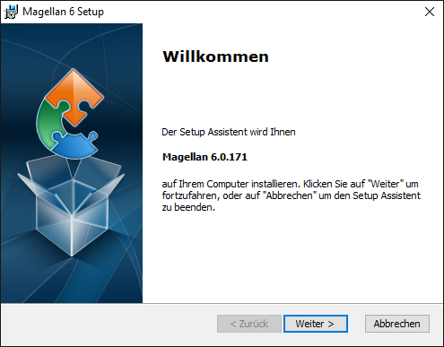

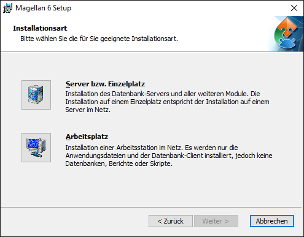

Wählen Sie die `Server-/Einzelplatzinstallation` aus! Es wird das Programm installiert, zusätzlich wird die Datenbank abgelegt und es werden die sogenannten Datenordner erzeugt. In den Datenordnern befinden sich alle Bestandteile auf die die Nutzer später gemeinsam zugreifen können, zum Beispiel Bericht, Seriendruckvorlagen, Skripte usw.

!!! info "Hinweis"

    Die Installation des Datenbankservers \(Firebird\) wird für die Installationsarten Server und Einzelplatz vorausgesetzt.

Jetzt ist der Setup Assistent bereit, die Installation der Dateien vorzunehmen. Die Installation selbst muss direkt auf dem Server oder dem Einzelplatz erfolgen.

Wählen Sie zunächst den Speicherort für die Programmdateien aus.

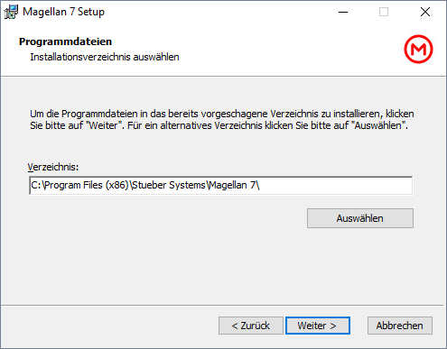

Wählen Sie den Speicherort für die Datenbank und klicken Sie auf „Weiter“.

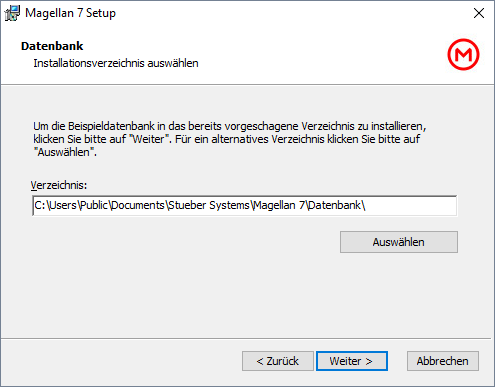

Wählen Sie den Speicherort für die Datenordner \(Berichte-, Dokumente-, Importe-, Skripte- und Vorlagenordner\) und klicken Sie auf „Weiter“.

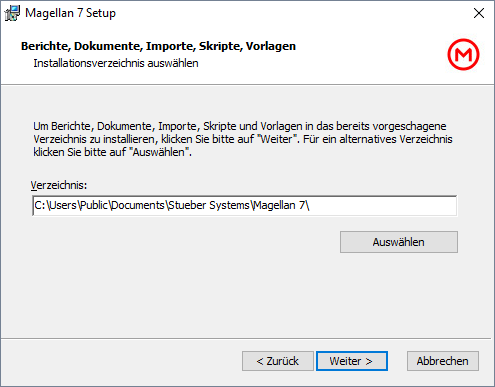

!!! info "Hinweis"

    Der Installationsassistent schlägt Ihnen hier Speicherpfade für die Datenordner vor. Diese Pfade können Sie im Assistenten anpassen. Bitte beachten Sie, dass diese Pfade später bei Updates verwendet werden. Sollten Sie hier angelegten Verzeichnisse auf Dateiebene verschieben, können trotz Update aktualisierte Daten fehlen. Sollten Sie sich später umentscheiden, deinstallieren Sie das Programm vom Serverrechner, installieren neu und geben den gewünschten Pfad an.

Klicken Sie nun auf „Installieren“, um mit der Installation zu beginnen.

Die Installation selbst kann einige Minuten in Anspruch nehmen. Klicken Sie zum Abschließen der Installation auf „Fertigstellen“.

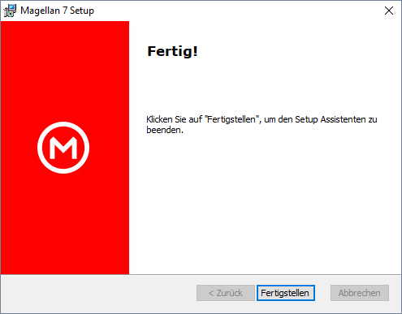

### Speicherorte der Dateien

Nach Abschluss der Installation befinden sich standardmäßig die Dateien in folgenden Ordnern auf dem Server:

Anwendungsdaten \(z.B. Magellan.exe\):

| Betriebssystem | Pfad |
| --- | --- |
| Windows Vista | C:\Program Files\Stueber Systems\MAGELLAN 7 |
| Windows XP | C:\Programme\Stueber Systems\MAGELLAN 7 |
| Windows 2000 | C:\Programme\Stueber Systems\MAGELLAN 7 |
| Windows 7 | C:\Programme\Stueber Systems\MAGELLAN 7 |
| Windows Server 2008 | C:\Program Files \(x86\)\Stueber Systems\MAGELLAN 7\ |
| Windows 8 | C:\Programme\Stueber Systems\MAGELLAN 7 |
| Windows 10 | C:\Program Files \(x86\)\Stueber Systems\MAGELLAN 7\ |

Allgemeine Einstellungs- und Lizenzdaten \(z.B. Magellan.evm, Magellan.lic, Magellan.SiteInfo, Magellan.UserInfo\):

| Betriebssystem | Pfad |
| --- | --- |
| Windows Vista | C:\ProgramData\Stueber Systems\MAGELLAN 7 |
| Windows XP | C:\Dokumente und Einstellungen\All Users\Anwendungsdaten\Stueber Systems\MAGELLAN 7 |
| Windows 2000 | C:\Dokumente und Einstellungen\All Users\Anwendungsdaten\Stueber Systems\MAGELLAN 7 |
| Windows 7 | C:\ProgramData\Stueber Systems\MAGELLAN 7 |
| Windows Server 2008 | C:\ProgramData\Stueber Systems\MAGELLAN 7 |
| Windows 8 | C:\ProgramData\Stueber Systems\MAGELLAN 7 |
| Windows 10 | C:\ProgramData\Stueber Systems\MAGELLAN 7 |

Datenordner \(Vorlagen, Skripte, Importe, Dokumente, Berichte, Datenordner\):

Auf die Datenordner sollen die Nutzer von den Arbeitsplatzrechnern aus zugreifen können. Bitte stellen Sie sicher, dass den Nutzern auf Betriebssystemebene Schreib- und Leserechte für diese Verzeichnisse eingeräumt werden. Diese Rechte sind notwendig, um alle MAGELLAN-Funktionalitäten nutzen zu können (Beispiel: Berichte organisieren, Vorlagen organisieren, Ablegen von Schülerdokumenten u.a.).
Richten Sie bitte eine Freigabe für diese Verzeichnisse ein, die Sie anschließend für den Verweispfad der Arbeitsplatzrechner verwenden können.

| Betriebssystem | Pfad |
| --- | --- |
| Windows Vista | C:\Users\Public\Documents\Stueber Systems\MAGELLAN 7 |
| Windows XP | C:\Dokumente und Einstellungen\All Users\Anwendungsdaten\Stueber Systems\MAGELLAN 7 |
| Windows 2000 | C:\Dokumente und Einstellungen\All Users\Dokumente\Stueber Systems\MAGELLAN 7 |
| Windows 7 | C:\Users\Public\Documents\Stueber Systems\MAGELLAN 7 |
| Windows Server 2008 | C:\ProgramData\Documents\Stueber Systems\MAGELLAN 7 |
| Windows 8 | C:\Users\Public\Documents\Stueber Systems\MAGELLAN 7 |
| Windows 10 | C:\Users\Public\Documents\Stueber Systems\MAGELLAN 7 |

!!! info "Hinweis"

    Die Pfade sind exemplarisch für die deutschen Versionen der Betriebssysteme und können je nach Sprache und Ausgabe des Betriebssystems variieren.

## Der Willkommensassistent

Nach Beenden des Setup Assistenten müssen Sie MAGELLAN 7 starten. Es erscheint zunächst der Willkommen-Assistent.

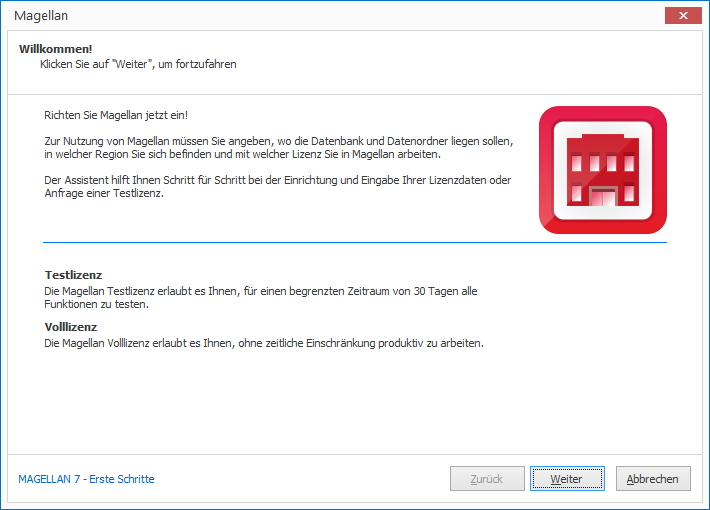

Klicken Sie auf „Weiter“. Um Magellan starten zu können, müssen Sie Ihre Lizenzdaten für eine Vollversion oder eine Testlizenz eingeben.
Unten links im Fenster können Sie über den Link ["MAGELLAN 7 - Erste Schritte"](https://doc.magellan7-kb.stueber.de/erste-schritte-in-magellan.html) ein Infoblatt aufrufen, dass Ihnen die ersten Schritte von einer Beispieldatenbank zu einer Datenbank mit Ihren Realdaten beschreibt.

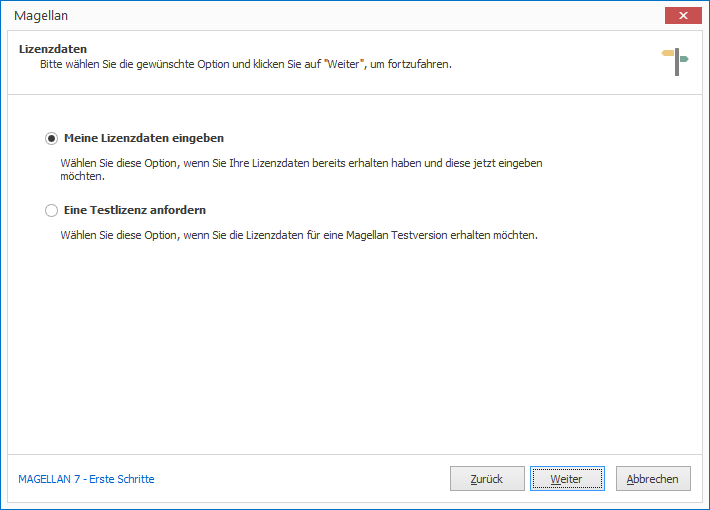

Wählen Sie „Eine Testlizenz anfordern“ und klicken Sie dann auf „Weiter“, wenn Sie noch keine Lizenzdaten besitzen. Die Lizenzdaten können Sie dann mit Hilfe des Assistenten per E-Mail direkt anfordern oder als Textdatei speichern, falls Sie keinen E-Mailzugang besitzen.

Wenn Sie Ihre Lizenzdaten erhalten haben, wählen Sie „Meine Lizenzdaten eingeben“ und klicken Sie dann auf „Weiter“. Tragen Sie nun Ihre Lizenzierung ein. Sollten Sie mit Ihren Lizenzdaten auch eine Lizenzdatei erhalten haben, so können Sie diese alternativ über „Lizenz importieren“ einlesen. Klicken Sie dann auf „Weiter“.

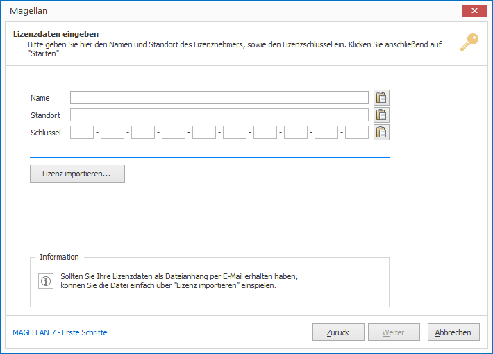

Wählen Sie hier Ihre Region (Bundesländer, Auslandsschulen, Schweiz oder Deutschland möglich) aus und klicken dann auf „Weiter“.

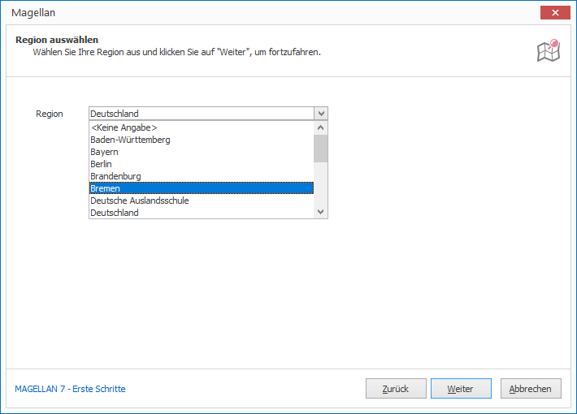

Bei einer Server-/Einzelplatzinstallation sind die Pfade für die Datenordner, die Datenbank und den Server schon korrekt vorbefüllt, bitte ändern Sie hier nichts.

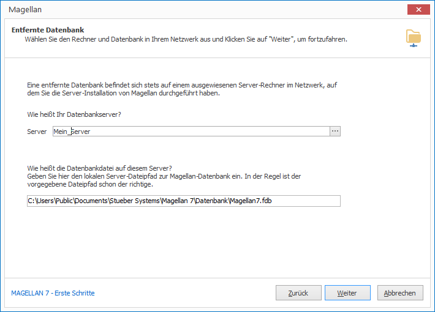

Für die Verbindungsinformationen geben Sie jetzt bitte noch einen Standardablageort für zukünftige Sicherungen an. Eine Sicherung Ihrer Datenbank kann über das Modul MAGELLAN ADMINISTRATOR auch von einer Arbeitsplatzinstallation aus ausgelöst werden, allerdings wird die Sicherung immer auf dem Rechner erstellt werden, auf die Datenbank sich befindet - das sollte Ihr Serverrechner sein. Bitte geben Sie den Netzwerkpfad zu Ihrem Server aus Sicht Ihres Rechners ein!

!!! info "Hinweis"

    Sollten Sie andere Speicherorte wünschen, stellen Sie bitte sicher, dass die Zielverzeichnisse auch existieren. Die Sicherung der Datenbank oder auch das Wiederherstellen einer neuen Datenbank aus einer Sicherungskopie können Sie über das Modul MAGELLAN ADMINISTRATOR auslösen.

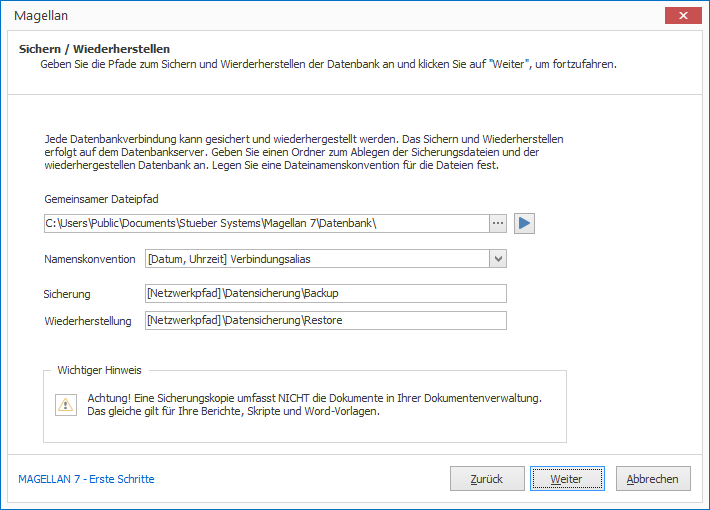

Bestätigen Sie mit "Weiter", es erscheint eine Informationsseite, die Ihnen kurz die Schritte aufzeigt, die von der Datenbank mit Beispieldaten zu einer Datenbank mit Realdaten führen.

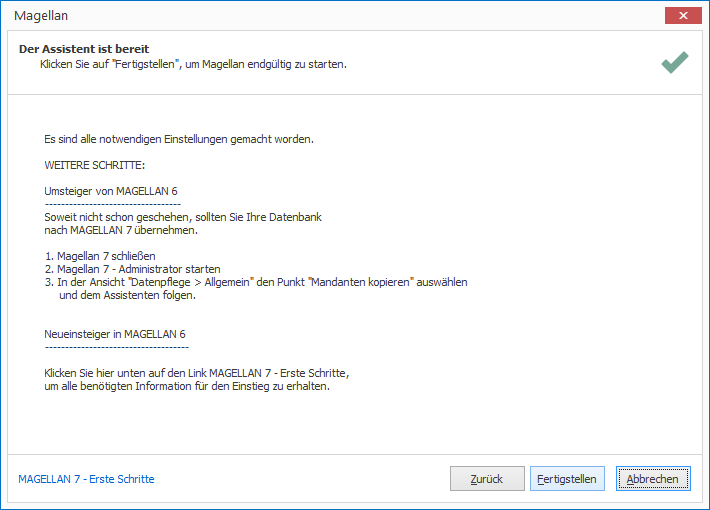

Bestätigen Sie mit „Weiter“, es erscheint das Anmeldefenster von MAGELLAN. Geben Sie im Anmeldedialog bei Benutzer „sysdba“ und als Kennwort „masterkey“ ein. Die Einrichtung Ihres Servers oder Ihres Arbeitsplatzes ist fertig!

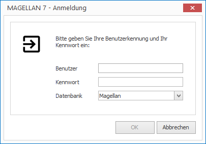

## Umstieg von MAGELLAN 6 nach MAGELLAN 7

!!! info "Hinweis"

    Nach einer Neuinstallation einer Server-/Einzelplatzinstallation liegen im Verzeichnis Datenbank eine leere Datenbank (MAGELLAN7.fdb) und eine Beispieldatenbank (MAGELLAN7_Beispiel.fdb). Wenn Sie MAGELLAN gern testen möchten, verweisen Sie bitte auf die Beispieldatenbank. Wenn Sie Ihre Daten gern importieren möchten oder aus Ihrer MAGELLAN6.fdb übernehmen möchten, verweisen Sie bitte auf die MAGELLAN7.fdb. Eine Anleitung zur Datenübernahme von MAGELLAN 6 nach MAGELLAN 7 finden Sie im Abschnitt ["Daten aus MAGELLAN 6 nach MAGELLAN 7 übernehmen"](https://doc.magellan7.stueber.de/installation/umstieg-von-6-auf-7.html#daten-aus-magellan-6-nach-magellan-7-%C3%BCbernehmen).