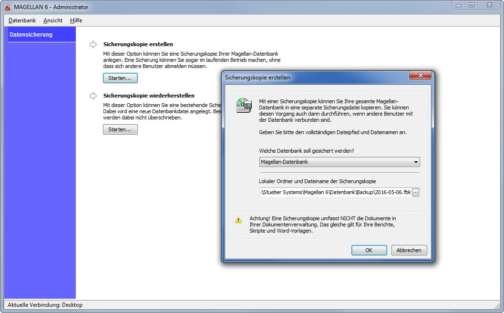

# Update von Firebird 2.1 auf Firebird 2.5.5
 
MAGELLAN 6 wurde bis zur Version 6.0.68 mit Firebird 2.1 ausgeliefert. Aktuell setzt MAGELLAN 6 mit Firebird 2.5 eine neuere Version des Datenbank-Management-Systems voraus. Setzen Sie noch die Version 2.1 ein, müssen Sie vor dem Update von Magellan noch einige Schritte  ausführen.

Bitte folgen Sie diesen Schritten:

1. Setzen Sie  im MAGELLAN-Administrator das Administratorenkennwort auf „masterkey“ zurück. Sie finden die Möglichkeit dazu unter dem Punkt "Datenbank | Administratoren-Kennwort".

2. Um die Kennwortdaten unter Firebird 2.1 zu sichern, wählen Sie bitte den Punkt "Datensicherung | Sicherungskopie erstellen | Starten". Wählen Sie „Firebird Sicherheitsdatenbank 2.1/2.5“ und geben im unteren Feld einen Pfad und Namen für die Sicherung an. Die Endung ``*.fbk`` wird automatisch ergänzt. Möchten Sie die Sicherung der Sicherheitsdatenbank im Programmordner der Firebird-Installation vornehmen wählen Sie bitte folgende Pfade: Für 32-Bit-Betriebssysteme ``C:\Program Files\Firebird\Firebird_2_1`` und für 64-Bit-Betriebssysteme ``C:\Program Files (x86)\Firebird\Firebird_2_1``.
 
3. Deinstallieren Sie bitte Firebird 2.1 (analog dem Kapitel „Deinstallation von Firebird 1.5“)

4. Laden Sie die aktuelle Version von Firebird herunter: [Download Firebird 2.5.5](ftp://ftp.stueber.de/pub/bin/de/magellan/v6/Firebird-2.5.5.26952_0_Win32.exe)

5. Starten Sie die Installation per Doppelklick auf das Installationspaket. Folgen Sie dem Installationsassistenten.

7. Melden Sie sich als sysdba am Magellan-Administrator an und erstellen unter `Datenbanksicherung > Sicherungskopie erstellen` eine Sicherung der Datenbank. Der Speicherort der Sicherung muss sich auf dem Rechner befinden, auf dem sich Ihre Magellan-Datenbank befindet. Wir empfehlen die Sicherung im Verzeichnis Datenbank > Backup zu erstellen und als Dateinamen das Tagesdatum zu verwenden.

6. Stellen Sie anschließend aus der Sicherung eine neue Datenbank wiederher, verwenden Sie dafür den Punkt `Datenbanksicherung > Sicherungskopie wiederherstellen`. Sie können mit der neuen Datenbank nicht Ihre aktuelle Datenbank überschreiben, verwenden Sie bitte einen neuen Datennamen.

7. Tauschen Sie bitte die aktuelle Datenbank gegen die mit der aktuellen Firebirdversion wiederhergestellte Datenbank aus. Stoppen Sie den laufenden Firebirdserver unter `Start > Systemsteuerung > Verwaltung > Dienste > Firebird-Server > Rechtsklick > Beenden`. Benennen Sie die aktuelle Datenbank um (z.B. in alt_Magellan6.fdb) und geben der wiederhergestellten Datenbank den bisherigen Datenbanknamen.Starten Sie den Firebirdserver unter `Start > Systemsteuerung > Verwaltung > Dienste > Firebird-Server > Rechtsklick > Neu starten`. Anschließend starten Sie Magellan und folgen bitte dem Assistenten zur Datenstrukturanpassung.  

5. Rufen Sie im Administrator den Punkt "Datenbankpflege | Firebird 1.5/Firebird 2.1 Sicherheitsdatenbank konvertieren" auf.
 
6. Wählen Sie im Feld Format „Firebird 2.1 Sicherheitsdatenbank“ aus. Im Feld Datenbank wird eine Pfad vorgeschlagen. Wird der Pfad rot angezeigt, befindet sich dort keine entsprechende Datei. Bitte verweisen Sie hier auf die zuvor erstellte Sicherung, tragen das Kennwort „masterkey“ und starten den Assistenten. Der Assistent kopiert aus der Firebird 2.1 Sicherheitsdatenbank die Benutzerdaten in die neue Firebird 2.5 Sicherheitsdatenbank. Anschließend können sich Ihre Benutzer mit den gewohnten Zugangsdaten wieder an MAGELLAN anmelden.
 