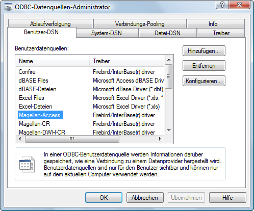
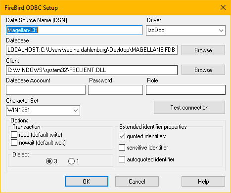

# Access-Anbindung von MAGELLAN

## MAGELLAN und Microsoft Access

Auf die MAGELLAN-Datenbank können Sie auch über Microsoft Access zugreifen, um beispielsweise Daten über Microsoft zu importieren oder eigene Microsoft Access Berichte zu verwenden.
Hierzu müssen Sie auf Basis einer ODBC-Verbindung eine Verknüpfung zwischen Access und der MAGELLAN-Datenbank herstellen, um mit Access auf die MAGELLAN-Daten zugreifen zu können.
Das Problem
Beim Erstellen der Verknüpfungen zu der Tabelle „Schue-ler“ unter Microsoft Access erhalten Sie von Access die Rückmeldung, dass eine Verknüpfung nicht möglich ist. 
Die Tabelle „Schueler“ enthält mehr als 32 Datenbankindizes. Microsoft Access kann maximal 32 Datenbankindizes verarbeiten. Eine Verknüpfung über den von uns  mitgelieferten aktuellen Firebird Open Source Treiber erzeugt daher die korrekte Fehlermeldung.

## Die Lösungen

Zur Lösung haben Sie zwei Möglichkeiten:

Lösung A: Sie können in der MAGELLAN-Datenbank an-stelle der Tabelle „Schueler“ das View „Schueler2“ verwenden. Beim Verknüpfen von Views werden in Access keine Indizes erzeugt, so dass es keine Probleme mehr gibt.

Lösung B: Alternativ können Sie einen anderen ODBC-Treiber für Firebird verwenden (z.B. von der Firma Easysoft, www.easysoft.com), der dieses Problem der begrenzten Datenbankindizes unter Access umgeht, wenn Sie unbedingt auf die Tabelle „Schueler“ zugreifen wollen. 

Im Rahmen der Weiterentwicklung des mitgelieferten Open Source ODBC-Treiber für Firebird kann das Problem des Zugriffs auf die Tabelle „Schueler“ eventuell behoben sein.

Die Verknüpfung einer leeren Accessdatenbank mit der Firebirddatenbank beschreiben wir nachfolgend:

## Access-Anbindung an die Firebird-Datenbank

### Grundlagen

Möchten Sie Bescheinigungen, Listen oder Zeugnisse drucken, so bietet Ihnen MAGELLAN standardmäßig die Ausdruckmöglichkeit über Crystal Reports an. 
Alternativ können Sie auch Abfragen oder Berichte unter Microsoft Access erstellen. Hierzu müssen Sie auf Basis einer ODBC-Verbindung eine Verknüpfung zwischen Access und der Firebird-Datenbank herstellen, um mit Access auf die Daten zugreifen zu können. Für Access müssen die folgenden Schritte berücksichtigen, die in den nachfolgenden Abschnitten dieses Kapitels ausführlich erläutert werden:

| Nr. | Schritt                                  |
|-----|------------------------------------------|
| 1.  | Erstellen einer ODBC-Verbindung zu Firebird-Datenbank |
| 2.  | Ein neue Access-Datenbank anlegen        |
| 3.  | Berichte erstellen                       |

!!! warning "Wichtig"

    Um einen unbefugten Zugriff per Access auf die MAGELLAN-Datenbank zu verhindern, muss auf die Anzahl der Benutzer von Access bereits über das Betriebssystem eingeschränkt werden.

### 1. Schritt: ODBC-Verbindung zur Firebird-Datenbank erstellen

Um eine ODBC-Verbindung zu erstellen, müssen Sie über die Systemsteuerung Ihres Rechners eine neue ODBC-Datenquelle einrichten.

Unter Windows NT/Windows 2000 gehen Sie dazu wie folgt vor:

| Nr. | Schritt                            |
|-----|------------------------------------|
| 1.  | Öffnen Sie das Windows-Startmenü.  |
| 2.  | Klicken Sie auf Systemsteuerung.   |
| 3.  | Klicken Sie auf Verwaltung.        |
| 4.  | Klicken Sie auf Datenquellen ODBC. |

Unter Windows 95/98/ME gehen Sie dazu wie folgt vor:

| Nr. | Schritt                                  |
|-----|------------------------------------------|
| 1.  | Öffnen Sie das Windows-Startmenü.        |
| 2.  | Klicken Sie auf Systemsteuerung.         |
| 3.  | Klicken Sie auf ODBC Datenquellen 32-Bit. |

Im Dialogfenster „ODBC-Datenquellen-Administrator“ können Sie nun unterschiedliche Möglichkeiten wählen, um eine ODBC-Verbindung aufzubauen.

#### Benutzerabhängige ODBC-Datenquelle

Bei der benutzerabhängigen ODBC-Datenquelle wird die Einrichtung pro Benutzer abgespeichert. Sie müssen pro MAGELLAN-Benutzer auf dem Rechner die Einrichtung vornehmen. Sie haben den Vorteil, dass Sie in diesem Fall auch die in MAGELLAN eingetragenen Kennungen direkt mit abspeichern können. Beim Aufruf der Access-Berichte müssen Sie dann nicht mehr die Kennungen pro Benutzer ändern.

| Nr. | Schritt                                  |
|-----|------------------------------------------|
1. |Klicken Sie im Dialogfenster ODBC-Datenquellen-Administrator auf die Registerkarte Benutzer-DSN.

2. |Klicken Sie auf Hinzufügen.

3.| Wählen Sie im Dialogfenster Neue Datenquelle erstellen den Namen „Firebird/InterBase(r) driver“ aus und klicken Sie dann auf Fertigstellen.

4. |Füllen Sie im Dialogfenster „Firebird ODBC Setup“ mindestens die nachfolgenden Felder aus.

| Feld                  | Eintrag                                  |
|-----------------------|------------------------------------------|
| **DSN:**              | Geben Sie hier eine freie festzulegenden Namen für Ihre ODBC-verbindung an. Für die weiteren Betrachtungen wählen wir hier die Bezeichnung „MAGELLANAccess“. |
| **Database:**         | Hier geben Sie den lokalen Pfad der MAGELLAN-Datenbank an, analog zur Installation von MAGELLAN. Dies ist entweder der lokale Pfad der MAGELLAN-Datenbank auf Ihrem Einzelplatzrechner (z.B. LOCALHOST:C:\Users\Public\Documents\Stueber Software\MAGELLAN 6\Datenbank\MAGELLAN6.fdb) oder der lokale Pfad des Servers inkl. Servernamen der MAGELLAN-Datenbank auf einer Arbeitsstation im Netzwerk (z.B. MeinServer: C:\Users\Public\Documents\Stueber Software\MAGELLAN 6\Datenbank\MAGELLAN6.fdb) |
| **Client:**           | Hier geben Sie bitte den folgenden Pfad zur Treiberdatei fbclient.dll an (C:\WINDOWS\system32\fbclient.dll) |
| **Database Account:** | Hier können Sie einen Benutzer aus der Benutzerverwaltung von MAGELLAN angeben. Standardmäßig ist dies „sysdba“. Geben Sie hier keinen Wert an, werden Sie beim ersten Aufruf eines Access-Berichtes aus MAGELLAN automatisch nach dem Benutzer gefragt. |
| **Password:**         | Hier können Sie ein zum Benutzer passendes Kennwort aus der Benutzerverwaltung von MAGELLAN angeben, der das Recht zum Drucken hat. Standardmäßig ist dies „masterkey“ für den Benutzer „sysdba“. Geben Sie hier keinen Wert an, werden Sie beim ersten Aufruf eines Access-Berichtes aus MAGELLAN automatisch nach dem Kennwort gefragt. |
| **Character Set:**    | Hier müssen Sie den Zeichensatz WIN1251 einstellen. |

### 2. Schritt: Neue Access-Datenbank anlegen

Nachdem Sie die ODBC-Verbindung im ersten Schritt erstellt haben, müssen Sie jetzt eine Access-Datenbank anlegen, welche mit der neuen ODBC-Verbindung eine Verknüpfung zur MAGELLAN-Datenbank aufbaut. Die Vorgehensweise wird exemplarisch unter Microsoft Access 2000 vorgestellt:

| Nr. | Schritt                                  |
|-----|------------------------------------------|
| 1.  | Starten Sie Microsoft Access.            |
| 2.  | Klicken Sie auf `Datei` und dann auf `Neu`. |
| 3.  | Wählen Sie im Dialog `Neu` auf der Registerkarte `Allgemein `die Option `Datenbank` und klicken Sie dann auf `OK`. |
| 4.  | Speichern Sie die neue Datenbank unter einem Namen ab, z.B. unter` C:\Stueber Software\MAGELLAN 6\Datenbank\MAGELLAN6.mdb`. |
| 5.  | Wählen Sie unter `Objekte `den Bereich `Tabellen`. Hier sind noch keine Tabellen eingetragen. |
| 6.  | Klicken Sie im weißen Bereich der Anzeigefläche der Tabellen auf die rechte Maustaste und klicken Sie dann auf `Tabellen verknüpfen`. |
| 7.  | Wählen Sie im Dialogfenster `Verknüpfen `den Dateityp `ODBC Databases ()` aus. |
| 8.  | Wählen Sie im Dialogfenster `Datenquelle `auswählen die neu definierte Datenquelle `MAGELLANAccess` auf der Registerkarte `Computerdatenquellen` aus. |
| 9.  | Im Dialogfenster `Tabellen verknüpfen` werden Ihnen jetzt alle Tabellen der MAGELLAN-Datenbank zur Auswahl angeboten. Markieren Sie hier durch Mehrfachmarkierung alle Tabellen, die nicht den Präfix „tbl“ (z.B. tblLehrer) besitzen. Wenn Sie das Kennwort der ODBC-Verbindung nicht bei jedem Aufruf eines Access-Berichts später eingeben wollen, müssen Sie zusätzlich das Optionsfeld `Kennwort speichern` anwählen. Klicken Sie abschließend auf `OK`. |

Während der Erstellung der Tabellenverknüpfungen werden Sie bei einigen Tabellen aufgefordert, eindeutige Datensatzbezeichner auszuwählen. Hier können Sie jeweils auf `Abbrechen `klicken, da diese Einstellungen für das Drucken nicht relevant sind.

Die Access-Datenbank MAGELLAN6.mdb ist jetzt erstellt und besitzt über die Tabellen einen direkten Zugriff auf die originale Firebird MAGELLAN-Datenbank MAGELLAN6.fdb.

!!! warning "Wichtig"

    Beim Erstellen der Verknüpfungen zu der Tabelle „Schueler“ unter Microsoft Access erhalten Sie von Access die Rückmeldung, dass eine Verknüpfung nicht  möglich ist. Die Tabellen „Schueler“ und „Lehrer“ enthalten mehr als 32 Datenbankindizes. 
    Microsoft Access kann maximal 32 Datenbankindizes verarbeiten. Eine Verknüpfung über den von uns mitgelieferten aktuellen Firebird Open Source Treiber erzeugt daher die korrekte Fehlermeldung. Sie können in der MAGELLAN-Datenbank anstelle der Tabellen „Schueler“ bzw. „Lehrer“ das View „Schueler2“ bzw. „Lehrer2“ verwenden. 
     Beim Verknüpfen von Views werden in Access keine Indizes erzeugt, so dass es keine Probleme mehr gibt. Die beiden View „Schueler2“ bzw. „Lehrer2“ verweisen auf alle Felder der Tabelle „Schueler“ bzw. „Lehrer“.

### 3. Schritt: Berichte in der Access-Datenbank anlegen

In der neu erzeugten Access-Datenbank können Sie jetzt entsprechende Abfragen oder Berichte erstellen. Grundlage für die Erstellung ist die MAGELLAN-Datenbankstruktur, welche ausführlich im elektronischen Dokument „MAGELLAN-Datenstruktur“ beschrieben ist. Den Link können Sie unter support@stueber.de anfordern. Zur Erstellung von Berichten unter Access ist auf die umfangreiche Literatur zum Thema Access zu verweisen.

