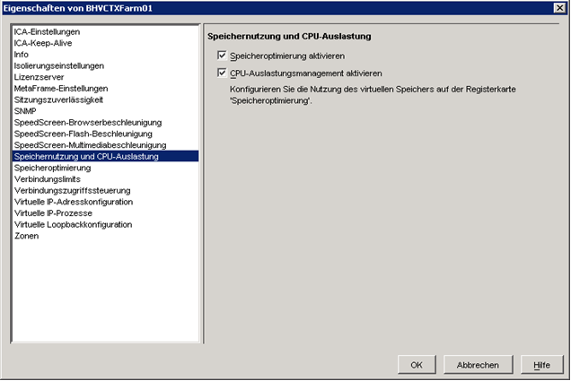

# MAGELLAN und Citrix

MAGELLAN ist unter Citrix bzw. Terminalserver lauffähig.
Dieses Infoblatt ist für Sie nur relevant, wenn Sie MAGELLAN unter Citrix einrichten möchten. Es behandelt zwei typische Probleme und deren Lösungen:

## Problem A: Keine Verbindung zur Datenbank

Bei der Server-, Einzelplatz- oder Arbeitsplatzinstallation von MAGELLAN unter Citrix (z.B. Citrix Presentationserver) führt die Angabe einer lokalen Verbindung zur MAGELLAN-Datenbank immer zu einer fehlerhaften Verbindung.
 
Der Fehler liegt hierbei in der Wahl des Protokolls „Lokal“. Unter Citrix müssen Sie immer die eindeutige Kennung im Netzwerk wählen, typischerweise über das Netzwerkprotokoll „TCP/IP“

### Lösung zu Problem A
Wählen Sie unter Citrix grundsätzlich eine Netzwerkverbindung bei der Server-, Einzelplatz oder Arbeitsplatzinstallation von MAGELLAN.
Gehen Sie dazu wie folgt vor:

1.	Öffnen Sie den MAGELLAN::Administrator.
2.	Wählen Sie „Ansicht|Server-Verwaltung|Verbindung verwalten“.
3.	Markieren Sie die gewünschte Verbindung und klicken Sie dann auf „Bearbeiten“.
4.	Wählen Sie auf der Registerkarte „Datenbank“ das Netz-werkprotokoll (z.B. „TCP/IP“), den Servernamen und die lokalen Dateipfad auf dem Server aus. 

Diese Einstellungen der Verbindung zur Datenbank können Sie auch analog direkt über den Willkommensassistent bei der Installation vornehmen.

## Problem B: Unregelmäßiger Abbruch beim Drucken

Beim Drucken von Berichten stürzt MAGELLAN unregelmäßig auf dem Citrixserver ab. Nach einer Neuinstallation von MAGELLAN kommt es nach einer gewissen Zeit wieder zum Absturz von MAGELLAN auf dem Citrixserver. 
Der Fehler liegt an der nachfolgend abgebildeten optional einstellbaren Optimierung von Speicher und CPU unter Citrix. 
 
MAGELLAN ist eine Anwendung, die nicht mit dieser Optimierung genutzt werden kann.

### Lösung zu Problem B

Bei der Speicheroptimierung unter Citrix können bestimmte Anwendungen von der Optimierung ausgeschlossen werden. 
Sie müssen dazu MAGELLAN als eine von der Optimierung ausgeschlossene Anwendung definieren, wie die nachfolgende Abbildung zeigt
 
 
 
Tragen Sie dazu unter 'Speicheroptimierung > Anwendungen ausschließen' den lokalen Pfad zur Datei „MAGELLAN.exe“ auf dem Citrixserver ein (in der Abbildung als „D:\Stueber Systems\MAGELLAN 6\MAGELLAN.exe“).

## Problem C: Installationpaket konnte nicht geöffnet werden

Dieses Installationspaket konnte nicht geöffnet werden. Lassen Sie den Hersteller der Anwendung überprüfen, ob es sich um ein gültiges Windows Installer-Paket handelt.

### Tipp

Erfahrungsgemäß sind folgende Lösungsansätze am Erfolgreichsten:

* _Mögliche Lösungen: 2._

* _Deaktivieren Sie für die Installation das Antivirus Programm_

und könnten somit am ehesten zum Erfolg führen, wenn nicht gehen Sie bitte die gesamte
Anleitung wie beschrieben durch.

### Mögliche Ursachen

Der Fehler kann verschiedene Gründe haben:

* Die Datei wurde beim Download beschädigt.
* Es wird versucht die Installation aus einem Netzwerklaufwerk heraus auszuführen und nicht auf dem lokalen Computer.
* Der ausführende Windows-Benutzer besitzt keine Administratoren Rechte.
* Ein Antivirus Programm blockiert die Installation.
* Windows Installer Problem.
* Ein Registry-Eintrag blockiert die Installation.

### Mögliche Lösungen zu Problem C

1. Laden Sie Magellan erneut herunter. Speichern Sie die Installation lokal auf dem auszuführenden Rechner.

2. Sobald die Datei lokal auf Ihrem Rechner liegt, führen Sie einen Rechtsklick mit der Maus darauf aus und wählen Sie Eigenschaften. Im Dialogfenster Eigenschaften, klicken Sie auf entsperren (o.ä., wenn Schaltfläche vorhanden).

3. Stellen Sie sicher, dass Sie mit einem Benutzerkonto mit Administrator Rechten angemeldet sind.

4. Führen Sie einen Doppelklick auf die Datei aus, um die Installation zu starten. 
 
Sollte dies fehlschlagen, gehen Sie wie folgt vor:

### Deaktivieren Sie für die Installation das Antivirus Programm

TSR (Terminate and Stay Resident) Programme, wie Norton AntiVirus, können den Installationsprozess blockieren. Deaktivieren Sie das Antivirus Programm und führen Sie die Installation erneut aus. 

Sollte dies fehlschlagen, gehen Sie wie folgt vor:

### Überprüfen Sie den Windows Installer

Der Windows Installer Dienst verwaltet (hinzufügen, modifizieren und löschen) jede Applikation die mit einem .msi Paket installiert wird. Ist dieser Dienst deaktiviert, schlägt jeder weitere darauf aufbauende Dienst fehl.

#### Überprüfen und ggf. aktivieren Sie den Windows Installer wie folgt:

1. Klicken Sie die `Windowstaste + R`, geben Sie `Services.msc` in das Eingabefeld ein und bestätigen Sie mit `Enter`.

2. Finden Sie im Dialogfenster `Dienste` in der Liste den Windows Installer Dienst. Führen Sie ein Rechtsklick auf den Eintrag aus und wählen Sie `Eigenschaften`.

3. Wählen Sie in der Auswahlliste `Starttyp` den Wert `Automatisch` aus und klicken Sie auf `Starten`.

4. Führen Sie die Installation erneut aus. Erhalten Sie weiterhin die gleiche Fehlermeldung, könnte der Windows Installer Dienst fehlerhaft sein. 

5. Laden und installieren Sie die aktuelle Windows Installer Version: http://www.microsoft.com/en-us/download/details.aspx?id=8483

6. Führen Sie die Installation erneut aus.

### Überpüfen Sie die Registry

1. Öffnen Sie den Registry-Editor:

  #### Windows 8:

    1. Öffnen Sie das Windows Startmenü.
    2. Geben Sie **REGEDIT** ein (dieser wird ihnen auf der Suchseite dargestellt).
    3. Bestätigen Sie mit `Enter`.

  #### Windows 7

    1. Auf der Taskleiste klicken Sie auf die `Start`-Schaltfläche.
    2. Direkt über Start geben Sie in das Eingabefeld **REGEDIT** ein.
    3. Bestätigen Sie mit `Enter`.

2. Bestätigen Sie ggf. eine Benutzerrechtsanfrage.

3. Browsen Sie zum Schlüssel `HKEY_LOCAL_MACHINE\SYSTEM\CurrentControlSet\Control\FileSystem`. Dies machen Sie, indem Sie auf das Dreieck oder Plus-Zeichen neben jedem Listeneintrag klicken, bis Sie auf `FileSystem` gelangen.

4. Klicken Sie auf `FileSystem`, um dessen Inhalte im Rechten Bereich des Editors anzuzeigen

5. Wenn der Wert für 
  
  * **NtfsDisable8dot3NameCreation** DWORD 
  * **theWin31FileSystem** DWORD 

  nicht 0 ist, führen Sie einen Rechtsklick auf `DWORD` aus, wählen Sie `Bearbeiten` aus und setzen Sie den Wert auf "0".

6. Nach dem Schließen des Registry-Editor führen Sie die Installation erneut aus.

