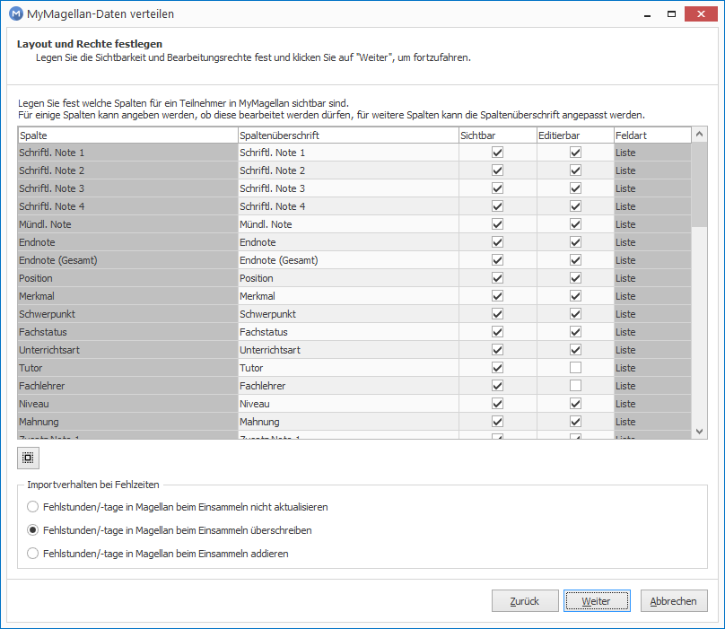

# Importlogik

Nachstehend wird beschrieben was genau beim Import passiert, falls Daten in MAGELLAN und/oder in in MyMAGELLAN vorhanden sind.

!!! warning "Wichtig"

	Bitte ändern Sie in MAGELLAN keine Verzeichniswerte oder Daten auf der Unterkarte `Schüler > Zeugnis` solange MyMAGELLAN-Dateien für die Kollegen verteilt wurden.
	 
	 

!!! warning "Wichtig"

	Zeugnisbemerkungen werden nur von Klassenleitern und Tutoren nach Magellan übernommen.

In der nachstehenden Tabelle zeigen wir welche Felder nicht editierbar sind. Sie können beim Erzeugen der Dateien jedes der Felder gezielt ausblenden, für ausgeblendete Daten wird kein Wert in die MyMAGELLAN-Datei gespielt und auch nichts wieder importiert.	

Feld | wahlweise  editierbar | wahlweise ausblendbar | Importverhalten
-- | -- | -- |--
Schriftl. Note 1 | JA | JA | siehe Abschnitt [Noten](https://doc.magellan7.stueber.de/mymagellancenter/importlogik/#noten)
Schriftl. Note 2 | JA | JA | siehe Abschnitt [Noten](https://doc.magellan7.stueber.de/mymagellancenter/importlogik/#noten)
Schriftl. Note 3 | JA | JA | siehe Abschnitt [Noten](https://doc.magellan7.stueber.de/mymagellancenter/importlogik/#noten)
Schriftl. Note 4 | JA | JA | siehe Abschnitt [Noten](https://doc.magellan7.stueber.de/mymagellancenter/importlogik/#noten)
Mündl. Note | JA | JA | siehe Abschnitt [Noten](https://doc.magellan7.stueber.de/mymagellancenter/importlogik/#noten)
Endnote | JA | JA | siehe Abschnitt [Noten](https://doc.magellan7.stueber.de/mymagellancenter/importlogik/#noten)
Endnote(Gesamt) | JA | JA | siehe Abschnitt [Noten](https://doc.magellan7.stueber.de/mymagellancenter/importlogik/#noten)
Position | JA |JA
Merkmal | JA |JA
Schwerpunkt | JA |NEIN
Fachstatus | JA |JA
Unterrichtsart | JA |JA
Tutor | JA |NEIN
Fachlehrer | JA |NEIN
Niveau | JA |JA
Mahnung | JA |JA
Zusatznote 1 | JA | JA | siehe Abschnitt [Noten](https://doc.magellan7.stueber.de/mymagellancenter/importlogik/#noten)
Zusatznote 2 | JA | JA | siehe Abschnitt [Noten](https://doc.magellan7.stueber.de/mymagellancenter/importlogik/#noten)
Zusatznote 3 | JA | JA | siehe Abschnitt [Noten](https://doc.magellan7.stueber.de/mymagellancenter/importlogik/#noten)
Zusatznote 4 | JA | JA | siehe Abschnitt [Noten](https://doc.magellan7.stueber.de/mymagellancenter/importlogik/#noten)
Zusatznote 5 | JA | JA | siehe Abschnitt [Noten](https://doc.magellan7.stueber.de/mymagellancenter/importlogik/#noten)
Zusatznote 6 | JA | JA | siehe Abschnitt [Noten](https://doc.magellan7.stueber.de/mymagellancenter/importlogik/#noten)
Zusatznote 7 | JA | JA | siehe Abschnitt [Noten](https://doc.magellan7.stueber.de/mymagellancenter/importlogik/#noten)
Zusatznote 8 | JA | JA | siehe Abschnitt [Noten](https://doc.magellan7.stueber.de/mymagellancenter/importlogik/#noten)
Zusatznote 9 | JA | JA | siehe Abschnitt [Noten](https://doc.magellan7.stueber.de/mymagellancenter/importlogik/#noten)
Beurteilung | JA |siehe Abschnitt [Beurteilungen](https://doc.magellan7.stueber.de/mymagellancenter/importlogik/#beurteilungen)
Vornote | JA | JA | siehe Abschnitt [Noten](https://doc.magellan7.stueber.de/mymagellancenter/importlogik/#noten)
Vergessene Hausaufgaben | JA |JA
Vergessene Arbeitsmaterialien | JA |JA
Personalnummer | JA |JA
Abschluss 1 | JA |JA|siehe Abschnitt [Zeugnisdaten](https://doc.magellan7.stueber.de/mymagellancenter/importlogik/#zeugnisdaten)
Abschlussart 1 | JA |JA |siehe Abschnitt [Zeugnisdaten](https://doc.magellan7.stueber.de/mymagellancenter/importlogik/#zeugnisdaten)
Vergessene Hausaufgaben | JA |JA
Abschlussdatum 1 | JA |JA |siehe Abschnitt [Zeugnisdaten](https://doc.magellan7.stueber.de/mymagellancenter/importlogik/#zeugnisdaten)
Abschlussnote 1 | JA |JA |siehe Abschnitt [Zeugnisdaten](https://doc.magellan7.stueber.de/mymagellancenter/importlogik/#zeugnisdaten)
Abschluss 2 | JA |JA |siehe Abschnitt [Zeugnisdaten](https://doc.magellan7.stueber.de/mymagellancenter/importlogik/#zeugnisdaten)
Abschlussart 2 | JA |JA |siehe Abschnitt [Zeugnisdaten](https://doc.magellan7.stueber.de/mymagellancenter/importlogik/#zeugnisdaten)
Abschlussdatum 2 | JA |JA |siehe Abschnitt [Zeugnisdaten](https://doc.magellan7.stueber.de/mymagellancenter/importlogik/#zeugnisdaten)
Abschlussnote 2 | JA |JA |siehe Abschnitt [Zeugnisdaten](https://doc.magellan7.stueber.de/mymagellancenter/importlogik/#zeugnisdaten)
Versetzt | JA |JA |siehe Abschnitt [Zeugnisdaten](https://doc.magellan7.stueber.de/mymagellancenter/importlogik/#zeugnisdaten)
Versetzungsart | JA |JA |siehe Abschnitt [Zeugnisdaten](https://doc.magellan7.stueber.de/mymagellancenter/importlogik/#zeugnisdaten)
Zeugniskonferenz | JA |JA |siehe Abschnitt [Zeugnisdaten](https://doc.magellan7.stueber.de/mymagellancenter/importlogik/#zeugnisdaten)
Zeugnisdatum | JA |JA |siehe Abschnitt [Zeugnisdaten](https://doc.magellan7.stueber.de/mymagellancenter/importlogik/#zeugnisdaten)
Verhalten | JA |JA | siehe Abschnitt [Noten](https://doc.magellan7.stueber.de/mymagellancenter/importlogik/#noten)
Mitarbeit | JA |JA | siehe Abschnitt [Noten](https://doc.magellan7.stueber.de/mymagellancenter/importlogik/#noten)
Unterrichtstage | JA |JA | siehe Abschnitt [Fehlzeiten](https://doc.magellan7.stueber.de/mymagellancenter/importlogik/#fehlzeiten)
Versäumnisse | JA |JA| siehe Abschnitt [Fehlzeiten](https://doc.magellan7.stueber.de/mymagellancenter/importlogik/#fehlzeiten)
Fehltage | JA |JA| siehe Abschnitt [Fehlzeiten](https://doc.magellan7.stueber.de/mymagellancenter/importlogik/#fehlzeiten)
Versäumnisse | JA |JA| siehe Abschnitt [Fehlzeiten](https://doc.magellan7.stueber.de/mymagellancenter/importlogik/#fehlzeiten)
Fehltage (unentschuldigt) | JA |JA| siehe Abschnitt [Fehlzeiten](https://doc.magellan7.stueber.de/mymagellancenter/importlogik/#fehlzeiten)
Fehlstunden | JA |JA| siehe Abschnitt [Fehlzeiten](https://doc.magellan7.stueber.de/mymagellancenter/importlogik/#fehlzeiten)
Fehlstunden (unentschuldigt) | JA |JA| siehe Abschnitt [Fehlzeiten](https://doc.magellan7.stueber.de/mymagellancenter/importlogik/#fehlzeiten)
Fehltage Praktikum | JA |JA| siehe Abschnitt [Fehlzeiten](https://doc.magellan7.stueber.de/mymagellancenter/importlogik/#fehlzeiten)
Fehltage Praktikum (unentschuldigt) | JA |JA| siehe Abschnitt [Fehlzeiten](https://doc.magellan7.stueber.de/mymagellancenter/importlogik/#fehlzeiten)
Leistungsanforderung | JA |JA | siehe Abschnitt [Zeugnisdaten](https://doc.magellan7.stueber.de/mymagellancenter/importlogik/#zeugnisdaten)

## Fachlehrer, Tutor, Schwerpunkt

Die Inhalte dieser Felder werden nur für eine einfachere Sortierung nach MyMAGELLAN übertragen, es ist keine Änderung dieser Inhalte über MyMAGELLAN möglich.

## Noten

Stand in MAGELLAN/MyMAGELLAN |Was passiert beim Import?
---|---
Note ist in MAGELLAN /keine Note in MyMAGELLAN| Note in MAGELLAN bleibt bestehen
Note ist nicht in MAGELLAN, Note ist in MyMAGELLAN| Note aus der MyMAGELLAN-Datei wird eingelesen
Noten sind in beiden Programmen|Note aus MyMAGELLAN wird eingelesen

!!! info "Hinweis"

	Das bedeutet, wenn in MAGELLAN eine Note besteht, die Sie in der MyMAGELLAN-Datei entfernen, dann bleibt die Note weiterhin nach dem Einlesen in MAGELLAN bestehen.

## weitere Listenfelder

Stand in MAGELLAN/MyMAGELLAN |Was passiert beim Import?
---|---
Wert ist in MAGELLAN /kein Wert in MyMAGELLAN | Wert in MAGELLAN bleibt bestehen
Wert ist nicht in MAGELLAN, Wert ist in MyMAGELLAN | Wert aus der MyMAGELLAN-Datei wird eingelesen
Wert ist in beiden Programmen | Wert aus MyMAGELLAN wird eingelesen

!!! info "Hinweis"

	Das bedeutet, wenn in MAGELLAN ein Wert besteht, die Sie in der MyMAGELLAN-Datei entfernen, dann bleibt der Wert weiterhin nach dem Einlesen in MAGELLAN bestehen.

## Beurteilungen

Gemeint sind die Beurteilungen unter `Schüler > Zeugnis > Leistungen` im Feld `Beurteilungen`. Hier können zusätzlich zur Benotung (per Punkt- oder Notenwert) schriftliche Beurteilungen pro Fach erfolgen.

Stand in MAGELLAN/MyMAGELLAN |Ergebnis
---|---
Beurteilung ist in MAGELLAN /keine Beurteilung in MyMAGELLAN| Beurteilung in MAGELLAN bleibt bestehen
Beurteilung ist nicht in MAGELLAN, Beurteilung ist in MyMAGELLAN| Beurteilung aus der MyMAGELLAN-Datei wird eingelesen
Beurteilung sind in beiden Programmen|Beurteilung aus MyMAGELLAN wird eingelesen

!!! info "Hinweis"

	Beispiel: Sie verteilen die Daten für Fachlehrer und Klassenleiter gleichzeitig, es ist beispielsweise die Fachzeile für Mathematik eines Schülers in der Fachlehrerdatei und in der Klassenleiterdatei. **Die Eintragungen beider Rollen werden beim Import gleichwertig behandelt.** 
	Trägt nur einer der beiden in seine Datei eine Leistungsbeurteilung für Mathe ein, wird dessen Eintragung nach MAGELLAN importiert. 
	Tragen beide Kollegen (also der Fachlehrer und der Klassenlehrer tragen etwas für die Mathezeile ein) ein oder wurde bereits eine Eintragung in die MyMAGELLAN-Dateien exportiert, werden die Eingaben nacheinander importiert, die zuletzt importierte Information bleibt in MAGELLAN bestehen.   

## Zeugnisbemerkungen

Stand in MAGELLAN/MyMAGELLAN |Ergebnis
-|-
Bemerkung in MAGELLAN existiert, MyMAGELLAN-Datei wird erzeugt|Bemerkung wird mit in die MyMAGELLAN-Datei übergeben
Bemerkung wird in MyMAGELLAN aktualisiert Bemerkung wird in MAGELLAN neu angelegt|Bemerkungen werden beim Import in MAGELLAN gelöscht und durch aktualisierte oder neue Bemerkungen aus MyMAGELLAN ersetzt
Neue Bemerkung wird in MAGELLAN erfasst, während die MyMAGELLAN-Dateien ausgeteilt sind|Bemerkungen wird beim Import in MAGELLAN gelöscht und durch aktualisierte oder neue Bemerkungen ersetzt. Sind keine neuen Bemerkungen in MyMAGELLAN erfasst worden, können als Ergebnis auch KEINE Bemerkungen übrig bleiben.

!!! warning "Wichtig"

	Beim Erstellen der MyMAGELLAN-Dateien werden bereits in MAGELLAN existierende Zeugnisbemerkungen in die Lehrer-/Tutorendateien mit ausgegeben. 
	Um beim Import keine Dopplungen von Bemerkungen zu erzielen, werden beim Einlesen der Klassenleiterdatei und der Tutorendatei jeweils zuvor die Schülerzeugnisbemerkungen gelöscht. 
	Sollten einem Schüler ein Klassenleiter und ein Tutor zugeordnet worden sein, können damit je nach Einlesereihenfolge Zeugnisbemerkungen überschrieben werden.

Beispiel:

Schüler S1 wurden Lehrer L1 und Tutor T1 zugeordnet. Beim Erstellen der MyMAGELLAN-Dateien haken Sie versehentlich beide Rollen an, also Klassenleiter- und >Tutorendatei erstellen. 
Eventuell in MAGELLAN bereits existente Zeugnisbemerkungen werden für S1 ausgespielt. 
L1 vergibt eine neue Zeugnisbemerkung, T1 vergibt keine neue Zeugnisbemerkung. Die Dateien von L1 und T1 werden wieder importiert. 
 
Import der Datei von L1: Zeugnisbemerkungen werden für S1 gelöscht, neue und alte Zeugnisbemerkung werden aus der Datei von L1 importiert. 

Als nächstes wird die Datei für T1 importiert: die Zeugnisbemerkungen von S1 werden gelöscht (neue und alte reimportierte Zeugnisbemerkungen), nur die alten Zeugnisbemerkungen werden eingelesen. Im Ergebnis fehlen die neuen Zeugnisbemerkungen von L1. 
Sie können den Konflikt nur lösen, indem Sie entweder:

* entweder Schülern nicht einen Klassenleiter UND einen Tutor zuweisen
* oder falls beide Felder für Schüler vergeben sind, beim Erstellen der Dateien nicht Tutor- und Klassenleiterdateien gemeinsam erstellen, sondern nacheinander, also erst die Dateien für die zweite Rolle **nach** dem Einsammeln der Daten der ersten Rolle verteilen.

## Fehlzeiten

Folgende Felder sind gemeint:

|Felder|Anmerkung
|--|--|
|Fehltage|Je nach Auswahl beim Erstellen der Datei: kein Aktualisieren, Addieren oder Ersetzen.  Wird die Option "Fehlstunden/-tage in MAGELLAN beim Einsammeln überschreiben" gewählt, kann ein Eintrag in MAGELLAN nicht auf NULL durch eine entsprechende Eingabe in MyMAGELLAN zurückgesetzt werden.|
|davon unentschuldigt|Je nach Auswahl beim Erstellen der Datei: kein Aktualisieren, Addieren oder Ersetzen.  Wird die Option "Fehlstunden/-tage in MAGELLAN beim Einsammeln überschreiben" gewählt, kann ein Eintrag in MAGELLAN nicht auf NULL durch eine entsprechende Eingabe in MyMAGELLAN zurückgesetzt werden.|
|Fehlstunden|-|
|davon unentschuldigt|Je nach Auswahl beim Erstellen der Datei: kein Aktualisieren, Addieren oder Ersetzen.  Wird die Option "Fehlstunden/-tage in MAGELLAN beim Einsammeln überschreiben" gewählt, kann ein Eintrag in MAGELLAN nicht auf NULL durch eine entsprechende Eingabe in MyMAGELLAN zurückgesetzt werden.|
|Fehltage Praktikum|Je nach Auswahl beim Erstellen der Datei: kein Aktualisieren, Addieren oder Ersetzen.  Wird die Option "Fehlstunden/-tage in MAGELLAN beim Einsammeln überschreiben" gewählt, kann ein Eintrag in MAGELLAN nicht auf NULL durch eine entsprechende Eingabe in MyMAGELLAN zurückgesetzt werden.|
|davon unentschuldigt|Je nach Auswahl beim Erstellen der Datei: kein Aktualisieren, Addieren oder Ersetzen.  Wird die Option "Fehlstunden/-tage in MAGELLAN beim Einsammeln überschreiben" gewählt, kann ein Eintrag in MAGELLAN nicht auf NULL durch eine entsprechende Eingabe in MyMAGELLAN zurückgesetzt werden.|
|Unterrichtstage|Kein Addieren, der Wert wird übertragen.  Kein Eintrag aus MyMAGELLAN wird nicht nach MAGELLAN übergeben, überschreibt also keinen MAGELLAN-Wert.
|Versäumnisse|Kein Addieren, der Wert wird übertragen.  Kein Eintrag aus MyMAGELLAN wird nicht nach MAGELLAN übergeben, überschreibt also keinen MAGELLAN-Wert.|

Die Option "Fehlstunden/-tage in MAGELLAN beim Einsammeln addieren" ist ungeeignet fürs erneute Einlesen, da die Werte dann wieder aufsummiert werden, also die doppelte Anzahl von Fehlzeiten das Ergebnis wäre.

Gut geeignet ist die Option "Fehlstunden/-tage in MAGELLAN beim Einsammeln überschreiben".

Option|Ergebnis
-|-
Fehlstunden/-tage in MAGELLAN beim Einsammeln überschreiben|Der Eintrag aus der MyMAGELLAN überschreibt den Eintrag in MAGELLAN.   **Ausnahme: Es wird nichts oder eine NULL in MyMAGELLAN erfasst, in diesem Fall bleibt der MAGELLAN-Eintrag erhalten.**
Fehlstunden/-tage in MAGELLAN beim Einsammeln addieren|Fehlstunden/-tage aus allen MyMAGELLAN-Dateien werden aufaddiert.  Bitte beachten Sie, dass das erneute Einlesen einer Datei bei dieser Option auch erneut die Werte addiert.
Fehlstunden/-tage in MAGELLAN beim Einsammeln nicht aktualisieren|Es erfolgt keine Änderung in MAGELLAN.

## Zeugnisdaten

Feld|Aktion beim Übertrag nach MAGELLAN
--|--
Abschluss 1|Wert aus MyMAGELLAN überschreibt den Wert in MAGELLAN. Es sein denn, in MyMAGELLAN ist das Feld leer, dann bleibt der MAGELLAN-Wert bestehen.
Abschluss 2|Wert aus MyMAGELLAN überschreibt den Wert in MAGELLAN. Es sein denn, in MyMAGELLAN ist das Feld leer, dann bleibt der MAGELLAN-Wert bestehen.
Abschlussart 1|Wert aus MyMAGELLAN überschreibt den Wert in MAGELLAN. Es sein denn, in MyMAGELLAN ist das Feld leer, dann bleibt der MAGELLAN-Wert bestehen.
Abschlussart 2|Wert aus MyMAGELLAN überschreibt den Wert in MAGELLAN. Es sein denn, in MyMAGELLAN ist das Feld leer, dann bleibt der MAGELLAN-Wert bestehen.
Versetzungsart|Wert aus MyMAGELLAN überschreibt den Wert in MAGELLAN. Es sein denn, in MyMAGELLAN ist das Feld leer, dann bleibt der MAGELLAN-Wert bestehen.
Versetzt|Wert aus MyMAGELLAN überschreibt den Wert in MAGELLAN. Es sein denn, in MyMAGELLAN ist das Feld leer, dann bleibt der MAGELLAN-Wert bestehen.
Leistungsanforderung|Wert aus MyMAGELLAN überschreibt den Wert in MAGELLAN. Es sein denn, in MyMAGELLAN ist das Feld leer, dann bleibt der MAGELLAN-Wert bestehen.
Zeugniskonferenz (Datum)|Wert aus MyMAGELLAN überschreibt den Wert in MAGELLAN. Es sein denn, in MyMAGELLAN ist das Feld leer, dann bleibt der MAGELLAN-Wert bestehen.
Zeugnisdatum (Datum)|Wert aus MyMAGELLAN überschreibt den Wert in MAGELLAN. Es sein denn, in MyMAGELLAN ist das Feld leer, dann bleibt der MAGELLAN-Wert bestehen.
Abschlussdatum 1 (Datum)|Wert aus MyMAGELLAN überschreibt den Wert in MAGELLAN. Es sein denn, in MyMAGELLAN ist das Feld leer, dann bleibt der MAGELLAN-Wert bestehen.
Abschlussdatum 2 (Datum)|Wert aus MyMAGELLAN überschreibt den Wert in MAGELLAN. Es sein denn, in MyMAGELLAN ist das Feld leer, dann bleibt der MAGELLAN-Wert bestehen.
Abschlussnote 1|Wert aus MyMAGELLAN überschreibt den Wert in MAGELLAN. Es sein denn, in MyMAGELLAN ist das Feld leer, dann bleibt der MAGELLAN-Wert bestehen.
Abschlussnote 2|Wert aus MyMAGELLAN überschreibt den Wert in MAGELLAN. Es sein denn, in MyMAGELLAN ist das Feld leer, dann bleibt der MAGELLAN-Wert bestehen.
Verhalten|Wert aus MyMAGELLAN überschreibt den Wert in MAGELLAN. Es sein denn, in MyMAGELLAN ist das Feld leer, dann bleibt der MAGELLAN-Wert bestehen.
Mitarbeit|Wert aus MyMAGELLAN überschreibt den Wert in MAGELLAN. Es sein denn, in MyMAGELLAN ist das Feld leer, dann bleibt der MAGELLAN-Wert bestehen.