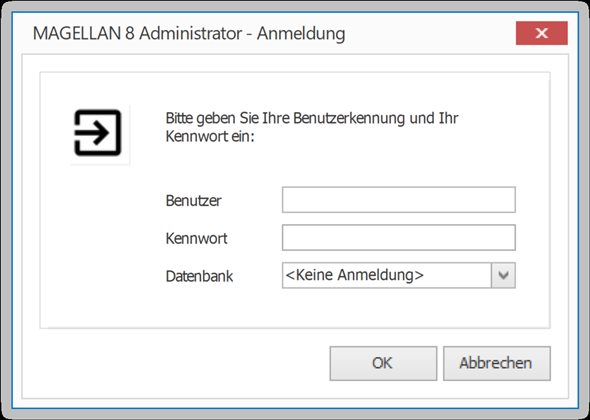

# MAGELLAN-Administration

Dieses Kapitel richtet sich an Administratoren und soll einen Einblick in die MAGELLAN-Administration geben. Dazu werden die Funktionen des MAGELLAN-ADMINISTRATORs, das Versetzen von Schülern oder Lehrern in einen anderen Mandanten, das MyMAGELLAN Center, eine Access-Anbindung an die MAGELLAN-Datenbank, das Einspielen von Updates, der MAGELLAN-DWH Explorer, der MAGELLAN-Skripteditor, das Ein- bzw. Ausblenden von Bereichen und anderes näher erläutert. 

Der MAGELLAN-ADMINISTRATOR beinhaltet folgende Funktionen für den Administrator:

* [MAGELLAN ADMINISTRATOR](https://doc.magellan7.stueber.de/schulverwaltung/admin/magellan.administrator.html)
  * [Datenbankverbindungen](https://doc.magellan7.stueber.de/schulverwaltung/admin/admin.datenbankverbindungen.html)
  * [Benutzerverwaltung](https://doc.magellan7.stueber.de/schulverwaltung/admin/users.html)
  * [MYMAGELLAN CENTER](https://doc.magellan7.stueber.de/schulverwaltung/admin/mymagellan-center.html)
  * [Datenbankpflege](https://doc.magellan7.stueber.de/schulverwaltung/admin/datenbankpflege.html)
  * [Datenaustausch](https://doc.magellan7.stueber.de/schulverwaltung/admin/datenaustausch.html)
  * [Logbuch](https://doc.magellan7.stueber.de/schulverwaltung/admin/logbuch.html)

Weitere Themen:

* [Weitere Themen](https://doc.magellan7.stueber.de/schulverwaltung/admin/weitere.themen.html)
  * [MAGELLAN Optionen](https://doc.magellan7.stueber.de/schulverwaltung/admin/preferences.html)  
  * [Sicherung per Windows Task](https://doc.magellan7.stueber.de/schulverwaltung/admin/sicherung.windows.task.html)
  * [Mehrmandantenlösungen](https://doc.magellan7.stueber.de/schulverwaltung/admin/mehrmandantenloesung.html)
  * [Access-Anbindung](https://doc.magellan7.stueber.de/schulverwaltung/admin/access.anbindung.html)
  * [Protokollierung](https://doc.magellan7.stueber.de/schulverwaltung/admin/protocol.html)
  * [Aktionen im Silentmode](https://doc.magellan7.stueber.de/schulverwaltung/installation/magellan-administrator-im-silentmode-starten.html)
  * [MAGELLAN Scripting](https://doc.magellan-scripting.stueber.de/)

So starten Sie den MAGELLAN-ADMINISTRATOR:

1. Klicken Sie auf `Start`, dann auf `Programme` und dann auf `STÜBER SYSTEMS`.

2. Klicken Sie auf`MAGELLAN ADMINISTRATOR`

3. Tippen Sie Ihre Kennung und Ihr Kennwort ein und bestätigen Sie mit OK (Wenn Sie MAGELLAN neu installiert haben, dann tippen Sie unter Kennung „sysdba“ und das Kennwort „masterkey“ ein).

!!! info "Hinweis"

	Für den Fall das noch keine Verbindung zu einer Datenbank angelegt worden ist, oder die angelegte Verbindung korrigiert werden soll, kann man den MAGELLAN ADMINISTRATOR auch ohne Anmeldung starten. In diesem Fall kann nur das Menü Datenbankverbindungen bedient werden.

 

