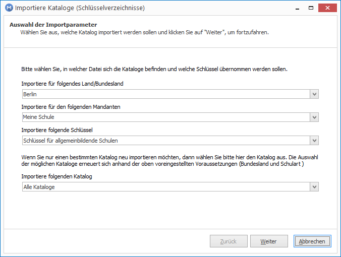
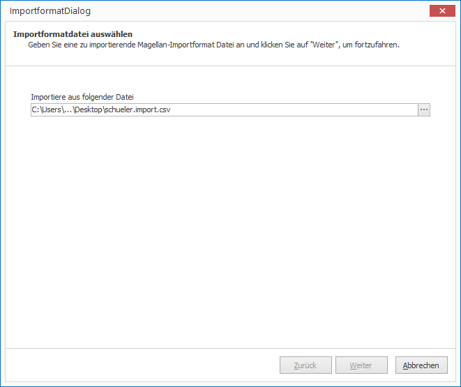
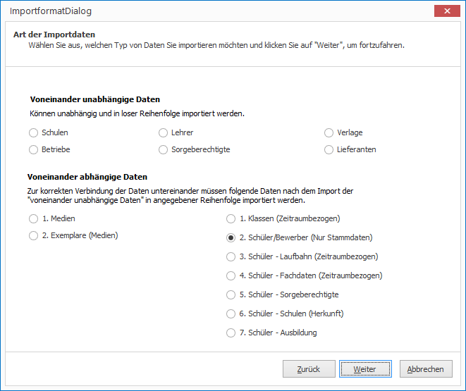
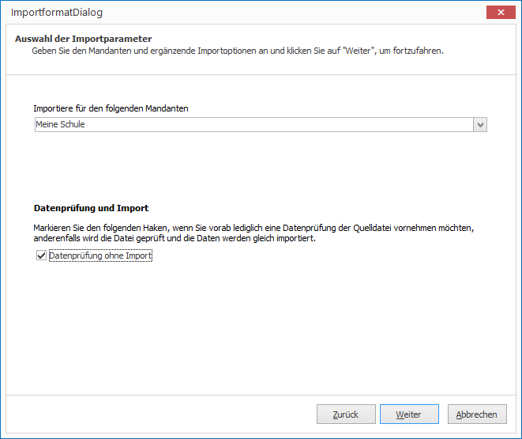
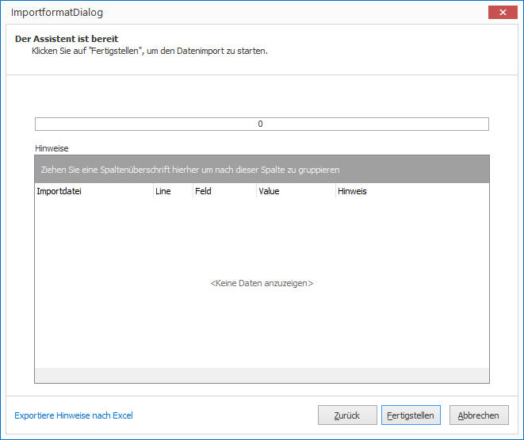

# Datenaustausch

## Kataloge (Schlüsselverzeichnisse) importieren

Mit dieser Option können Sie die Schlüsselverzeichnisse Ihrer Region in die MAGELLAN-Datenbank importieren. Sie können diesen Import jederzeit wiederholen, um beispielsweise bestehende Schlüsselverzeichnisse auf den neuesten Stand zu bringen.

Für MAGELLAN existieren Anpassungen an die Bestimmungen einzelner Bundesländer bzw. bestimmter Schularten. Diese Anpassungen richten sich u. a. danach, ob die jeweiligen Stellen der Statistikämter, Kultusministerien bzw. Schulträger entsprechende Datentransferformate usw. anbieten. Durch die Landesanpassung werden die Bereiche Statistik und Oberstufenverwaltung, als auch die Zeugnisse abgedeckt. Um eine MAGELLAN-Datenbank mit neuen Schlüsselverzeichnissen zu aktualisieren bzw. Schlüssel in eine leere MAGELLAN-Datenbank zu importieren, müssen Sie die Option „Schlüsselverzeichnisse importieren“ wählen.

| Feld                                     | Bedeutung                                                                                                                                                                                                                                                                                          |
| ---------------------------------------- | -------------------------------------------------------------------------------------------------------------------------------------------------------------------------------------------------------------------------------------------------------------------------------------------------- |
| Importiere für folgendes Land/Bundesland | Wählen Sie Ihr Bundesland oder Land aus.  Der Assistent bietet Schlüsselverzeichniskataloge aus dem gleichnamigen Verzeichnis im Verzeichnis Importe (standardmäßig auf Ihrem MAGELLAN-Serverrechern).                                                                                         |
| Importiere folgende Schlüssel            | Es gibt die Auswahl Schlüssel für allgemeinbildende Schulen oder berufsbildende Schulen. Katalogedateien können mit 00_, AS_ oder BS_ beginnen. Für allgemeinbildende Schulen werden Dateien mit 00_ und AS_ importiert, für berufsbildende Schulen werden Dateien mit 00_ und BS_ importiert. |
| Importiere für den folgenden Mandanten   | Wählen Sie den Zielmandanten aus                                                                                                                                                                                                                                                                   |
| Importiere folgenden Katalog             | Sie können eine einzelne Datei oder alle zutreffenden Datei einlesen lassen.                                                                                                                                                                                                                       |

[Assistent zum Importieren von Katalogen](../../assets/images/magellan.administrator/kataloge.importieren.png)

### Eigene Kataloge importieren

Damit Sie eigene oder bearbeitete Katalogdateien (*.keys) importieren können, gibt es ein gesondertes Unterverzeichnis `Benutzer`. Legen Sie eigene Katalogdateien auf dem Serverrechner unter `C:\Users\Public\Documents\Stueber Systems\Magellan 7\Importe\Benutzer`(Pfad gegebenenfalls abweichend) ab und importieren Sie die Dateien über den Assistenten mit dem Eintrag `Benutzer`für `Importiere für folgendes Land/Region`. Das Unterverzeichnis `Benutzer`wird bei Updates nicht verändert.
 
[Kataloge aus dem Verzeichnis `Benutzer`importieren](../../assets/images/magellan.administrator/kataloge.importieren1.png)

### Benennung der Kataloge 

Beispiele:
* 00_Faecher.keys
* AS_Faecher.keys
* BS_Faecher.keys

| Benennung                                      | Anmerkung                                                                                                                                                                                                                                                                                                     |
| ---------------------------------------------- | ------------------------------------------------------------------------------------------------------------------------------------------------------------------------------------------------------------------------------------------------------------------------------------------------------------- |
| Dateinamenanfang "AS_"                         | Schlüsseldateien die mit "AS_" bezeichnet sind, werden beim Aufruf `für allgemeinbildende Schulen` zum Import angeboten                                                                                                                                                                                       |
| Dateinamenanfang "BS_"                         | Schlüsseldateien die mit "BS_" bezeichnet sind, werden beim Aufruf `für berufsbildende Schulen` zum Import angeboten                                                                                                                                                                                          |
| Dateinamenanfang "00_"                         | Schlüsseldateien die mit "00_" bezeichnet sind, werden beim Aufruf `für allgemeinbildende Schulen` und beim Aufruf `für berufsbildende Schulen` zum Import angeboten                                                                                                                                          |
| Text ab Zeichen 4  (im Beispiel "Faecher") | Anhand dieser Bezeichnung wird das Schlüsselverzeichnis identifiziert. Eine vollständige Aufzählung der Schlüsselverzeichnisse, inklusive der Beschreibung für den Aufbau der Katalogdateien finden Sie im Abschnitt [Referenz > keys-Dateien](https://doc.magellan7.stueber.de/reference/keys-dateien.html). |

### Importiere folgenden Katalog

Es können entweder alle keys-Dateien (AS_xxx und 00_xxx oder BS_xxx und 00_xxx ) importiert werden oder Sie wählen eine bestimmte Datei aus.

### Aufbau der Dateien

!!! info "Hinweis"

	Den Aufbau der einzelnen Importdatei beschreiben wir im Abschnitt [Referenz > keys-Dateien](https://doc.magellan7.stueber.de/reference/keys-dateien.html).

Jede dieser Dateien muss als CSV-Datei aufgebaut sein, d.h. sie besteht jeweils aus einer Kopfzeile und
ein oder mehreren Zeilen mit den zu importierenden Inhalten. Die einzelnen Felder sind durch
Semikolon getrennt und mit Anführungszeichen abgegrenzt.

Die Importdatei für Fachstatus (00_Fachstati.keys) kann z.B. folgenden Aufbau haben

`
"Kuerzel";"Schluessel";"Bezeichnung";"GueltigVon";"GueltigBis"
"1PF";"1PF";"1. Prüfungsfach";"01.08.2006";""
"2PF";"2PF";"2. Prüfungsfach";"01.08.2006";""
"3PF";"3PF";"3. Prüfungsfach";"01.08.2006";""
"1PFBLL";"1PFBLL";"1. Prüfungsfach und Besondere Lernleistung";"01.08.2006";""
`

Die Felder entsprechen dem sogenannten System Data Format (SDF), d.h. bei einem Semikolon, Komma, Sonderzeichen oder einem Leerzeichen im String wird der String in Anführungszeichen gesetzt, z.B. die Bezeichnung "1. Prüfungsfach und Besondere Lernleistung " wird ;“ 1. Prüfungsfach und Besondere Lernleistung“;... und nicht ; 1. Prüfungsfach und Besondere Lernleistung;... geschrieben.
Besitzt der Inhalt selbst Anführungszeichen, so sind doppelte Anführungszeichen anzugeben. Welche Felder pro Datei eingelesen werden, ist den nachfolgenden Abschnitten pro Datei zu entnehmen.

!!! info "Hinweis"

	Zeilenumbrüche sind in einer CSV-Datei nicht erlaubt. Das Datenformat bestimmt jede Zeile als einen Datensatz. Ein Umbruch mitten in der Zeile kann nicht verarbeitet werden.
Ändern Sie bitte vor dem Import die Dateiendung in *.keys.

### Was passiert beim Schlüssel importieren?

Beim Einlesen von Schlüsselverzeichnissen wird folgendes der Reihe nach durchgeführt:

1. Alle noch nie verwendeten Schlüssel werden in den Zielverzeichnissen der Datenbank gelöscht.

2. Alle übrigen Schlüssel werden in der Datenbank mit einem älteren Datum versehen und damit als ungültig (graue Raute) markiert.

3. Nun wird geprüft welche Schlüssel eingelesen werden sollen, entscheidend ist dabei lediglich der Wert in der Spalte Schlüssel:

* Wird ein Schlüssel erkannt, wird nur das Gültig-Bis-Datum entfernt (Schlüssel ist wieder aktiv). Das gilt auch, wenn der Schlüsselwert mehrfach im Verzeichnis existiert.
* Wird ein Schlüssel nicht im Verzeichnis erkannt, wird er eingelesen und aktiv gesetzt.
Als Ergebnis haben Sie damit nur die korrekten Schlüssel als aktive Werte markiert. Verkehrte, aber bereits verwendete Schlüssel, bleiben in der Datenbank bestehen, werden aber als inaktiv gekennzeichnet.

!!! info "Hinweis"

	 Bei bestehenden Schlüsselzeilen in den Zielverzeichnissen wird weder Bezeichnung, noch Kürzel oder Schlüssel verändert, lediglich das Gültig-von- und das Gültig-bis-Datum wird angepasst.

| Feld                  | Hinweis                                                                                                                                                                   |
| --------------------- | ------------------------------------------------------------------------------------------------------------------------------------------------------------------------- |
| Kuerzel               | dieser Wert muss pro Zeile gefüllt werden, darf aber nur einmalig innerhalb eines Verzeichnisses verwendet werden.                                                        |
| Zeichenlänge pro Feld | Die Gesamtzeichenlänge darf nicht überschritten werden. Bitte beachten Sie hierzu das Dokument [MAGELLAN-Datenstruktur](https://doc.magellan6-datenstruktur.stueber.de/). |

## Postleitzahlen und Banken importieren

Mit dieser Option können Sie Ihr bestehendes Postleitzahlverzeichnis gegen ein neues austauschen oder erstmalig in Ihre Datenbank importieren. Folgende Verzeichnisse werden eingelesen oder ersetzt:
* Bundesländer
* Bezirke
* Kreise
* Gemeinden
* Stadtbezirke
* Postleitzahlen

| Feld                          | Anmerkung                                                                                                                   |
| ----------------------------- | --------------------------------------------------------------------------------------------------------------------------- |
| Importiere für folgendes Land | Aktuell bieten wir Kataloge für folgende Regionen an:   * Deutschland * Schweiz * Rheinland-Pfalz  * Berlin |
| Importiere folgenden Katalog  | alle Kataloge                                                                                                               |

## Daten über das MAGELLAN-Importformat importieren

Das MAGELLAN-Importformatist die allgemeine Importschnittstelle für die Übernahme von Fremddaten in dei MAGELLAN-Datenbank. Den Aufbau der einzelnen Dateien und die Einlesereihenfolge um Daten aufeinander aufbauend in die Datenbank zu importieren, beschreiben wir in der Dokumentation des [MAGELLAN-Importformates](https://doc.magellan-import.stueber.de/).

## MAGELLAN DataCenter starten

Das MAGELLAN DataCenter ermögicht Ihnen die Konvertierung von Daten fremder Anbieter in das MAGELLAN-Importformat. Es werden verschiedene Quelldatenbank- und Quellsysteme untestützt.
Anhand von Prüfungs- und Konvertierungsregeln können Sie nicht konforme Daten entweder ersetzen oder überspringen. Zusätzlich können komplexe Konvertierungsroutinen per JavaScript-Technologie implementiert werden.