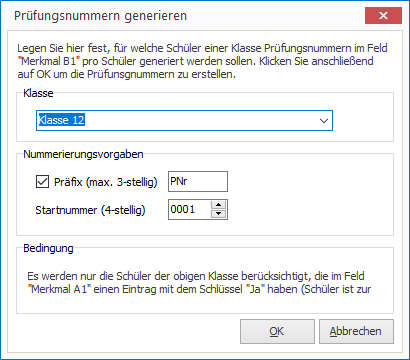
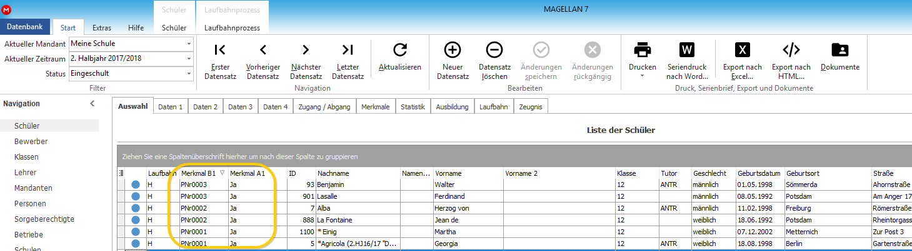

# Prüfungsnummer generieren

Um die Reihenfolge für Prüfungen festzulegen, können in MAGELLAN Prüfungsnummern generiert werden. 

## Vorbereitung

Die Prüfungsnummern sollen nur für Schüler generiert werden, die zur Prüfung zugelassen sind. Legen Sie dazu unter `Extras > Schlüsselverzeichnisse > Merkmale (Schüler)` ein Merkmal an. Entscheidend ist dabei der Schlüssel.

Kürzel  | Schlüssel | Bezeichnung                         | Bereich
------- | --------- | ----------------------------------- | ------- 
Ja      | Ja        | Schüler ist zur Prüfung zugelassen. | MerkmalA1

Weisen Sie dieses Merkmal den Schülern zu, Sie können dazu auch die Sammelzuweisung unter `Schüler > Sammelzuweisung` verwenden. 

## Prüfungsnummern generieren

So gehen Sie vor:

1. Rufen Sie im aktuellen Halbjahr aus dem `Schülermenü > Schüler > Prüfungsnummern generieren` auf. 

2. Wählen Sie eine Klasse und vergeben ein Prüfungspräfix, es können dafür höchstens 3 Zeichen verwendet werden. Sie können die niedrigste Prüfungsnummer vordefinierten. 
 

Die generierte Prüfungsnummer wird für den Schüler unter `Merkmale > MerkmalB1` angezeigt und ist auch in der Auswahlliste sichtbar.
 

