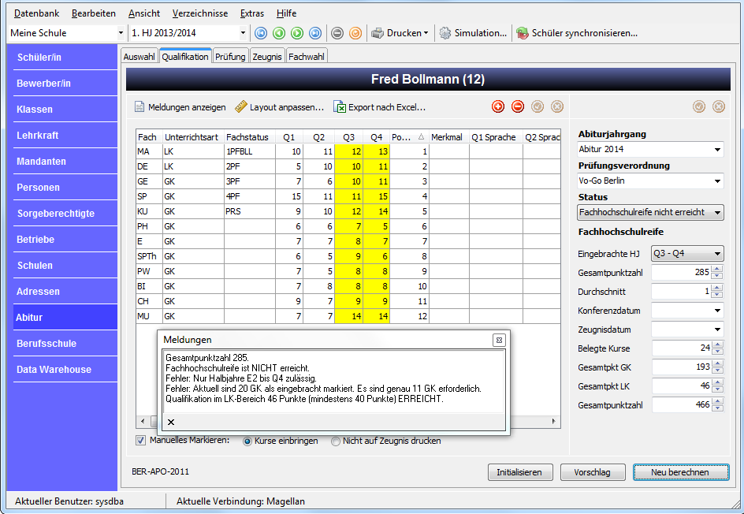

#	Die Fachhochschulreife

##	Die Berechnung der Fachhochschulreife

Die Berechnung der Fachhochschulreife erfolgt wie die Abiturzulassungsberechnung auf der Registerkarte `Qualifikation `in der Ansicht „Abitur“. Die Berechnungsvorschrift ist im gleichen Skript realisiert wie die Berechnungen für die Abiturqualifikation. Als Voraussetzung müssen Sie dazu die Schüler vorher in die Ansicht „Abitur“ synchronisieren (siehe „Schülerdaten in die Ansicht „Abitur“ synchronisieren“).
 

##	Fachhochschulreife automatisch berechnen

Um die Fachhochschulreife automatisch berechnen zu lassen, gehen Sie wie folgt vor:

1.	Stellen Sie unter Status `„Fachhochschulreife berechnen“` ein.
2.	Stellen Sie unter `Eingebrachte HJ` die entsprechenden Halbjahre ein, auf die sich die Berechnung bezieht. Es können nur aufeinander folgende Halbjahre ausgewählt werden.
3.	Markieren Sie dann die eingebrachten Kurse des Schülers, d.h. markieren Sie `Manuelles Markieren` mit der Option `Kurse einbringen` und klicken Sie die entsprechenden Kurse an, die Sie einbringen wollen. Die eingebrachten Kurse werden gelb markiert.
4.	Klicken Sie dann auf die Schaltfläche `Neu berechnen`, um die Zulassung automatisch durch das Skript berechnen zu lassen. Im Meldungsfenster werden evtl. Fehler ausgegeben. 

Bei der Berechnung werden automatisch folgende Eingaben auf der Registerkarte durchgeführt:

1.	Der Wert im Feld Status wird auf „Fachhochschulreife erreicht“ oder „Fachhochschulreife nicht erreicht“ gesetzt.
2.	Die Gesamtpunktzahl und die Durchschnittsnote werden berechnet und in die gleichnamigen Felder eingetragen.

##	Fachhochschulreife manuell eingeben

Wenn die auf die automatische Berechnung der Fachhochschulreife aufgrund der zuvor markierten eingebrachten Kurse verzichten wollen, gehen Sie wie folgt vor:

1.	Setzen Sie den Wert im Feld Status auf „Fachhochschulreife erreicht“ oder „Fachhochschulreife nicht erreicht“.
2.	Stellen Sie unter „Eingebrachte Halbjahre“ die entsprechenden Halbjahre ein, auf die sich die Berechnung bezieht. Es können nur aufeinander folgende Halbjahre ausgewählt werden.
3.	Markieren Sie die eingebrachten Kurse wie im vorherigen Abschnitt beschrieben.
4.	Geben Sie die Gesamtpunktzahl im Feld Gesamtpunktzahl ein.
5.	Geben Sie die Durchschnittsnote im Feld Durchschnittsnote ein.

