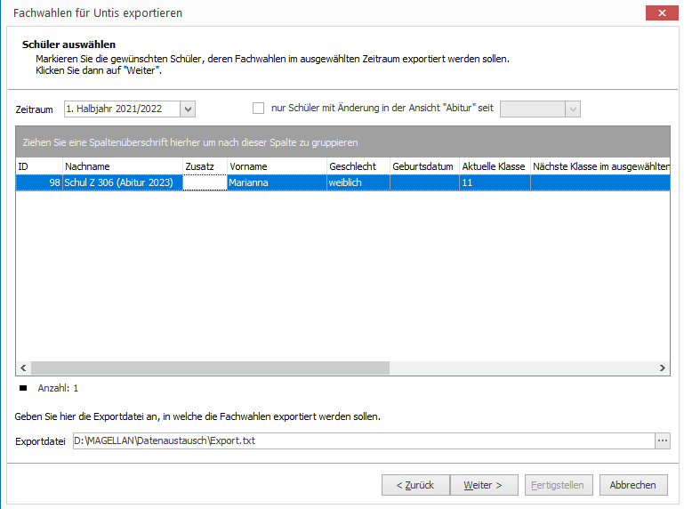

#	Schüler-Fachwahlen nach Untis übertragen

Aufgrund der Schüler-Fachwahlen müssen die Kurse und Kursblockung erstellt werden. Diese Aufgabe ist Teil der Stundenplansoftware.

!!! info "Hinweis"

     Im Folgenden wird die Datenübergabe in das Stundenplanprogramm Untis beschrieben. Für DAVINCI gilt die analoge Vorgehensweise. 

##	Allgemeines Vorgehen

Zuerst müssen die Schüler-Fachwahlen nach Untis exportiert werden. Dazu werden aus der Ansicht „Abitur“ heraus die jahrgangsübergreifenden Fachwahlen in eine Schuldatentransferformat-Datei gespielt. 

Gehen Sie dazu wie folgt vor:

1.	Wählen Sie in der Ansicht Abitur die Karte Fachwahl eines beliebigen Schülers. Starten Sie den Assistenten unter `Bearbeiten > Fachwahl exportieren > Untis`.
 
 
 
2.	Wählen Sie bei Bedarf einen Zeitraum aus. Standardmäßig ist dies der aktuell eingestellte Zeitraum in MAGELLAN. Die Schülerliste zeigt nur die Schüler an, für die eine Fachwahl für den gewählten Zeitraum angelegt wurde.

Spalte|Bedeutung
--|--
Aktuelle Klasse| finden Sie jeweils die Klasse, in welcher sich der Schüler im aktuellen Zeitraum befindet.
Nächste Klasse|im ausgewählten Zeitraum finden Sie jeweils die Klasse, welche der aktuellen Klasse des Schülers als nächste Klasse unter Ansicht `„Klassen“ > Daten > Nächste Klasse` im ausgewählten Zeitraum zugeordnet ist.
Exportklasse| finden Sie die Klasse, welche exportiert wird.

3.	Lassen Sie sich optional die Ansicht gefiltert anzeigen, indem Sie ein Datum eingeben und nur Schüler mit einer Änderung der Fachwahlen ab dem gewählten Datum angezeigt bekommen. 
4.	Verweisen Sie im Feld Exportdatei auf eine Datei, in die die Fachwahlen exportiert werden sollen. Möglich sind CSV- oder TXT-Dateien
5.	Markieren Sie die gewünschten Schüler und klicken auf `Fertigstellen`.

Die anschließend erstellte Schuldatentransferdatei können Sie nun in Untis importieren.

!!! info "Hinweis"

     Sie können die Fachwahl sowohl einzelner Schüler als auch aller Schüler der Auswahlliste exportieren. Dies ist abhängig davon, welche Schüler Sie markiert haben.
     
      Die „nächste Klasse“ einer Klasse können Sie definieren, in dem Sie unter Ansicht „Klassen“ > Daten den Befehl Bearbeiten > Nächste Klasse wählen.

##	Nachträgliches Erfassen von Schülerfachwahlen

Wenn Sie nachträglich Fachwahlen einzelner Schülern erfasst wollen, so ist die jederzeit möglich. Sie unterscheidet sich praktisch nicht von der allgemeinen Erfassung der Schülerfachwahlen. Dazu gehen Sie analog der Beschreibung „Schüler-Fachwahlen eingeben und prüfen“ und der allgemeinen Vorgehensweise im vorangegangenen Abschnitt dieses Kapitels vor.
Sie sollten Sie jedoch aus Performanzgründen nur noch diese Schüler nach Untis exportieren und nicht wieder alle Schüler mit Fachwahlen. Nutzen Sie dazu das Optionsfeld `nur Schüler mit Änderungen` in der Ansicht „Abitur“ seit im Assistenten.
 

Abbildung 40:

##	Logik bei Erzeugen der Exportdatei für Untis

Im Rahmen des Exports der zuvor beschriebenen Schülerfachwahlen nach Untis in eine Schuldatentransferdatei wird unter anderem der Zeilentyp P1 des Schuldatentransferformats pro ausgewählten Schüler erzeugt.

 Dabei gilt folgende Logik für den Export des Feldes „Kursnummer“ im Zeilentyp P1:
 
*	Ist das zu exportierende Fach mit seiner Unterrichtsart für den Schüler nur unter Ansicht `Abitur > Fachwahl` und noch nicht unter `Ansicht Schüler > Zeugnis > Fächer` eingetragen, bleibt der Wert im Feld „Kursnummer“ leer.

*	Ist das zu exportierende Fach mit seiner Unterrichtsart für den Schüler unter Ansicht `Abitur > Fachwahl` und unter `Ansicht Schüler > Zeugnis > Fächer` eingetragen, gelten folgende Werte Feld „Kursnummer“:
 *	Ist unter Ansicht `Schüler > Zeugnis > Fächer` im Feld Kurs kein Eintrag oder der Wert „0“ eingetragen, bleibt der Wert im Feld „Kursnummer“ leer.
 *	Ist unter Ansicht `Schüler > Zeugnis > Fächer` im Feld Kurs ein Wert „1“ oder größer eingetragen, wird dieser Wert in das Feld „Kursnummer“ geschrieben.

##	Export relevanter SDTF-Datensatz 

Für den Export nur der Schülerfachwahlen von MAGELLAN nach Untis ist im Schuldatentransferformat der folgende Datensatz relevant.

SDTF-Datensatz 	|Beschreibung
--|--
P1|	Schülerdaten

Tabelle 1: Für den Export relevanter SDTF-Datensatz beim Export nur der Schülerkurswahlen von MAGELLAN nach Untis

!!! info "Hinweis"

     Eine vollständige Beschreibung des Datensatzes finden Sie in der Dokumentantion [Schuldatentransferformat](https://doc.sdtf.stueber.de/)

