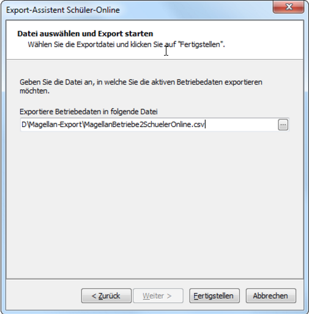
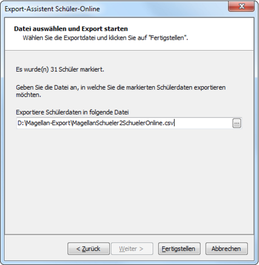
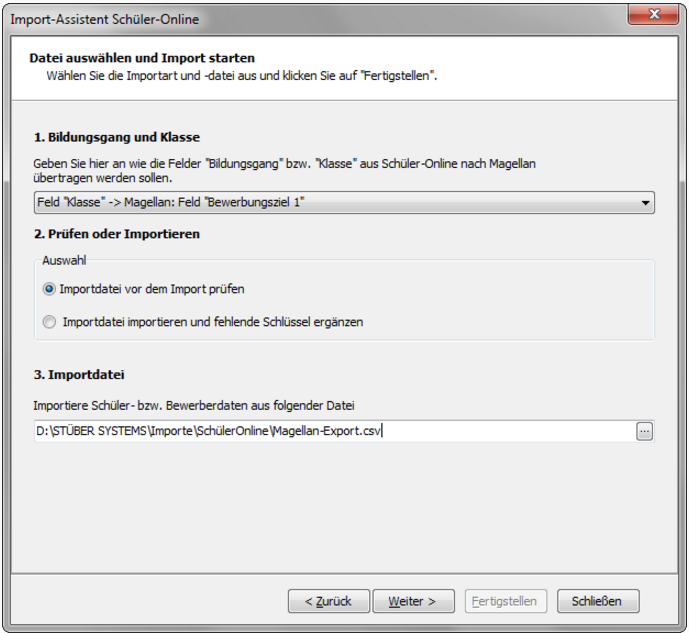
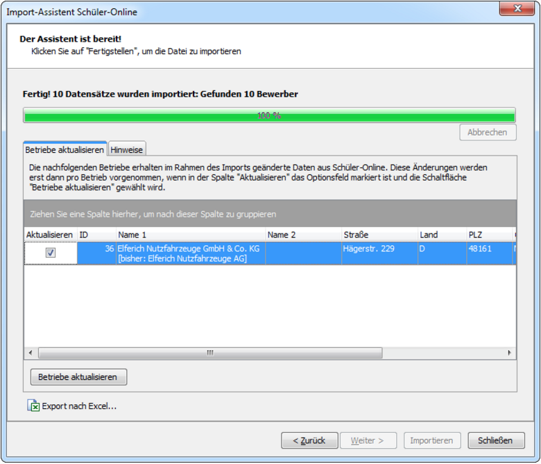

# Abgleich mit SchülerOnline

MAGELLAN unterstützt das Schüler Online-Verfahren des Kommunalen Rechenzentrums (krz) Minden-Ravensberg/Lippe in Lemgo.

MAGELLAN unterstützt:
1.	den Export der aktiven Betriebe für den Import in Schüler Online bei der aufnehmenden Schulen
2.	den Export markierter Schüler für den Import in Schüler Online
3.	den Import der angemeldeten Schüler aus Schüler Online nach MAGELLAN.

## Export der Betriebe

Für den Export der Betriebe aus MAGELLAN und den Import der Daten in die aufnehmende Schule in Schüler-Online müssen Sie in folgenden Schritten vorgehen:
1.	Schritt: Export der Betriebe aus MAGELLAN
2.	Schritt: Import der Exportdatei in Schüler Online

### Export der Betriebe aus MAGELLAN

1.	Um die aktiven Betriebe aus MAGELLAN zu exportieren, müssen Sie wie folgt vorgehen:
2.	Wechseln Sie in MAGELLAN in die Ansicht „Betriebe“
3.	Wählen Sie den Menüpunkt ```Bearbeiten > Export > Schüler-Online exportieren…```.
4.	Klicken Sie im Export-Assistenten auf Weiter.
5.	Geben Sie unter Exportdatei den Pfad für eine Exportdatei an, in welche Sie die aktiven Betriebe exportieren wollen.
6.	Klicken Sie auf Fertigstellen. Die Datensätze aller aktiven Betriebe werden jetzt exportiert.



## Import der Betriebedatei nach Schüler Online

Um die zuvor exportierte Betriebedatei in Schüler Online zu importieren, müssen Sie in Schüler Online wie folgt vorgehen:
2.	Melden Sie sich in Schüler Online an.
3.	Wählen Sie in der Navigation die Option ```Aufnehmende Schule```.
4.	Wählen Sie in der Navigation den Menüpunkt Administration|Import Betriebe.
5.	Wählen Sie das ```Import-Schema MAGELLAN``` aus.
6.	Wählen Sie unter Auswahl ```Importdatei``` die zuvor aus MAGELLAN exportierte Betriebedatei über die Schaltfläche ```Durchsuchen``` aus und laden Sie dies über ```Upload```.
7.	Klicken Sie zum Import jetzt auf ```Import der Daten```.

## Export von Schülern{#Export von Schülern}

Für den Export von Schülern aus MAGELLAN und den Import der Daten in die abgebende Schule in Schüler-Online müssen Sie in folgenden Schritten vorgehen:
1. Schritt: Export von Schülern aus MAGELLAN
2. Schritt: Import der Exportdatei in Schüler Online
Export von Schülern aus MAGELLAN
Um die Schüler aus MAGELLAN für Schüler Online zu exportieren, müssen Sie wie folgt vorgehen:
Um die aktiven Betriebe aus MAGELLAN zu exportieren, müssen Sie wie folgt vorgehen:
1.	Wechseln Sie in MAGELLAN in die Ansicht ```Schüler```.
2.	Markieren Sie in der Auswahlliste die Schüler, die Sie exportieren wollen.
3.	Wählen Sie den Menüpunkt ```Bearbeiten > Export > Schüler-Online exportieren…```.
4.	Klicken Sie im Export-Assistenten auf ```Weiter```.
5.	Geben Sie unter Exportdatei den Pfad für eine Exportdatei an, in welche Sie die markierten Schüler exportieren wollen.
6.	Klicken Sie auf ```Fertigstellen```.
Die Datensätze aller markierten Schüler werden jetzt exportiert.




## Import der Schülerdatei nach Schüler Online

Um die zuvor exportierte Schülerdatei in Schüler Online zu importieren, müssen Sie in Schüler Online wie folgt vorgehen:

1. Melden Sie sich in Schüler Online an.
2. Wählen Sie in der Navigation die Option `Abgebende Schule`.
3. Wählen Sie in der Navigation den Menüpunkt `Datenimport > Datenimport (2013)`.
4. Wählen Sie das Import-Schema `MAGELLAN Standard` aus.
5. Wählen Sie unter Auswahl `Importdatei` die zuvor aus MAGELLAN exportierte Schülerdatei über die Schaltfläche `Durchsuchen` aus und laden Sie dies über `Upload`.
6. Klicken Sie zum Import jetzt auf `Import der Daten`.

## Import der Schüleranmeldungen aus Schüler Online

Für den Import der Schüleranmeldungen aus Schüler Online nach MAGELLAN müssen Sie in folgenden Schritten vorgehen:
1. Schritt: Export der Schüleranmeldungen aus Schüler Online
2. Schritt: Prüfen der Exportdatei bzgl. der eingetragenen Schlüssel in MAGELLAN
3. Schritt: Import der Exportdatei in MAGELLAN

### Export der Schüleranmeldungen aus Schüler Online

Um die Schüleranmeldungen aus Schüler Online zu exportieren, müssen Sie in Schüler Online wie folgt vorgehen:
2.	Melden Sie sich in Schüler Online an.
3.	Wählen Sie in der Navigation die Option ```Abgebende Schule```.
4.	Wählen Sie in der Navigation den Menüpunkt``` Administration > Datenexport MAGELLAN```
5.	Klicken Sie in der erscheinenden Maske rechts oben auf das Symbol neben ```Daten exportieren```.
6.	Die Datei wird dann standardmäßig mit dem Namen ```MAGELLAN_Export.csv``` gespeichert.

### Prüfen der Exportdatei{#Prüfen der Exportdatei}

Bevor Sie den eigentlich Import der zuvor erzeugten Datei ```MAGELLAN-Export.csv``` vornehmen, sollten Sie zunächst eine Prüfung der Daten vornehmen. Dabei wird geprüft, ob diese Schlüssel auch in den entsprechenden Schlüsselverzeichnissen von MAGELLAN enthalten sind und ob die Inhalte der Felder den maximalen Feldlängen in MAGELLAN entsprechen.

Gehen Sie dazu wie folgt vor:
3.	Wechseln Sie in MAGELLAN in die Ansicht ```Bewerber```
4.	Wählen Sie den Menüpunkt ```Bearbeiten > Import > Schüler-Online importieren…```.
5.	Klicken Sie im Import-Assistenten für Schüler-Online auf ```Weiter```.
6.	Wählen Sie unter ```1. Bildungsgang und Klasse```, wie die in den Feldern Bildungsgang und Klasse enthalten Werte auf welche Felder in MAGELLAN abgebildet werden sollen.
7.	Wählen Sie unter ```2. Prüfen und Importieren``` die Option ```Importdatei vor dem Import prüfen```.
8.	Wählen Sie unter ```3. Importdatei``` die Exportdatei aus Schüler-Online.
9.	Klicken Sie auf ```Weiter```.
10.	Klicken Sie auf ```Fertigstellen```.

!!! info "Hinweis"

      Alle Datensätze werden jetzt geprüft, ob die enthalten Schlüsselwerte auch in MAGELLAN vorhanden sind. Existiert ein Wert in der Exportdatei, der nicht in MAGELLAN vorhanden ist bzw. der in seine Stelligkeit nicht nach MAGELLAN importiert werden kann, so wird dazu eine Hinweismeldung unter Hinweise ausgeben.
      Im Rahmen der Prüfung werden noch keine Daten importiert

Jede Hinweiszeile beinhaltet:
•	die Zeilennummer der Exportdatei (Spalte Zeile),
•	das Feld der Exportdatei (Spalte Feld) und
•	die eigentliche Meldung (Spalte Meldung)

Diese Hinweise können Sie nach Abschluss der Prüfung über die Schaltfläche ```Export nach Excel ```nach Excel zu weiteren Auswertung exportieren. Liegen keine Hinweise vor, wird im Bereich Hinweise kein Eintrag ausgegeben.

!!! info "Hinweis"

     Alle im Rahmen der Prüfung festgestellten fehlenden Schlüsselwerte in MAGELLAN werden beim späteren Import automatisch erzeugten. Die Prüfung soll Ihnen die Möglichkeit geben, unterschiedliche Schlüsselwerte in Schüler Online und MAGELLAN für ein und denselben Sachverhalt in MAGELLAN vor dem Import anzupassen. Dies kann beispielweise leicht durch die Umbenennung von Kürzeln für Schlüsselwerte in MAGELLAN erfolgen.

### Import der Exportdatei

Um die Exportdatei aus Schüler-Online zu exportieren, gehen Sie wie folgt vor:
2.	Wechseln Sie in MAGELLAN in die Ansicht ```Bewerber```
3.	Wählen Sie den Menüpunkt ```Bearbeiten > Import > Schüler-Online importieren…```.
4.	Klicken Sie im Import-Assistenten für Schüler-Online auf ```Weiter```.
5.	Wählen Sie unter ```1. Bildungsgang und Klasse```, wie die in den Feldern Bildungsgang und Klasse enthalten Werte auf welche Felder in MAGELLAN abgebildet werden sollen.
6.	Wählen Sie unter ```2. Prüfen und Importieren``` die Option Importdatei importieren und fehlenden Schlüssel ergänzen.
7.	Wählen Sie unter ```3. Importdatei ```die Exportdatei aus Schüler-Online.
8.	Klicken Sie auf ```Weiter``` und auf ```Fertigstellen```.

Alle Datensätze werden jetzt importiert. Werden fehlende Schlüssel in den Schlüsselverzeichnissen ergänzt, so wird dazu eine Hinweismeldung unter Hinweise ausgeben.



!!! info "Hinweis"

     Beim erstmaligen Import der Betriebedaten aus der Exportdatei aus Schüler Online prüft MAGELLAN über die Felder Name, Strasse, Postleitzahl und Ort, ob der Betrieb schon in MAGELLAN existiert, damit dieser nicht neu angelegt wird.

Ein einmalig aus Schüler Online übernommener Betrieb ist in MAGELLAN eindeutig gekennzeichnet, damit zukünftige Betriebsdatenänderung in Schüler Online mit nach MAGELLAN übernommen werden können.
Wird im Rahmen des Imports ein Betrieb als schon vorhanden erkannt, werden die in Schüler Online eingetragenen Daten nicht automatisch übernommen. Schon vorhandene Betriebe werden im Anschluss an den Import in einer gesonderten Registerkarte ```Betriebe aktualisieren ```aufgelistet.



Um eine Aktualisierung der Betriebe nun explizit durchzuführen, gehen Sie wie folgt auf der Registerkarte Betriebe aktualisieren vor:
1.	Prüfen Sie jede der angezeigten Zeilen, welche Daten pro Betrieb dort genau geändert worden sind. Der jeweils bisherige Wert ist jeweils nachfolgende in eckigen Klammern angegeben.
2.	Soll ein Betrieb nicht aktualisiert werden, dann entfernen Sie die Markierung in der Zeile für die Spalte ```Aktualisieren```.
3.	Nach Prüfung alle Betriebe können Sie über die Schaltfläche ```Betriebe aktualisieren ```die eigentliche Aktualisierung durchführen lassen.
> Die Exportdatei aus Schüler Online kann mehrfach nach MAGELLAN importiert werden. MAGELLAN erkennt beim erneuten Import, ob der Bewerber bereits importiert wurde und überschreibt dessen bisherigen Daten durch den Import.

> Beim erstmaligen Import der Betriebedaten aus der Exportdatei aus Schüler Online prüft MAGELLAN über die Felder Name, Strasse, Postleitzahl und Ort, ob der Betrieb schon in MAGELLAN existiert, damit dieser nicht neue angelegt wird.
Ein einmalig aus Schüler Online übernommener Betrieb ist in MAGELLAN eindeutig gekennzeichnet, damit zukünftige Betriebsdatenänderung in Schüler Online mit nach MAGELLAN übernommen werden können.
Welche Felder der Exportdatei aus Schüler Online genau nach MAGELLAN eingelesen werden, können Sie dem nachfolgenden Abschnitt entnehmen.

### Importierte Felder

Der nachfolgende Übersicht können Sie entnehmen, in welcher Reihenfolge welche Felder der Exportdatei MAGELLAN-Export.csv in welche Felder in MAGELLAN übernommen werden.

!!! info "Hinweis"

      Bereits in MAGELLAN vorhandene Schüler können anhand der SchuelerID (MAGELLANID) und der Schulnummer erkannt werden. Bei Übereinstimmung wird der bestehende Schülerdatensatz als Bewerberdatensatz dupliziert und das Feld IDExtern wird gefüllt,um ein anschließendes Zusammenführen beim Einschulen zu ermöglichen. 
      Voraussetzung dafür ist, dass Sie Ihre Abgänger vorab nach SchülerOnline übergeben haben, dabei wird die MAGELLANID im Programm mit gespeichert.
      
      Das Einlesen und Prüfen der Inhalte erfolgt anhand der Position der Spalten (Beispiel: der Nachname wird als zweites erwartet), bitte verändern Sie die Anordnung nicht.
      
      Auch wichtig: einige Angaben aus SchülerOnline haben keine Entsprechung in MAGELLAN, die Spalten müssen aber dennoch in der Importdatei enthalten sein, damit die Zuordnung gelingt. 


Titel|Inhalt
---|---
**01.Feldname in Exportdatei**|SchuelerID
Felder in MAGELLAN|Schueler.ID
Verwendet in Ansicht|Siehe Hinweis über der Tabelle
Schlüsselwert|-
**02.Feldname in Exportdatei**|Nachname
Felder in MAGELLAN|Schueler.Nachname
Verwendet in Ansicht|`Bewerber > Daten 1 > Nachname`
Schlüsselwert|-
**03.Feldname in Exportdatei**|Vorname
Felder in MAGELLAN|Schueler.Vorname
Verwendet in Ansicht|`Bewerber > Daten 1 > Vorname`
Schlüsselwert|-
**04.Feldname in Exportdatei**|	Geburtsort
Felder in MAGELLAN|	Schueler.Geburtsort
Verwendet in Ansicht|	`Bewerber > Daten1 > Geburtsort`
Schlüsselwert|	Nein
**05.Feldname in Exportdatei**|Geburtsdatum
Felder in MAGELLAN|Schueler.Geburtsdatum
Verwendet in Ansicht|`Bewerber > Daten 1 > Geboren am`
Schlüsselwert|		Nein
**06.Feldname in Exportdatei**|	Strasse
Felder in MAGELLAN|Schueler.Strasse
Verwendet in Ansicht|`Bewerber > Daten 1 > Straße`
Schlüsselwert|	Nein
**07.Feldname in Exportdatei**|	Land
Felder in MAGELLAN|Schueler.Land
Verwendet in Ansicht|`Bewerber > Daten 1 > Land`
Schlüsselwert|	Nein
**08.Feldname in Exportdatei**|	Plz
Felder in MAGELLAN|Schueler.PLZ
Verwendet in Ansicht|`Bewerber > Daten 1 > Postleitzahl`
Schlüsselwert|	Nein
**09.Feldname in Exportdatei**|	Wohnort
Felder in MAGELLAN|	Schueler.Ort
Verwendet in Ansicht|	`Bewerber > Daten 1 > Ort`
Schlüsselwert|	Nein
**10.Feldname in Exportdatei**|	Ortsteil
Felder in MAGELLAN|	Schueler.Ortsteil
Verwendet in Ansicht|	`Bewerber > Daten 1 > Ortsteil`
Schlüsselwert|	Nein
**11.Feldname in Exportdatei**|	Telefon
Felder in MAGELLAN|	Schueler.Telefon
Verwendet in Ansicht|	`Bewerber > Daten 1 > Telefon`
Schlüsselwert|	Nein
**12.Feldname in Exportdatei**|	Telefon2
Felder in MAGELLAN|	Schueler.Mobil
Verwendet in Ansicht|	`Bewerber > Daten 1 > Mobil`
Schlüsselwert|	Nein
**13.Feldname in Exportdatei**|	Email
Felder in MAGELLAN|	Schueler.Email
Verwendet in Ansicht|	Bewerber > Daten 1 > E-Mail
Schlüsselwert|	Nein
**14.Feldname in Exportdatei**|	Geburtsname
Felder in MAGELLAN|	Schueler.Geburtsname
Verwendet in Ansicht|	`Bewerber > Daten 1 > Geburtsname`
Schlüsselwert|	Nein
**15.Feldname in Exportdatei**|	Geschlecht
Felder in MAGELLAN|	Schueler.Geschlecht
Verwendet in Ansicht|	`Bewerber > Daten 1 > Geschlecht`
Schlüsselwert|	Ja
**16.Feldname in Exportdatei**|	Nationalitaet
Felder in MAGELLAN|	Schueler.Staatsangehörigkeit1
Verwendet in Ansicht|	`Bewerber > Daten 2 > Staatsangeh. 1`
Schlüsselwert|	Ja
**17.Feldname in Exportdatei**|	Nationalitaet2
Felder in MAGELLAN|	Schueler.Staatsangehörigkeit2
Verwendet in Ansicht|	`Bewerber > Daten 2 > Staatsangeh. 2`
Schlüsselwert|	Ja
**18.Feldname in Exportdatei**|	Konfession
Felder in MAGELLAN|	Schueler.Konfession
Verwendet in Ansicht|	`Bewerber > Daten 1 > Konfession`
Schlüsselwert|	Nein
**19.Feldname in Exportdatei**|	Einschulung
Felder in MAGELLAN|	Schueler.Grundschuleintritt
Verwendet in Ansicht|	`Bewerber > Daten 2 > Grundschuleintritt`
Schlüsselwert|	Nein
**20.Feldname in Exportdatei**|	Migration
Felder in MAGELLAN|	Migration
Verwendet in Ansicht|	
Schlüsselwert|	Nein
**21.Feldname in Exportdatei**|	ZuzugsJahr
Felder in MAGELLAN|	Schueler.InDeutschlandSeit
Verwendet in Ansicht|	`Bewerber > Daten 2 > In Deutschland seit`
Schlüsselwert|	Nein
**22.Feldname in Exportdatei**|	Geburtsland
Felder in MAGELLAN|	Schueler.Geburtsland
Verwendet in Ansicht|	`Bewerber > Daten 1 > Geburtsland`
Schlüsselwert|	Ja
**23.Feldname in Exportdatei**|	GeburtslandVater
Felder in MAGELLAN|	Keine Entsprechung in MAGELLAN,<br/>Spalte muss in der Datei aber enthalten sein!
Verwendet in Ansicht|	    -
Schlüsselwert|	-
**24.Feldname in Exportdatei**|	GeburtslandMutter
Felder in MAGELLAN|Keine Entsprechung in MAGELLAN,<br/>Spalte muss in der Datei aber enthalten sein!
Verwendet in Ansicht|	  -
Schlüsselwert|	     -
**25.Feldname in Exportdatei**|	Verkehrssprache
Felder in MAGELLAN|	Schueler.Verkehrssprache
Verwendet in Ansicht|	`Bewerber > Daten 2 > Verkehrsprache`
Schlüsselwert|	Ja
**26.Feldname in Exportdatei**|	KeyExtern
Felder in MAGELLAN|Keine Entsprechung in MAGELLAN,<br/>Spalte muss in der Datei aber enthalten sein!
Verwendet in Ansicht|	-
Schlüsselwert|-	
**27.Feldname in Exportdatei**|	Ezb1_Anrede
Felder in MAGELLAN|	Sorgeberechtigte.Anrede
Verwendet in Ansicht|	`Sorgeberechtigte > Daten > Anrede`
Schlüsselwert|	Nein
**28.Feldname in Exportdatei**|	Ezb1_Nachname
Felder in MAGELLAN|	Sorgeberechtigte.Nachname
Verwendet in Ansicht|	`Sorgeberechtigte > Daten > Name`
Schlüsselwert|	Nein
**29.Feldname in Exportdatei**|	Ezb1_Vorname
Felder in MAGELLAN|	Sorgeberechtigte.Vorname
Verwendet in Ansicht|	`Sorgeberechtigte > Daten > Vorname`
Schlüsselwert|	Nein
**30.Feldname in Exportdatei**|	Ezb1_Strasse
Felder in MAGELLAN|	Sorgeberechtigte.Strasse
Verwendet in Ansicht|	`Sorgeberechtigte > Daten > Straße`
Schlüsselwert|	Nein
**31.Feldname in Exportdatei**|	Ezb1_Land
Felder in MAGELLAN|	Sorgeberechtigte.Land
Verwendet in Ansicht|	`Sorgeberechtigte > Daten > Land`
Schlüsselwert|	Nein
**32.Feldname in Exportdatei**|	Ezb1_PLZ
Felder in MAGELLAN|	Sorgeberechtigte.PLZ
Verwendet in Ansicht|	`Sorgeberechtigte > Daten > Postleitzahl`
Schlüsselwert|	Nein
**33.Feldname in Exportdatei**|	Ezb1_Wohnort
Felder in MAGELLAN|	Sorgeberechtigte.Ort
Verwendet in Ansicht|	`Sorgeberechtigte > Daten > Ort`
Schlüsselwert|	Nein
**34.Feldname in Exportdatei**|	Ezb1_Telefon
Felder in MAGELLAN|	Sorgeberechtigte.TelefonPrivat
Verwendet in Ansicht|	`Sorgeberechtigte > Daten > Tel. (privat)`
Schlüsselwert|	Nein
**35.Feldname in Exportdatei**|	Ezb1_Email
Felder in MAGELLAN|	Sorgeberechtigte.Email
Verwendet in Ansicht|	`Bewerber > Sorgeberechtigte > Email`
Schlüsselwert|	Nein
**36.Feldname in Exportdatei**|	Ezb1_Art
Felder in MAGELLAN|	SchuelerSorgebe.Verhaeltnis
Verwendet in Ansicht|	`Bewerber > Sorgeberechtigte > Verhältnis`
Schlüsselwert|	Nein
**37.Feldname in Exportdatei**|	Ezb2_Anrede
Felder in MAGELLAN|	Sorgeberechtigte.Anrede
Verwendet in Ansicht|`	Sorgeberechtigte > Daten > Anrede`
Schlüsselwert|	Nein
**38.Feldname in Exportdatei**|	Ezb2_Nachname
Felder in MAGELLAN|	Sorgeberechtigte.Nachname
Verwendet in Ansicht|	`Sorgeberechtigte > Daten > Name`
Schlüsselwert|	Nein
**39.Feldname in Exportdatei**|	Ezb2_Vorname
Felder in MAGELLAN|	Sorgeberechtigte.Vorname
Verwendet in Ansicht|	`Sorgeberechtigte > Daten > Vorname`
Schlüsselwert|	Nein
**40.Feldname in Exportdatei**|	Ezb2_Strasse
Felder in MAGELLAN|	Sorgeberechtigte.Strasse
Verwendet in Ansicht|	`Sorgeberechtigte > Daten > Straße`
Schlüsselwert|	Nein
**41.Feldname in Exportdatei**|	Ezb2_Land
Felder in MAGELLAN|	Sorgeberechtigte.Land
Verwendet in Ansicht|	`Sorgeberechtigte > Daten > Land`
Schlüsselwert|	Nein
**42.Feldname in Exportdatei**|	Ezb2_PLZ
Felder in MAGELLAN|	Sorgeberechtigte.PLZ
Verwendet in Ansicht|	`Sorgeberechtigte > Daten > Postleitzahl`
Schlüsselwert|	Nein
**43.Feldname in Exportdatei**|	Ezb2_Wohnort
Felder in MAGELLAN|	Sorgeberechtigte.Ort
Verwendet in Ansicht|	`Sorgeberechtigte > Daten > Ort`
Schlüsselwert|	Nein
**44.Feldname in Exportdatei**|	Ezb2_Telefon
Felder in MAGELLAN|	Sorgeberechtigte.TelefonPrivat
Verwendet in Ansicht|	`Sorgeberechtigte > Daten > Tel. (privat)`
Schlüsselwert|	Nein
**45.Feldname in Exportdatei**|	Ezb2_Email
Felder in MAGELLAN|	Sorgeberechtigte.Email
Verwendet in Ansicht|	`Bewerber > Sorgeberechtigte > Email`
Schlüsselwert|	Nein
**46.Feldname in Exportdatei**|	Ezb2_Art
Felder in MAGELLAN|	SchuelerSorgebe.Verhaeltnis
Verwendet in Ansicht|	`Bewerber > Sorgeberechtigte > Verhältnis`
Schlüsselwert|	Nein
**47.Feldname in Exportdatei**|	Schulnr
Felder in MAGELLAN|	Schule.Schulnr
Verwendet in Ansicht|	`Bewerber > Zugang > Bereits besuchte Schulen > Schule`
Schlüsselwert|	Nein
**48.Feldname in Exportdatei**|	SchulBez
Felder in MAGELLAN|	Schule.Name1
Verwendet in Ansicht|	`Bewerber > Zugang > Bereits besuchte Schulen > Schule`
Schlüsselwert|	Ja
**49.Feldname in Exportdatei**|	Schulform
Felder in MAGELLAN|	SchuelerSchulen.Schulform
Verwendet in Ansicht|	`Bewerber > Zugang > Bereits besuchte Schulen > Schulform`
Schlüsselwert|	Ja
**50.Feldname in Exportdatei**|	Schulgliederung
Felder in MAGELLAN|	SchuelerSchulen.Schulart
Verwendet in Ansicht|	`Bewerber > Zugang > Bereits besuchte Schulen > Schulart`
Schlüsselwert|	Nein
**51.Feldname in Exportdatei**|	AbschlussSchule
Felder in MAGELLAN|	HoechsterAbschlussABS
Verwendet in Ansicht|	`Bewerber > Daten 2 > HoechsterAbschlussABS<br/>Schüler > Daten 2 > HoechsterAbschlussABS`
**52.Feldname in Exportdatei**|	AbschlussBeruf
Felder in MAGELLAN|	HoechsterAbschlussBBS
Verwendet in Ansicht|`Bewerber > Daten 2 > HoechsterAbschlussBBS<br/>Schüler > Daten 2 > HoechsterAbschlussBBS`
Schlüsselwert|	Nein
**53.Feldname in Exportdatei**|	Klasse
Felder in MAGELLAN|	Schueler.Einschulmerkmal oder Schueler.Bewerbungsziel1
Verwendet in Ansicht|	In Anhängigkeit von der Einstellung unter „1. Bildungsgang und Klasse“ evtl. unter `Bewerber > Daten 1 > Einschulmerkmal` oder `- Bewerbungsziel1`
Schlüsselwert|	Ja
**54.Feldname in Exportdatei**|	Bildungsgang
Felder in MAGELLAN|	SchuelerAusbildung.Bildungsgang<br/>Schueler.Einschulmerkmal<br/>Schueler.Bewerbungsziel1
Verwendet in Ansicht|	`Bewerber > Ausbildung > Bildungsgang` <br/>In Anhängigkeit von der Einstellung unter „1. Bildungsgang und Klasse“ <br/>evtl. auch unter:<br/> `- Bewerber > Daten 1 > ` oder<br/> `- Einschulmerkmal 1 `oder<br/>` - Bewerber > Daten 1 > Bewerbungsziel 1`
Schlüsselwert|	Nein
**55.Feldname in Exportdatei**|	Aufnahmestatus
Felder in MAGELLAN|	Schueler.Bewerberstatus
Verwendet in Ansicht|	Erklärung: Die verschiedenen Werte für den Aufnahmestatus werden in MAGELLAN wie folgt abgebildet:<br/><br/> - aufgenommen (Wert=1)<br/>Datensatz wird als Bewerber in MAGELLAN aufgenommen mit dem Bewerberstatus„Angenommen für Bewerbungsziel 1“<br/><br/> - Warteliste (Wert=2)<br/>Datensatz wird als Bewerber in MAGELLAN aufgenommen mit dem Bewerberstatus <br/><br/> -  abgelehnt (Wert=3)<br/> Datensatz wird als Bewerber in MAGELLAN aufgenommen mit dem Bewerberstatus „nicht angenommen“„Auf Warteliste“<br/><br/> - nicht erschienen (Wert=4)<br/> Datensatz wird als Bewerber in MAGELLAN aufgenommen mit dem Bewerberstatus „Nicht zum Gespräch/Test erschienen“<br/><br/> - abgemeldet (Wert=5)<br/> Datensatz wird als Bewerber in MAGELLAN aufgenommen mit dem Bewerberstatus „Abgemeldet“
Schlüsselwert|	Nein
**56.Feldname in Exportdatei**|	Unterlagen
Felder in MAGELLAN|	Unterlagen
Verwendet in Ansicht|	`Schüler > Zugang/Abgang > bereits besuchte Schulen`
Schlüsselwert|	Ja
**57.Feldname in Exportdatei**|	Beratung
Felder in MAGELLAN|	
Verwendet in Ansicht|	`Schüler > Merkmale > Bemerkung`
Schlüsselwert|	Nein
**58.Feldname in Exportdatei**|	Notiz
Felder in MAGELLAN|	Schueler.Bemerkung
Verwendet in Ansicht|	`Bewerber > Merkmale > Bemerkung<br/>Bewerber > Daten 1 > Bewerbung am`
Schlüsselwert|	Nein
**59.Feldname in Exportdatei**|	Anmeldedatum
Felder in MAGELLAN|	Schueler.BewerbungAm
Verwendet in Ansicht|	`Bewerber > Zugang/Abgang > Zugang am`
Schlüsselwert|	Nein
**60.Feldname in Exportdatei**|	Aufnahmedatum
Felder in MAGELLAN|	Schueler.ZugangAm
Verwendet in Ansicht|	`Bewerber > Ausbildung > Ausbildung von`
Schlüsselwert|	Ja
**61.Feldname in Exportdatei**|	Ausbildungbeginn
Felder in MAGELLAN|	SchuelerAusbildung.
Verwendet in Ansicht|	`Bewerber > Ausbildung > Ausbildung von`<br/>`Bewerber > Ausbildung > Ausbildung bis`
Schlüsselwert|	Nein
**62.Feldname in Exportdatei**|	Ausbildungende
Felder in MAGELLAN|	SchuelerAusbildung.
Verwendet in Ansicht|	`Bewerber > Ausbildung > Ausbildung bis`
Schlüsselwert|	Nein
**63.Feldname in Exportdatei**|	Klassenlehrer
Felder in MAGELLAN|	
Verwendet in Ansicht|	`Betriebe > Daten 1 > Name 1`
Schlüsselwert|	
**64.Feldname in Exportdatei**|	Betrieb
Felder in MAGELLAN|	Betrieb.Name1<br/>Betrieb.Name2
Verwendet in Ansicht|	`Betriebe > Daten 1 > Name 2`<br/>`Name 2`
Schlüsselwert|	Nein
**65.Feldname in Exportdatei**|	BetriebStrasse
Felder in MAGELLAN|	Betrieb.Strasse
Verwendet in Ansicht|`Betriebe > Daten 1 > Strasse`	
Schlüsselwert|	Nein
**66.Feldname in Exportdatei**|	BetriebLand
Felder in MAGELLAN|	
Verwendet in Ansicht|	`Betriebe > Daten 1 > Postleitzahl`
Schlüsselwert|	
**67.Feldname in Exportdatei**|	BetriebPLZ
Felder in MAGELLAN|	Betrieb.PLZ
Verwendet in Ansicht|	`Betriebe > Daten 1 > Ort`
Schlüsselwert|	Nein
**68.Feldname in Exportdatei**|	BetriebOrt
Felder in MAGELLAN|	Betrieb.Ort
Verwendet in Ansicht|	`Betriebe > Daten 1 > Telefon`
Schlüsselwert|	Nein
**69.Feldname in Exportdatei**|	BetriebTelefon
Felder in MAGELLAN|	Betrieb.Telefon
Verwendet in Ansicht|	`Betriebe > Daten 1 > Telefax`
Schlüsselwert|	Nein
**70.Feldname in Exportdatei**|	BetriebFax
Felder in MAGELLAN|	Betrieb.Fax
Verwendet in Ansicht|	`Betriebe > Daten 1 > E-Mail`
Schlüsselwert|	Nein
**71.Feldname in Exportdatei**|	BetriebEmail
Felder in MAGELLAN|	Betrieb.Email
Verwendet in Ansicht|	`Betriebe > Kontakte > Kontakt > Nachname`
Schlüsselwert|	Nein
**72.Feldname in Exportdatei**|	BetriebKontakt
Felder in MAGELLAN|	BetriebeKontakte.Nachname
Verwendet in Ansicht|	`Betriebe > Kontakte > Kontakt > Nachname`
Schlüsselwert|	
**73.Feldname in Exportdatei**|	BetriebKammer
Felder in MAGELLAN|	Keine Entsprechung in MAGELLAN,<br/>Spalte muss in der Datei aber enthalten sein!
Verwendet in Ansicht|	-
Schlüsselwert|	-
**74.Feldname in Exportdatei**|	BetriebMitgliedsnummer
Felder in MAGELLAN|Keine Entsprechung in MAGELLAN,<br/>Spalte muss in der Datei aber enthalten sein!
Verwendet in Ansicht|	-
Schlüsselwert|	-
**75.Feldname in Exportdatei**|	BetriebIdExtern
Felder in MAGELLAN|Keine Entsprechung in MAGELLAN,<br/>Spalte muss in der Datei aber enthalten sein!
Verwendet in Ansicht|	-
Schlüsselwert|	-
**76.Feldname in Exportdatei**|	KrzBetriebeid
Felder in MAGELLAN|Keine Entsprechung in MAGELLAN,<br/>Spalte muss in der Datei aber enthalten sein!
Verwendet in Ansicht|	-
Schlüsselwert|	-

                  
## Wie sieht eine korrekte Kopfzeile aus?

Wichtig ist, dass alle Spalten in der korrekten Reihenfolge in der Datei enthalten sind, nachstehend als Beispiel und auch zum Vergleich bei Importproblemen eine Kopfzeile:


```
"SchuelerID";"Nachname";Vorname";"Geburtsort";"Geburtsdatum";"Strasse";"Land";"Plz";"Wohnort";"Ortsteil";"Telefon";"Telefon2";"Email";"Geburtsname";"Geschlecht";"Nationalitaet";"Nationalitaet2";"Konfession";"Einschulung";"Migration";"ZuzugsJahr";"Geburtsland";"GeburtslandVater";"GeburtslandMutter";"Verkehrssprache";"KeyExtern";"Ezb1_Anrede";"Ezb1_Nachname";"Ezb1_Vorname";"Ezb1_Strasse";"Ezb1_Land";"Ezb1_PLZ";"Ezb1_Wohnort";"Ezb1_Telefon";"Ezb1_Email";"Ezb1_Art";"Ezb2_Anrede";"Ezb2_Nachname";"Ezb2_Vorname";"Ezb2_Strasse";"Ezb2_Land";"Ezb2_PLZ";"Ezb2_Wohnort";"Ezb2_Telefon";"Ezb2_Email";"Ezb2_Art";"Schulnr";"SchulBez";"Schulform";"Schulgliederung";"AbschlussSchule";"AbschlussBeruf";"Klasse";"Bildungsgang";"Aufnahmestatus";"Unterlagen";"Beratung";"Notiz";"Anmeldedatum";"Aufnahmedatum";"Ausbildungbeginn";"Ausbildungende";"Klassenlehrer";"Betrieb";"BetriebStrasse";"BetriebLand";"BetriebPLZ";"BetriebOrt";"BetriebTelefon";"BetriebFax";"BetriebEmail";"BetriebKontakt";"BetriebKammer";"BetriebMitgliedsnummer";"BetriebIdExtern";"KrzBetriebeid"


