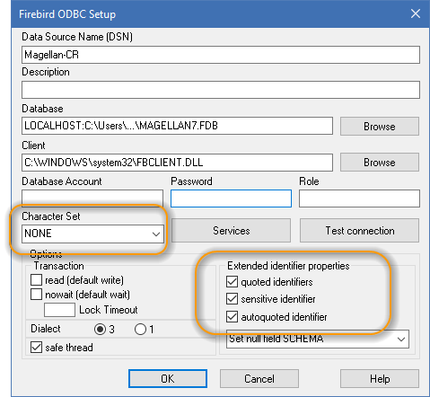
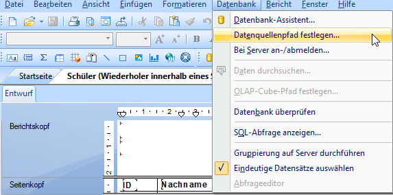

# Berichte für MAGELLAN 7 anpassen

Aufgrund technischer Veränderungen in MAGELLAN 7 müssen bestehende Berichte für die neue Version angepasst werden. Alle mitgelieferten Originalberichte von STÜBER SYSTEMS werden über Service-Updates nach und nach angepasst ausgeliefert. 
Berichte, die von Schulen verändert worden sind oder selbsterstellte Berichte liegen im Verantwortungsbereich der Schulen. Im Folgenden erläutern wir die Gründe und die notwendigen Anpassungen.


## MAGELLAN 7 unterstützt Unicode

Dies ist grundsätzlich eine erfreuliche Nachricht, da ab Version 7 sämtliche Schriftzeichen in der MAGELLAN-Datenbank gespeichert werden können. Beispielsweise alle Namensschreibweisen sind nun möglich und auch für den Zeugnisdruck ausgebbar.  
Bedingt durch diese Umstellung benötigt MAGELLAN 7 aber einen aktualisierten ODBC-Treiber, der Unicode verarbeiten kann.
Der bisherige ODBC-Treiber ist mittlerweile in die Jahre gekommen und für die neuen Anforderungen nicht geeignet.

Während Tests mit dem neuen ODBC-Treiber und unseren Berichten ist aufgefallen, dass viele Berichte eine Fehlermeldung produzierten, die nach Recherchen auf problematische Datenbank-Abfragen zurückzuführen sind, die ältere Crystal-Reports Versionen produzieren.

Während der ältere ODBC-Treiber, der in MAGELLAN 6/6.5 Verwendung findet dahingehend fehlertolerant zu sein scheint, verweigert der neuere Treiber die Verarbeitung und erzeugt einen Fehler.

## Was ist zu tun - eine Übersicht

Nr.|Was ist zu tun
--|--
1.|[ODBC-Treiber-Einstellungen](https://doc.magellan7.stueber.de/schulverwaltung/installation/Berichte_anpassen/#1-odbc-treiber-einstellungen)
2.|[Datenbankfelder aktualisieren](https://doc.magellan7.stueber.de/schulverwaltung/installation/Berichte_anpassen/#2-datenbankfelder-aktualisieren)
3.|[Datenquellenpfad festlegen](https://doc.magellan7.stueber.de/schulverwaltung/installation/Berichte_anpassen/#3-datenquellenpfad-festlegen)
4.|[Tabellenverknüpfungen anpassen](https://doc.magellan7.stueber.de/schulverwaltung/installation/Berichte_anpassen/#4-tabellenverkn%C3%BCpfungen-anpassen)
5.|[Test](https://doc.magellan7.stueber.de/schulverwaltung/installation/Berichte_anpassen/#5-test)
6.| [ggfs. Datenbankverbindung aktualisieren](https://doc.magellan7.stueber.de/schulverwaltung/installation/Berichte_anpassen/#6-datenbankverbindung-aktualisieren)

### 1. ODBC-Treiber-Einstellungen

Um das Problem beheben zu können, müssen wir fehlerfrei auf die Datenbank zugreifen können. Das funktioniert nur, wenn wir zuvor ein paar Einstellungen an den ODBC-Treiber weitergeben.

1. Starten Sie den ODBC-Datenquellen-Administrator (32-Bit) in Windows.<br>
Auf der Registerkarte ```Treiber``` finden Sie den aktuellen mit MAGELLAN 7 installierten Treiber. Da muss mindestens die im Bild angegeben Version stehen.


1. Wechseln Sie auf die Registerkarte ```Benutzer-DSN``` und wählen Sie den Eintrag ```Magellan-CR``` aus. Dieser wird von MAGELLAN automatisch erstellt. Finden Sie keinen solchen Eintrag, dann starten Sie MAGELLAN 7 und öffnen einen Bericht in der Vorschau. Danach sollte der Eintrag vorhanden sein. Klicken Sie auf ```Konfigurieren```.


2. Im Konfigurationsfenster geben Sie bei ```Character Set``` den Wert ```NONE``` ein, oder wählen diesen aus. Im Bereich ```Extended identifiert properties``` setzen Sie bitte **alle** Häkchen. 




!!! info "Hinweis"

     Wenn Sie zwischenzeitlich MAGELLAN auf dem Rechner (Druckvorschau!) verwendet haben, ändert sich diese Einstellung wieder. 
     Bitte kontrollieren Sie vor dem erneuten Start von Crystal Reports diese Einstellungen.


### 2. Datenbankfelder aktualisieren


Ein Bericht zeigt die Felder, die beim Erstellen des Berichtes in der Datenstruktur zur Verfügung standen. Um die neuen Datenbankfelder einzufügen, wechseln Sie bitte auf `Datenbank > Datenbank überprüfen`. Im Folgenden kann mehrfach eine Meldung gezeigt werden, die erscheint weil eine Tabelle nicht gefunden wird. Sie wählen bitte immer `NEIN` aus.


## 3. Datenquellenpfad festlegen


Fehlermeldungen:

 


So gehen Sie vor:

1. Klicken Sie im Menü auf ```Datenbank > Datenquellenpfad festlegen...```<br>



2. Im Dialogfenster wählen Sie wie im Bild beschrieben zuerst oben die erste Ansicht/Tabelle aus.<br> Dann öffnen Sie unten die bestehende Verbindung und melden sich an.


3. Im Beispiel ist das erste Element ```AuswahlZeugnisse``` eine Ansicht.<br> Das heißt, sie öffnen im unteren Bereich ```Ansichten```
    


und wählen die Ansicht auch im unteren Bereich aus. Dann klicken Sie auf ```Aktualisieren```.
ACHTUNG: ein Doppelklick wird hier von Crystal Reports nicht korrekt verarbeitet, bitte nutzen Sie die Schaltfläche `Aktualisieren` oder die Taste `Enter`.
    


4. Den Vorgang wiederholen Sie mit allen Ansichten/Tabellen die in Ihrem Bericht vorhanden sind.<br>Auch mit den Ansichten/Tabellen von Unterberichten.


    
5. Sonderfall ```SchuelerKlassen```<br>Die SchuelerKlassen haben eine neue Datenstruktur und Crystal-Reports kennt im bestehenden Bericht lediglich die alte Datenstruktur. Damit kann die Tabelle nicht einfach neu verknüpft werden. Sie erhalten deshalb ein weiteres Dialogfenster, dass Sie lediglich mit ```OK``` quittieren. 


Sie müssen nachdem Sie die Korrektur komplett durchlaufen haben, dann noch einmal in den Datenbank-Assistenten gehen und wie bereits erwähnt, die Verknüpfung der Tabelle "SchuelerKlassen" korrigieren (Fehlende Verknüpfung auf Feld ```SchuelerZeitraumID``` ergänzen).
    
Danach können Sie das Dialogfenster ```Schließen``` und den Bericht in der Vorschau anzeigen. Die Fehlermeldung sollte jetzt nicht mehr auftauchen. Ggf. aktualisieren Sie die Datenstruktur des Berichtes über ```Datenbank > Datenbank überprüfen``` und speichern den korrigierten Bericht.

##	4. Tabellenverknüpfungen anpassen


Außerdem sind mit MAGELLAN 7 einige wichtige Umstellungen in der Datenbankstruktur vorgenommen worden, um neue und verbesserte Funktionalitäten abbilden zu können. Dadurch sind einige Felder entfernt und an anderer Stelle hinzugekommen. 
Sie öffnen bitte den Punkt `Datenbank-Assistent..`und rufen die Unterkarte `Verknüpfungen` auf.


!!! info "Hinweis"

    Prüfen Sie, ob die folgenden Tabellen oder Felder **im Bericht oder in einem Unterbericht** genutzt wurden, was dann zu tun ist, wird nachstehend beschrieben. Bitte denken Sie daran, dass der Punkt `Datenbank > Datenbank-Assistent > Unterkarte Verknüpfungen` immer nur die Verknüpfungen für den gerade gewählten Hauptbericht oder den ausgewählten Unterbericht zeigt. Bitte prüfen Sie auch die Verknüfungen in den Unterberichten.

Tabelle |Feld
--|--
Schueler und SchuelerAusbildung|[Verknüpfungen lösen](https://doc.magellan7.stueber.de/schulverwaltung/installation/Berichte_anpassen/#tabelle-schuelerzeitraeume-und-tabelle-schuelerausbildung)
Schueler|[ehemalige Felder: SopaedFoerderungen, Foerderschwerpunkt1, Foerderschwerpunkt2 und Behinderung ](https://doc.magellan7.stueber.de/schulverwaltung/installation/Berichte_anpassen/#tabelle-schueler---felder-sopaedfoerderungen-foerderschwerpunkt1-foerderschwerpunkt2-behinderung)
SchuelerZeitraeume und SchuelerKlassen|[Neue Verknüpfungen](https://doc.magellan7.stueber.de/schulverwaltung/installation/Berichte_anpassen/#tabelle-schuelerklassen)
SchuelerZeitraeume und SchuelerAusbildung|[Neue Verknüpfungen](https://doc.magellan7.stueber.de/schulverwaltung/installation/Berichte_anpassen/#tabelle-schuelerzeitraeume-und-tabelle-schuelerausbildung)

> Wenn keine der Tabellen oder keines der Felder genutzt wurde, können Sie speichern und zum Test die Druckvorschau (bei mehrseitigen Berichten bitte auch auf die weiteren Seiten blättern) aufrufen. Klappt alles, ist der Bericht fertig für die Nutzung in MAGELLAN 7.

### Tabelle SchuelerZeitraeume und Tabelle SchuelerAusbildung 

Das Feld `Ausbildung` ist in der Tabelle `Schueler` weiterhin vorhanden, bildet aber nicht mehr die aktuelle "Ausbildung" ab. 
> Bitte löschen Sie die Verknüpfungen zwischen der Tabelle "Schueler" und der Tabelle "SchuelerAusbildung".
Setzen Sie stattdessen die Verbindungen zwischen der Tabelle "SchuelerZeitraeume" und der Tabelle "SchuelerAusbildung"
Die neue Verknüpfung muss wie folgt aussehen:

Tabelle und Feld|Art der Verbindung|Tabelle und Feld
--|--|--
SchülerZeitraeume|-|SchuelerAusbildung
Mandant|linke äußere Verknüpfung<br/>(left outer join)|Mandant
Ausbildung|linke äußere Verknüpfung<br/>(left outer join)|ID


###	Tabelle "Schueler" - Felder "SopaedFoerderungen", "Foerderschwerpunkt1", "Foerderschwerpunkt2", "Behinderung"

Diese sind nicht mehr in der Tabelle "Schueler" zu finden, sondern wurden in die neue Tabelle "SchuelerFoerderungen" verschoben, da es sich jetzt um eine Liste von Fördermaßnahmen/Behinderung/Schwächen handelt.

###	Tabelle "SchuelerKlassen" 

Wenn die Tabelle "SchuelerKlassen" in Berichten verwendet wurde, dann musste Sie mit den Feldern "Schueler", "Klasse", "Zeitraum" verknüpft werden. Diese Felder gibt es in der Tabelle nicht mehr, dafür gibt es das Feld "SchuelerZeitraumID". Die Tabelle wird dann aus der Tabelle "SchuelerZeitraeume" Feld "ID" verknüpft. Folgende Fehlermeldung könnten Sie in der Vorschau erhalten: 


Die Verknüpfung wird wie folgt korrigiert:


Tabelle und Feld|Art der Verbindung|Tabelle und Feld
--|--|--
SchülerZeitraeume|-|SchuelerKlassen
Mandant|linke äußere Verknüpfung<br/>(left outer join)|Mandant
ID|linke äußere Verknüpfung<br/>(left outer join)|SchuelerZeitraumID

## 5. Test

Speichern Sie Ihre Änderungen und wählen Sie anschließend `F5` (oder rufen die Vorschau über das Symbol auf). Wird die Vorschau gefüllt (bei mehrseitigen Berichten bitte auch einmal blättern)? Dann ist der Bericht jetzt für MAGELLAN 7 vorbereitet.

Sie erhalten diese Meldung? Dann folgen Sie bitte dem letzten Punkt der Anleitung.


## 6. Datenbankverbindung aktualisieren

Wenn Sie auf einem Rechner arbeiten, mit dem Sie üblicherweise Ihre Crystal-Reports Berichte bearbeiten, dann legt Crystal-Reports gerne mehrere Datenquellen zur ODBC-Verbindung an. Um da für die Korrektur nicht durcheinander zu kommen, räumen wir an der Stelle auf. 
Die vorstehende Meldung taucht allerdings auf, weil in der Datenbankverbindung, mit der Sie gerade angemeldet sind, nicht der korrekte Zeichensatz verwendet wird. 
Per `Rechtsklick > Eigenschaften`auf eine Verbindung können Sie den Unterschied sehen.
Diese Einstellung kann man nicht direkt editieren, letztlich muss eine neue korrekte Verbindung angelegt werden.

  


Gehen Sie wie folgt vor:

1. Klicken Sie im Menu auf ```Datenbank > Bei Server an-/abmelden...```


2. Melden Sie sich zuerst über die ```Abmelden``` Schaltfläche von allen Verbindungen ab. Wenn die Schaltfläche `Abmelden` für alle Verbindungen grau ist, dann sind sie auch nirgends angemeldet. 

    

3. Im Daten-Explorer sollte unter `Meine Verbindungen` nur eine Verbindung stehen.<br>Wenn Sie mehrere Verbindungen finden, löschen Sie alle (bei denen es möglich ist), wie folgt heraus:

    
    
4. Benennen Sie die verkehrte(n) Datenbankverbindung um (Rechtsklick > Umbenennen), damit keine der bisherigen Verbindungen mehr "MAGELLAN-CR" heißt und legen anschließend eine neue Datenbankverbindung an. 

 

6. Öffnen Sie die neue Datenbankverbindung, indem Sie auf das Plus vor "MAGELLAN-CR" und anschließend auf das Plus vor "Tabellen" klicken.


7. Melden Sie sich wieder an und testen die Vorschau, jetzt sollte es klappen!

## weitere Probleme?

### Die Vorschau lädt und lädt....

Wenn Sie alle vorstehenden Punkte befolgt haben, die Vorschau aber noch immer dauerhaft lädt, ist vermutlich eine vergessene Verknüpfung in einem Unterbericht die Ursache. Die Übersicht der Verknüpfungen gilt für den jeweils gewählten Bericht oder Unterbericht. Bitte schauen Sie, ob es Unterbericht in Ihrem Bericht gibt und überprüfen Sie bitte die Verknüpfungen unter `Datenbank > Datenbank-Assistent > Unterkarte Verknüpfungen` während der Unterbericht geöffnet ist.

### Crystal Reports - Operation noch nicht implementiert

Erscheint die Meldung in der MAGELLAN-Vorschau oder in der Crystal Reports-Vorschau? Dann handelt es sich vermutlich um einen Bericht, der den Inhalt eines Feldes als Barcode darstellen soll. Für die Darstellung als Barcode wird die Schriftart [Code EAN 13](ftp://ftp.stueber.de/pub/bin/de/magellan/v7/zubehoer/ean13.ttf) verwendet. Die Schriftart fehlt auf Ihrem Rechner oder ist nicht korrekt installiert, bitte laden Sie sie herunter und installieren Sie diese Schriftart per Doppelklick auf dei Datei neu!

### MAGELLAN-Vorschau meldet "Die Tabelle wurde nicht gefunden"

In Crystal Reports klappt die Vorschau, MAGELLAN meldet aber "Die Tabelle wurde nicht gefunden"?


Dann öffnen Sie bitte den Bericht in Crystal Reports und stellen sicher, dass unter `Datei > Berichtsoptionen > Allgemeine Einstellungen` das Häkchen vor `Beim ersten Regenerieren überprüfen` **nicht** aktiviert ist. Wichtig: diese Einstellungen muss bitte für den Bericht und auch für alle Unterberichte deaktiviert sein.


