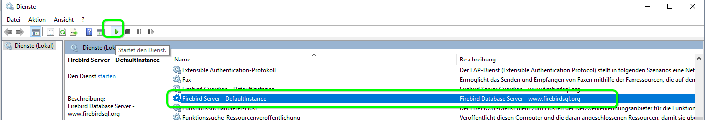

# Firebird aktualisieren

## Wann sollten Sie Firebird aktualisieren?

Wenn Firebird aktualisiert werden soll, weisen wir darauf in unserem Newsletter oder im Abschnitt [Was ist neu?](http://doc.magellan7.stueber.de/changelog.html) hin. Bitte setzen Sie nur die von uns auf unserer Webseite veröffentlichten Firebird-Versionen ein!

Letztlich besteht die Aktualisierung aber aus zwei Schritten:

1. Die Software Firebird wird aktualisiert.
2. Die ODS-Version (on disc struktur} Ihrer MAGELLAN-Datenbank wird durch Sichern und Wiederherstellen aktualisiert.

Der Assistent zum Datenstrukturanpassen prüft vor der Erweiterung der Datenstruktur um neue Felder, Tabellen usw. die ODS-Version (on disc struktur} Ihrer Datenbank und gibt Ihnen eine Meldung, wenn die ODS-Version nicht aktuell ist.

!!! warning "Wichtig"

    Bitte prüfen Sie vorab welche Version von Firebird Sie aktuell einsetzen. Die Versionsnummer wird Ihnen auf Ihrem Serverrechner unter `Start > Systemsteuerung > Programme und Funktionen > Firebird` gezeigt.  

Nachfolgend beschreiben wir die Schritte beim Aktualisieren von  von 2.5.5 auf 2.5.7,  von 2.5.1/2.5.2 oder, hier sind einige Schritte mehr zu erledigen, von 2.1 auf die aktuell empfohlene Version.

## Update von Firebird 2.5.5 auf 2.5.7

1. Bitte gehen Sie wie folgt vor:
   Laden Sie die aktuelle Version von Firebird herunter: [Download Firebird 2.5.7](ftp://ftp.stueber.de/pub/bin/de/magellan/v6/Firebird-2.5.7.27050_0_Win32.exe)
2. Stoppen Sie den laufenden Firebirdserver unter `Start > Systemsteuerung > Verwaltung > Dienste > Firebird-Server > Rechtsklick > Beenden`.
3. Starten Sie die Installation von Firebird per Doppelklick auf die heruntergeladene Datei. Folgen Sie dann bitte der Installation wie nachstehend abgebildet:

## Update von Firebird 2.5.1/2.5.2 auf 2.5.5

1. Bitte gehen Sie wie folgt vor:
   Laden Sie die aktuelle Version von Firebird herunter: [Download Firebird 2.5.5](ftp://ftp.stueber.de/pub/bin/de/magellan/v6/Firebird-2.5.5.26952_0_Win32.exe)
2. Stoppen Sie den laufenden Firebirdserver unter `Start > Systemsteuerung > Verwaltung > Dienste > Firebird-Server > Rechtsklick > Beenden`.

1. Starten Sie die Installation per Doppelklick auf das Installationspaket. Folgen Sie dem Installationsassistenten.
2. Starten Sie den Firebirdserver unter `Start > Systemsteuerung > Verwaltung > Dienste > Firebird-Server > Rechtsklick > Neu starten`.
3. Melden Sie sich als sysdba am Magellan-Administrator an und erstellen unter `Datenbanksicherung > Sicherungskopie erstellen` eine Sicherung der Datenbank (Magellan.fdb}. Der Speicherort der Sicherung muss sich auf dem Rechner befinden, auf dem sich Ihre Magellan-Datenbank befindet. Wir empfehlen die Sicherung im Verzeichnis Datenbank &gt; Backup zu erstellen. Bitte geben Sie in der aktuellen Ausgabe nur den Pfad an, der Dateiname wird vom Programm selbst gesetzt.

1. Stellen Sie anschließend aus der Sicherung eine neue Datenbank wiederher, verwenden Sie dafür den Punkt `Datenbanksicherung > Sicherungskopie wiederherstellen`. Sie können mit der neuen Datenbank nicht Ihre aktuelle Datenbank überschreiben, verwenden Sie bitte einen neuen Datennamen.

2. Als letzten Schritt tauschen Sie bitte die aktuelle Datenbank gegen die mit der aktuellen Firebirdversion wiederhergestellte Datenbank aus. Stoppen Sie den laufenden Firebirdserver unter `Start > Systemsteuerung > Verwaltung > Dienste > Firebird-Server > Rechtsklick > Beenden`. Benennen Sie die aktuelle Datenbank um (z.B. in alt\_Magellan6.fdb} und geben der wiederhergestellten Datenbank den bisherigen Datenbanknamen. Starten Sie den Firebirdserver unter `Start > Systemsteuerung > Verwaltung > Dienste > Firebird-Server > Rechtsklick > Neu starten`. Anschließend starten Sie Magellan und folgen bitte dem Assistenten zur Datenstrukturanpassung.

## Update von Firebird 2.1 auf Firebird 2.5.5

MAGELLAN 6 wurde bis zur Version 6.0.68 mit Firebird 2.1 ausgeliefert. Aktuell setzt MAGELLAN 6 mit Firebird 2.5 eine neuere Version des Datenbank-Management-Systems voraus. Setzen Sie noch die Version 2.1 ein, müssen Sie vor dem Update von Magellan noch einige Schritte  ausführen.

Bitte folgen Sie diesen Schritten:

1. Setzen Sie  im MAGELLAN-Administrator das Administratorenkennwort auf „masterkey“ zurück. Sie finden die Möglichkeit dazu unter dem Punkt "Datenbank \| Administratoren-Kennwort".

2. Um die Kennwortdaten unter Firebird 2.1 zu sichern, wählen Sie bitte den Punkt "Datensicherung \| Sicherungskopie erstellen \| Starten". Wählen Sie „Firebird Sicherheitsdatenbank 2.1/2.5“ und geben im unteren Feld einen Pfad und Namen für die Sicherung an. Die Endung `*.fbk` wird automatisch ergänzt. Möchten Sie die Sicherung der Sicherheitsdatenbank im Programmordner der Firebird-Installation vornehmen wählen Sie bitte folgende Pfade: Für 32-Bit-Betriebssysteme `C:\Program Files\Firebird\Firebird_2_1` und für 64-Bit-Betriebssysteme `C:\Program Files (x86)\Firebird\Firebird_2_1`.

3. Deinstallieren Sie bitte Firebird 2.1 (analog dem Kapitel „Deinstallation von Firebird 1.5“}

4. Laden Sie die aktuelle Version von Firebird herunter: [Download Firebird 2.5.5](ftp://ftp.stueber.de/pub/bin/de/magellan/v6/Firebird-2.5.5.26952_0_Win32.exe)

5. Starten Sie die Installation per Doppelklick auf das Installationspaket. Folgen Sie dem Installationsassistenten.

6. Melden Sie sich als sysdba am Magellan-Administrator an und erstellen unter `Datenbanksicherung > Sicherungskopie erstellen` eine Sicherung der Datenbank. Der Speicherort der Sicherung muss sich auf dem Rechner befinden, auf dem sich Ihre Magellan-Datenbank befindet. Wir empfehlen die Sicherung im Verzeichnis Datenbank &gt; Backup zu erstellen und als Dateinamen das Tagesdatum zu verwenden.

1. Stellen Sie anschließend aus der Sicherung eine neue Datenbank wiederher, verwenden Sie dafür den Punkt `Datenbanksicherung > Sicherungskopie wiederherstellen`. Sie können mit der neuen Datenbank nicht Ihre aktuelle Datenbank überschreiben, verwenden Sie bitte einen neuen Datennamen.

1. Tauschen Sie bitte die aktuelle Datenbank gegen die mit der aktuellen Firebirdversion wiederhergestellte Datenbank aus. Stoppen Sie den laufenden Firebirdserver unter `Start > Systemsteuerung > Verwaltung > Dienste > Firebird-Server > Rechtsklick > Beenden`. Benennen Sie die aktuelle Datenbank um (z.B. in alt\_Magellan6.fdb} und geben der wiederhergestellten Datenbank den bisherigen Datenbanknamen.Starten Sie den Firebirdserver unter `Start > Systemsteuerung > Verwaltung > Dienste > Firebird-Server > Rechtsklick > Neu starten`. Anschließend starten Sie Magellan und folgen bitte dem Assistenten zur Datenstrukturanpassung.

2. Rufen Sie im Administrator den Punkt "Datenbankpflege \| Firebird 1.5/Firebird 2.1 Sicherheitsdatenbank konvertieren" auf.

3. Wählen Sie im Feld Format „Firebird 2.1 Sicherheitsdatenbank“ aus. Im Feld Datenbank wird eine Pfad vorgeschlagen. Wird der Pfad rot angezeigt, befindet sich dort keine entsprechende Datei. Bitte verweisen Sie hier auf die zuvor erstellte Sicherung, tragen das Kennwort „masterkey“ und starten den Assistenten. Der Assistent kopiert aus der Firebird 2.1 Sicherheitsdatenbank die Benutzerdaten in die neue Firebird 2.5 Sicherheitsdatenbank. Anschließend können sich Ihre Benutzer mit den gewohnten Zugangsdaten wieder an MAGELLAN anmelden.

